<picture>
  <source media="(prefers-color-scheme: dark)" srcset="docs/brand/vendune-logo-dark.svg">
  
</picture>

# Vendune — Agentic commerce with merchant control

An **open-source ecommerce prototype in Rust** for developers exploring AI-assisted
B2C and B2B commerce. Run a storefront and merchant workspace on your own machine,
connect local LLMs or optional cloud models, and expose selected commerce operations
through **Model Context Protocol (MCP)** and **Universal Commerce Protocol (UCP)** adapters.

**The AI proposes. The merchant reviews and approves. The Rust core applies the change.**
Browser and agent clients share the same pricing, inventory and checkout operations.
This is also a laboratory for porting selected original Shopware behavior to Rust.

[Brand assets & naming](docs/branding.md) ·
[Website & guides](https://sthamann.github.io/vendune/) ·
[Quickstart](docs/quickstart.md) · [Hands-on playground](docs/playground.md) · [MCP setup](docs/connectors.md) ·
[Feature matrix](docs/shopware-parity.md) · [Contributing](CONTRIBUTING.md)

[](https://github.com/sthamann/vendune/actions/workflows/verify.yml)
[](LICENSE)

[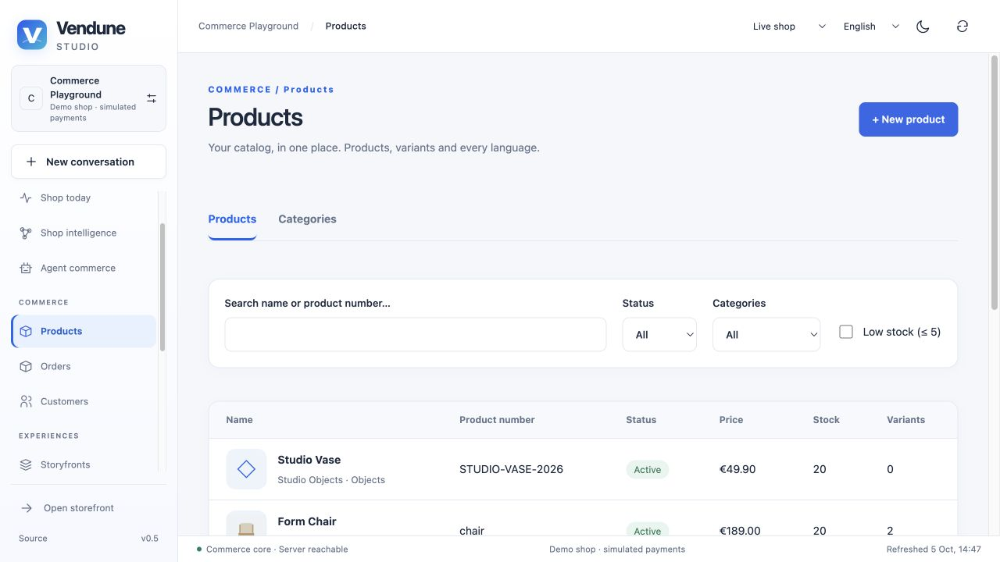](https://sthamann.github.io/vendune/playground.html)

Company settings now include structured addresses, statutory/register and content-responsibility metadata, safe logo uploads, one-language brand/legal text editing and explicit per-sales-channel inheritance. Storefront identity and receipt issuers consume the resolved values; company/channel changes can be released selectively from staging. [Guide and contracts](docs/company-settings.md).

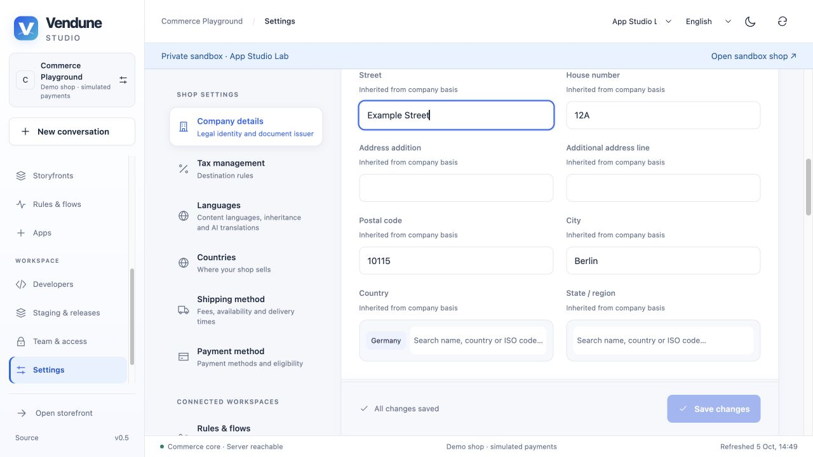

## Settings and product media workspaces

Choose a **shared basis or a sales channel** in tax, country, shipping and payment
settings. Sparse overrides retain field inheritance, flow through real product/cart/
order calculations and can be released separately from staging. One **content language**
applies across each editor. Method removal checks order/cart/channel/rule references
and offers deactivation when deletion is blocked.

Product media now has a cover/thumbnail gallery, large inspector, localized alt text,
drag/drop multi-file uploads and optional private, reviewed AI generation/edit drafts.
The assistant preview uses the actual gallery, including an honest empty state.
[Workspace guide, HTTP/MCP, provider setup and test boundaries](docs/settings-media.md).

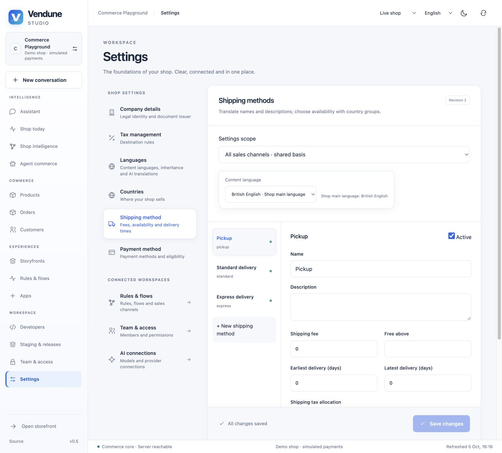

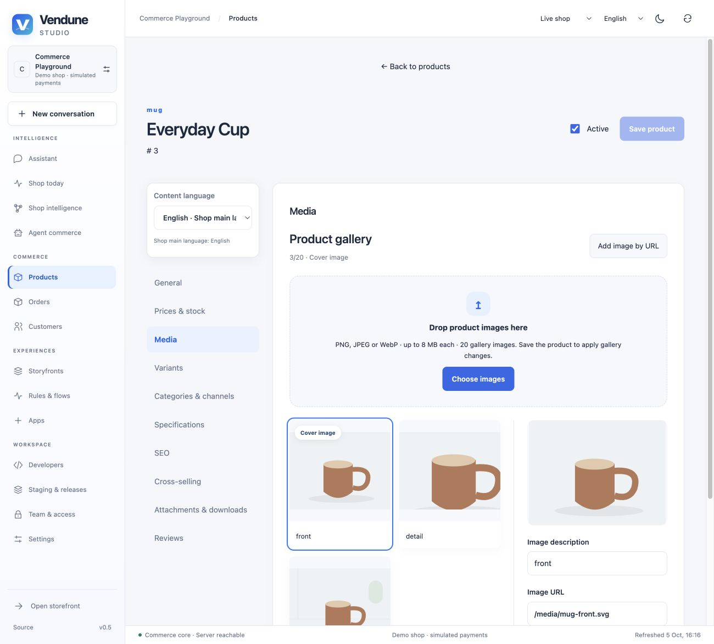

## App library and management

Browse **Apps → Installed / Discover** with search, category and status filters.
Every app has an illustrated card and a dedicated page for configuration, real
admin interfaces, data and immutable versions. Enabling an app is distinct from
connecting a provider account; connector credentials and readiness remain visible
in its settings. Deactivation uses the shared confirmation dialog.

Published packages can supply their own icon, cover and localized summary through
optional `presentation` metadata. Without artwork, Vendune creates deterministic
category illustrations and functional icons locally, with no model calls. Broken
images fall back independently. [Guide, manifest contract and tests](docs/app-library.md).

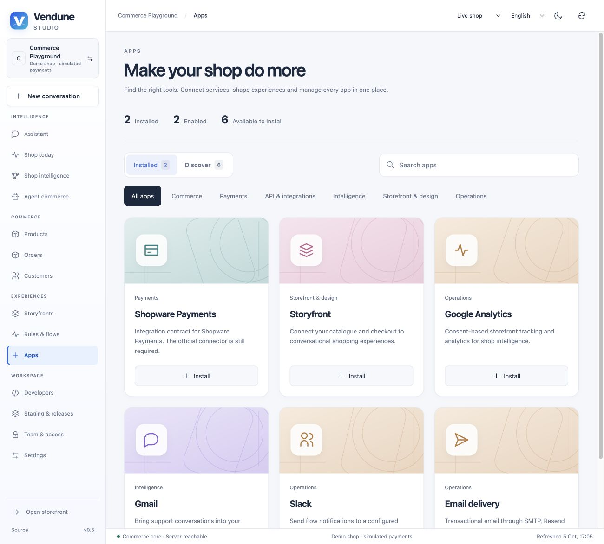

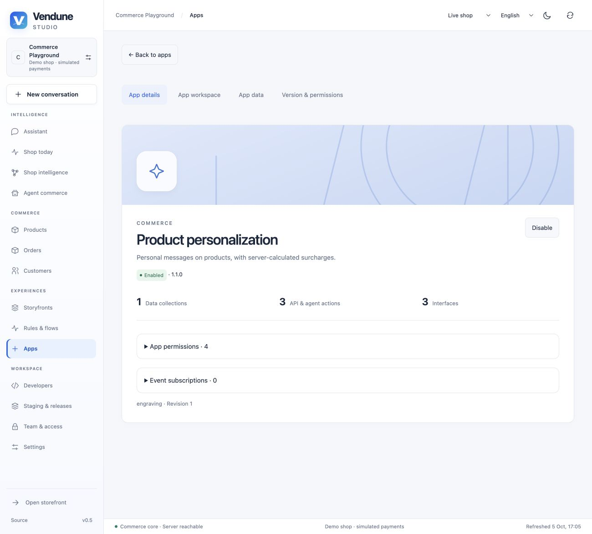

## Connected shop knowledge

**Shop intelligence** is now a dedicated knowledge workspace with an overview, product connections,
searchable source library, learning/decisions and a no-model evidence preview. Add
care guides, data sheets, FAQs, shipping/returns policies or brand knowledge; edit
with one inherited content language, review customer publication and selectively
release sources from staging. Current SKU/specification facts, order associations
and private app evidence remain distinguishable. The merchant assistant actually
retrieves source passages and hashes; customer answers use only published sources.

[Guide, lifecycle, HTTP/MCP contracts and verification](docs/knowledge-workspace.md).

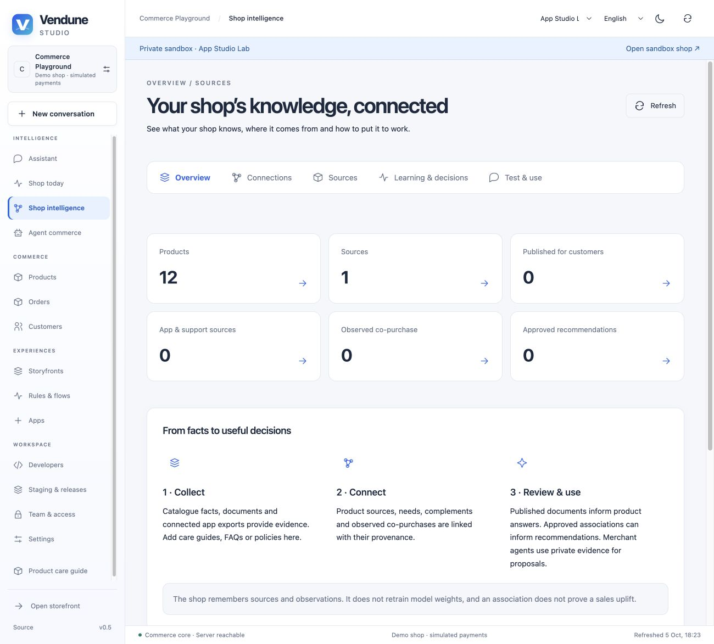

## Guided app assistants and embedded editors

Start with frontend, admin, combined, payment, shipping, ERP/integration, event,
webhook or cron assistants. Add app-owned fields and translated choices directly
to a product section/tab, customer or order. Configure team scopes, public API reads,
MCP exposure and merchant-AI tools independently. Save immutable versions, try actual
records in a private sandbox and release selectively.

Signed incoming webhooks and persistent UTC schedules feed the same durable events
and graphical Flow Builder. Service assistants generate connector contracts; provider
implementations and operator service deployment are still required.
[Guide, Shopware extension comparison and verification](docs/app-assistants.md) ·
[Twelve installable examples](extensions/apps/assistant-examples/README.md)

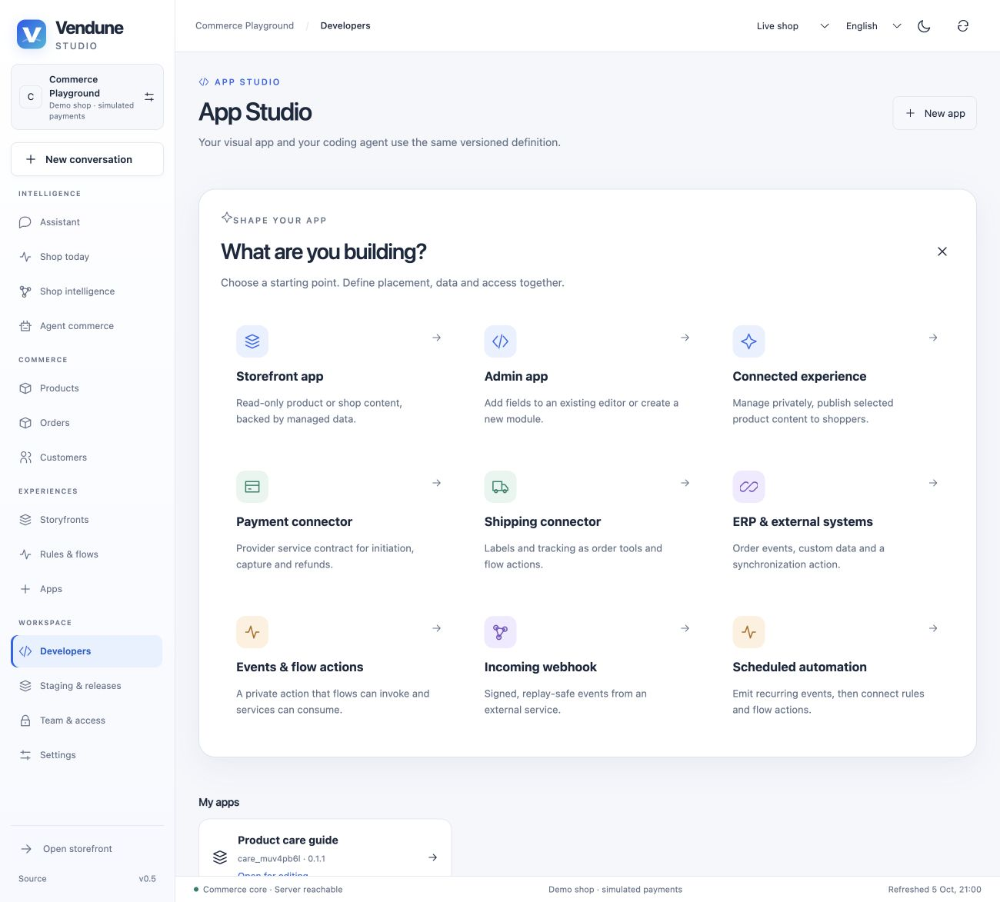

## Visual App Studio

Build native apps visually in **Vendune Studio → Developers**. Compose text, tables, cards and forms, define typed app data, connect HTTP/MCP/AI tools and opt actions into the graphical Flow Builder. Human edits and Codex/Claude agent edits use the **same executable Manifest**. Open saved apps through explicit edit controls, remove development projects to a recoverable trash, save an immutable version, test real records in a private sandbox, then selectively release the package.

The modern builder uses one inherited content-language editor and supports the shop’s enabled languages. Native admin modules and storefront surfaces share the exact same renderer as their sandbox preview. Arbitrary service code keeps the existing isolated app-service path.

[App Studio guide, schema and limitations](docs/app-studio.md) · [Working care-guide example](extensions/apps/care-studio/manifest.json)

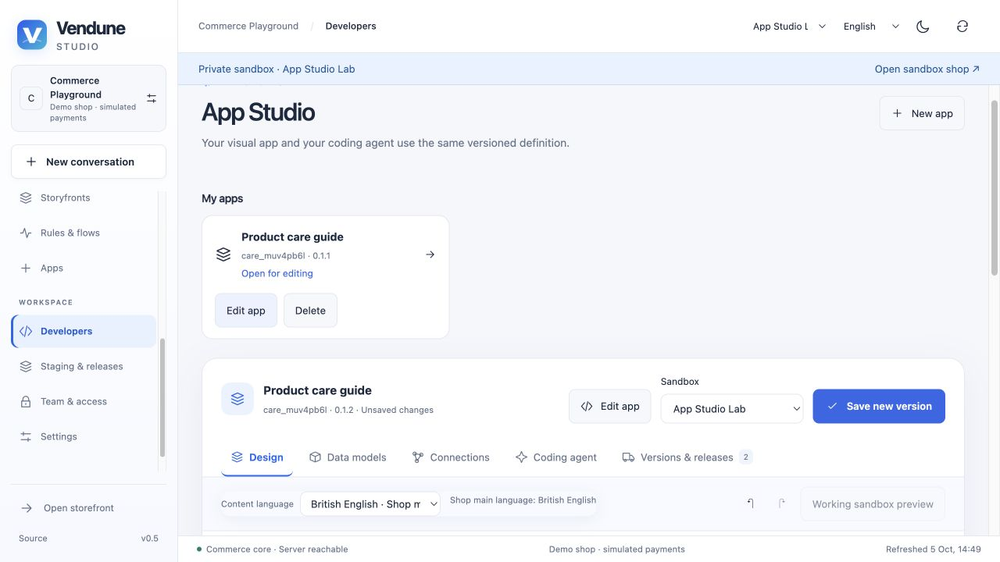

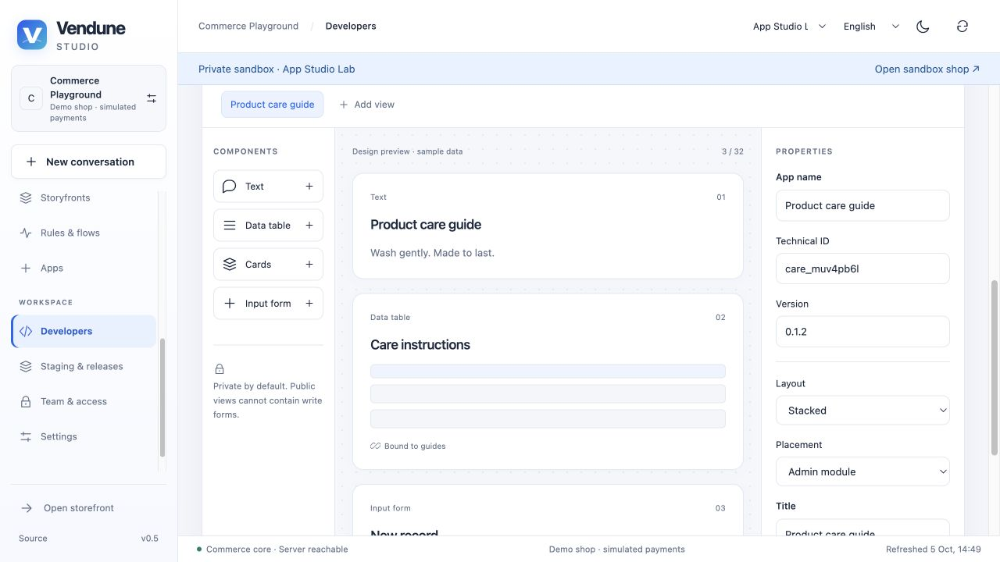

## Why try it?

| You want to explore… | What this prototype provides |
|---|---|
| AI-assisted merchant operations | Stored proposals, visible changes, role checks and explicit approval |
| Local AI commerce | Ollama for local inference; optional OpenAI and Anthropic API adapters |
| Agent commerce protocols | A local MCP bridge and partial UCP checkout adapters using shared operations |
| Rust ecommerce and B2B checkout | SKU variants, quantity prices, tax/shipping configuration and durable demo orders |
| Shopware behavior in Rust | Bounded ports checked against original Shopware PHP classes |
| Storyfront shops | Catalog/variant/media import and checkout transfer through a separate [Storyfront app](docs/storyfront.md) |
| SaaS platform administration | Separate personal operator access, audited shop creation, live-shop statistics and staging visibility |
| Self-hosted storage | PostgreSQL + private Qdrant; no paid database service required |

The interface supports **English, German, French and Spanish**. MIT licensed.

## Vendune Studio interface

The light Studio uses a blue accent, compact grouped navigation and independent
workspace styles. **Settings** has a dedicated secondary navigation for company
details, taxes, countries, shipping and payments. Company identity, contact and
bank fields are grouped; the save bar shows unsaved changes, progress, success and
read-only access. Countries, taxes, methods and languages share one revisioned
draft across settings navigation; leaving that workspace protects unsaved changes.
English, German, French and Spanish use the same controls and behavior.


See [interface ownership, verification and limitations](docs/studio-interface.md).

## International configuration and AI translation

Choose delivery destinations from a continent-grouped catalogue of **249 ISO
countries/territories plus explicitly non-ISO Kosovo**, with multilingual names
and US subdivisions. Searchable country/region controls are shared by methods,
addresses and checkout. Add tenant country/region definitions and tax classes;
destination rules combine states, postcodes, date windows, priority and saved
Rule Builder conditions in actual product/cart/order calculations. New delivery
countries require explicit tax, shipping and payment coverage.

**Settings → Languages** defines the main content language and additional locales.
Product/category editors, shipping/payment content, SEO and rich descriptions
use visible inheritance. Catalogue-wide AI translations produce durable reviewable
drafts with progress, resume, stale-edit protection and bounded apply through HTTP
and MCP. UI vocabulary remains EN/DE/ES/FR; content can use additional locales.

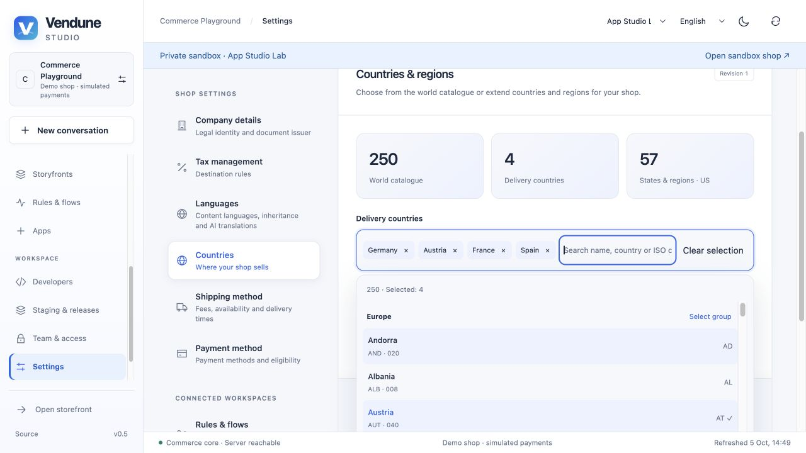

[Configuration, API/MCP, datasets and verification boundaries](docs/international-commerce.md).
No current worldwide tax law or real model translation quality is inferred from fixtures.

Native content editors use **one selected content language**, including nested Flow
Builder steps. Products, SEO, categories, attachment titles, rules, campaigns,
channels, taxes and methods share the same field controls. Missing translations
inherit the shop main language; switching languages never fabricates stored
translations. Simple and graphical flow execution, attachment uploads and
storefront file labels apply the same contract through the real API.
See [the shared editor contract](frontend/src/shared/i18n/README.md).

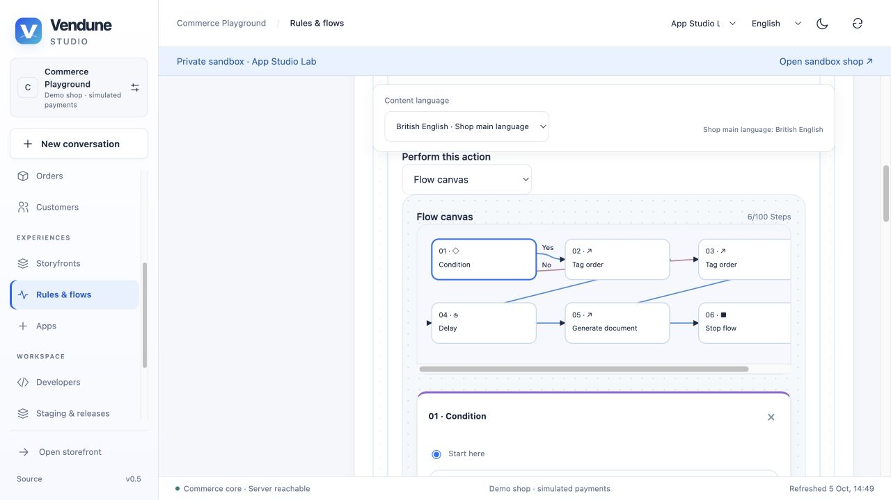

## Customers, checkout and order operations

The storefront now shares a full **customer address book** with Vendune Studio:
registration/sign-in, separate default billing/shipping addresses, structured
contacts, payment preferences and own order history. Checkout copies the selected
customer/address records into the order, so later account edits do not rewrite it.
Guest email entry never grants an existing account's identity or order access.
Address cards independently choose billing/delivery defaults. Customer orders,
registered buyers and product line items open their related native editors with
back navigation and direct links. **Settings → Customer groups** configures
translated groups and their gross/net basis; exact group IDs drive rules, flows
and quantity prices. Public registration cannot grant a privileged group.

**Version history** shows who changed an entity, when, through which path and its
before/after values. A confirmed restore passes current validation and saves a
new revision. Product inventory and immutable order snapshots are preserved;
orders use workflow actions, and knowledge sources re-enter private review.
History begins with this update; earlier edits cannot be reconstructed. See
[recorded entities, API/MCP operations and restore limits](docs/entity-history.md).

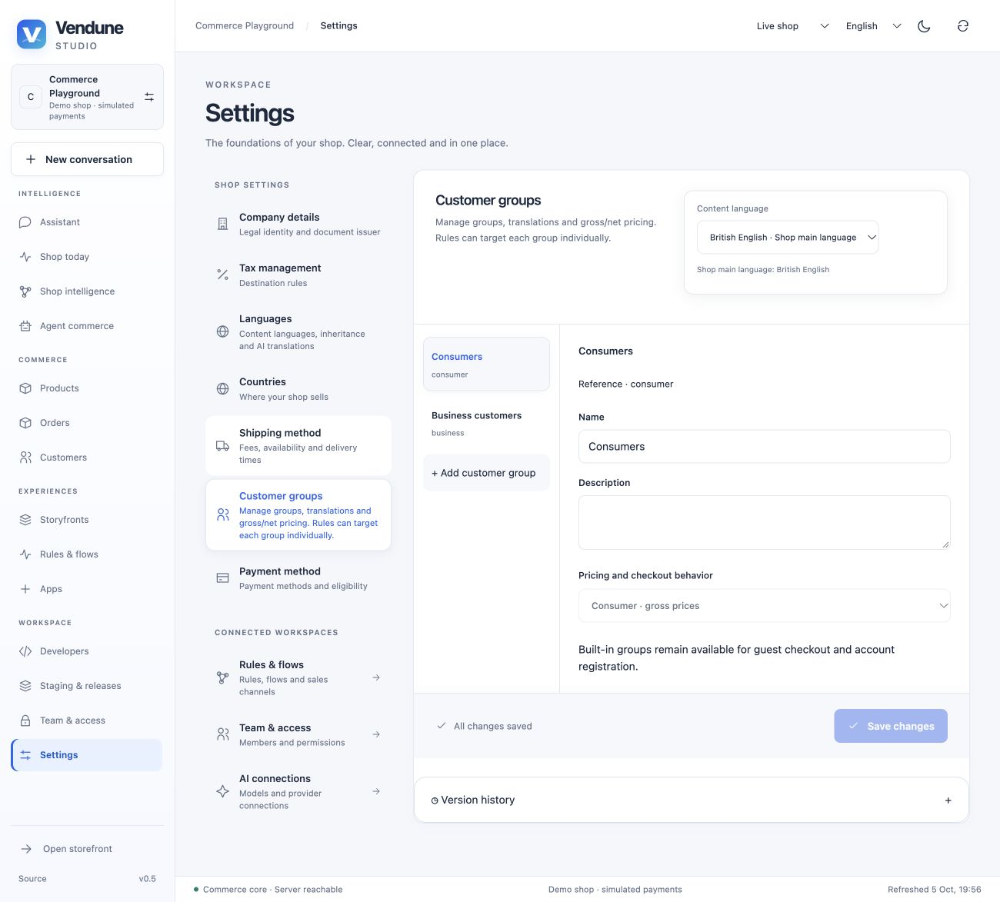

Vendune Studio provides **Customers** and **Orders** with direct server-owned
workflow actions, payment-job progress, tracking, activity and four-language
numbered PDF documents. Company/document issuer data is centrally stored under
**Settings → Company details**. Apps have a category catalog and individual
package workspaces. Fine team rights and expiring per-shop API/MCP keys use the
same request-time authorization checks.

Product attachments, private purchased downloads, rich descriptions and selected
asset/workflow releases are connected to their actual storefront/order consumers.
Read the [operations/API guide and precise boundaries](docs/merchant-operations.md),
[Shopware feature matrix](docs/shopware-parity.md) and [source map](docs/source-map.md).
This remains a bounded prototype: full Shopware entity/DAL/API parity, production
identity/account recovery, complete original FlowSequence interchange and a supported
Shopware Payments connector are still missing.


## Connected apps and graphical automation

Install **Google Analytics**, **Gmail** and **Slack** from the Apps workspace. Each has
its own multilingual OAuth/settings page. Google Analytics loads the actual GA4 tag
in the native storefront after consent and imports reports; Gmail imports a support
label into private shop knowledge; Slack receives order notifications or rule-bound
Flow Builder actions. Private sources are consumed by the merchant model prompt and
MCP, with source IDs and transactional SQL product relationships. Apps can publish typed events,
and the visual builder edits nested AND/OR/NOT/XOR conditions, source-named typed rules and app actions. Connected flow graphs support true/false branches, consecutive actions, durable delays, stop nodes and saved-rule references.

[Setup, provider permissions, event API and tested boundaries](docs/connected-apps.md)
· [Order-alert app and Slack flow example](extensions/apps/order-alerts)
· [Original production rule/action inventory](reference/automation-registry.json) · [Native rules and durable flow guide](docs/automation.md)

Local: install `extensions/services/connectors/requirements.txt`, configure the Google/
Slack OAuth clients in ignored `.env`, then run `CONNECTED_APPS=1 scripts/dev.sh`.
Existing app services are preserved. Protocol fixtures test the entire provider-to-core
path without external messages or paid model calls; live account authorization requires
your provider clients. Imports are manual in this version. The native builder does not
claim complete behavior/API parity with the original condition catalog or arbitrary source FlowSequences. The reflected production catalog contains 114 Rule subclasses and 16 Core actions; 108 rule scopes are executable natively, with 432 direct original-PHP comparison cases across 74 classes. Unsupported runtimes remain visibly disabled. Source-name registration is not a claim of complete equivalence.


[Historical flow evidence with an optional reviewable AI proposal](docs/assets/automation-flow-en.jpg)

[Historical Slack app action example](docs/assets/slack-flow-en.jpg)

## Transactional email delivery

Install **Email Delivery** from Apps and choose **SMTP**, **Resend** or **SendGrid**.
Configure your sender, TLS/credentials and four-language order templates in its own
workspace. Preview, dry-run and an explicitly labeled real test use the same durable
queue as apps, API/MCP and graphical order-event flows. Provider credentials stay
encrypted and write-only. Default installation never sends external mail.

[Setup, API, flow example and delivery guarantees](docs/email-delivery.md).
The local suite exercises real SMTP with STARTTLS/implicit TLS and both HTTP wire
formats; an isolated Rust/PostgreSQL checkout actually reaches a local SMTP server.
Inbox delivery/webhooks and a horizontally scaled mail queue are not yet implemented.

## Full apps without core changes

Apps can add their own **Studio modules, product/order panels, storefront pages,
HTTP APIs, MCP tools, AI context and database structures**. Their independently
served UI can use any framework; the browser SDK calls the same authorized gateway
as API/agent clients. Managed JSONB records and indexed cursor pages complement
app-owned services/databases. Event subscriptions and selected staging releases
use the existing durable app machinery.

[Product Lab](extensions/apps/product-lab) demonstrates one connected app across
admin, product detail, storefront, HTTP and MCP, in four languages. Run
`PRODUCT_LAB=1 ./scripts/dev.sh`, then install its manifest in your test shop.
The example retrieves sample care facts; it does not claim LLM-generated advice.
[Contract, SDK, setup, isolation/performance evidence and precise limits](docs/app-platform.md).


Slow remote services have non-queuing per-app/tenant admission limits, timeouts and
bounded payloads. Studio/storefront code loads separately. External code runs in
independently deployed services; a resource-limited example container is provided.
Automatic arbitrary source compilation, remote bundle signing and hostile-code
microVM isolation remain separate work.

## Platform administration and hosting

A dedicated **Vendune Platform** console at `/#platform` creates empty or
sample-catalogue shops and shows global customers, product SKUs, orders, staging,
teams and API activity. Per-shop details show actual daily orders; totals keep
currencies, simulated payments and confirmed captures separate. Personal operator
grants are independent of merchant roles and integration keys. New shops contain
no known demo customer accounts. The console supports all four interface languages.


[Operator console and API](docs/platform.md) · [Host setup and Vercel deployment](docs/deployment.md)

The public deployment package includes a non-root Rust image, private open-source
PostgreSQL/Qdrant, HTTPS gateway, one-shot personal operator setup and closed
merchant signup/bootstrap-token gates. **It is tested locally; a public host/domain
and verified Vercel/backend deployment are still outstanding.** GitHub Pages is the
documentation site, not a hosted commerce backend.

## Lean-checked production policies

The real Rust checkout, order workflow, access, refund and download paths now
call a small pure kernel with **24 policies and 52 Lean-proved properties**.
The production functions are extracted through a closed typed grammar; compiled
Rust/Lean outputs are compared on 4,180 cases. Deliberately broken policies must
fail the proof checks. CI also audits transitive axioms and locks every Rust,
schema, build and proof input to an explicitly reviewed source inventory.

This is **partial formal verification**, not an entire-core or bug-free
certificate. Database concurrency, surrounding adapters, tax/rounding, provider
protocols, apps, browser and AI behavior remain outside the proofs. Read the
[exact contracts, evidence and future-change procedure](docs/formal-verification.md).
Lean is needed for verification; the running commerce server does not depend on it.

## Products and categories

Vendune Studio has one **Products** workspace with searchable/filterable product
lists, creation and a complete native product detail editor. Manage configured content-language
names and visual rich descriptions, prices/tax/stock/quantity rules, galleries and
uploads, native variant SKUs, categories and channel visibility, properties,
specifications, SEO metadata, cross-selling, attachments, downloads and reviews.
Revision-bound saves share the real commerce API and MCP; committed product events
can execute durable flows.

Categories are real translated parent/child records with product assignments,
page/folder/link types, nested listing control and a navigation root per sales
channel. The storefront consumes that tree and its category-filtered product API.
Products and category changes can be staged and published selectively.


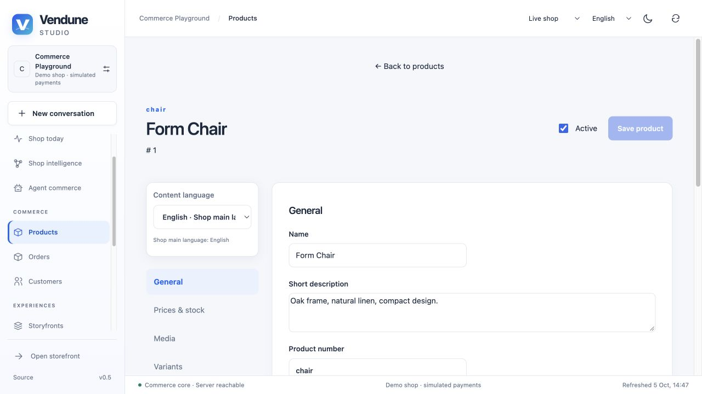

See the [product management guide](docs/product-management.md) for routes, file
ownership, original Shopware source references, tests and explicit remaining gaps.
This does not claim complete original DAL, CMS, product-stream or SEO-URL parity.

## Merchant workbench and private releases

The workbench now has **Storyfronts**, **Developers**, **Environments**,
**Automation** and **Products** sections. An existing merchant can create
additional shops. Prompt-generated apps are immutable reviewed drafts, installed
in a private sandbox and selectively published with their own typed data/API/UI.
Codex and Claude Code can use the exported package schema and authorized MCP
workflow; OpenAI/Anthropic model APIs and local Ollama generate app drafts.

Product pages support source-bound questions; merchants upload private text/PDF
sources and explicitly publish them. Customer accounts expose profile editing and
own orders. Native campaigns/coupons/free shipping, rule conditions, durable
note/AI-proposal flows and scoped sales channels share the real checkout path.
Product translations/specifications/SEO/cross-selling and behavior-based ranking
are connected to their storefront consumers.

Read the [workbench guide and exact limits](docs/workbench.md) and the [Vercel + self-hosted deployment](docs/deployment.md). The four-language interface
extends to the new tabs, forms, native app fields and customer account/checkout
flow; user-authored sources and earlier conversation messages retain their
original language. Real model quality and full Shopware Rule/Flow parity remain
separate verification work.


A local Qwen run generated **Product Care** with translated app labels, a typed
`guides` entity, API actions and a product-detail slot. The reviewed package and
its four-language care record were installed in a private sandbox and selectively
published; the live parent product and 500 ml variant render that same app record.
This is one verified declarative app, not a claim of arbitrary app-generation quality.


## Try the commerce app first — no model download

Requirements: **Rust stable (1.96+), Node 22+, Docker Compose and Python 3**.

```sh
git clone https://github.com/sthamann/vendune.git
cd vendune
./scripts/dev.sh
```

Open [Storefront](http://127.0.0.1:8787/),
[Vendune Studio](http://127.0.0.1:8787/#merchant), or the
[example product](http://127.0.0.1:8787/#product/mug).
In Studio, select **Team & access → Create shop** to create a personal owner
account and a separate synthetic shop. Then explore products, quantity prices,
cart and simulated checkout. AI chat and semantic indexing require their model
services; ordinary commerce operations do not.

The first start builds the database image, frontend and Rust application. It can
take several minutes. No model is downloaded by this command. Private instance
credentials are generated in ignored `.env`; the app binds to `127.0.0.1:8787`
and PostgreSQL to `127.0.0.1:15487`.

## Try the connected playground

After creating your personal merchant account, run:

```sh
python3 scripts/playground.py --email your-personal-merchant@example.test
```

Enter your password at the private prompt. This creates a separate **Commerce
Playground** and prints its Studio, storefront, product and sales-channel links.
It contains the `TRY10` coupon, engraving app, a saved source rule and an active
flow: check the €100 threshold → tag the chosen branch → wait on priority orders
→ create an invoice → stop. Setup needs no model/provider and creates no orders.
Re-running preserves your edits; credentials are not stored in its state file.

[Follow the ten-minute tour](docs/playground.md): product/SKU/cart → customer and
address book → simulated checkout → real flow execution → order detail/PDF,
then explore staging, apps, product knowledge and optional AI.


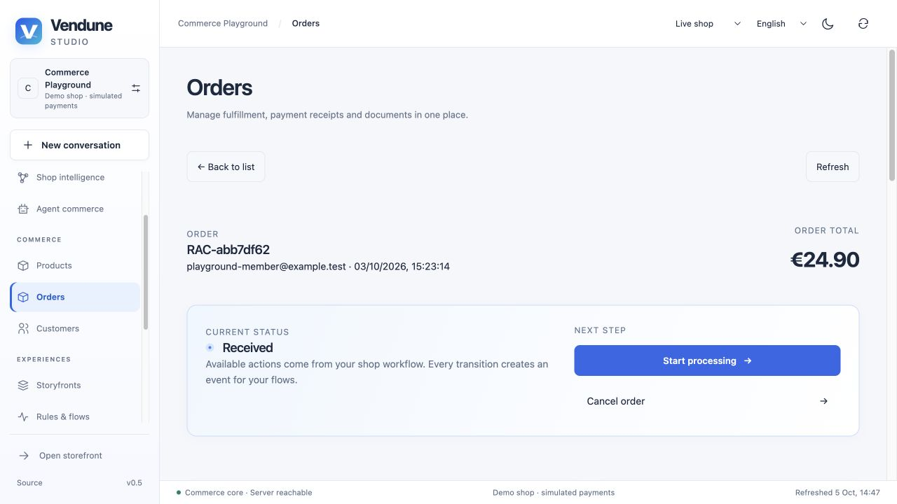

## Choose your next step

- **Add local AI:** follow the [Ollama setup](docs/quickstart.md#add-local-ai-optional).
  The documented default model download is about 24 GB, with additional runtime
  memory required. Install it only when you want local inference.
- **Connect an MCP client:** use the [Claude Desktop / local MCP configuration](docs/connectors.md#claude-desktop--local-mcp-clients).
- **Use a cloud model:** configure your own API credentials using the
  [provider guide](docs/connectors.md#models-inside-the-merchant-chat).
- **Study the implementation:** read the [feature tour](docs/features.md),
  [architecture](docs/architecture.md) and [Shopware migration workflow](docs/migration.md).

## See three short feature demos

[Watch the feature clips](https://sthamann.github.io/vendune/#demo):

- Switch an actual SKU, select six units and carry the quantity tier into the cart.
- Personalize a product through an installed Wasm app; its fee enters the real cart.
- Review and approve a local AI price proposal, then inspect the changed storefront.

In the approval clip,
a local model proposes EUR 69.90 instead of EUR 74.90 for the lamp; the price
changes only after merchant approval and is then visible in the storefront.
These feature recordings use a synthetic shop and show the navigation at capture
time, before the Vendune rebrand; waiting time is shortened. The current screenshots show the current
product, flow and order workspaces. [Capture notes](docs/assets/README.md).

1. Ask the assistant to propose a catalog change.
2. Inspect the stored proposal and the exact fields that would change.
3. Approve with an authorized merchant account.
4. Inspect the updated product in the storefront.

Model text does not grant permissions. The server checks roles and current
revisions before applying an approved proposal. See the [security scope](docs/security.md).

## Inspect measured performance

The [local benchmark page](https://sthamann.github.io/vendune/benchmarks.html)
reports a physical **1,000,000-product catalog with 1,000,000 translations**,
product pages, search, a 20-line cart and fresh durable checkouts at fixed arrivals
of 100 and 500 requests/s. It retains the historical 1,000-product comparison,
failed-run records, raw latencies, response checks and source/binary metadata. [Reproduce the setup](docs/benchmarks.md).
These bounded synthetic measurements do not establish production capacity or LLM speed.

## Current status and limits

**Working prototype; payments are simulated, manually recorded or PayPal Sandbox.
No real money is charged.** This is not a complete drop-in Shopware replacement or a validated
production SaaS deployment.

MCP/UCP cover selected capabilities, not full protocol conformance. Hosted
ChatGPT/Claude connectors require separate endpoint/account setup; no production
OAuth server is included. Live cloud model quality, production scale and causal
sales uplift are unverified. The Sandbox adapter is tested with local contract
fixtures; no live Sandbox transaction is claimed. See the [precise feature matrix](docs/shopware-parity.md)
and [connection boundaries](docs/connectors.md).

## Apps, payments and shop intelligence

The v0.5 prototype also includes versioned app installation, independent worker
roles, an evidence-based shop-intelligence view and a PayPal Sandbox adapter.
See [implementation and limits](docs/intelligence-apps-payments.md),
[worker roles](docs/intelligence-apps-payments.md) and [extension examples](extensions/README.md).

## Evidence and documentation

- [Features, extension examples and verification commands](docs/features.md)
- [Source files and their tests](docs/source-map.md)
- [Recorded verification results](docs/verification.json) and [current CI runs](https://github.com/sthamann/vendune/actions)
- [Original Shopware migration units](porting/units.json) and [migration workflow](docs/migration.md)
- [Architecture decisions](docs/architecture.md), [security](docs/security.md), [third-party licenses](THIRD_PARTY.md)

The current verification includes **7,000 bounded comparisons** against original
Shopware 6.7.14.2 PHP classes. These cover selected pricing/context/tax operations and numeric/string/array/UUID comparison primitives, plus 432 cases against 74 concrete original condition classes;
they do not establish full Shopware compatibility. The current workbench verification
now runs 68 Rust unit tests and 90 frontend component/hook tests, plus 25 real HTTP suites,
three local provider suites, four browser contracts and verification-tool tests.
These include private releases, customer authority, concurrent checkout and bounded catalog reads.

## Modular source and measured quality

The Studio, storefront and operator console live in dedicated feature folders; shared API, app, form and locale code has enforced ownership boundaries. Studio workspaces load lazily. Views and controllers are bounded, documented modules; ordered CSS fragments preserve the visual cascade. See the [frontend architecture](frontend/README.md), [complete source inventory](docs/module-inventory.md) and [testing guide](docs/testing.md).

CI runs source-boundary/cycle/size checks, real integration, component regressions, original Shopware comparisons and existing Lean/mutation checks. It uploads full V8, LLVM and Python coverage reports and enforces reviewed regression floors. Untested source files remain in the reports. **Full-system 100% coverage is not achieved**; the strict audit fails until the remaining branches and unmeasured runtime scopes are covered. The [5 October 2026 CI run](https://github.com/sthamann/vendune/actions/runs/37285967720) measures line coverage at **81.00% Rust, 42.28% frontend and 74.11% Python** in their separate documented source scopes. Current measured evidence, untouched modules and limitations are in [quality-baseline.json](docs/quality-baseline.json).

## Contribute

Start with [CONTRIBUTING.md](CONTRIBUTING.md). Useful contributions include
reproducible bugs, clearer setup instructions, locale improvements and bounded
behavior ports with original-source comparisons. Please include the current
version, steps to reproduce and expected versus observed behavior.

App-owned product rules: engraving and gift-message packages supply their own Wasm business rules, input fields and localized forms. The core hosts a generic cart-contribution contract. See [extension examples](extensions/README.md#app-owned-product-configuration).

Managed hosting and staged shop relocation are described in [managed-hosting.md](docs/managed-hosting.md).
