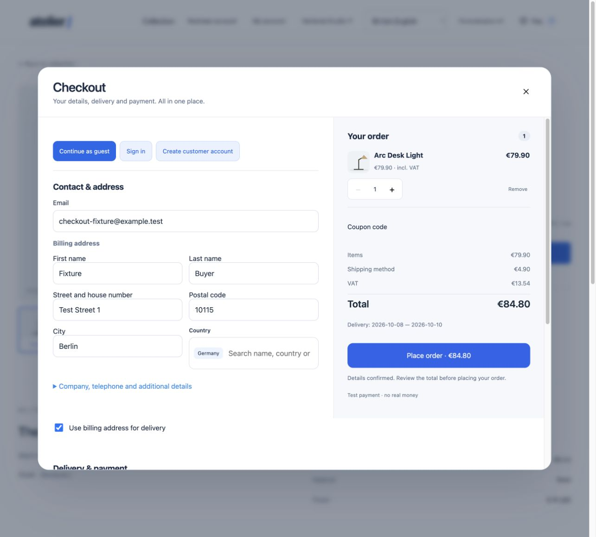
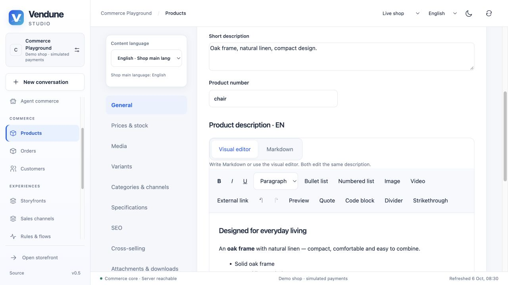
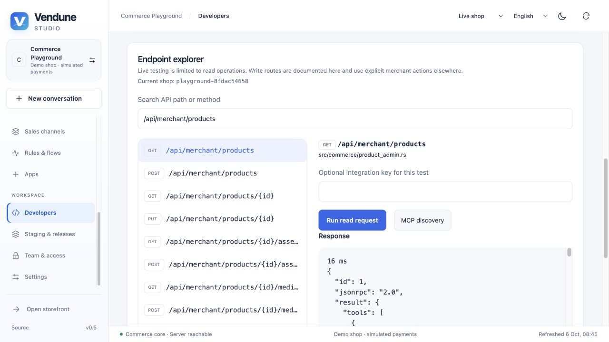
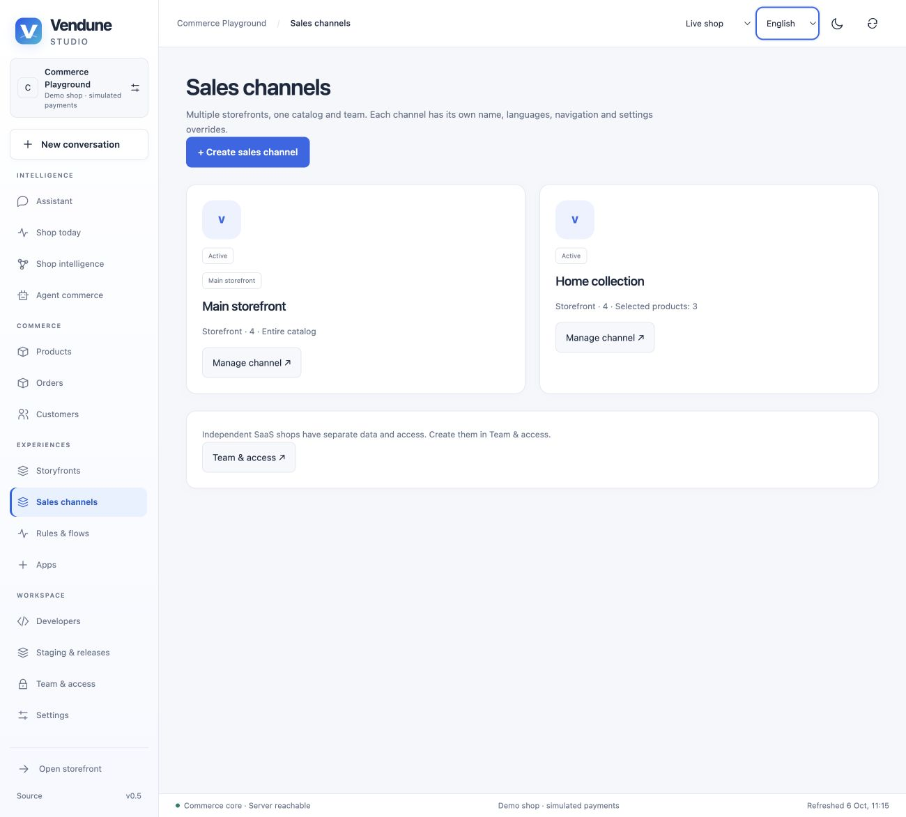

<p align="center">
  
</p>

<div align="center">

# Vendune

**An extensible Rust commerce core for AI-assisted B2C and B2B experiences.**

[](https://github.com/sthamann/vendune/actions/workflows/verify.yml)
[](#current-boundaries)
[](LICENSE)
[](docs/quickstart.md)

[**Get started**](#get-started) · [**Explore the playground**](docs/playground.md) · [**Build an app**](docs/app-studio.md) · [**Connect an agent**](docs/connectors.md) · [**Documentation**](https://sthamann.github.io/vendune/docs/)

</div>

Vendune connects a storefront, a merchant workspace, shop knowledge and agents to
**the same commerce operations**. Product prices, stock, customer permissions and
checkout remain server-controlled. AI can retrieve evidence and propose changes;
authorized merchants review and apply them.

Self-host the source. Run your own stores. Build extensions across the frontend,
Studio, API and AI layer. Commercial shop platforms or hosted SaaS for other
merchants require a separate license. [See the usage guide](docs/licensing.md).

> **Working prototype.** The local tour uses synthetic data and simulated payments.
> Complete Shopware parity, production payment support and database-wide SaaS
> isolation are still being built. [Read the exact boundaries](#current-boundaries).

[](docs/product-management.md)

**A shop worth trying.** New demo shops start with [Nord Atelier](docs/fashion-demo.md): 12 fashion products, 34 size SKUs, four content languages and individually generated product photographs. The catalog is shared by the native storefront and the private Experience integration; checkout uses the actual commerce API.

| Harbor Wool Coat | Cloud Knit | Everyday Leather Tote |
| :---: | :---: | :---: |
|  |  |  |

## Why Vendune?

- **Commerce with one source of truth.** Browser, API and agent clients use shared
  pricing, cart, inventory and order operations.
- **Intelligence with evidence.** Connect products, documents, support sources
  and observed behavior. Inspect where an answer comes from and what was approved.
- **Apps beyond a settings page.** Add admin modules, product fields, storefront
  surfaces, typed data, HTTP/MCP actions, events and external services.
- **A model is a choice.** Centrally configured, inherited Ollama/OpenAI/Anthropic adapters;
  ordinary commerce runs without a model download or API key.
- **Change with control.** Private sandboxes, immutable app versions, selective
  releases, scoped team access and history for supported entities.
- **Ports you can inspect.** Selected Shopware behavior is compared with original
  PHP classes; small production policies have explicitly bounded Lean proofs.

## New in Studio

- **Sign in once, continue in place.** Protected Studio deep links open the login page first. An expired active session opens a login overlay over the current workspace and preserves unsaved drafts. Same-account and membership checks prevent another user from resuming private editors; failed writes are never replayed. [Session behavior](docs/studio-api-and-channels.md#studio-login-and-session-expiry).

- **Manage real shop processes.** Every shop has an editable main sales channel, three reusable starter rules and two order/payment note flows. Search, edit, schedule campaigns and remove unused definitions with dependency checks. [Automation lifecycle](docs/automation.md#starting-configuration-and-lifecycle).

- **One-page checkout.** Address, delivery and payment together; review the server quote, then place one explicit order. Price changes require a fresh review. [Checkout contract](docs/checkout.md).

- **Write visually or in Markdown.** One safe product document, one content language, guarded drafts.
- **Review variants before creation.** Option groups, combinations, individual SKUs/prices/stock and duplicate protection.
- **Connect with precise access.** Developer → API & integrations: scoped keys valid for 1–90 days, source-derived endpoint explorer and live read tests.
- **Create another storefront in three steps.** Storefront or headless, searchable catalog selection and inherited company/checkout settings.
- **Discover standard apps immediately.** Fresh shops see the bundled catalog without silently activating external integrations.

[Explore the Studio integration guide](docs/studio-api-and-channels.md).

**One entry for the whole platform:** [admin.vendune.ai](https://admin.vendune.ai/)
links merchant and platform logins. Operators create subdomain shops, configure
inherited AI providers, inspect each shop and pause/restore operations.
[Operator guide](docs/platform.md).


[](docs/checkout.md)

| Visual + Markdown editing | API + MCP explorer | Sales channels |
| :---: | :---: | :---: |
| [](docs/studio-api-and-channels.md#products--description) | [](docs/studio-api-and-channels.md#developer--api--integrations) | [](docs/studio-api-and-channels.md#sales-channels) |

Screenshots show the running synthetic playground with English UI, not mockups.


## Get started

You need **Rust stable 1.96+, Node.js 22+, Docker Compose and Python 3**.

```sh
git clone https://github.com/sthamann/vendune.git
cd vendune
./scripts/dev.sh
```

Open [the storefront](http://127.0.0.1:8787/) or
[Vendune Studio](http://127.0.0.1:8787/#merchant). On the Studio login page, choose
**Create shop** to create your personal owner account and a
separate synthetic shop. Try a product variant, quantity price, cart and simulated
checkout before adding AI.

The first start pulls PostgreSQL/Qdrant images and builds the frontend and Rust application; it can
take several minutes. No model is downloaded. Private credentials are generated
in ignored `.env`. Keep the terminal open; Ctrl+C stops the app without deleting
the database. [Requirements, restarts and troubleshooting](docs/quickstart.md).

### Your first connected shop

After creating your merchant account:

```sh
python3 scripts/playground.py --email your-personal-merchant@example.test
```

Enter your password at the private prompt. The script creates a **Commerce
Playground** with a `TRY10` coupon, engraving app, Home collection sales channel
and an active branching invoice flow, then prints the shop links. Setup creates
no orders and makes no AI/provider calls. Re-running preserves your edits.

**Try this:** choose a mug variant → register a customer and addresses → apply
`TRY10` → place a simulated order → inspect the order, flow execution and PDF
invoice. [Follow the ten-minute walkthrough](docs/playground.md).

<details>
<summary><strong>Add AI, an MCP client or a separate development instance</strong></summary>

- [Local Ollama setup](docs/quickstart.md#add-local-ai-optional). The documented
  default model download is about 24 GB, with additional memory needed at runtime.
- [OpenAI and Anthropic API setup](docs/connectors.md#models-inside-the-merchant-chat).
  API credentials and charges are separate from consumer chat subscriptions.
- [Claude Desktop and local MCP clients](docs/connectors.md#claude-desktop--local-mcp-clients).
  Hosted ChatGPT/Claude connections need separate reachable endpoints and account setup.
- [A second local instance](docs/quickstart.md#run-a-separate-development-instance),
  using separate database/application ports and a separate Compose project.

</details>

## Explore the connected system

| Workspace | What you can try | Guide |
| --- | --- | --- |
| **Catalog** | Search and filter products; generate and edit variant combinations; visual/Markdown descriptions, media, properties, specifications, SEO, cross-selling, categories and downloads | [Products](docs/product-management.md) |
| **Customers & orders** | Customer accounts, billing/delivery defaults, address books, group configuration, linked records, order state transitions, activity and PDF documents | [Operations](docs/merchant-operations.md) · [History](docs/entity-history.md) |
| **International settings** | Main-language inheritance, reviewed bulk AI translation, country/region pickers, destination tax rules, shipping/payment methods and channel overrides | [International commerce](docs/international-commerce.md) · [Settings & media](docs/settings-media.md) |
| **Shop knowledge** | Product connections, text/PDF sources, publication controls, evidence retrieval, observed co-purchases and decision previews | [Knowledge workspace](docs/knowledge-workspace.md) |
| **Rules & flows** | Nested conditions, branching graphs, consecutive actions, durable delays, documents, AI proposals and app actions | [Automation](docs/automation.md) |
| **Apps & developers** | App library, visual and guided builders, typed entities, embedded editors, API/MCP/AI exposure, signed webhooks and persistent schedules | [App Studio](docs/app-studio.md) · [Assistants](docs/app-assistants.md) |
| **Storyfront & channels** | Guided multishop/headless setup, inherited channel settings, searchable product assignment, Storyfront import and checkout transfer | [Storyfront](docs/storyfront.md) · [Workbench](docs/workbench.md) |
| **Platform & releases** | Shop subdomains, service directory, central encrypted AI settings, operator dossiers, reversible pause/trash, actual infrastructure diagnostics, private stages and selective publishing | [Platform](docs/platform.md) · [Staging](docs/workbench.md#what-a-sandbox-contains) |

The interface supports **English, German, Spanish and French**. Content editors
use one selected language with inheritance from the shop's main language;
additional enabled content locales do not create walls of duplicate fields.

### Intelligence that you can inspect

Knowledge flows from catalog facts, uploaded documents and configured apps into
an evidence workspace. Merchant answers can use private sources; customer
answers use published sources. Source IDs, passages and hashes make retrieval
inspectable. Proposed changes pass the same permissions and revision checks as
ordinary commerce edits.

**This is stored knowledge and observations, not continuous model-weight training.**
An observed association does not prove a sales uplift.
[See the actual retrieval and learning boundary](docs/knowledge-workspace.md).


### Build visually. Extend in code. Use the same contract.

Visual App Studio and coding agents work with the **same executable manifest**.
Compose forms, cards and tables; define typed data; add fields or tabs to existing
product/customer/order editors; decide which actions appear in HTTP, MCP, AI and
Flow Builder. Save an immutable version, test real records in a private sandbox
and release the selected package.

Independent app-service frontends can use their own framework and authorized
browser SDK. External services can own additional APIs and database structures;
they require separate deployment and permission configuration. The system does
not claim automatic compilation or safe execution of arbitrary hostile source.

[Start with App Studio](docs/app-studio.md) · [Full app contract](docs/app-platform.md) ·
[Twelve guided assistant examples](extensions/apps/assistant-examples/README.md) ·
[Product Lab across admin, storefront and MCP](extensions/apps/product-lab)


### Automate the work around commerce

Native events feed the graphical Flow Builder: saved rules, true/false branches,
consecutive actions, persistent delays, documents and app actions. Signed
webhooks and UTC schedules join the same durable event path. App-owned Wasm rules
can contribute to the real cart, including engraving or gift-message fees.


| Integration | Connected behavior | Setup |
| --- | --- | --- |
| **Google Analytics** | Consent-controlled GA4 tag and ecommerce events in the native storefront; report import | [Connected apps](docs/connected-apps.md) |
| **Gmail** | Import a support label into private merchant knowledge | [Connected apps](docs/connected-apps.md) |
| **Slack** | Order notifications and rule-bound flow actions | [Connected apps](docs/connected-apps.md) |
| **SMTP / Resend / SendGrid** | Configurable transactional templates, previews and durable delivery queue | [Email delivery](docs/email-delivery.md) |
| **PayPal Orders v2** | Prototype external payment adapter and local protocol fixtures | [Payment scope](docs/intelligence-apps-payments.md) |

Provider credentials and account authorization are separate setup steps. Default
installation sends no external emails or Slack messages. Provider fixtures verify
local contracts; they do not prove live delivery or a real payment transaction.

<details>
<summary><strong>More Studio screenshots and short recorded demos</strong></summary>

[Product editor](docs/screenshots/vendune-product-editor.jpg) ·
[Media gallery](docs/screenshots/vendune-product-media.jpg) ·
[App discovery](docs/screenshots/vendune-app-discovery.png) ·
[App detail](docs/screenshots/vendune-app-details.png) ·
[Order operations](docs/screenshots/vendune-orders.jpg) ·
[Company details](docs/screenshots/company-settings.jpg) ·
[Country picker](docs/screenshots/vendune-countries.jpg)

[Watch three feature clips](https://sthamann.github.io/vendune/#demo): SKU/tier
selection, Wasm app personalization and a reviewed AI price proposal. Earlier
clips retain the branding/navigation at capture time and shorten waiting time.
The screenshots above are actual English captures from synthetic shops.
[Capture dates and evidence notes](docs/assets/README.md).

</details>

## Inside the core

```text
Storefront · Vendune Studio · Apps · HTTP / MCP / UCP clients
                           │
             Authentication · scopes · revisions
                           │
             Shared Rust commerce operations
                 │                    │
     PostgreSQL: records,       Durable events / workers
     source relationships,           │
     orders and history       Flows · app services · knowledge
                                      │
                               Private Qdrant retrieval
                               + optional model adapters
```

The same committed commerce data reaches browser and agent consumers.
Knowledge retrieval validates semantic candidates against current PostgreSQL
records and publication state. Version-checked configuration caches reduce
repeated reads; checkout keeps authoritative transactional reads.

[Architecture](docs/architecture.md) · [Source ownership](docs/module-inventory.md) ·
[Frontend modules](frontend/README.md) · [Read performance](docs/read-performance.md) ·
[Worker roles](docs/intelligence-apps-payments.md)

### Evidence over promises

- **Original-source comparisons:** bounded pricing, context, tax and rule ports
  are checked against original Shopware **6.7.14.2** PHP classes. The
  [feature matrix](docs/shopware-parity.md) distinguishes native behavior,
  partial ports and missing features.
- **Partial formal verification:** **26 extracted production policies and 55
  Lean-proved properties**, with Rust/Lean conformance and negative mutations.
  [Exact proof boundary](docs/formal-verification.md); no entire-core certificate.
- **Measured performance:** recorded local tests use **1,000,000 products and
  1,000,000 translations**, with raw responses, latency data and failed runs
  retained. [Benchmarks](docs/benchmarks.md) establish bounded local results,
  not production capacity or a speed claim versus Shopware.
- **Continuous checks:** source boundaries, localization, Rust/frontend tests,
  real PostgreSQL integration, original PHP comparisons and Lean/mutation gates.
  [Current CI](https://github.com/sthamann/vendune/actions) · [Testing and coverage](docs/testing.md).
  Full-system 100% coverage is not achieved.

## Current boundaries

| Area | Current scope |
| --- | --- |
| **Payments** | Simulated/manual or configured PayPal Sandbox/Live Orders v2. Local protocol fixtures are verified; actual PSP transactions remain unverified. Shopware Payments requires its private connector and official integration access. |
| **SaaS isolation** | Tenant-scoped API/MCP operations and 22 composite relationship constraints are tested. Core-wide RLS is absent; the local database role is a superuser. [Actual guarantees and remaining work](docs/tenant-isolation.md). |
| **Shopware compatibility** | Selected behavior ports, not complete DAL/Admin API/Store API, CMS, Rule/Flow or extension compatibility. |
| **Agents and models** | Selected MCP/UCP capabilities; not full protocol conformance. Hosted client setup, production OAuth, live model quality and causal learning gains remain separate work. |
| **Hosting** | Public Studio and health endpoint reachable at [app.vendune.ai](https://app.vendune.ai/#merchant); Northflank deployment and prepared Vercel/self-hosted paths. Browser MCP admits the configured `app.vendune.ai` origin and rejects foreign origins. This is not a production checkout certification. |
| **Apps** | Executable declarative packages and separately deployed services. Automatic arbitrary compilation, bundle signing and hostile-code microVM isolation are not implemented. |

Use synthetic data for the playground. Deployment instructions do not establish
production security. [Security](docs/security.md) · [Deployment](docs/deployment.md) ·
[Managed hosting](docs/managed-hosting.md).

## License

**Source available under the [Vendune Sustainable Use License 1.0](LICENSE),**
following n8n's sustainable-use approach with explicit commerce-specific terms.

- **Permitted:** your own commercial stores, multiple brands belonging to your
  company, customization, app development and non-commercial experimentation.
- **Separate commercial permission required:** selling a competing shop system,
  white-labeling, managed commerce hosting or SaaS for independent merchants,
  including commerce APIs or agent-based platform access.

This is **not an OSI-approved open-source license**. Third-party licenses remain
intact. Previously distributed MIT versions retain their original rights; this
change is not retroactive. [Usage examples and commercial inquiries](docs/licensing.md).

## Contribute

Bring a reproducible commerce bug, a better setup experience, locale corrections
or a bounded Shopware port with original-source comparisons.
[Read the contribution guide](CONTRIBUTING.md) and
[open an issue](https://github.com/sthamann/vendune/issues/new/choose).
Keep credentials and customer data out of public reports.

[Full feature tour](docs/features.md) · [API/source map](docs/source-map.md) ·
[Migration workflow](docs/migration.md) · [Brand assets](docs/branding.md) ·
[Third-party notices](THIRD_PARTY.md)
