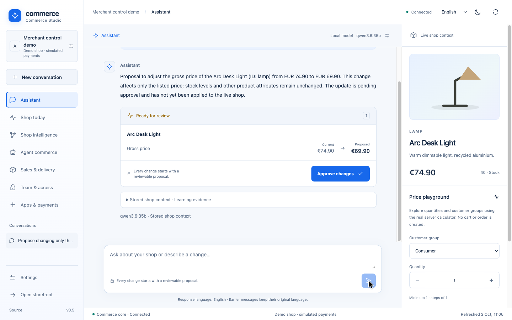
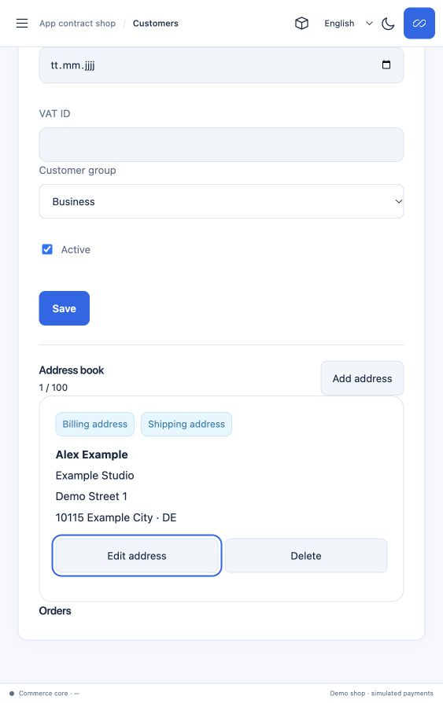
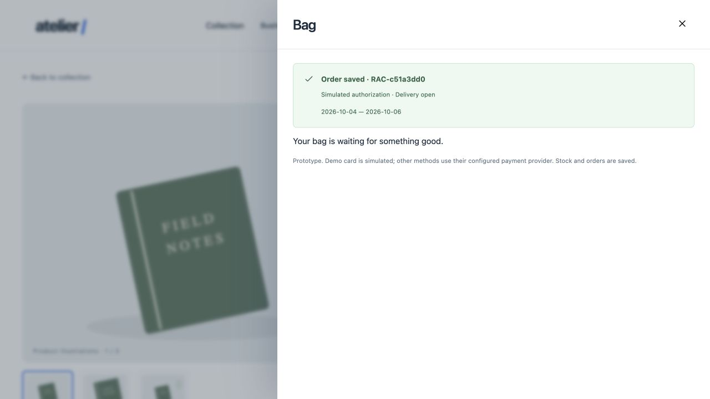
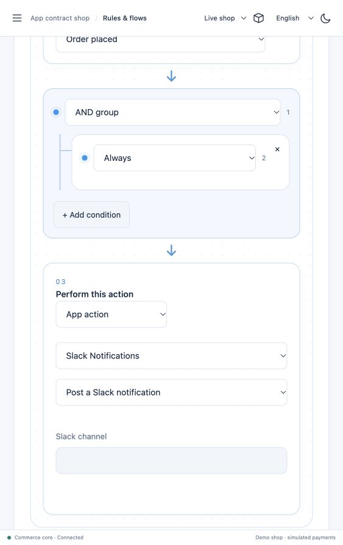
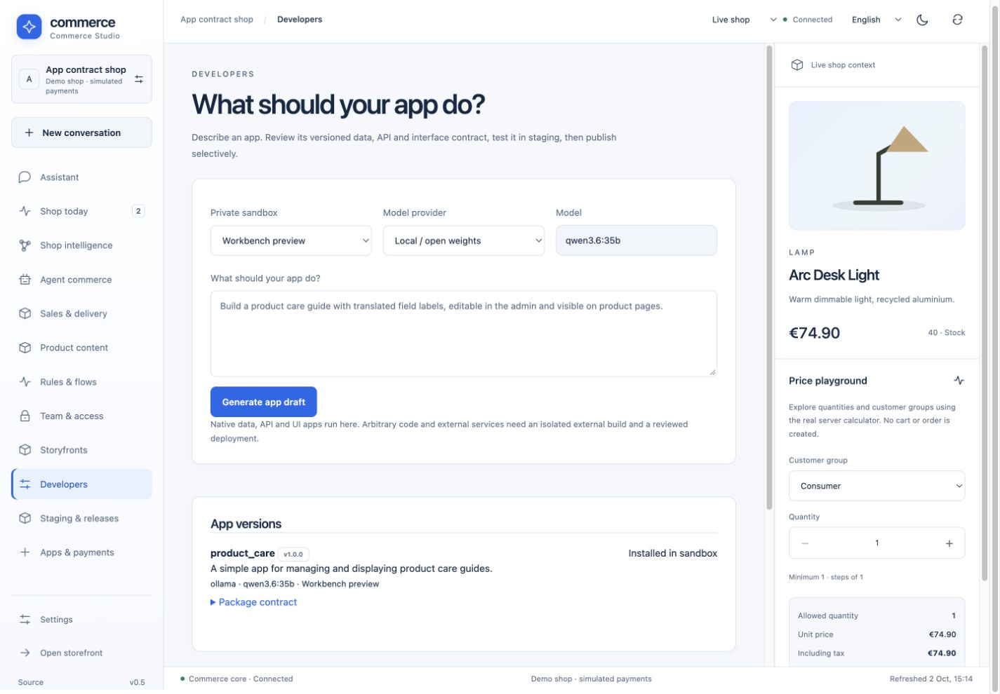
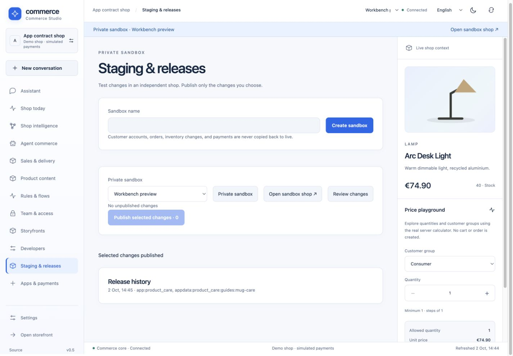

# Rust AI Commerce — Agentic commerce with merchant control

An **open-source ecommerce prototype in Rust** for developers exploring AI-assisted
B2C and B2B commerce. Run a storefront and merchant workspace on your own machine,
connect local LLMs or optional cloud models, and expose selected commerce operations
through **Model Context Protocol (MCP)** and **Universal Commerce Protocol (UCP)** adapters.

**The AI proposes. The merchant reviews and approves. The Rust core applies the change.**
Browser and agent clients share the same pricing, inventory and checkout operations.
This is also a laboratory for porting selected original Shopware behavior to Rust.

[Website & guides](https://sthamann.github.io/rust-ai-commerce/) ·
[Quickstart](docs/quickstart.md) · [MCP setup](docs/connectors.md) ·
[Feature matrix](docs/shopware-parity.md) · [Contributing](CONTRIBUTING.md)

[](https://github.com/sthamann/rust-ai-commerce/actions/workflows/verify.yml)
[](LICENSE)

[](https://sthamann.github.io/rust-ai-commerce/#demo)

## Why try it?

| You want to explore… | What this prototype provides |
|---|---|
| AI-assisted merchant operations | Stored proposals, visible changes, role checks and explicit approval |
| Local AI commerce | Ollama for local inference; optional OpenAI and Anthropic API adapters |
| Agent commerce protocols | A local MCP bridge and partial UCP checkout adapters using shared operations |
| Rust ecommerce and B2B checkout | SKU variants, quantity prices, tax/shipping configuration and durable demo orders |
| Shopware behavior in Rust | Bounded ports checked against original Shopware PHP classes |
| Storyfront shops | Catalog/variant/media import and checkout transfer through a separate [Storyfront app](docs/storyfront.md) |
| Self-hosted storage | PostgreSQL + Apache AGE + pgvector; no paid database service required |

The interface supports **English, German, French and Spanish**. MIT licensed.

## Customers, checkout and order operations

The storefront now shares a full **customer address book** with Commerce Studio:
registration/sign-in, separate default billing/shipping addresses, structured
contacts, payment preferences and own order history. Checkout copies the selected
customer/address records into the order, so later account edits do not rewrite it.
Guest email entry never grants an existing account's identity or order access.

Commerce Studio provides **Customers** and **Orders** with direct server-owned
workflow actions, payment-job progress, tracking, activity and four-language
numbered PDF documents. Company/document issuer data is centrally stored under
**Settings → Company details**. Apps have a category catalog and individual
package workspaces. Fine team rights and expiring per-shop API/MCP keys use the
same request-time authorization checks.

Product attachments, private purchased downloads, rich descriptions and selected
asset/workflow releases are connected to their actual storefront/order consumers.
Read the [operations/API guide and precise boundaries](docs/merchant-operations.md),
[Shopware feature matrix](docs/shopware-parity.md) and [source map](docs/source-map.md).
This remains a bounded prototype: full Shopware entity/DAL/API parity, production
identity/account recovery, graphical full FlowSequence behavior and a supported
Shopware Payments connector are still missing.





## Connected apps and graphical automation

Install **Google Analytics**, **Gmail** and **Slack** from the Apps workspace. Each has
its own multilingual OAuth/settings page. Google Analytics loads the actual GA4 tag
in the native storefront after consent and imports reports; Gmail imports a support
label into private shop knowledge; Slack receives order notifications or rule-bound
Flow Builder actions. Private sources are consumed by the merchant model prompt and
MCP, with source IDs and AGE product relationships. Apps can publish typed events,
and the visual builder edits nested AND/OR/NOT conditions and app actions.

[Setup, provider permissions, event API and tested boundaries](docs/connected-apps.md)
· [Order-alert app and Slack flow example](extensions/apps/order-alerts)
· [Original Shopware condition inventory](reference/rule-catalog.json)

Local: install `extensions/services/connectors/requirements.txt`, configure the Google/
Slack OAuth clients in ignored `.env`, then run `CONNECTED_APPS=1 scripts/dev.sh`.
Existing app services are preserved. Protocol fixtures test the entire provider-to-core
path without external messages or paid model calls; live account authorization requires
your provider clients. Imports are manual in this version. The native builder does not
claim parity with the full original condition catalog or arbitrary FlowSequences.



## Lean-checked production policies

The real Rust checkout, order workflow, access, refund and download paths now
call a small pure kernel with **16 policies and 38 Lean-proved properties**.
The production functions are extracted through a closed typed grammar; compiled
Rust/Lean outputs are compared on 3,602 cases. Deliberately broken policies must
fail the proof checks. CI also audits transitive axioms and locks every Rust,
schema, build and proof input to an explicitly reviewed source inventory.

This is **partial formal verification**, not an entire-core or bug-free
certificate. Database concurrency, surrounding adapters, tax/rounding, provider
protocols, apps, browser and AI behavior remain outside the proofs. Read the
[exact contracts, evidence and future-change procedure](docs/formal-verification.md).
Lean is needed for verification; the running commerce server does not depend on it.

## Merchant workbench and private releases

The workbench now has **Storyfronts**, **Developers**, **Environments**,
**Automation** and **Product content** sections. An existing merchant can create
additional shops. Prompt-generated apps are immutable reviewed drafts, installed
in a private sandbox and selectively published with their own typed data/API/UI.
Codex and Claude Code can use the exported package schema and authorized MCP
workflow; OpenAI/Anthropic model APIs and local Ollama generate app drafts.

Product pages support source-bound questions; merchants upload private text/PDF
sources and explicitly publish them. Customer accounts expose profile editing and
own orders. Native campaigns/coupons/free shipping, rule conditions, durable
note/AI-proposal flows and scoped sales channels share the real checkout path.
Product translations/specifications/SEO/cross-selling and behavior-based ranking
are connected to their storefront consumers.

Read the [workbench guide and exact limits](docs/workbench.md) and the prepared
[Vercel + self-hosted deployment](docs/deployment.md). The four-language interface
extends to the new tabs, forms, native app fields and customer account/checkout
flow; user-authored sources and earlier conversation messages retain their
original language. Real model quality and full Shopware Rule/Flow parity remain
separate verification work.



A local Qwen run generated **Product Care** with translated app labels, a typed
`guides` entity, API actions and a product-detail slot. The reviewed package and
its four-language care record were installed in a private sandbox and selectively
published; the live parent product and 500 ml variant render that same app record.
This is one verified declarative app, not a claim of arbitrary app-generation quality.



## Try the commerce app first — no model download

Requirements: **Rust stable (1.96+), Node 22+, Docker Compose and Python 3**.

```sh
git clone https://github.com/sthamann/rust-ai-commerce.git
cd rust-ai-commerce
./scripts/dev.sh
```

Open [Storefront](http://127.0.0.1:8787/),
[Commerce Studio](http://127.0.0.1:8787/#merchant), or the
[example product](http://127.0.0.1:8787/#product/mug).
In Studio, select **Team & access → Create shop** to create a personal owner
account and a separate synthetic shop. Then explore products, quantity prices,
cart and simulated checkout. AI chat and semantic indexing require their model
services; ordinary commerce operations do not.

The first start builds the database image, frontend and Rust application. It can
take several minutes. No model is downloaded by this command. Private instance
credentials are generated in ignored `.env`; the app binds to `127.0.0.1:8787`
and PostgreSQL to `127.0.0.1:15487`.

## Choose your next step

- **Add local AI:** follow the [Ollama setup](docs/quickstart.md#add-local-ai-optional).
  The documented default model download is about 24 GB, with additional runtime
  memory required. Install it only when you want local inference.
- **Connect an MCP client:** use the [Claude Desktop / local MCP configuration](docs/connectors.md#claude-desktop--local-mcp-clients).
- **Use a cloud model:** configure your own API credentials using the
  [provider guide](docs/connectors.md#models-inside-the-merchant-chat).
- **Study the implementation:** read the [feature tour](docs/features.md),
  [architecture](docs/architecture.md) and [Shopware migration workflow](docs/migration.md).

## See three short feature demos

[Watch the feature clips](https://sthamann.github.io/rust-ai-commerce/#demo):

- Switch an actual SKU, select six units and carry the quantity tier into the cart.
- Personalize a product through an installed Wasm app; its fee enters the real cart.
- Review and approve a local AI price proposal, then inspect the changed storefront.

In the approval clip,
a local model proposes EUR 69.90 instead of EUR 74.90 for the lamp; the price
changes only after merchant approval and is then visible in the storefront.
The recording uses a synthetic shop; waiting time is shortened.

1. Ask the assistant to propose a catalog change.
2. Inspect the stored proposal and the exact fields that would change.
3. Approve with an authorized merchant account.
4. Inspect the updated product in the storefront.

Model text does not grant permissions. The server checks roles and current
revisions before applying an approved proposal. See the [security scope](docs/security.md).

## Inspect measured performance

The [local benchmark page](https://sthamann.github.io/rust-ai-commerce/benchmarks.html)
reports a physical **1,000,000-product catalog with 1,000,000 translations**,
product pages, search, a 20-line cart and fresh durable checkouts at fixed arrivals
of 100 and 500 requests/s. It retains the historical 1,000-product comparison,
failed-run records, raw latencies, response checks and source/binary metadata. [Reproduce the setup](docs/benchmarks.md).
These bounded synthetic measurements do not establish production capacity or LLM speed.

## Current status and limits

**Working prototype; payments are simulated, manually recorded or PayPal Sandbox.
No real money is charged.** This is not a complete drop-in Shopware replacement or a validated
production SaaS deployment.

MCP/UCP cover selected capabilities, not full protocol conformance. Hosted
ChatGPT/Claude connectors require separate endpoint/account setup; no production
OAuth server is included. Live cloud model quality, production scale and causal
sales uplift are unverified. The Sandbox adapter is tested with local contract
fixtures; no live Sandbox transaction is claimed. See the [precise feature matrix](docs/shopware-parity.md)
and [connection boundaries](docs/connectors.md).

## Apps, payments and shop intelligence

The v0.5 prototype also includes versioned app installation, independent worker
roles, an evidence-based shop-intelligence view and a PayPal Sandbox adapter.
See [implementation and limits](docs/intelligence-apps-payments.md),
[worker roles](docs/intelligence-apps-payments.md) and [extension examples](extensions/README.md).

## Evidence and documentation

- [Features, extension examples and verification commands](docs/features.md)
- [Source files and their tests](docs/source-map.md)
- [Recorded verification results](docs/verification.json) and [current CI runs](https://github.com/sthamann/rust-ai-commerce/actions)
- [Original Shopware migration units](porting/units.json) and [migration workflow](docs/migration.md)
- [Architecture decisions](docs/architecture.md), [security](docs/security.md), [third-party licenses](THIRD_PARTY.md)

The current verification includes **5,872 bounded comparisons** against original
Shopware 6.7.14.2 PHP classes. These cover selected pricing/context/tax operations and numeric rule comparisons;
they do not establish full Shopware compatibility. The current workbench verification
also records 44 Rust unit tests and 191 actual HTTP check groups across 18 suites, including
private releases, customer authority, concurrent checkout and bounded catalog reads.

## Contribute

Start with [CONTRIBUTING.md](CONTRIBUTING.md). Useful contributions include
reproducible bugs, clearer setup instructions, locale improvements and bounded
behavior ports with original-source comparisons. Please include the current
version, steps to reproduce and expected versus observed behavior.

App-owned product rules: engraving and gift-message packages supply their own Wasm business rules, input fields and localized forms. The core hosts a generic cart-contribution contract. See [extension examples](extensions/README.md#app-owned-product-configuration).
