<p align="center">
  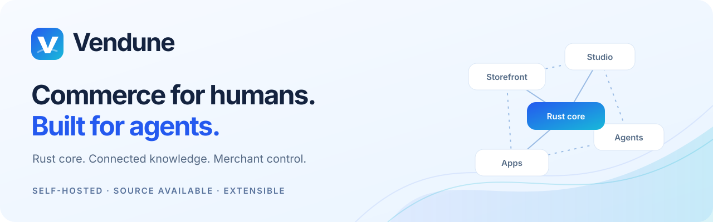
</p>

<div align="center">

# Vendune

**Your storefront. Your apps. Your AI. One commerce core.**

[](https://github.com/sthamann/vendune/actions/workflows/verify.yml)
[](https://sthamann.github.io/vendune/docs/)
[](#current-boundaries)
[](LICENSE)

[**Start locally**](#get-started) · [**See it in action**](#see-vendune-in-action) · [**Interactive demos**](https://sthamann.github.io/vendune/index.html#demo) · [**Full feature tour**](https://sthamann.github.io/vendune/docs/features.html) · [**Latest release**](docs/current-release.md) · [**Build an app**](docs/app-studio.md) · [**How it works**](docs/production-architecture.md) · [**Documentation**](https://sthamann.github.io/vendune/docs/)

</div>

Vendune is a self-hosted **Rust commerce system** for B2C and B2B shops. Run a
storefront, manage it in Vendune Studio, build custom experiences and give agents
access to the same catalog, prices, inventory and checkout. AI retrieves shop
knowledge and proposes changes; you review the exact changes before they go live.

| Run your shop | Build your experience | Keep control |
| --- | --- | --- |
| Products, variants, customer accounts, orders, taxes, shipping and documents | Visual App Studio, typed data, custom storefronts, HTTP/MCP actions and app services | Private sandboxes, selected releases, scoped team access, version history and central AI settings |

[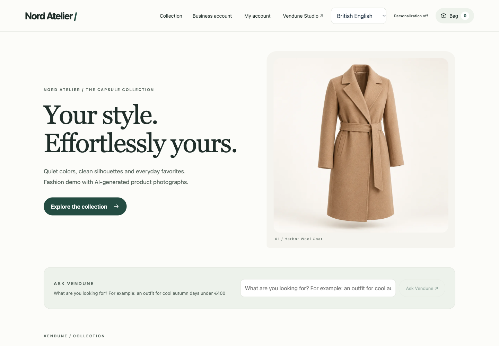](docs/features.md#storefront-and-shopping)

**Meet Nord Atelier.** The default demo has **12 fashion products, 34 purchasable
SKUs, seven categories and four content languages**, with individually generated
product photographs included. Choose a size, add it to your bag and follow the
real checkout. [Explore the collection](docs/fashion-demo.md).

The responsive checkout includes touch-sized controls, a fixed order action,
address validation and optional opt-in Google Places completion. Accepted orders
open a durable confirmation page with a finite, reduced-motion-aware confetti
animation. [Checkout setup and limits](docs/checkout.md).

> **Working prototype.** The captures use isolated synthetic shops and simulated
> payments. Current capabilities and remaining production work are described
> [below](#current-boundaries) and in the [complete feature guide](docs/features.md).

**Core hardening:** explicit route permissions, trusted request identity, non-owner
RLS deployment, shared tenant/connection budgets, persistent login throttles,
transaction-mode PgBouncer and recoverable poison-event handling now use the
existing commerce owners. [All eighteen fixes, architecture and verification boundaries](docs/core-hardening.md).

**Connected intelligence foundation:** automatic batched embedding intake and model
rebuilds, hybrid text retrieval with optional reranking, authorized agent read
rounds, native chat progress, source-bound merchant-reviewed claims, signed facts,
price guardrails/daily autonomy budgets, controlled layout experiments and private
consent-bound cart preferences. [How they connect, setup, evidence and remaining audit work](docs/cognitive-commerce.md).

## Get started

**Rust stable 1.96+ · Node.js 22+ · Docker Compose · Python 3**

```sh
git clone https://github.com/sthamann/vendune.git
cd vendune
./scripts/dev.sh
```

Open [the storefront](http://127.0.0.1:8787/) or
[Vendune Studio](http://127.0.0.1:8787/#merchant). Choose **Create shop** on the
Studio login page to create your personal owner account and a separate shop.
The fashion demo, variants, cart and simulated checkout work **without a model
download or provider API key**.

**Your first round:** choose a coat size → place a simulated order → inspect it
in Studio → create a sandbox → try a product change → review its release.
[Follow the illustrated tour](docs/features.md).

The first start builds the frontend/Core and starts PostgreSQL/Qdrant; allow a
few minutes. Private credentials are generated in ignored `.env`. Keep the
terminal open; Ctrl+C stops the app and retains the database.
[Full setup and troubleshooting](docs/quickstart.md).

<details>
<summary><strong>Add a model, connect an agent or run the legacy playground</strong></summary>

- **AI:** use centrally configured Ollama, OpenAI Responses or Anthropic Messages.
  [Provider setup](docs/connectors.md#models-inside-the-merchant-chat) ·
  [Optional local Ollama](docs/quickstart.md#add-local-ai-optional). The documented
  local model download is about 24 GB; runtime needs additional memory. Cloud API
  credentials and charges are separate from consumer chat subscriptions.
- **Agents:** [connect a local MCP client](docs/connectors.md#claude-desktop--local-mcp-clients).
  Hosted clients need a reachable HTTPS endpoint and account-side registration;
  OAuth-based clients additionally need an appropriate gateway.
- **Another instance:** [use separate ports, credentials and volumes](docs/quickstart.md#run-a-separate-development-instance).
- **Legacy furniture walkthrough:** [the playground CLI](docs/playground.md)
  exercises mug/lamp fixtures, TRY10, personalization and an invoice flow.
  Select `DEMO_CATALOG=legacy-furniture` and restart **before creating that shop**.
  Keep the normal fashion default for Nord Atelier; existing shops retain their data.

</details>

## See Vendune in action

### Shop, review, place the order

One checkout combines contact, billing/delivery addresses, shipping, payment,
coupons and the authoritative total. **Review order** and **Place order** are
separate steps. A changed quote needs a new review; repeated requests return the
same saved order. Inventory and immutable order snapshots commit together.

[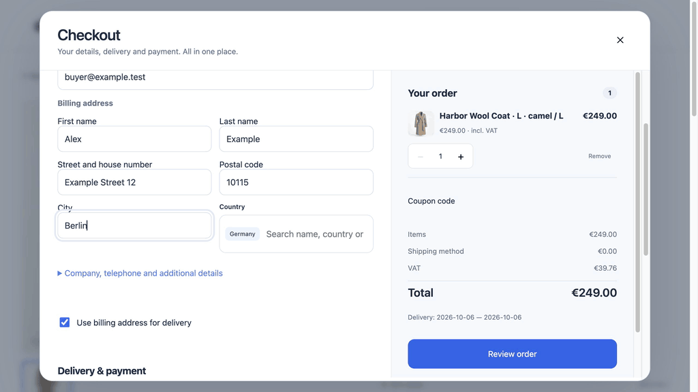](docs/features.md#one-page-checkout)

*Real checkout interaction in the Nord Atelier test shop. The payment is simulated.*

The **product editor** brings visual/Markdown descriptions, translated
content, prices/stock, reviewed variant combinations, galleries, category/channel
visibility, specifications, SEO, cross-selling, downloads and reviews together. Public shops use their own subdomain; product links use stable SKU addresses with inherited localized SEO slugs and support direct reloads. [Explore commerce](docs/features.md#products-and-categories).

### Intelligence beside the work

**Ask Vendune** opens beside products, orders, customers, settings and app workspaces. It prepares an editable question with the current workspace, staging environment and linked entity reference. The existing conversation, evidence and permission-checked proposals stay connected; opening help preserves the product editor.

[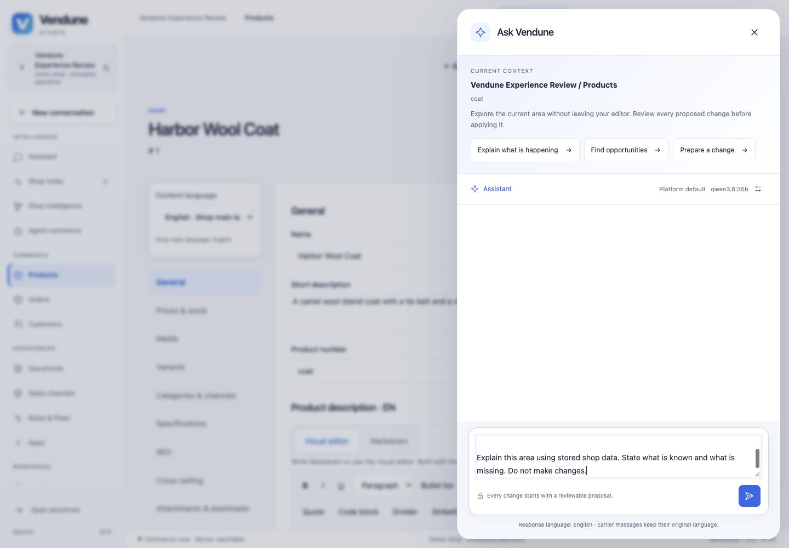](docs/ui-experience.md)

*Actual local Studio screen; the question is prepared, with no model call or automatic change.*

### Stay connected after checkout

A separate sign-in and registration leads to a responsive customer account:
independent default billing/shipping addresses, cursor-paginated purchase history,
immutable order details, current delivery and payment state, HTTPS tracking links,
issued PDF documents and entitled digital downloads. The storefront uses customer
sessions and ownership checks, never merchant credentials.

[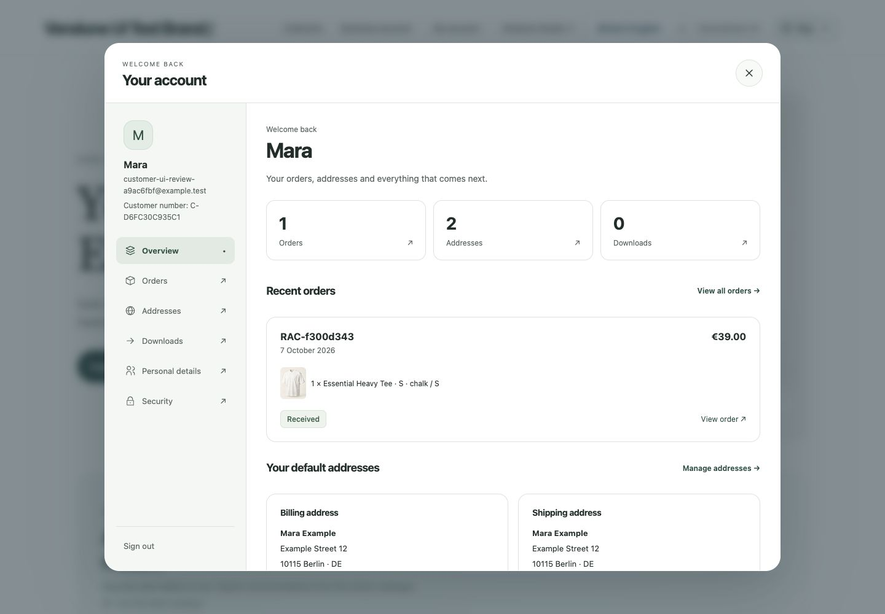](docs/merchant-operations.md#storefront-account-experience)

*Actual account interaction in an isolated Nord Atelier test shop; all purchases are simulated.*

### Operate in Europe with connected privacy and legal controls

**Settings → Legal & privacy** brings a source-linked sector checklist, inherited
channel documents, provider disclosures and a private consumer-request workspace
together. The storefront starts optional tracking denied, supports equal privacy
choices and revocation, gates analytics/media/maps/personalization, and exposes an
online withdrawal function. Strict server checkout binds current legal documents
and separate digital-delivery approval to immutable orders. Email and Flow Builder
use the same durable events. [Configuration, architecture and exact legal/technical
boundaries](docs/european-operation.md). Reviewed legal texts and sector-specific
obligations remain the operator's responsibility; strict checkout defaults off in demos.

### Give AI evidence. Review its changes.

Products, uploaded text/PDF sources, curated relationships, observed purchases
and configured app evidence meet in **Shop intelligence**. Test retrieval,
inspect passages and source identity, and explicitly publish eligible knowledge
for shoppers. Merchant-private evidence stays within authorized merchant use.

The assistant keeps conversations and inspectable proposals. Approved changes
use the same permission/revision checks as manual edits. Translation and image
jobs produce private drafts. Choose Ollama, OpenAI or Anthropic; ordinary
commerce runs independently of inference.

[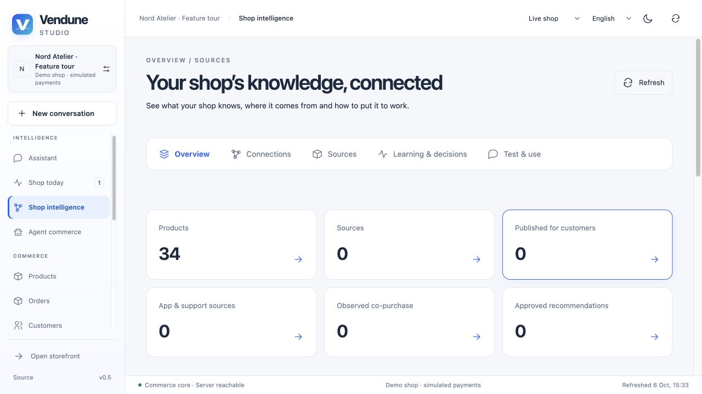](docs/knowledge-workspace.md)

Stored knowledge and observations are distinct from model-weight training;
observed associations do not establish sales uplift.
[Knowledge and AI tour](docs/features.md#assistant-and-shop-intelligence).

### Build an app that belongs in your shop

**Visual App Studio and coding agents share one executable manifest.** Compose
a snapping form raster with controls, data grids and code-behind; define typed models; add product,
customer or order fields; choose public reads, HTTP/MCP tools, AI access and Flow
actions deliberately. F5 runs actual records in an actor-private sandbox with hot reload. Autosave drafts,
inspect calls and breakpoint traces, save an immutable version and publish selected changes.

[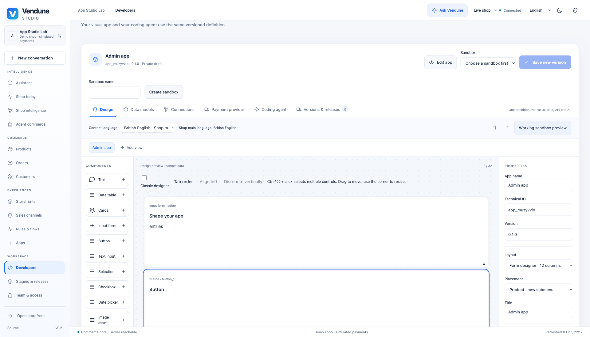](docs/app-studio.md)

*Actual browser capture, 8 October. The design canvas labels sample data;
the [working private preview](docs/assets/feature-tour/app-private-preview.png)
shows a product-bound record saved and reloaded through PostgreSQL.*

Nine assistants cover storefront/admin apps, connected experiences, connectors,
events, webhooks and schedules. Separately deployed services can bring their own
frontend, database and capabilities through the scoped SDK.
[App Studio](docs/app-studio.md) · [Guided contracts](docs/app-assistants.md) ·
[Full app SDK](docs/app-platform.md) · [App security](docs/app-security.md) · [Runnable Product Lab](extensions/apps/product-lab).

### Make the process visible. Publish what you choose.

Rules and campaigns feed a graphical Flow Builder with Yes/No branches,
consecutive actions, durable delays, documents and configured app actions.
Execution traces show actual results and errors. Signed app webhooks and UTC
schedules connect external events to the same durable path.

[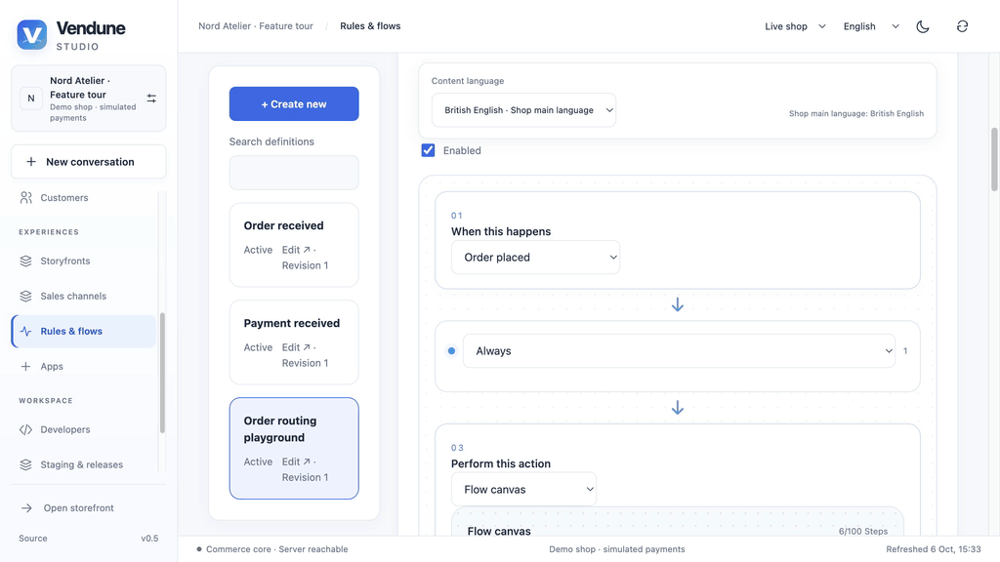](docs/automation.md)

*Inspect the saved six-step flow. This editor recording does not assert an external delivery.*

Compare a private stage with its live baseline, select changes and publish them
atomically. Product content releases preserve live inventory. Version history
supports validated content restoration, without replaying financial operations.

[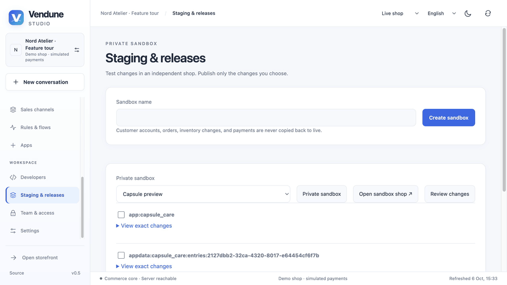](docs/workbench.md)

*Package and app-data publication are independent. The unselected data stays in the sandbox.*

These are real browser captures; waits are shortened for readability. The
[complete tour](docs/features.md) retains **40 screenshots and 12 interaction
GIFs from 6 October**, alongside [three new public integration captures from
8 October](docs/assets/showcase/README.md#public-integration-captures-8-october-2026)
and [two current App Studio captures](docs/assets/feature-tour/README.md).
Capture versions, recording edits and live-provider limits remain explicit.

## Operate the whole platform

[**admin.vendune.ai**](https://admin.vendune.ai/) is the entry to merchant and
platform sign-in. The separate operator console creates shops, inspects their dossiers, and
supports pause, recoverable trash and restore. Configured wildcard routing gives
shops subdomains; diagnostics probe the actual database, index, pools and queues.
HTTP diagnostics distinguish access refusals, other client responses and server
failures, with exact response codes. Older totals remain visibly unclassified;
[read the measurement boundaries](docs/platform.md#what-the-http-error-counts-mean).

Central encrypted **Ollama/OpenAI/Anthropic settings** are inherited or overridden
per shop. Chat, app generation, translations and AI proposals share that selection.
Keys stay server-side; “Configured” reports settings, not provider health.

[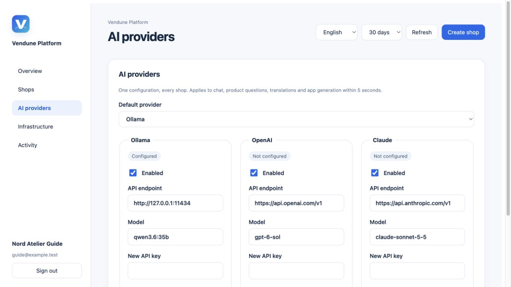](docs/platform.md)

**Connect your own experience.** The latest opt-in integration adds trusted
server-side merchant identity, owned shop provisioning, structured inference,
one-use Studio handoff and channel-bound hosted frontends. Public frontend
traffic uses a restricted proxy. The trusted identity service and its credentials
remain operator-managed; this is not a deployed Google/Apple OAuth service.
[Experience integration](docs/experience-integration.md) · [Platform guide](docs/platform.md).

## Explore the connected system

| Area | What is connected | Guide |
| --- | --- | --- |
| **Catalog & channels** | Search, eleven editor tabs, translated category trees, variants, guided storefront/headless channels, domains, pause/resume and personal previews | [Products](docs/product-management.md) · [Channels](docs/studio-api-and-channels.md#sales-channels) |
| **Customers & orders** | Responsive customer workspace, separate sign-in/registration, default billing/delivery addresses, purchase details, HTTPS tracking, owned invoice PDFs and paid downloads; Studio fulfillment, guest buyer contacts with linked purchase addresses/orders, and customer groups | [Operations](docs/merchant-operations.md) · [History](docs/entity-history.md) |
| **International settings** | Company/channel inheritance, enabled content locales, countries, destination taxes and eligible shipping/payment methods | [International commerce](docs/international-commerce.md) · [Settings](docs/settings-media.md) |
| **Knowledge & automation** | Published/private sources, reviewed recommendations/proposals, coupons, rules, event graphs and durable workers | [Knowledge](docs/knowledge-workspace.md) · [Automation](docs/automation.md) |
| **Apps & developers** | Eight bundled apps, nine builder assistants, typed storage, SDK surfaces, scoped API keys, HTTP/MCP tools, schedules and webhooks | [App library](docs/app-library.md) · [App contracts](docs/app-platform.md) |
| **Platform & experiences** | Shop domains, inherited AI, lifecycle, diagnostics, trusted identity, private stages and selective releases | [Platform](docs/platform.md) · [Experiences](docs/experience-integration.md) |

### Connected experiences, managed in one place

Experience onboarding installs the **Storyfront integration** in the same
transaction that connects its frontend. Apps, Storyfronts and **Sales channels →
Domains & experiences** show the same owned connection and open the deployment’s
existing editor. Pause a channel or make it private without deleting its orders.
Storyfront implementation stays private; installation does not publish a draft
or activate the original native renderer.
[Current release and deployment boundaries](docs/current-release.md) ·
[Connections and dependency checks](docs/channel-management.md).

[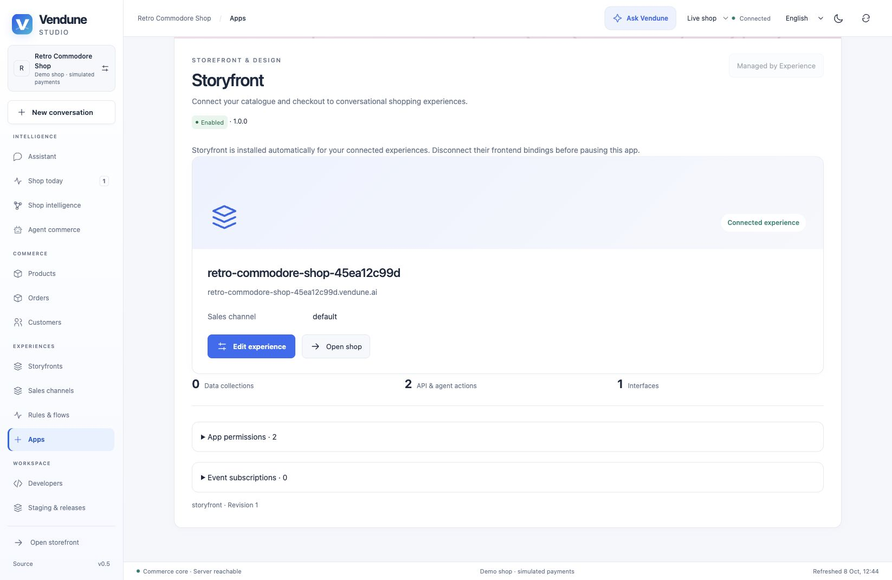](docs/channel-management.md#storyfront-app-ownership-for-experience-shops)

The **eight bundled apps** are Personalize this product, PayPal, Shopware
Payments, Storyfront, Google Analytics, Gmail, Slack and Email delivery
(SMTP/Resend/SendGrid). Each has explicit setup and permission boundaries;
installation does not silently connect a provider.
[App capabilities](docs/features.md#the-eight-bundled-apps).

Studio has **15 workspaces** in **English, German, Spanish and French**, plus
dynamic content locales with main-language inheritance. Developers get scoped
keys and an explorer generated from the current Rust routes (**279 static HTTP
method/path pairs** in this implementation, reviewed 9 October 2026); installed app routes
are discovered per shop. CI rejects catalogue drift.
[Studio/API tour](docs/studio-api-and-channels.md).

### Multiple currencies, one checkout

Choose shop and sales-channel currencies, expose a storefront selector and use
fixed localized prices or the latest stored exchange rates. Generate product and
variant prices in durable batches. API, MCP and UCP checkout share the same currency
context; payments, refunds and invoices retain their original precision.
[Configure currencies and pricing](docs/currencies.md).

## Inside the core

**Rust + PostgreSQL + private Qdrant + bounded Wasm extensions.** Browser,
HTTP, MCP and UCP clients reach shared commerce operations with authenticated
scope and revision checks. PostgreSQL owns orders, stock, users, app records,
knowledge and queues. Qdrant is a rebuildable retrieval index whose candidates
are checked against current records and publication state.

Independent workers process events, payments, knowledge, translation and media.
External calls stay outside database transactions; approved Wasm policies have
bounded fuel/memory and no network/filesystem access.
[Architecture](docs/architecture.md) · [Source map](docs/source-map.md) ·
[Worker roles](docs/intelligence-apps-payments.md) · [Wasm examples](extensions/README.md).

### Evidence you can inspect

| Evidence | What it establishes |
| --- | --- |
| **7,000 original-PHP comparisons** | Bounded pricing, context, shipping-tax, rule and comparison behavior against reviewed Shopware sources. [Parity matrix](docs/shopware-parity.md). |
| **45 extracted production policies · 97 Lean properties** | Exact named pure decisions, Rust/Lean conformance and rejected negative mutations. Surrounding SQL/providers/browser behavior remains outside those proofs. [Formal boundary](docs/formal-verification.md). |
| **1,000,000 products + 1,000,000 translations** | Dated local commerce workloads with retained raw measurements and failures; not production capacity or a Shopware speed ratio. [Benchmarks](docs/benchmarks.md). |
| **Translation workflow** | Four-language Studio, platform, checkout and bundled app controls; shared content inheritance, additional shop content languages and translator-friendly catalogue export/import. [How translations work](docs/localization.md). |
| **Continuous verification** | Source ownership, localization, Rust/frontend checks, real PostgreSQL integration, original PHP comparisons and Lean/mutation gates. [CI](https://github.com/sthamann/vendune/actions) · [Testing](docs/testing.md). |

## Production architecture

[](docs/production-architecture.md)

The core now includes an exact money boundary with explicit currency scale, strict
RLS deployment checks, allocations for all payment methods, a central payment state
machine, commit-driven cache eviction, resource admission, shared daily interactive
AI quotas and operator latency histograms. Native public assets skip database authentication;
shop admission shares one fresh SQL snapshot, dashboard reads are consolidated,
settings use immutable `Arc` handles, and storefront/build assets support gzip/Brotli.
A matched local 9,000-request comparison retains raw samples, payload sizes and
unchanged-response checks: [read-path measurements and limits](docs/read-performance.md).
[Follow the complete request, checkout,
security and intelligence paths](docs/production-architecture.md), including rendered
diagrams, source locations, configuration, tests and the remaining production gaps.
The ported pricing slice deliberately retains Shopware float behavior; a complete
integer/decimal pricing migration must continue to pass its original-source gates.

### Rust standard services

Email Delivery, Google Analytics, Gmail and Slack now run in a separate **Rust** service.
Their configuration, source exports and notification queue use encrypted, tenant-scoped
PostgreSQL records. Multiple workers share fenced leases and per-shop limits; uncertain
external results are never blindly retried. API, MCP and Flow Builder contracts remain
unchanged. External apps still choose their own language.

[Architecture and SQLite migration](docs/rust-services.md) · [Email setup](docs/email-delivery.md) · [Connected apps](docs/connected-apps.md)


## Current boundaries

| Area | Current scope |
| --- | --- |
| **Production readiness** | Working prototype. Recovery/MFA, complete token/spend quotas, automatic relocation/failover, legal compliance and full-system coverage remain additional work. |
| **Payments & connected services** | Simulated/manual payments, native PayPal Orders v2 and a versioned [provider API](docs/payment-provider-api.md) for isolated payment apps: onboarding, redirect/embedded checkout, capture/authorize/void/refund, signed callbacks and Flow/MCP actions. App Studio edits the same contract. Local fixtures are tested; real PSP outcomes and the private Shopware Payments service require approved provider configuration. |
| **Tenant isolation** | Scoped API/MCP operations, tenant-aware foreign keys, core FORCE RLS policies and connection-scoped runtime enforcement. Strict deployments require a separate non-owner runtime login; policies alone do not protect a superuser. [Exact isolation boundary](docs/tenant-isolation.md). |
| **Shopware & protocols** | Selected native behavior ports and HTTP/MCP/UCP capabilities; complete DAL/CMS/plugin compatibility and full protocol conformance are outside this slice. |
| **Custom apps & hosting** | Declarative packages plus separately deployed services. Canonical Ed25519 package signatures, dependency checks and hash-pinned UI bundles are implemented. Arbitrary source builds and hostile-code microVM containment remain external deployment responsibilities. Deployment/health availability does not certify production checkout. |

[Security](docs/security.md) · [Managed hosting](docs/managed-hosting.md) ·
[Complete feature scope](docs/features.md).

Adding another settlement rail requires invoice-bound server verification and
ledger integration. [Payment provider requirements and current limits](docs/payment-provider-contributions.md).

## License and contributions

**Source available under the [Vendune Sustainable Use License 1.0](LICENSE).**
Run and customize your company's own stores, brands and apps. Selling a competing
shop system, white-labeling or providing managed commerce/SaaS for independent
merchants requires a separate written commercial license.

This is not an OSI-approved open-source license. Earlier MIT-distributed versions
retain their original rights; third-party terms remain intact.
[Usage examples and commercial inquiries](docs/licensing.md) · [Third-party notices](THIRD_PARTY.md).

Bring a reproducible commerce bug, a useful extension, a locale correction or a
bounded Shopware port with original-source comparisons.
[Contribute](CONTRIBUTING.md) · [Open an issue](https://github.com/sthamann/vendune/issues/new/choose) ·
[Changelog](CHANGELOG.md).

### Channel management and private previews

Existing sales channels now support revisioned editing, pause/resume and public/private visibility, including the main channel. Each channel displays its connected domains and canonical Experience editing links. Additional addresses and disconnect operations reuse the tenant-owned frontend registry and dependency checks. Personal 15-minute previews are session-bound and cannot purchase. See [workflow, APIs, security and native Storyfront limits](docs/channel-management.md).
