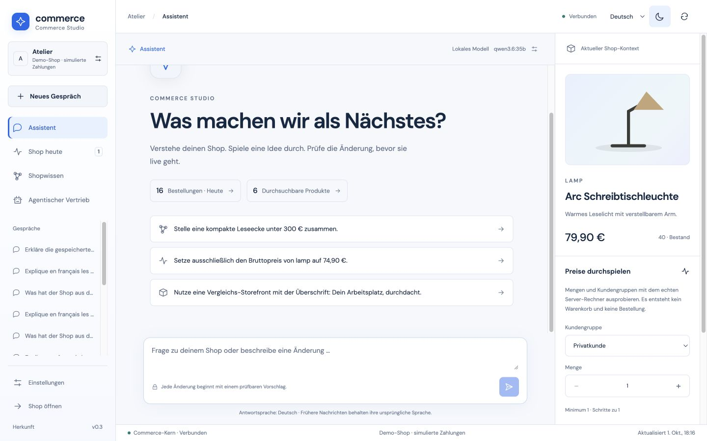
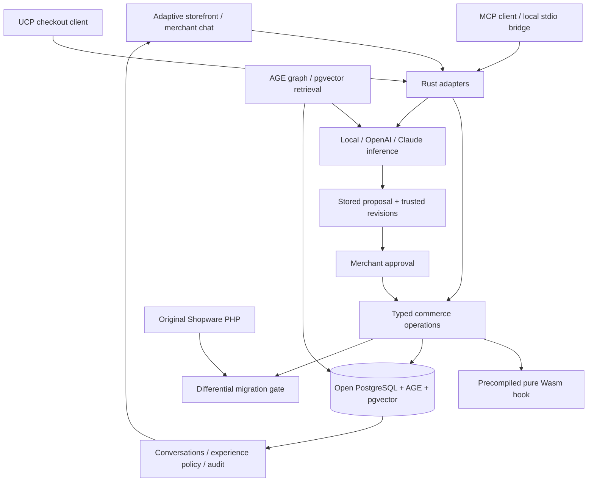

# Rust AI Commerce

An open, working **B2C + B2B commerce prototype** with a Rust core, a chat-first
merchant workspace, adaptive storefront, graph knowledge, semantic retrieval,
and incremental ports of original Shopware behavior. MIT licensed.

The core places durable orders and changes real demo inventory. **Payment is
simulated.** This is a migration laboratory, not a complete Shopware replacement.



[Verification](docs/verification.json) · [Migration scope](docs/migration.md) ·
[Model and ChatGPT/Claude connections](docs/connectors.md) ·
[CI](https://github.com/sthamann/rust-ai-commerce/actions)

## Start

Requirements: Rust stable, Node 22+, Docker Compose, Python 3, and Ollama for
local inference. The app binds to `127.0.0.1:8787`; its dedicated database binds
to `127.0.0.1:15487`. No other shop/database is used.

```sh
git clone https://github.com/sthamann/rust-ai-commerce.git
cd rust-ai-commerce
ollama pull qwen3.6:35b
ollama pull qwen3-embedding:0.6b
./scripts/dev.sh
```

Qwen3.6-35B-A3B is the current default open-weight model. The Ollama artifact is
about 24 GB; actual memory requirements also include context/runtime overhead.
Use a compatible installed model via `OLLAMA_MODEL` if needed. Models are never
silently downloaded by the Rust application. An existing `.env` keeps your
model selection; update it when migrating from the earlier Qwen2.5 prototype.

The dev script generates private credentials in ignored `.env`, builds the
open database image and frontend, then starts Rust. Open the storefront at
http://127.0.0.1:8787 and merchant chat at http://127.0.0.1:8787/#merchant.
Use `MERCHANT_TOKEN` from `.env` to connect. The browser keeps that token in
memory; it is never baked into assets or stored in chat history.

The B2B demo account is `buyer@example.test` / `demo-business`. It receives net
pricing, group/quantity discounts, and a €1,000 pure-Wasm purchase limit.
All products, relationships and accounts are synthetic.

For semantic search, connect Commerce Studio, open **Einstellungen / Settings**,
and click **Shopwissen aktualisieren / Refresh shop knowledge**. This computes real 1,024-dimensional
Qwen embeddings, persists them, and reuses unchanged documents.

## A fully open database stack

The data layer is PostgreSQL 17 **with Apache AGE and pgvector**, built from
source in [database/Dockerfile](database/Dockerfile). It provides:

- Actual Cypher product/need/complement relationships, with provenance.
- Persisted embeddings and tenant-filtered vector retrieval, joined to current
  authoritative prices and inventory.
- Atomic order, inventory, idempotency and outbox transactions.
- Durable conversations, plans, approvals and experience-policy state.

Licenses: PostgreSQL License / Apache 2.0 / PostgreSQL License. No BSL, SSPL,
paid database service or proprietary database edition is required. See
[attribution](THIRD_PARTY.md). This preserves the transactional ledger and adds
an actual semantic graph; it does not pretend SQL disappeared.

AGE is pinned to a source commit; pgvector is pinned to v0.8.6. Migrations are
additive and preserve the existing prototype's PostgreSQL 17 volume. Back up
an existing demo before updating its database image. Do not delete the volume.
The local update was checked using an actual pre-update backup.

The graph currently contains curated demo facts, not automatically learned
truth. Search uses exact vector ranking on this small dataset. Million-product
capacity, ANN recall, distributed graph sharding and failover are **unmeasured**.
The prototype admits two demo tenants; a production tenant directory is future
work. Every graph/vector access includes the tenant boundary.

## Commerce Studio · v0.3

A standalone light workspace with Shopware-inspired blue accents, a large assistant and an
interactive product/price preview. Four connected views provide:

- **Assistant:** persistent conversations and reviewable price, inventory or
  storefront proposals, followed by explicit approval.
- **Shop today:** API-backed orders, seven-day order counts, inventory, stored
  proposals and actual activity. Demo orders are labeled as simulated.
- **Shop intelligence:** a selectable AGE product/need graph, complementary
  products, real semantic retrieval, observed variant counts and a seven-day
  session/reward history. Selecting a product also selects its price preview.
- **Agent commerce:** an understandable customer journey, actual HTTP call
  counters, local MCP configuration and separate ChatGPT/Claude setup status.
  Calls include synthetic tests and are not customers or attributed sales.

The complete Studio interface is available in **German, English, French and
Spanish**, with locale-aware numbers/dates, localized products and model replies
in the selected language. The API additionally demonstrates Swiss German →
German → system-language fallback. Switching languages retains conversation
history; previously stored messages keep their original language. An optional slate-blue dark theme,
keyboard-operable graph/dialogs and a mobile preview drawer are included.

The preview calls the real Rust calculator for quantities and consumer/business
pricing. It creates no cart/order and changes no stock. Product minimum, purchase
steps, maximum, rule priority and quantity tiers are also used by actual carts.

Studio reads `/api/merchant/overview`; its non-mutating quote is
`POST /api/merchant/quote`. Both require merchant authority. Product locale comes
from `x-commerce-locale` or `sw-language-id`; `/store-api/context` exposes the
language chain. These are native prototype contracts, not full Shopware schemas.

## Chat-first operations and optional cloud models

The merchant workspace puts conversations first: persistent history, provider
selection, natural-language requests, before/after change cards and approval.
You can ask about product combinations, change prices/stock, or reshape the
storefront's constrained experience definition. The model receives current
catalog state, AGE relationships, prior conversation and verified demo-order
aggregates, recorded learning counts and observed channel calls. The same verified
facts are stored with the proposal so its answer can be inspected. The server binds concurrency revisions and validates every action.

Three provider adapters are implemented:

| Provider | Transport | Setup |
|---|---|---|
| Local open weights | Ollama structured JSON | `OLLAMA_MODEL` / `OLLAMA_URL` |
| OpenAI | Responses API + strict JSON schema | `OPENAI_API_KEY` / `OPENAI_MODEL` |
| Claude | Anthropic Messages + structured output | `ANTHROPIC_API_KEY` / `ANTHROPIC_MODEL` |

Optional keys are server environment variables. Choosing a cloud provider
sends the task and bounded shop/conversation context to that provider. No
subscription-cookie reuse, silent fallback or invented model output exists.
Missing credentials, incomplete responses and HTTP failures become explicit
errors. Cloud inference is optional; commerce and the database work locally.

The local MCP stdio bridge supports Claude Desktop and other clients.
ChatGPT/hosted Claude connections require a secure remote endpoint and account
setup. No external account was silently registered, no OAuth server is claimed,
and localhost is not presented as remotely reachable. See the concrete setup
and verified boundaries in [docs/connectors.md](docs/connectors.md).

## Working paths

| Path | Behavior |
|---|---|
| B2C/B2B checkout | Server prices/taxes, revision-checked cart, atomic stock/order/outbox and idempotent retries |
| Pricing port | Gross/net quantity, cash rounding, multiple/empty/duplicate tax rules, list-price discount, regulation price, reference-unit price |
| Merchant chat | Actual inference → stored proposal → explicit approval → revision-checked mutation → visible storefront change |
| Customer advice | Actual model uses catalog plus graph/retrieval evidence; only existing product IDs and supported layouts are accepted |
| Semantic tools | `knowledge.graph` / `knowledge.search` share the Rust retrieval path with HTTP and the agents |
| Adaptive frontend | Stable components, session affinity and persisted discovery/comparison decision policy |
| Extensions | Authorized WAT activation, compile before checkout, fuel/memory/stack limits, no host imports/WASI |
| MCP / UCP | Selected tool and checkout bindings use the same cart and commerce operations |

The persisted learning policy is a small epsilon-greedy mechanism using views
and **simulated-order** rewards. It is not online LLM weight training or proof
of economic uplift. Durable chat is contextual memory, not evidence that model
weights learned. Causal evaluation, returns/consent handling, long-running
agent workers, autonomous mandates and validated skill-learning remain open.

## Verify

With the app running, in another terminal:

```sh
set -a; source .env; set +a
cargo test --locked
python3 scripts/studio.py
python3 scripts/integration.py
python3 scripts/protocols.py
python3 scripts/intelligence.py
python3 scripts/providers.py
TEST_EMBEDDING=1 TEST_MODEL=1 python3 scripts/intelligence.py
TEST_MODEL=1 python3 scripts/studio.py
```

These checks write synthetic demo carts, orders, conversations and approved
price changes. They never charge money. `providers.py` runs a separate local
app and local HTTP contract servers: it validates both native cloud request
formats and execution paths, **not live cloud-model quality**. Live local
inference and embeddings are verified separately. Cloud inference needs your
own API keys and remains unverified until run against those providers.

Independent original Shopware reference:

```sh
composer install --working-dir=reference --no-interaction
cargo build --locked --bins
python3 scripts/differential.py
python3 scripts/context_differential.py
```

The reference directly instantiates Shopware 6.7.14.2 original PHP classes.
2,144 deterministic edge/random cases compare all returned price/tax/metadata
fields, with 1e-8 representation tolerance. Another 1,446 cases exercise original
ContextFactory language chains, context-rule priority, tier selection and quantity
normalization through Reflection, real DBAL and upstream collections/entities.
No PHP rewrite of these selectors is used as an oracle. These are bounded unit
ports, not the complete context factory, DAL or cart processor.

`python3 scripts/restart.py snapshot` / `verify` checks persistence across
server/database restart. See [verification](docs/verification.json) for the
actual tested scope. Existing small-catalog load measurements are historical
v0.1 diagnostics, not v0.3 or production capacity claims.

## Architecture



Inference is separate from the catalog/pricing/checkout execution path. SQL and
Cypher parameters are bound, not generated/executed by an LLM. Merchant product
updates synchronize graph metadata in the same transaction; search hydrates
live prices/stock from the ledger rather than trusting embedding snapshots.
Graph revision is metadata, not a promise that every inventory event has been
projected into graph properties.

## Migration and compatibility boundaries

[porting/units.json](porting/units.json) records source units, implemented scope,
remaining behavior and executable gates. `scripts/port.py` selects and verifies
incremental ports. Existing differential, HTTP, protocol and contention checks
remain reusable as more of the kernel is migrated.

This is **partial Shopware behavior/API coverage**. It does not yet port the
complete collector/processor/rule engine, variants/full context inheritance,
shipping, currency conversion, DAL/extensions or commercial B2B modules.
Native prototype envelopes are not a drop-in replacement for Shopware Admin
or its SDK. Payments are simulated; MCP/UCP conformance and production
OAuth/tenant identity are incomplete. Keep this demo bound to loopback.

[Architecture decisions](docs/architecture.md) · [Security scope](docs/security.md)
