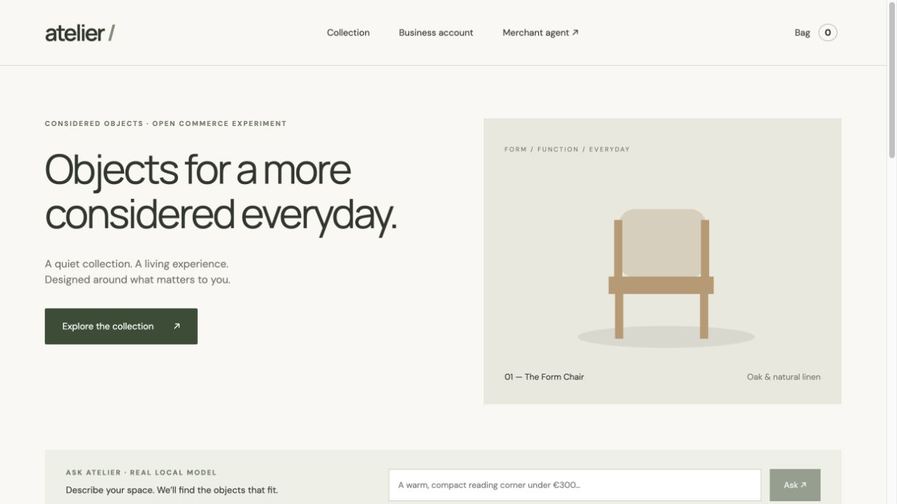
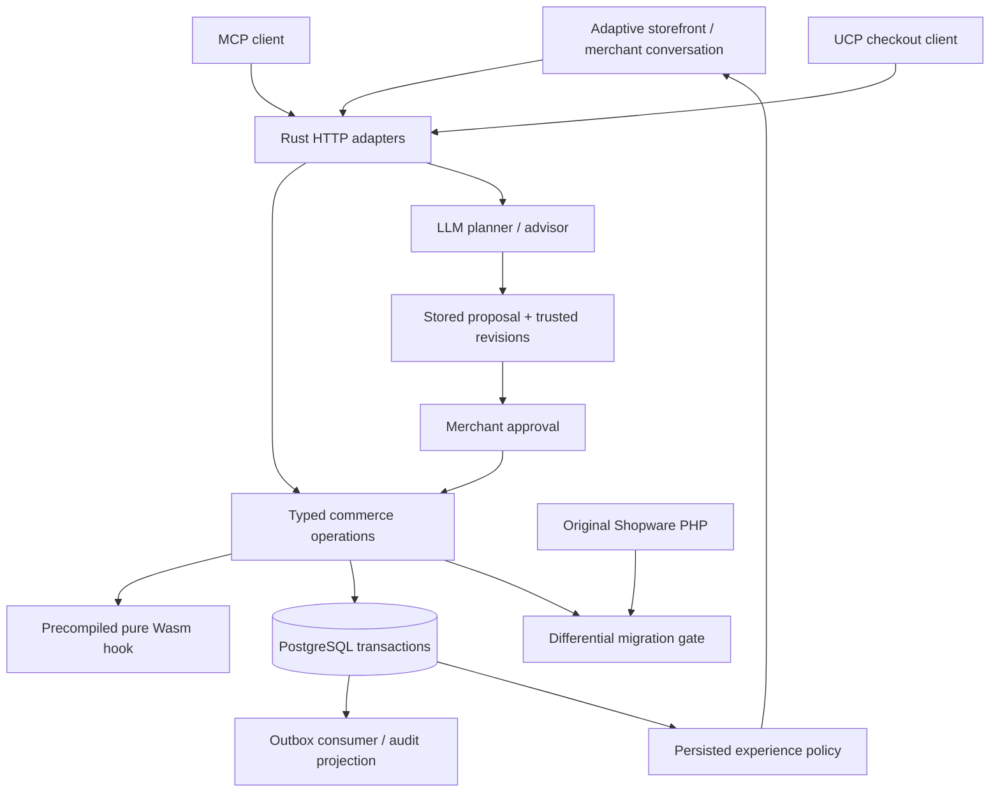

# Rust AI Commerce

A working, open prototype of an AI-native **B2C and B2B commerce platform**,
and an executable starting point for incrementally porting Shopware behavior
to Rust. MIT licensed. Experimental; not a production Shopware replacement yet.

The prototype has a real Rust HTTP server, a PostgreSQL database, a React
storefront, a merchant agent using real local LLM inference, MCP tools, a UCP
checkout adapter, and Wasmtime extension execution. Orders and stock changes
are real database transactions. **Payment is explicitly simulated.**



[Verified scenarios and measured scope](docs/verification.json) · [CI](https://github.com/sthamann/rust-ai-commerce/actions)

## Run locally

Requirements: Rust stable (tested with 1.98.1), Node 22+, Docker Compose,
Python 3, and Ollama for inference. PostgreSQL uses localhost port 15487;
the application uses localhost port 8787. Existing databases are not used.

```sh
git clone https://github.com/sthamann/rust-ai-commerce.git
cd rust-ai-commerce
ollama pull qwen2.5-coder:32b
./scripts/dev.sh
```

The 32B model needs substantial memory. You may set `OLLAMA_MODEL` in the
generated `.env` to another installed model supporting structured output.
Commerce continues to work when the model is offline; planning/advice return
an explicit error. There is no fallback that silently fabricates model output.
No model is downloaded by the application itself.

Open http://127.0.0.1:8787 . The dev script creates private, ignored credentials
in `.env`, starts the dedicated PostgreSQL volume, builds the frontend and runs
Rust. The merchant agent at `/#merchant` asks for `MERCHANT_TOKEN` from that
local file; it is never embedded in the frontend. The demonstration business
account is `buyer@example.test` / `demo-business` (also available through the
Business account button). It receives net group/quantity pricing and a €1,000
purchase approval limit implemented by a Wasm guest.

Keep the app bound to localhost. The seeded account, shared development
merchant credential, public inference endpoints and local HTTP protocol
transports are deliberate demo choices, not a production identity system.

## What actually works

| Path | Working behavior |
|---|---|
| Storefront | Six products; search/categories; stable keyed components; session affinity changes ordering; learned server policy chooses discovery/comparison layout |
| B2C | Server prices/taxes; mutable cart with revision checks; atomic order/stock transaction; idempotent retries |
| B2B | Authenticated demo company, context rotation, 10% group and 15% quantity discount from five units, net calculation and Wasm approval hook |
| Merchant operations | Natural language → real Ollama inference → typed stored change preview → explicit approval → revision-checked transaction → customer-visible change |
| Customer intelligence | Natural language needs → real model recommendation from existing catalog IDs → explanatory response and constrained layout change |
| Persistence | Carts, order snapshots, tasks, experience configuration, exposure propensities, rewards and extensions survive server restart |
| Event processing | Transactional outbox → locking background consumer → durable audit projection, with no external email/payment side effects |
| Extensions | Merchant-authorized activation of pure WAT modules; compiled before checkout; per-invocation fuel, stack and memory limits; no WASI/host imports |
| Migration | Original Shopware PHP quantity calculators run independently against Rust; reproducible differential and HTTP regression scripts |

The learning mechanism is a small persisted epsilon-greedy policy based on
views and **simulated order** rewards. It is online decision-policy learning,
not on-the-fly LLM weight training and not evidence of increased conversion.
The policy currently uses lifetime counters; attribution windows, bots,
consent, refunds and causal evaluation are future work. Session IDs originate
in the browser, so exposure counts are not adversarially robust.

## Verify

With the local app running, in a second terminal:

```sh
set -a; source .env; set +a
cargo test --locked
python3 scripts/integration.py
python3 scripts/protocols.py
TEST_MODEL=1 python3 scripts/protocols.py
python3 scripts/load.py
# Optional: consumes the separate workshop tenant's remaining desk stock
python3 scripts/contention.py
```

HTTP verification writes synthetic carts/orders into the demo database. The
model check applies the requested lamp price change. It never charges money.

For the **independent Shopware reference**, install PHP 8.4+ and Composer:

```sh
composer install --working-dir=reference --no-interaction
cargo build --locked --bin price
python3 scripts/differential.py
```

To check persistence, run `python3 scripts/restart.py snapshot`, stop the
application, restart the dedicated PostgreSQL container, start the application
again, then run `python3 scripts/restart.py verify`. It compares catalog, orders,
stored plans, learning counters, event projections and extension versions.

Alternatively point `SHOPWARE_AUTOLOAD` at an existing installation's
`vendor/autoload.php`. Only pure calculator objects are instantiated; its
database and shop are not touched. The gate covers 1,264 deterministic edge
and random cases with a `1e-8` representation tolerance (well below the smallest
tested monetary unit). See [migration scope](docs/migration.md).

## Architecture



Rust handles the bounded commerce path. Model inference is asynchronous and
only on planning/advice endpoints; it is not a dependency of catalog, pricing
or checkout. PostgreSQL owns correctness: row locks, stock constraints, unique
order/idempotency keys and atomic outbox writes. No distributed transaction
or microservice mesh is needed for this first slice.

The source is intentionally small: `src/pricing.rs`, `src/sandbox.rs`, the
server in `src/main.rs`, SQL schema in `migrations/001.sql` and the frontend.
Further port units should extract domain modules rather than duplicate rules
inside protocol/UI adapters.

## Compatibility boundaries

- Store/Admin endpoints are a **selected path and behavior subset**, with
  prototype response envelopes. Existing Shopware SDKs/plugins are not yet
  drop-in compatible. Criteria/DAL writes, versioned entities, languages,
  variants and the complete error/alias schema still need porting.
- MCP supports JSON-RPC tools/resources, JSON HTTP responses, legacy
  `2025-11-25` initialize and stateless calls. It does not yet implement OAuth
  discovery, resumable SSE, elicitation or the full `2026-07-28` lifecycle.
- UCP uses the `2026-08-25` checkout routes, discovery, minor units, replacement
  updates and cancellation. It adds a demo `context_token` bound to the same
  customer cart. It does **not** yet implement profile negotiation, signatures,
  external payment handlers, fulfillment, AP2 or complete conformance. Demo completion requires a buyer email and exercises simulated payment;
  external payment negotiation is still missing.
- Wasm supports one typed company approval hook. Arbitrary Shopware PHP
  plugins cannot be translated automatically into equivalent Rust/Wasm; their
  service/container/DAL dependencies must be extracted and tested first.
- No claim of multi-region scaling, Rust-vs-PHP speedup, autonomous financial
  authority, full Shopware parity or learned LLM weights is made here.

See [architecture decisions](docs/architecture.md),
[incremental port plan](docs/migration.md), and [security scope](docs/security.md).
