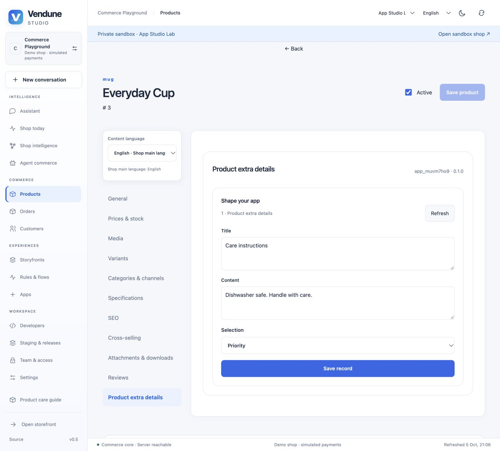

# Guided apps and embedded commerce editors

App Studio starts with nine assistants: frontend, admin, combined, payment, shipping, third-party integration (ERP), event subscriber, signed incoming webhook and scheduled task. Each assistant creates an ordinary versioned Manifest, editable visually or by a coding agent. It never hides provider-specific code behind a template.

## Build and try an app

1. Open **Developers → New app**, choose a use case and its placement.
2. Edit one content language at a time. Names, field labels, choice labels and view text support inherited shop languages. Built-in assistant labels ship in English, German, French and Spanish.
3. Choose an independent admin module, a product-general section, a new product tab, customer/order fields, a product-detail surface or a storefront page. Choose explicit public reads and MCP exposure.
4. Edit the resulting data models, choices, context bindings, routes, team scopes and automations. Select a private sandbox, save an immutable version and stage it under **Versions & releases**.
5. In **Design**, open the installed sandbox preview. Select an actual product/customer/order when the app is attached to one. Save a record, reopen it and verify its revision. Release only the reviewed package; app data has a separate selective release path.

Existing apps still open through their cards and **Edit app**. Regeneration preserves existing action access settings for actions with the same app/action identity. New generated actions default to MCP off. External agent JSON is reviewed and validated before staging.

## Editor extensions with actual ownership

`coreReference: "product" | "customer" | "order"` declares a required/indexable plain string holding an existing object's ID in the same shop. Native blocks bind that field with `contextBinding: {field: "product_id", key: "productId"}` (or customerId/orderId). The server validates the reference on each write. The host filters reads by its selected object. Missing context does not trigger an unfiltered read. A bound form updates the saved row with its optimistic revision; a model may also support multiple records per object through table/card blocks.

Supported editor mounts are `admin.product.general`, `admin.product.tab`, `admin.product` (legacy), `admin.customer`, `admin.order` and `admin.order.general`. Product tabs appear in the central product editor; new fields reside in app-owned tables, rather than becoming ad hoc columns on core tables. `choices: [{value, label}]` creates a server-validated selection field with localized labels. Public customer/order references are rejected.

## Four independent access decisions

| Decision | Manifest / enforcement |
| --- | --- |
| Who can see/edit the admin module? | Surface permission plus per-action team permission; unreadable blocks disappear and read-only users receive cards instead of editable forms. |
| Is the data public in the storefront API? | Entity publicRead **and** explicit public list action; authenticated writes remain separate. |
| Can MCP discover/call this action? | Action mcp flag plus the same team authorization. Omitted mcp retains legacy behavior; new assistants default false. |
| Can merchant AI use this action as a selected planning tool? | intelligence.tools selection and action authorization; independent of MCP exposure. |

The legacy direct entity routes also enforce the matching action scopes. Merchant planning filters app grounding/actions by current rights and rechecks selected actions both when binding a proposal and when committing it; a model cannot invent a disabled tool to bypass the gateway. UI visibility alone grants no backend access. Do not put secrets into records, prompts or manifests.

## Events, cron and incoming webhooks

Event subscribers use the existing durable app event worker. Flow-enabled actions appear in the graphical Flow Builder. Emitted app events use `app.APP_ID.ACTION`; flow rules can inspect their payload. Service calls use the configured operator service, bearer secret, deadline and per-process resource bulkheads.

Schedules declare id, six-field UTC cron, a declared **emit** action, typed input and enabled. They support at most eight jobs per app; seconds must be a single number, bounding execution to once per minute per schedule. Existing worker processes claim due rows transactionally with SKIP LOCKED. The schedule tick and outbox event commit together; duplicate ticks are prevented across restarts/replicas. Missed ticks coalesce; native private sandboxes never execute schedules. This does not promise exactly-once external effects: consumers remain at-least-once and must use stable idempotency keys.

Incoming webhooks use `POST /webhooks/apps/TENANT/APP/WEBHOOK`. The operator sets server-only `APP_WEBHOOK_KEYS` as `{ "tenant": { "app": "secret of at least 32 bytes" } }`. Headers are `x-app-timestamp` (Unix seconds within five minutes), `x-app-event-id` (bounded stable ASCII identifier) and `x-app-signature` (hex HMAC-SHA256). Sign the newline-separated tenant, app, webhook ID, timestamp, event ID and SHA256 hex of the exact UTF-8 JSON bytes. Bodies are bounded to 16 KiB and checked against the declared action schema. The declared action must emit. Identical repeats return the persisted event receipt; reusing an event ID for different bytes fails. Foreign-shop signatures and private-stage delivery fail. HTTPS is required when exposed outside a local trusted environment; public ingress/network hardening remains an operator deployment responsibility.

## Shopware extension requirements reviewed

Reviewed on 2026-10-05 against Shopware's curated [Most Popular Integrations](https://store.shopware.com/en/integrations/most-popular-integrations/) (24 entries at review time) and [integration catalogue](https://store.shopware.com/en/integrations/). This is a requirements sample, not a verified ranking of installations. Shopware documents [app Flow actions](https://developer.shopware.com/docs/guides/plugins/apps/flow-builder/add-custom-flow-actions-from-app-system.html) and [plugin Flow actions](https://developer.shopware.com/docs/guides/plugins/plugins/framework/flow/add-flow-builder-action.html) separately. Vendune's capability mapping below is an architectural assessment, not a claim of those apps' complete behavioral equivalence.

| Representative apps | Needed behavior | Vendune support / boundary |
| --- | --- | --- |
| PayPal, Mollie, Stripe, Adyen, Klarna, Amazon Pay | Payment initiation, capture/refund, callbacks, account credentials | Payment service assistant provides typed action contracts and native settings. Existing payment hooks connect checkout. Provider onboarding, signatures, disputes and reconciliation need provider implementation/tests. |
| Pickware ERP/WMS/POS | Product/customer/order mappings, owned extension data, synchronization and reconciliation | App-owned models, scoped core references, private editor fields, routes, events, schedules and isolated services. Arbitrary core schema mutation and full POS/offline workflow are not supplied by the assistant. |
| Sendcloud | Shipment creation, label/tracking API, order UI, callbacks | Shipping service template plus order mounts, action rights, events/webhooks. Actual label/provider handling remains custom service code. |
| magnalister, Channable | Marketplace/feed export, mapping, queued updates | Managed mappings, catalog APIs, event subscriptions and cron emit tasks driving service consumers. Bulk feed pipelines and marketplace authentication are app implementations. |
| Klaviyo, Brevo, CleverReach | Marketing event/customer sync and consent-aware segmentation | Customer choice fields, private context, event/Flow service calls. Provider-specific consent semantics and campaign workflows must be implemented and verified. |
| Trusted Shops | Review/trust widgets and order follow-up | Public cards or sandboxed custom UI, scoped order events and service calls. Arbitrary native JSX injection is not permitted. |
| Usercentrics / Cookiebot | Consent UI and control of trackers | Existing consent-aware storefront integration plus custom app UI. Assistant fields alone do not intercept every third-party tracker. |

The shared representation supports the recurring requirements above without a new extension protocol for each provider. The native editor has four block kinds. Custom scripts, sophisticated widgets, long-running external jobs and provider algorithms use the isolated app-service/UI SDK path. Self-service deployment of arbitrary server code is not implemented by these assistants. Service endpoints/credentials remain operator configured.

## Source and verification

- `frontend/src/admin/developer/assistant-model.ts`: assistant Manifest construction; other App*.tsx modules own UI editors.
- `src/apps/editor_contract.rs`, data.rs, surfaces.rs: owned reference, choice, scope and context enforcement.
- `src/apps/schedules.rs`, webhooks.rs; migration 036: persistent clock ticks and signed deduplicated ingress.
- `src/apps/gateway.rs`, `src/mcp.rs`: independent tool exposure and real action authorization.
- `extensions/apps/assistant-examples/`: twelve installable contracts for nine types and additional product/customer/order placements.
- `scripts/app_assistants.py`: actual PostgreSQL/HTTP import, stage, private data, scoped rights, public/MCP boundaries, local service call, signed webhook→rule→Flow→saved record, concurrent replay, cron and cold restart.
- Frontend unit tests exercise wizard compilation, rights controls, missing-context prevention and hydrated revision-bound fields. Rust tests reject invalid manifests and signatures. Lean covers only two extracted pure access decisions with production bindings, not the browser, scheduler, provider service or async database behavior.
