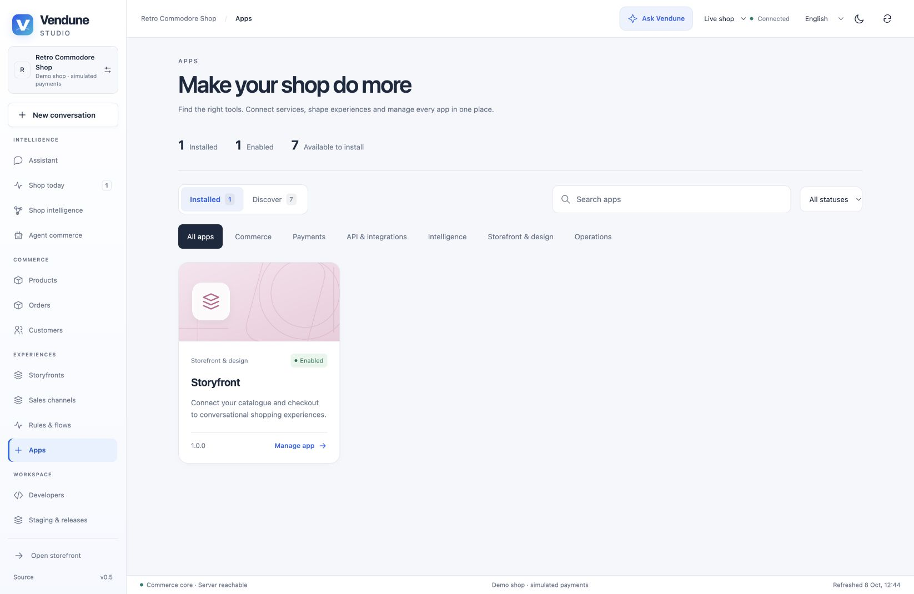

# App library and management

Open **Vendune Studio → Apps**. **Installed** shows the actual tenant packages,
versions and activation status; **Discover** shows the built-in packages available
to install. Search includes translated names, IDs and summaries. Categories and
status filters reduce the list; returning from a detail page preserves filters.

Choose a card to open its detail page. **App details** contains provider settings
and declared permissions/events. **App workspace** opens registered `admin.*` surfaces
through the existing permission-filtered registry, including native views.
**App data** and **Version & permissions** retain the existing collection and immutable-version
operations. A missing interface or collection produces an explicit empty state.
Owners and admins retain lifecycle access; other roles can only use their allowed
capabilities. Deactivation asks for confirmation and uses the expected revision.
Failed requests remain visible rather than silently changing the activation state.

Activation does not demonstrate a configured external account. PayPal, analytics,
Gmail, Slack and email adapters still require their existing settings. Discover is
the bundled prototype catalog, not an external app marketplace. Shopware Payments
is labeled as an integration contract with its official connector still required.

## Automatically managed Experience apps

Experience onboarding connects its frontend and installs **Storyfront** through the
normal app registry in one transaction. Existing Experience mounts are backfilled
by migration 055; ordinary shops still choose which apps to install. The installed
card and detail page show the actual connection, domain, sales channel and **Edit
experience** link. Apps, Storyfronts and channel management use one mount registry
and the same existing editor, with native/retained selection owned by that deployment.



The public manifest contains no private renderer. Listing apps does not install
anything; installation does not publish or generate an Experience. A hosted app
with frontend dependencies cannot be disabled until those bindings are disconnected.
Pause a channel when you want to stop public traffic without removing its connection.
See [ownership and lifecycle](channel-management.md#storyfront-app-ownership-for-experience-shops)
and [the current release review](current-release.md).

## Published artwork and localized summaries

Add optional metadata to a new package version. Example paths below refer to
assets your deployment must actually supply; this metadata does not upload files.

```json
{
  "presentation": {
    "icon": "/media/my-shop/my-app-icon.png",
    "cover": "https://your-asset-host.example/app-cover.webp",
    "description": {
      "en-GB": "Product care guidance in your shop.",
      "de-DE": "Pflegehinweise direkt in deinem Shop.",
      "es-ES": "Consejos de cuidado en tu tienda."
    }
  }
}
```

The name remains the existing localized `name` map. Summaries resolve the selected
language and the shop's main language per field; an explicitly empty summary stays
empty. Generation schemas use the shop's configured content languages, including
regional locales. Do not duplicate all language fields in a content editor.

Images must use safe `/media/` or `/assets/` paths or credential-free HTTPS URLs.
The backend bounds URLs and summaries; the browser loads passive images with lazy
loading and no referrer. It does not fetch remote artwork through a server proxy.
Use assets you are permitted to serve. There is no arbitrary HTML/script artwork.

If no icon or cover is supplied, a shared renderer generates category-specific
vector covers with deterministic app variation and functional icons locally.
Failed cover and icon requests fall back independently. These illustrations need
no external model or credits and do not imply official provider branding.

A published manifest is immutable: changing artwork requires a new version, just
like changing an app interface. Existing packages without metadata serialize as
before and keep their legacy digest. Use App Studio or an external coding agent
to create/edit the package, test in staging, and release selectively; the library
does not mutate installed source code in place.

## Code ownership

| Path | Responsibility |
|---|---|
| `frontend/src/admin/apps/AppLibrary.tsx` | Search, filters, installed/discover cards |
| `frontend/src/admin/apps/library-model.ts` | Catalog, categories and content fallback |
| `frontend/src/admin/apps/AppArtwork.tsx` | Supplied images and generated fallbacks |
| `frontend/src/admin/apps/AppDetails.tsx` | Detail tabs and confirmation-based activation |
| `frontend/src/admin/apps/AppInterfaces.tsx` | Registered native/external admin surfaces |
| `frontend/src/shared/i18n/app-library-i18n.ts` | English/German/French/Spanish UI and summaries |
| `src/apps/presentation.rs` | Passive metadata bounds and safe asset validation |
| `fixtures/app-studio-schema.json` | Shared optional package-generation schema |

Styles are divided between app catalog, artwork and detail modules. The generated
[source inventory](module-inventory.md) documents all production modules.

## Verification

```sh
npm --prefix frontend run build
npm --prefix frontend run format:check
npm --prefix frontend run architecture
npm --prefix frontend run localization
npm --prefix frontend run test:coverage
cargo test --locked
python3 scripts/verify_integration.py --only apps app_surfaces app_studio developer_documents
python3 scripts/formal.py
python3 scripts/formal/mutations.py
```

`frontend/tests/unit/app-library.test.tsx` covers interactive discovery/lifecycle,
permissions, native interfaces, translations and artwork failures. `scripts/apps.py`
checks real persisted metadata, immutable digests, URL rejection and tenant
isolation. Provider-schema checks use local fixtures. Browser captures and mobile
checks validate layout; they do not prove every app's external provider works or
that the entire system has exhaustive coverage.
