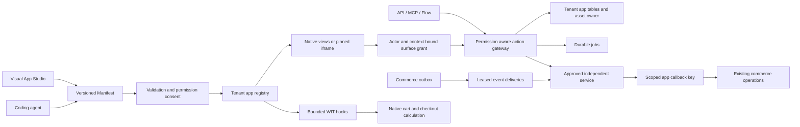

# The Vendune app platform

An app is an immutable, reviewed Manifest. Studio, coding agents, API, MCP, Flow
Builder and storefront surfaces use that same contract. The public core owns
identity, data, pricing and execution admission. An independently deployed service
owns its external business logic. Private Payments and Storyfront implementations
remain in their private repositories.

## Install and update

`POST /api/apps/review` with `builtIn` or `manifest` returns the Rust-canonical
package digest, complete permissions, added permissions and previous version.
`POST /api/apps` requires `approve: true`, that exact `digest` and the complete
`permissions` list. Current actor rights are checked independently. A stale review,
changed package or permission mismatch fails before installation. Apps shows this
review in a consent dialog. Version identifiers cannot be reused with different
content. Deactivation retains data and checks dependent apps/hosted frontends.

Reserved bundled names, including payment apps, cannot inherit operator authority
from a merchant-authored lookalike. A service configuration needs its own
`approvedDigests` pin even when a publisher has signed the package.
[Security, migration and operator configuration](app-security.md).

## Data and core capabilities

Each tenant/app/model has its own hashed physical table name. Equal merchant app
IDs in different shops can have incompatible fields without column collisions.
Forced RLS and tenant-aware references apply in addition to application checks.
Migration 058 moves existing shared tables once; historical tables remain for
operator-controlled backup/reconciliation. Do not delete these backups automatically.

Models support strings, integers, booleans, bounded JSON, date, datetime, decimal,
explicit-scale integer money, rich text, image/file references and multi-relations.
Validation rules and uniqueness run on the server. Image/file fields reference the
existing product asset owner; contextual multipart uploads are private by default.
A public model cannot silently expose a private asset. Lists use bounded keyset
pages, indexed filters and optimistic record revisions.

Explicit schema steps can rename/remove/convert/fill fields from an exact installed
version. Every record is validated before DDL/data changes. Installation, schema,
recovery snapshot and outbox commit atomically. The online path is bounded to 2,000
records/model, 4 MB/migration and retained recovery storage of 16 MB/app. Relation
changes and larger migrations require an offline plan. Recovery snapshots are not
an automatic one-click rollback of external service effects.

An app can request a separate callback key under **Apps → Access**. Keys are
app/tenant/package bound, expire within 90 days, show plaintext once and intersect
scopes with the creator's **current** membership rights. Upgrade, revocation or
membership removal invalidates access. They cannot call ordinary merchant endpoints.

| App capability | Core operation / boundary |
|---|---|
| `products.read`, `products.write` | Existing product content/read/save operations; native revisions and catalogue rights |
| `orders.read`, `customers.read` | Bounded projections of owned core objects |
| `customers.pii` | Separate consent plus current actor permission before personal fields are returned |
| `assets.read`, `assets.write` | Existing asset metadata/private content and validated contextual multipart upload |
| `jobs.write` | Claim/progress/completion of this app's admitted jobs |
| `events:self`, `events:order.*`, exact event scopes | Subscription selection; sensitive payload fields still require separate data rights |
| `commerce.hooks` | Bounded WIT price/discount/shipping/validation hooks |

Callbacks live at `/api/apps/APP/core/OPERATION`. The callback identity does not
become a merchant session. JSON aliases, MCP tools and flows call declared actions
through the same gateway; `mcp: false` and `flowAllowed` remain explicit.
Multipart uploads use a dedicated surface/core upload route, not a JSON MCP tool.

## Surfaces and native views

App modules can appear in navigation and existing product/customer/order editors,
storefront pages, product details, cart summaries and account areas. The existing
[assistant guide](app-assistants.md) lists all placement names. Each surface declares
its own action allowlist and optional team permission.

The host obtains a five-minute grant bound to tenant, app, current actor, package,
surface and context IDs. The server enforces the same allowlist and rejects changing
`productId`, `customerId` or `orderId`. Grants are not general callback keys.
Native views share the host renderer, translations and data owner. They include
text, tables/cards/forms, inputs, buttons, images, frames/tabs, KPI and charts.
[Visual builder, F5 previews and code-behind](app-studio.md).

Custom UI remains an opaque iframe. The host fetches only approved hash-pinned,
self-contained HTML, with CSP denying direct fetches/forms and sandbox limited to
scripts. The message bridge binds source/nonce and surface actions; no merchant
credential is passed to the guest. Only reviewed publishers should receive sensitive
permissions: browser CSP does not prove that hostile guest code cannot disclose data
through every form of navigation. Arbitrary customer-private external service
identity and hostile-code microVM hosting are not implemented by this contract.

## Events and long actions

The PostgreSQL outbox feeds leased deliveries. Each process has eight delivery
lanes, bounded per-tenant selection, batches of 1–25, stable per-event idempotency
keys, 30-second fenced leases and exponential retry up to eight attempts. A slow
service does not hold a database transaction or the sole global event lane.
Filters run on the permission-projected payload. Replay checks current permissions
and processes up to 50 events per request, preserving original IDs.

Subscriptions cannot see other apps, team changes or personal customer fields by
requesting only coarse `events.read`. Own events use `events:self`; core families
need their declared scope. Receiver code validates the **whole** batch before effects.
Delivery is at least once; the receiver must deduplicate persistent effects.

An optional signed public HTTPS destination needs `events.send`, consent and a
rotatable encrypted outbound secret. Egress rejects private/reserved addresses,
mixed DNS answers, redirects and ambient proxies; connections pin resolved addresses.
[SDK signature format and examples](../extensions/README.md).

An action with handler `job` admits a durable job with an idempotency key. The app
receives a minimized job-ID event, claims a fenced lease and reports progress via
its scoped callback. Cancellation must be acknowledged by a running service.
Expired leases produce **uncertain**, not an automatic replay of external effects.
Apps shows progress, results, review/retry/archive and private artifact downloads.
Limits are ten active jobs/app, 100/tenant and 1,000 retained jobs/app.

## Pure commerce components

[`vendune:commerce/extension@1.0.0`](../extensions/sdk/wit/commerce.wit) defines
read-only cart, product and explicitly declared app-record snapshots. The four hooks
return an accepted flag, integer money adjustment and bounded reason code. The core
checks currency/scale, bounds and validation semantics, then uses existing native
allocation/tax/delivery code. Checkout retains stock, payment and idempotency owners.
No arbitrary SQL, network, filesystem or mutable commerce host functions are imported.

Components compile before the checkout transaction, use digest-cached shared engines,
pooling, fuel, epoch deadlines, 1 MiB memory and 10,000 table-element limits. Eight
active hook apps/tenant are admitted; record snapshots are bounded to four/app and
host reads to 128/instance. Declared record revisions are included in quote outcomes.
The [snapshot-pricing example](../extensions/apps/snapshot-pricing/manifest.json)
and typed WAT component run through real quote and order paths. General Rust/PHP
source builds and arbitrary asynchronous hooks are external deployment concerns.

## Publisher distribution

Registered publisher public keys are configured by the operator in `APP_PUBLISHERS`.
A signed package uses `publisher_app` IDs, key ID, stable/beta/development channel,
Ed25519 signature and semver dependencies. Sign with `vendune --sign-app MANIFEST`
using a private base64 seed on stdin; never commit it. The signed message binds the
entire Rust-canonical package including permissions, bundles and dependencies.

The registry rejects unsigned occupancy of registered namespaces, wrong signatures,
missing/wrong-publisher/foreign-tenant dependencies, cycles, incompatible upgrades
and deactivation of required dependencies. Channels are signed metadata; there is
no automatic marketplace update-feed deployment. A local unsigned merchant app is
still allowed outside registered namespaces and has tenant-specific storage.

## Examples and evidence

- **care-studio**: native forms, public product care cards, API/MCP and multilingual content.
- **product-lab**: independent custom UI, managed data, product context and event inbox.
- **service-example**: approved pinned UI, scoped gateway and validated deduplicated batches.
- **snapshot-pricing**: actual typed WIT host reads and all four commerce hooks.
- **catalog-export**: leased job → product callbacks → private native asset → downloadable result.
- **Email / Slack / Google / Gmail**: bundled Rust connector services, precise subscriptions and batch validation.

Registered HTTP suites cover tenant collisions, resource attacks, consent, private
F5 records, callback PII/revocation, migration rollback, file boundaries, jobs,
publisher dependencies, payment/staging compatibility and slow-receiver isolation.
These are concrete prototype regressions, not production-scale measurements or a
claim of complete Shopware parity. [Test registry](testing.md), [source owners](source-map.md).

## Graph-native app views

An optional `intelligence.ontology` in the **same versioned manifest** maps up to
four AI-enabled entities to app-owned node types. Select up to 16 native fields;
optional `relations` maps selected native/core reference fields to app-owned edge
types. Identifiers stay under `app.<app-id>`, so an app cannot impersonate a native
product fact. Strings and native multi-relation arrays generate edges; they expose
only stored reference IDs, without fetching a target or bypassing target rights.

The authorized native list adds a bounded `ontology` view (24 rows, 16 KiB,
whole-record omission count), with tenant, package version and current native
record revision. HTTP, MCP and merchant planner context use that same projection.
Current package activation, action permissions and PostgreSQL RLS apply first.
A public list deliberately exposes selected fields; a private list remains private.
Empty optional metadata preserves existing package serialization and response shape.

App Studio uses the shared content-language editor for graph labels, selected field
controls and optional edge types; imported coding-agent JSON follows the identical
contract. Model rename/delete and field removal update draft references, without
silently selecting replacement fields. Empty selections fail package review.

These records carry `native-app-records-not-confirmed-product-claims`. Mapping a
model does not confirm a product claim, extract unstructured facts, add a second
graph store, or provide global graph traversal. See the [care knowledge example](../extensions/apps/ontology-care/README.md)
and real two-tenant API/MCP suite `scripts/app_ontology.py`.
