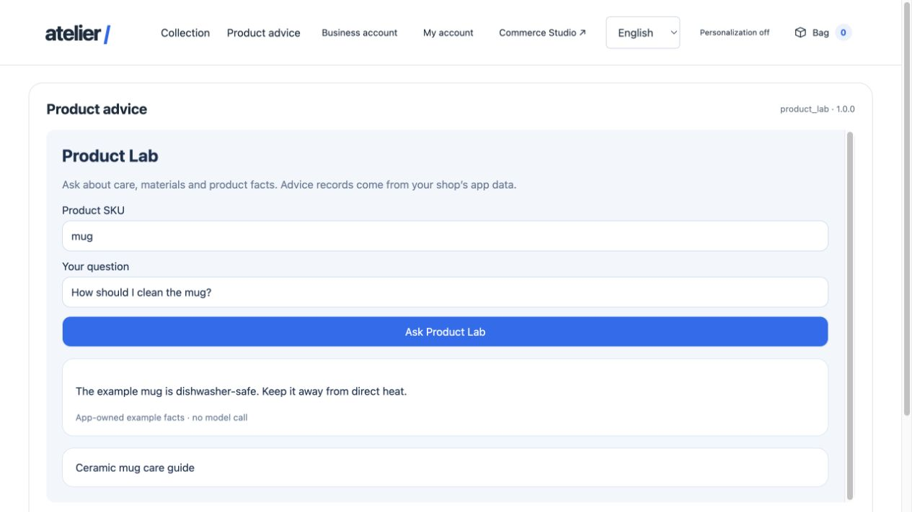
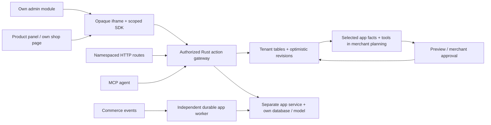

# Full apps: admin, storefront, API, AI and independent storage

A full app owns its UI bundle, service code, business logic and storage. The Rust
host discovers declared surfaces and sends authorized actions to the app. No Rust
branch or core rebuild is needed to add a new module. Managed declarations and
pure Wasm hooks remain available for small extensions.

[Product Lab manifest](../extensions/apps/product-lab/manifest.json) ·
[Browser SDK](../extensions/sdk/browser.js) · [Source map](source-map.md)

## One app, connected surfaces

Product Lab is a runnable example with a new Studio navigation module, a product
question panel, its own storefront page, typed managed guide records, an independent
SQLite database, HTTP routes, MCP tools and durable event subscriptions. UI labels,
managed guide titles and example answers support English, German, French and Spanish.
Its answer engine deliberately retrieves example facts; it does not run an LLM.
An app service can instead call its own model, vector database or external system.






## Manifest contract

The optional `surfaces`, `apiRoutes` and `intelligence` fields extend API 1.
Absent fields do not change the serialization/digests of published legacy apps.
Versions remain immutable; changed manifests need a new compatible version.

```json
{
  "surfaces": [{
    "id": "studio",
    "location": "admin.navigation",
    "label": {"en":"Product Lab","de":"Produktlabor","fr":"Laboratoire produit","es":"Laboratorio de productos"},
    "uiPath": "v1/index.html",
    "actions": ["catalog", "recommend"],
    "permission": "catalog.read"
  }],
  "apiRoutes": [{"path":"advice","method":"POST","scope":"storefront","action":"recommend"}],
  "intelligence": {
    "description": {"en":"Product care tools and guide records"},
    "tools": ["catalog", "save_entry", "recommend"],
    "entities": ["guides"]
  }
}
```

This fragment belongs in a complete validated manifest; its actions/entities must
also be declared. At most 16 surfaces and 24 custom routes are admitted per app.
UI paths are relative, bounded paths; the merchant cannot submit a remote origin.
Only the operator's private `APP_SERVICES` configuration supplies service/UI URLs.
Publish UI bundles under immutable version paths and deploy the corresponding
service version. Manifest hashes do **not** hash or sign remotely hosted source.

| Surface location | Actual host consumer / minimal context |
|---|---|
| `admin.navigation` | New Studio sidebar module |
| `admin.product` | Central product editor; `productId` |
| `admin.order` | Order detail; `orderId` |
| `storefront.page` | Navigation link and `#app/APP/SURFACE` page |
| `storefront.home` | Catalog home area |
| `storefront.header` | Storefront header area |
| `product.detail` | Product detail; `productId` |
| `cart.summary` | Checkout summary; `itemCount` |
| `account.overview` | Customer account area |

A surface is a complete HTML/React/Vue/Svelte/Wasm UI, served by the app in an opaque
iframe. It receives no merchant/session credential and cannot import the parent's
private JavaScript or replace arbitrary host DOM. Its bridge admits only selected
action names; the server checks current manifest state, tenant and permissions again.
Public surfaces can expose only explicitly public actions. Private surfaces can
require a granular merchant scope. A declared host context is descriptive input,
not an authorization token. Customer-private app endpoints need their own explicit
identity contract; this version does not forward customer authority to app services.

```js
import { connectCommerce } from "../sdk.js";
const commerce = await connectCommerce();
const productId = commerce.context.productId;
const answer = await commerce.action("recommend", {
  productId, question: "How do I clean it?", locale: commerce.locale
});
commerce.resize(420);
const unsubscribe = commerce.onContext(context => {
  // Update when the parent switches the selected product/order.
});
```

The source window and nonce bind the message exchange. Host resize is clamped to
180–1,200 px. Guest requests expire after 15 seconds. Locale changes remount the
surface. The registry refreshes on workspace/login changes and local package changes;
other browser windows refresh on reload, while server calls reject deactivated apps
immediately. Unknown/custom page paths do not grant access.

## API, data and AI

Declared GET/POST aliases live at `/api/apps/APP/http/ROUTE` (merchant) or
`/store-api/apps/APP/http/ROUTE` (public). They call the same action as the SDK and
MCP `app.APP.ACTION`. GET requires a declared read-only action and excludes managed
save/event mutations. A Lean-checked pure policy guards this admission; it cannot
prove that an external service honestly implements its `readOnly` declaration.
These JSON aliases do not add arbitrary path parameters, streaming, multipart or
core endpoint replacement. An independent app service may offer richer endpoints
behind its own separately authenticated gateway.

Managed entities support strings, integers, booleans, translated strings, local
references and bounded `json` object/array fields (8 KiB per JSON value). An app can
create its own tables and additive nullable columns. Compound tenant references and
forced RLS apply; destructive schema changes fail. Nested JSON is stored as JSONB;
its full nested business schema is the app's responsibility. JSON fields cannot use
the generated B-tree/reference option. Managed list actions/GET entities support
`limit=1..100`, `after=ID` and up to four indexed equality filters. Replies include
`hasMore` and `nextCursor`; SQL reads at most `limit+1` records.

For completely custom structures, indexes, migrations or nonrelational storage,
deploy a database with the app service. Product Lab has a durable deduplicated event
inbox in SQLite. Its fixed example care facts are shared sample data; real merchant
records must use the supplied tenant as part of every ownership/storage boundary.
Operator service credentials stay server-side. An app never submits SQL to the core.

`intelligence` selects the app's tools and entities entering merchant planning.
The host reads at most 12 records per selected entity, four entities per app and
eight apps, with depth/array/string bounds and a 32 KiB budget for the serialized
app context. Legacy apps preserve their earlier selection defaults. Exact record
revisions are fetched by indexed record ID, including records beyond page one.
A managed save is a proposal: no write before approval; stale package/record
revisions reject application. Arbitrary remote service mutations cannot become
atomic core changes. MCP can invoke declared service tools explicitly; the current
merchant planner describes them but does not autonomously call remote tools.

Apps subscribe to existing events and publish namespaced events through declared
`emit` actions. The independent app worker uses at-least-once delivery, bounded
retry and stable idempotency keys. Receiver storage must deduplicate. Private
mutation actions can join existing rule-bound flows; full arbitrary workflow
execution is still outside the documented Flow Builder subset.

## Run Product Lab locally

```sh
PRODUCT_LAB=1 ./scripts/dev.sh
```

The optional launcher generates an ignored private token, starts the service on
`127.0.0.1:8798`, and merges its configuration with other app services. It does not
install an app into any shop automatically. Sign in as an owner/admin and install
`extensions/apps/product-lab/manifest.json` through `POST /api/apps`. Create a guide
in **Apps → Product Lab → Data**; then open its sidebar module or storefront page.
Only active installed apps with operator-configured UI URLs appear.

For a running development stack:

```sh
python3 scripts/product_lab.py start
python3 scripts/product_lab.py status
# Restart the core with APP_SERVICES merged from .run/connector-services.json.
python3 scripts/product_lab.py stop
```

All local state lives in ignored `.run`. The launcher only stops its owned process.
`PROCESS_ROLE=app-worker` with the same DB/app-service configuration delivers queued
events; HTTP-only deployment does not deliver them itself.

## Container and performance boundaries

`extensions/apps/product-lab/compose.yaml` provides a non-root service with a read-only
root filesystem, writable data volume, dropped capabilities, 0.5 CPU, 128 MiB and
64-process limits. Supply `APP_TOKEN` privately and start it with:

```sh
docker compose -f extensions/apps/product-lab/compose.yaml up -d --build
```

Expose the UI through an HTTPS proxy for public shops and register that versioned
origin in private `APP_SERVICES`. Containers are **not microVM isolation**; untrusted
third-party code needs an operator-owned runner, restricted egress and a stronger
threat model. The core does not compile/deploy arbitrary uploaded app source.

Each Rust process admits at most eight simultaneous service calls per tenant/app
and 64 total, rejecting excess work with HTTP 429 instead of queuing it in the core.
Calls have a five-second timeout and 64 KiB request/response limits. Database
connections are released before remote execution. These limits are per process,
not distributed tenant quotas. A single busy app cannot monopolize those slots,
but many busy apps can still saturate the overall budget.

The native Studio and storefront bundles are loaded separately; app bundles load
when their surfaces mount. Indexed pages replace whole-table reads. None of this
makes remote LLMs intrinsically fast or establishes a speed ratio versus Shopware.
Existing million-product commerce benchmarks retain their original workload/commit.

## Verified and still open

`python3 scripts/app_surfaces.py` exercises the real Rust/PostgreSQL/standalone app
path: surfaces, unsafe contracts, nested data, keyset filters, foreign tenants,
HTTP/MCP equivalence, actual local model wire context and approved deep-page save,
permissions, service staging restrictions, overloaded service isolation and
retained-data deactivation. During eight two-second app calls, an actual new cart
completed before those calls returned and another tenant continued. The last local
debug run measured 13.146 ms for that single cart; this is an isolation observation,
not a capacity benchmark. No paid inference or external messages were sent.

SDK provenance/context regressions and four-language checks run in CI. Browser
checks exercised English/German/French/Spanish modules, a real product question
and a custom storefront page. The container's actual UI/action and resource settings
were tested locally. Existing app, service/event, staging, developer and membership
regressions remain active.

Still open: arbitrary synchronous cart/checkout hooks beyond the existing pure
Wasm ABIs; customer-private service identity; package/bundle signing; hosted source
builds/Git IDE; automatic service rollout/rollback; distributed admission quotas;
full Shopware Rule/Flow parity; hostile-code microVM runners; production scale tests
with many real extensions. This is a connected full-app prototype, not an unlimited
plugin host or a production SaaS certification.

## Native visual apps

The optional `views` contract adds bounded native text/table/cards/form layouts. Declarative surfaces use `uiPath: native/VIEW_ID` and explicit action allowlists. App Studio and coding agents edit the same Manifest; the sandbox and released surfaces use the same host renderer. Native public forms are rejected. Legacy packages omit empty `views`, retaining their serialized version digest. See [App Studio](app-studio.md) for workflows, code ownership, dynamic content languages and limitations. The care-studio example needs no operator-deployed app server.
