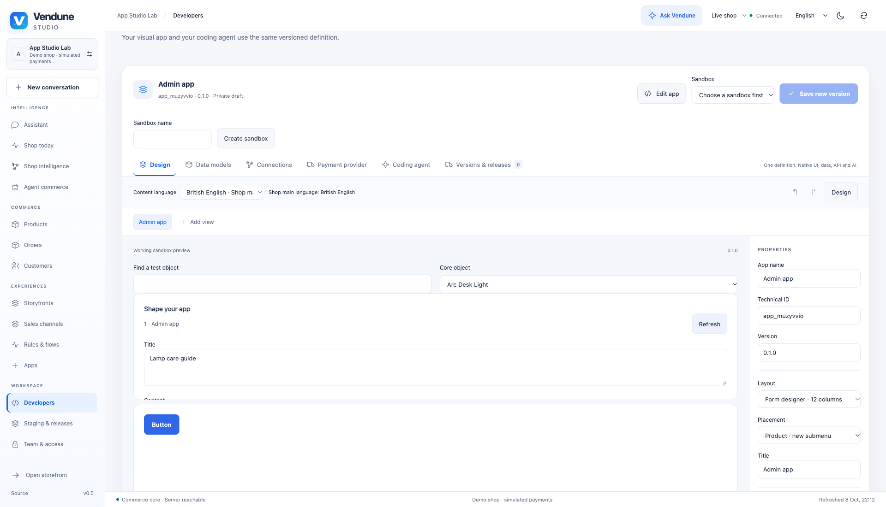
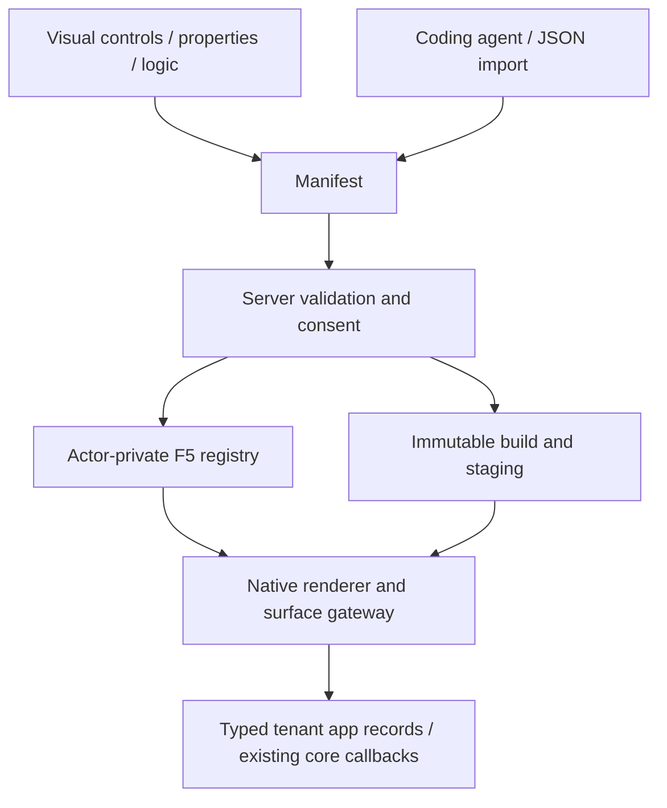

# Visual App Studio

App Studio and coding agents edit one Manifest. The same renderer, action gateway,
permissions and model schema power private previews and published apps. Open Studio
→ **Developers**; choose a guided app type or click an existing app's **Edit** card.

## The development loop

1. Choose a frontend/admin/combined/payment/shipping/integration/event/cron app
   assistant. It creates normal entities, actions and surfaces, not a hidden blueprint.
2. In **Design**, use a 12-column form raster. Drag controls from the toolbox, snap
   positions, resize by handles, use Ctrl/Command for multi-selection and align or
   distribute selected controls. Narrow screens render the same layout as a stack.
3. Press **F4** for properties: translated caption/tooltip, geometry, visibility,
   enablement, tab order, model/field/context binding. Geometry properties can be
   sorted alphabetically or by their defined category. Tab-order mode assigns order
   by clicking controls. An optional Classic appearance affects the designer only.
4. Double-click an input/button for **code-behind**. Visual instructions, BASIC and
   typed JSON edit the same bounded AST. Completion buttons insert current actions,
   form validation and refresh targets. Calls still need the surface allowlist.
5. In **Data models**, add rich field types and validation. The relationship diagram
   accepts dragging a field onto a target model. **Create workspace from model**
   adds a grid, linked record form and a validated save button.
6. Press **F5** for a private one-hour preview. It creates actual actor-private app
   tables/records through the existing registry. Changes hot-reload after validation.
   No saving/staging/publishing is required to try a draft. Preview services cannot
   send external events, place orders or execute live payment/provider actions.
7. Use the debugger to pause before instructions or at a numbered step, continue,
   stop and inspect bounded operation metadata. It does not log customer records or
   credentials. This debugger controls UI instructions, not a remote process.
8. Save an immutable semantic version, review and install it in staging, then release
   the selected app package. App records require their own explicit release selection.

Server drafts autosave after 500 ms with optimistic revisions. They are private to
the actor and shop, restored before edits and bounded to twenty drafts/user and
64 KiB/draft. Unsaved or failed saves retain a before-unload warning. Ctrl/Command+Z
uses manifest undo/redo; F4/F5 use the same controls as the toolbar. Immutable saved
versions and recoverable App Studio trash are separate from autosaved drafts.




These 8 October captures use the actual browser, Rust gateway and isolated
PostgreSQL instance; see [capture provenance](assets/feature-tour/README.md).

## Controls and behavior

Text, TextBox, ComboBox, CheckBox, DatePicker, Button, table/cards/form, Image,
Frame/Tabs, KPI and Chart are host-native controls. Tables can enable inline record
editing with real optimistic revisions. Image/file fields use the searchable asset
picker and private preview; uploads are available in product-bound editors.
Timers are persistent UTC **Schedules**, not uncontrolled browser loops.

The AST has `Set`, typed `If`, `Call`, translated `MsgBox`, `Navigate`, `Refresh`
and `Validate`. It is loop-free, bounded in depth/count and independently validated
by Rust against current blocks/actions/model fields. It is not JavaScript `eval`,
VBA or an unrestricted scripting language. BASIC source is a convenient encoding of
that AST; structured object expressions use the visual/JSON editor.

```vb
Validate guide_form
Call save_guides(guide_form.Record)
guide_grid.Refresh
MsgBox {"en":"Saved","de":"Gespeichert","fr":"Enregistré","es":"Guardado"}
```

The **Menus & surfaces** editor reuses views in Studio navigation or existing
product/customer/order editors. Each mount has one translated label, its team
permission and explicit allowed actions. Public mounts allow only public reads.

**Server modules** edits typed WIT component source and the four commerce hooks.
Components read bounded immutable cart/product/app-record snapshots, with no network
or SQL imports. Source must implement the published ABI; invalid components fail
before installation. The snapshot-pricing example provides executable source.
The browser does not compile arbitrary PHP/Rust, deploy an external service or launch
Codex/Claude shell commands. Those use the existing external app/development task path.

## Shared contract and translation



The dynamic generation schema is `fixtures/app-studio-schema.json`, exposed by
`GET /api/developer/schema` and MCP `developer.task`. Rust specializes text maps
using every enabled shop language. One selected content language edits captions,
fields, menus and messages; missing translations inherit the shop main language.
OpenAI strict fixed-object wire schemas encode dynamic JSON as a string, restore
it on the server and then run domain validation; Claude/local adapters preserve
native JSON. This adaptation does not bypass the shared manifest contract.

For Codex or Claude Code, export a credential-free development task with the current
Manifest, schema, guides and MCP bridge configuration. Import the result, review
permission additions and stage it through the same operations.

## Limits and tests

Sixteen views, 32 blocks/view, twelve models, sixteen fields/model and 24 actions/
routes keep previews and parsing bounded. Per-app storage has database-enforced
row/byte quotas; file quotas remain with the existing product asset owner.
Schema migrations are explicit and atomic; larger/relation changes are offline.
[Full platform and trust boundaries](app-platform.md), [security](app-security.md).

Frontend regressions exercise real designer edits, undo, private autosave/conflicts,
AST calls/validation, read-only surfaces and pinned UI loading. Registered
`app_studio`, `app_preview`, `app_callbacks`, `app_schema`, `app_assets`, `app_jobs`,
`app_components`, `app_distribution` and existing staging/payment suites exercise
actual Rust/PostgreSQL paths. Browser rendering and SQL/asynchronous adapters are
not covered by the extracted Lean proofs.
