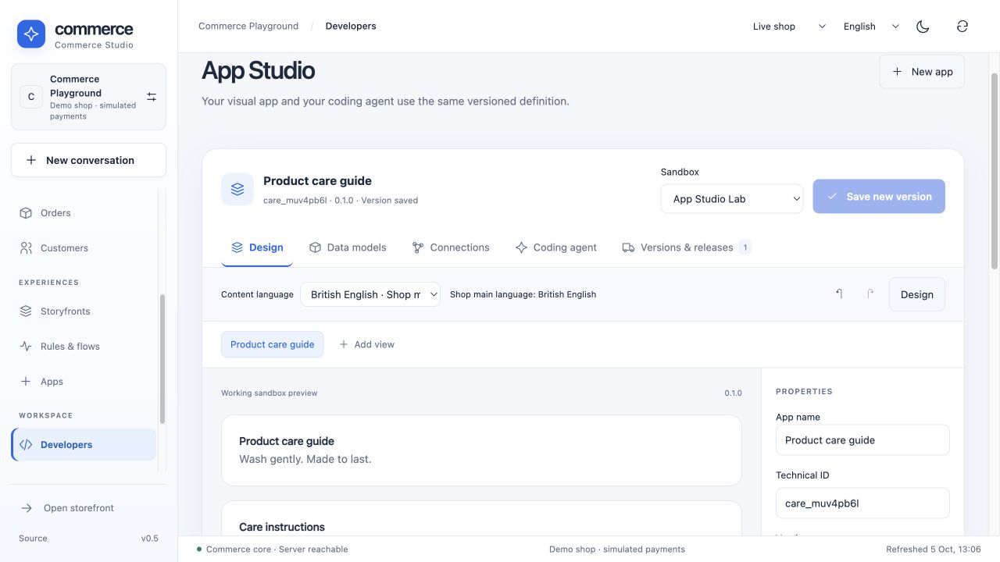

# Visual App Studio

App Studio is a visual builder for **working native commerce apps**, using the same versioned `Manifest` as coding agents. It extends the existing app platform and does not create a second, disconnected definition format.

## Try it

Open Commerce Studio → **Developers**, or use `/?shop=YOUR_SHOP&studio=developers#merchant` to enter the workspace directly. Reload tabs opened before a local frontend build; an already-loaded browser bundle does not update itself. The included care-guide draft has a text block, data table and form. It starts private.

Saved apps appear as clickable cards under **My apps**. Click a card to open its latest saved build on the editable design canvas with a bumped semantic version. The **Edit app** button also returns from the runtime preview to editing. Editing through **Versions & releases** opens the same canvas. Existing versions remain immutable. Every card has explicit **Edit app** and **Delete** buttons. Deletion moves all development versions into the recoverable App Studio **Trash**; restoring preserves version IDs/digests. Installed packages and app data remain independent: deactivate an installed package separately under **Apps**. Archived versions cannot be staged until restored. The same operation is available through `DELETE /api/developer/apps/{app}` and `POST /api/developer/apps/{app}/restore` (both `approve: true`), plus MCP `developer.archive` (`app`, `archived`, `approve`).

1. Select a component to edit its title, text or model binding. Add text, table, cards and form blocks with the palette. Use the ordering buttons and undo/redo to change the layout.
2. Open **Data models** to add typed fields. Strings can use every enabled shop language; the editor shows one content language at a time. Missing translations inherit the shop main language. Public model access is explicit.
3. Open **Connections** to enable namespaced HTTP routes, select AI planning tools/grounding entities and opt save actions into the existing Flow Builder. Installed managed actions are also MCP tools.
4. Choose or create a **private sandbox**. Save a new immutable semantic version, then open **Versions & releases** and approve its sandbox installation.
5. Return to **Design** and open the working sandbox preview. It uses the same native renderer as released surfaces. Create and edit actual app records, including their optimistic revisions. The preview checks the installed app version first.
6. Review this app’s release and publish its package. Only `app:APP_ID` is selected. Sandbox records, orders and other changes are not copied by this action. App records can be released separately through Staging & releases.

A care app with both an admin module and product-detail cards is provided in [`extensions/apps/care-studio/manifest.json`](../extensions/apps/care-studio/manifest.json). Its public care records are intentional example configuration; new visual drafts start private. This example displays published guides on product pages generally; per-product filtering needs an additional indexed product reference and an app view extension.



## Shared representation

```text
Manifest
├── entities → managed tenant-scoped tables, typed fields, revisions
├── actions → one authorized gateway for UI, HTTP, MCP and flows
├── views → bounded native text/table/cards/form blocks
├── surfaces → placement and explicit action allowlists
├── apiRoutes → GET/POST namespaces linked to declared actions
└── intelligence → selected planning tools and grounding entities
```

A native surface uses `uiPath: "native/VIEW_ID"`. A table/cards block has an `entity` and `readAction`; a form also has a `writeAction`. Bindings must reference the matching entity’s list/save handlers and must appear in the surface action allowlist. A public surface cannot contain a form or a private action. Text is rendered as escaped text, never executable HTML.

The authoritative provider schema is [`fixtures/app-studio-schema.json`](../fixtures/app-studio-schema.json), specialized by Rust to the shop’s enabled languages. Download it through authenticated `GET /api/developer/schema`; the same schema is included in the MCP `developer.task` export. Rust validates the complete installed Manifest (including manually imported service contracts); the provider schema describes the narrower native generation subset.

App Studio edits that Manifest directly. There is no hidden UI-only blueprint to reconcile later. Manual imports preserve extension metadata. Bound list/save actions are compiled with fixed input types, then independently validated on the server. Field and schema removal/type changes remain subject to the existing compatibility rules; destructive migration is not silently performed.

## Coding agents and model providers

**Coding agent** can generate a next draft with configured local/OpenAI/Anthropic inference. The request includes the current Manifest, existing versions and the shared schema. Generation creates a reviewable build; it does not install or publish automatically.

For Codex or Claude Code, export the development task with the current Manifest, dynamic schema, extension guide and credential-free MCP configuration. The agent uses the same import/stage endpoints, and its JSON can be applied back to the canvas before saving. Account authorization stays with the external coding agent. The browser does not automatically launch Codex/Claude CLI or arbitrary shell commands.

## Events, AI and extensibility

Each managed write emits `app.record.changed`. An action with `flowAllowed: true` can be selected by the existing graphical Flow Builder, connecting a core event and rule to a typed app action. Permission checks and flow retry/idempotency rules remain in the established flow engine; the visual builder does not bypass them. Native declarations do not add arbitrary event-service code. Durable service-app event subscriptions continue to use the existing operator-deployed isolated service path.

`intelligence.tools` and `intelligence.entities` select what enters the merchant planning context, with existing record/byte bounds. They do not train model weights or expose private data to public product-question retrieval. MCP tool discovery continues to expose authorized declared actions; selecting planning tools does not change MCP permissions.

For custom JS UI, external APIs, complex algorithms, payment hooks and arbitrary services, use the existing service-app platform and SDK. Resource-limited service deployment is operator controlled. The native visual builder currently offers four UI block kinds rather than unrestricted arbitrary component code.

## Performance and limits

- Maximum 16 native views, 32 blocks per view, 12 data models, 16 fields per model and 24 actions/routes.
- Native views run in the host renderer and reuse managed data/action handlers; they need no dedicated app process or remote iframe bundle.
- Data views use keyset pages of 50 records, with backend bounds of 1–100. Model planning reads are also bounded.
- An installed definition is read from the active tenant-scoped registry. Deactivation/permission changes remove its surfaces on registry refresh; each action is authorized again on the server.
- UI state is transient; immutable build versions and staged packages are persisted. Refreshing an unsaved draft currently discards its edits.
- No new production performance comparison with Shopware is claimed by this change.

## Verification

Focused frontend tests cover shared-schema compilation, dependency cleanup, undo/redo, public-access rejection, click-to-build, agent import, immutable staging/selective release, bounded pages, typed record revisions, translation inheritance and stale preview rejection.

`python3 scripts/verify_integration.py --only app_studio staging app_surfaces apps developer_documents automation` verifies the actual Rust/PostgreSQL endpoints. The suite checks native admin/storefront registry resolution, schema languages, package immutability, bindings, public-write rejection, dynamic translations, cross-shop isolation, HTTP/MCP use and selected package release. Local model wire fixtures test OpenAI/Anthropic generation without paid provider calls. Formal verification remains limited to the documented extracted commerce decisions; view parsing, browser rendering and asynchronous adapters are not claimed as Lean-proven.
