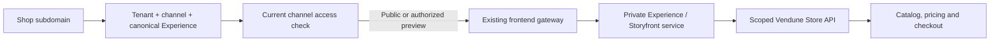
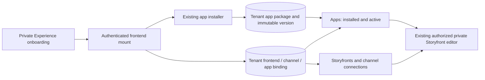

# Sales channels, domains and merchant previews

Sales channels are independently configured storefronts within **one merchant tenant**. A separately registered SaaS shop is a different tenant. Products, members and apps remain tenant-owned; channel settings select the visible catalog, languages, currency, navigation, company and checkout overrides.

## Studio workflow

Open **Sales channels → Manage channel**. Existing channels can be edited, including the main channel. Saving becomes available after an actual valid change; read-only roles receive an explicit notice. Change names through the shared content-language editor, preserving translations and main-language fallback.

- **Public**: an active channel serves shoppers and public Store API / UCP / MCP calls.
- **Private**: shoppers and public agents are denied. An authorized merchant can open a personal preview.
- **Paused**: public storefront and commerce calls are denied, even for the main channel. Studio remains accessible so it can be resumed.

Pause/resume uses a confirmation dialog. Additional channels use the existing dependency inspection and deletion confirmation. Orders, customers, open carts, settings overrides and connected frontend addresses can block deletion. Disconnect or reassign an address first. Keep channels with historical commerce references paused rather than deleting them. The main channel cannot be deleted or changed to headless; its languages inherit the shop configuration.

**Inherited settings** embeds the existing company, currency, tax, shipping, payment and legal editors. It does not introduce another settings store. On the main channel these edit shared defaults; other channels can override them.

## Domains and Experiences

The **Domains & experiences** tab reads the existing `hosted_frontends` registry. It shows the actual domain, assigned channel, canonical Experience and its original editing link. A second address can point to an already connected Experience owned by the same merchant. Changing an assignment or disconnecting an address uses its current revision; stale writes and foreign IDs fail. Disconnecting removes the address binding, not the Experience, its design or orders.

The built-in interface manages subdomains under the operator's configured wildcard domain. It does **not** provision arbitrary external DNS names or certificates. Operator-selected frontend origins and editor URLs remain server-side configuration; merchants cannot select arbitrary proxy destinations.

The private Experience adapter uses request-local channel context for its existing renderer and commerce API. It never updates canonical ownership or moves SKU data based on a browser header. The **original native Storyfront renderer** has an immutable imported tenant/channel binding: moving its domain to another channel fails closed at that adapter. Import an Experience for the intended channel before switching a native workspace. Reusing its renderer across channels and forwarding private preview grants into the upstream native runtime remain separate integration work; the generic registry must not pretend they already work.

## Personal preview security

`POST /api/automation/channels/{id}/preview` requires a current personal merchant session and `settings.read`. An integration API key or bootstrap token cannot mint browser previews. The returned one-use link expires after 60 seconds. Redeeming it rotates the token into a **host-only HttpOnly cookie**, with Secure on HTTPS, SameSite=Lax and a 15-minute expiry. It is bound to tenant, channel revision, personal session, current membership/permissions and, where selected, the frontend address.

Every request rechecks admission. Channel changes, session expiry, logout or revoked membership invalidate the grant. Forged identity/preview-principal headers are removed before authentication. A preview token from another tenant, channel or host is denied. Authenticated and hosted responses are not browser/CDN cached; the renderer can still use internal scene caches after admission.

Previews permit bounded cart simulations and catalog reads. They **cannot place orders**, change customer accounts, run paid AI actions or finalize payments. The standard frontend marks preview mode, suppresses analytics/account editing and disables checkout submission. The existing private Experience interface has its own preview indication; Core remains the security boundary regardless of UI controls.

## API and source ownership

| Operation | Existing owner / new responsibility |
|---|---|
| Channel list/save/delete/dependencies | `src/marketing/routes.rs`, `lifecycle.rs`, `dependencies.rs` |
| Shared request admission | `src/marketing/channel_access.rs`, called by `src/auth/middleware.rs` |
| Session-bound handoff and revocation | `src/marketing/channel_preview.rs`; migration 053 and forced tenant RLS |
| Catalog/cart/navigation/legal reads | Existing consumers use only the server-derived preview marker |
| Frontend alias CRUD and revision checks | `src/shop_domains/frontend_bindings.rs`; existing `hosted_frontends` table |
| Actual proxy and streamed responses | `src/shop_domains/frontends.rs`, `frontend_transport.rs` |
| Channel editor / lifecycle actions / domains | `frontend/src/admin/channels/ChannelEditor.tsx`, `ChannelActions.tsx`, `ChannelConnections.tsx` |
| Standard shop preview notice | `frontend/src/storefront/shell/ChannelPreview.tsx` and four-language `channel-preview-i18n.ts` |

Domain CRUD is `GET/PUT /api/settings/frontends` and `DELETE /api/settings/frontends/{alias}`. Changes require `settings.write`; list requires `settings.read`. Aliases are globally unique, but ownership and channel references are tenant-scoped. PUT supports `alias`, `channel`, `experienceAlias` and `revision`; unchanged legacy provisioning remains idempotent.

## Verification and limits

`scripts/channel_management.py` creates two synthetic shops and exercises CRUD, stale revisions, foreign IDs, private Store API/UCP/MCP, default pause/resume, dependencies, actual hosted proxy headers, one-use preview handoff, paused catalog preview, order/account-write denial and logout revocation. It runs in the central integration suite registry with disposable PostgreSQL data and a loopback frontend fixture. UI tests exercise editing, assignment and disconnect confirmation. Existing settings, tenancy, checkout, staging and broker regressions cover surrounding paths.

The pure channel admission decision is extracted into Lean with private/paused/preview claims and deliberate failing mutations. This proves the extracted decision under its input assumptions; it does not prove SQL, authentication, proxies, rendering, native Storyfront or the entire commerce system.

## Storyfront app ownership for Experience shops

An Experience is mounted through the same `PUT /api/settings/frontends` transaction,
with `appId: "storyfront"`. The core installs the bundled public integration manifest
through `apps::registry::install_tx`, then commits the frontend binding. It does not
load the private Storyfront implementation. Repeating an unchanged mount preserves
both frontend and app revisions. Additional domains inherit the canonical Experience's
app association; an ordinary custom frontend without `appId` does not install it.

Migration 055 assigns pre-existing Experience mounts to Storyfront and installs any
missing package **once**, using the normal installer inside the migration transaction.
A deferred composite `(tenant,app_id)` foreign key prevents a binding from borrowing
another tenant's app. GET requests never provision or repair installations. The
pre-055 hosting contract was Storyfront/Experience; future generic mounts remain
unassociated unless their application is explicitly supplied.

`GET /api/apps` reports `managedBy: "experience"` and its owned `connections`. Apps
and Storyfronts reuse the same connection card and safe editor URLs. While any
frontend depends on the package, deactivation returns 409 under the same
configuration lock used by mounting. Disconnecting the last binding releases that
restriction and preserves app data and version history. Channel pause/privacy
remains separate and continues to protect the public storefront.

The existing private `status` app action (HTTP/MCP) returns these authoritative
connection records; `connected` describes a binding, not a live renderer health
check or proof of publication. Managed `generate` directs the merchant to the
original editor rather than starting a second generator. Optional legacy service
connectors retain their existing contract for shops without managed bindings.

The real PostgreSQL `channel_management`, `identity_broker` and `tenant_isolation`
suites cover installation/idempotency, old-data migration/restart, foreign-shop
rejection, dependency protection and composite foreign keys. UI tests cover
localized navigation and suppressing duplicate legacy editors. SQL/network
adapters remain outside the Lean proof boundary.
