# Cognitive commerce: connected implementation and remaining work

The cognition layer reads current commerce data, retrieves relevant evidence and
proposes changes. PostgreSQL remains authoritative for products, prices, stock,
orders, permissions, consent, evidence and jobs. Qdrant is a rebuildable index.
Model output is untrusted input; saved knowledge does not update model weights.

This implementation closes a substantial foundation slice of the intelligence
audit. It does **not** implement the entire audit or certify the whole system.
The remaining-work table below is part of the contract for subsequent development.

```mermaid
flowchart LR
    SOURCE[Products and document chunks] --> QUEUE[Transactional embedding intake]
    MODEL[Embedding model change] --> CURSOR[Durable bounded generation cursors]
    CURSOR --> QUEUE
    QUEUE --> WORK[Admitted Rust worker]
    WORK --> PG[(Current PostgreSQL vectors and evidence)]
    PG --> PUB[Independent fenced publication queue]
    PUB --> Q[(Private Qdrant text index)]
    PG --> SEARCH[Lexical retrieval and exact native hydration]
    Q --> SEARCH
    SEARCH --> RANK[Optional admitted reranker]
    RANK --> AGENT[Bounded read-tool rounds]
    REG[Canonical capability registry and current rights] --> AGENT
    AGENT --> PROPOSE[Revision-bound proposal]
    PROPOSE --> GUARD[Native price and autonomy predicates]
    GUARD --> APPROVE[Merchant approval or explicitly enabled budget]
    APPROVE --> NATIVE[Existing transactional commerce owner]
```

## Retrieval and model serving

Products and document chunks enter `embedding_jobs` in their source transaction.
The memory worker claims one tenant and at most 32 jobs, reads current content,
releases its database transaction, then calls the embedding provider. Publication
checks the source text and job revision/lease before writing. Provider failures
have bounded retries and classified diagnostics; admission saturation does not
consume the provider retry budget. A manual reindex resets failed intake jobs.

Migration 076 adds per-tenant model-generation cursors. A configured model change
re-enqueues existing sources in 256-record keyset batches without a request-sized
catalog scan. Cursor progress and queue intake commit together and survive a
restart. Source triggers cover concurrent inserts/edits. Configure **one consistent
embedding model across all replicas**; mixed models are not a supported rollout.
A model's name identifies its semantic space: changing weights behind the same name
requires a new versioned name or an explicit reindex. Retired Qdrant collections
are not automatically garbage-collected.

Embedding dimensions are validated per response, 1–8192, with consistent batch
geometry and finite, nonzero vectors. Qdrant collection names bind kind, model and
dimension; they contain a named `text` vector and an indexed tenant payload.
Candidates are rehydrated against current PostgreSQL tenant/model/content state.
Pending source changes cannot use their old dense product vector. Publication claims
are ordered by next due attempt, so old retries do not repeatedly displace new
work; ready batches drain without a two-second delay between every packet. This is dense
plus PostgreSQL full-text reciprocal-rank fusion, **not BM25 or image search**.
The optional TEI reranker validates every candidate index; failures retain fused
ordering. Whole records/quotes are omitted when agent context budgets are exceeded;
truncated quotations are not presented as complete evidence.

| Configuration | Contract |
| --- | --- |
| `EMBEDDING_MODEL` | Versioned model identifier, default existing local configuration |
| `EMBEDDING_PROTOCOL=openai` | OpenAI-compatible `/embeddings`; otherwise Ollama `/api/embed` |
| `EMBEDDING_BASE_URL`, `EMBEDDING_API_KEY` | Operator-configured server-only endpoint/key; base URL includes `/v1` where required |
| `QDRANT_URL`, `QDRANT_API_KEY` | Private index; pooled HTTP client, bounded responses, no redirects |
| `QDRANT_QUANTIZATION=int8` | Scalar quantization when creating new collections; existing collection configuration is retained |
| `RERANKER_URL`, `RERANKER_API_KEY` | Optional TEI `/rerank` endpoint, 24 candidates, three-second ceiling |
| `OPENAI_PROTOCOL=chat` | Self-hosted OpenAI-compatible chat-completions, suitable for configured vLLM/SGLang servers |
| `INFERENCE_MODEL_PLANNER_OPENAI`, `INFERENCE_MODEL_EXTRACTION_OPENAI`, `INFERENCE_MODEL_CONCIERGE_OPENAI` | Task-specific model routing for explicitly configured providers; the Platform choice retains centrally inherited configuration |
| `INFERENCE_PROMPT_CACHE=true` | Provider-native system-prefix caching; no cache of private commerce answers |
| `INFERENCE_CONCURRENCY` | Shared per-process inference admission, default four; tenant fleet leases additionally bound model, embedding and reranker concurrency |

Running a compatible adapter does not prove a server's batching throughput.
Interactive embeddings and background indexing share admission. Reranker requests
are admitted before provider invocation. Saturation falls back to lexical/fused
retrieval instead of creating an unbounded inference queue. Interactive chat (including SSE), buyer-facing Concierge, MCP merchant planning, document extraction via HTTP/MCP and Flow AI
actions consume the same atomic UTC-day tenant attempt quota. Staging shares its
live tenant budget; failed provider attempts count. This is not token/spend accounting.

Migration 078 maintains per-error-code counters in the source-job transaction.
Status reads inspect this small per-tenant projection, not every failed job. Error
changes, reset/retry and deletion remove old contributions before adding new ones;
the migration backfills the projection once. This does not change retry admission.

## Lexical candidates under forced row security

Migration 079 adds two rebuildable word projections, `knowledge_product_lexemes`
and `knowledge_chunk_lexemes`. Source text is tokenized once in its native write
transaction. The tables store only tenant, source identity and distinct `simple`
lexemes, with composite source foreign keys and forced tenant RLS. Source deletion
cascades; name/description/chunk edits replace their tokens atomically. Price or
stock-only updates do not rewrite words. Source content, publication, association,
locale, rank and commerce state are still read from the native owners.

This choice addresses a PostgreSQL security/performance interaction: the native
FTS operator is not leakproof, so a GIN index can work under a database owner but
fail to narrow candidates under the ordinary forced-RLS runtime. B-tree equality
on tenant/lexeme narrows candidates without relaxing RLS or reclassifying a
PostgreSQL function. Products require every query term; documents retain their
existing any-term behavior. Both paths recheck the native text predicate and
current source admission before returning results. A forged/stale candidate is
not sufficient to admit a product or quote. No extra service or truth ledger is
introduced; the historic document GIN index is retained, not duplicated.

The migration takes a source-write lock for one backfill and trigger installation.
Provision a maintenance window and storage headroom for large existing catalogs:
this is **not an online zero-downtime index build**. Storage grows with distinct
source words, and writes maintain two B-tree indexes per projection. Large/common
term posting lists still require candidate ranking. This is lexical filtering,
not BM25, language stemming, semantic quality or a universal sub-millisecond API.
Rebuilding these projections is an operator migration task, not a public endpoint.
Runtime grants follow the existing post-migration role setup.

`lexical_search` executes the actual product/document SQL under a non-owner
NOSUPERUSER/NOBYPASSRLS role, with 5,000 products and 5,000 document chunks. It
checks the actual indexed plans without disabling sequential scans, preexisting
source backfill, AND/OR semantics, absent/foreign contexts, composite references,
scoped edits, private/archive withdrawals, native rechecks and cascade deletion.
Document hydration is fenced to lexical/semantic candidate IDs before checking
current locale, publication and product associations. Parameterized lateral lookups
prevent a broad document scan under forced RLS; unexecuted alternative plans are
not counted as actual scans. Semantic IDs are split on their final position suffix,
so document IDs containing colons remain valid. Native hash/model checks still
reject stale semantic candidates.
The separately measured 20,000-product selective case used five paired baseline/candidate SQL executions with
identical native results. Median execution was 36.209 ms before
and 0.243 ms after under the scoped runtime role. [Recorded conditions and
source hashes](evidence/lexical-rls.json) accompany this database micro-test. It
does not measure HTTP, inference, mixed tenant load or the entire platform.

## Agent reads, writes and progress

Planner/Concierge separate read decisions from the final response. Up to four
read-decision calls allow at most three executed read rounds, three tools per round,
followed by one final response call (at most five model calls). The read-decision
schema cannot contain proposed changes. Malformed decisions stop without a task.
Core tools are explicitly classified; current actor permissions and input schemas
are checked at dispatch. Installed app tools require a current authorized read-only
contract. Storefront agents can read only public catalog tools. Tools cannot execute
writes. Provider output may propose the existing price/stock/layout/managed-app
changes; the server binds actual revisions, validates and persists the proposal.
Expanding this to all registry mutations remains open.

Proposal review retains the existing permission-filtered, bounded `appContext`
projection (up to 32 KiB). `modelAppContext` records the separate 4 KiB prompt
projection, including explicit whole-record omissions. Inspecting a proposal's
review data does not establish that the model read those omitted records.

`POST /api/agent/chat/stream` carries acceptance, elapsed waiting updates and final
completion/errors through the existing conversation and lease owner. It is **not
provider token streaming**, a new chat backend or process-resumable model execution.
Reloading retrieves the persisted conversation. Reviewed claims, experiment lifecycle/results and applied proposals emit native outbox events selectable in Flow Builder; the existing worker executes them. Scoped app subscriptions receive minimized IDs/states, never private quotes or actor identities. Context omits oversized records
explicitly and never dumps a million-product catalog into the model.

### Buyer context admission and response freshness

Concierge shares one retrieval between its localized catalog and relevant graph.
It admits the initially supplied products through current sales-channel visibility
and stock before model calls. Search hits, relation endpoints and approved pair
observations outside that admitted catalog are omitted from both model input and
the returned knowledge context. Public read tools still use their native Store
API admission; the model cannot widen merchant permissions.

After inference, the advisor rehydrates only its original at-most-24 IDs, checks
current locale/channel admission, compares the exact catalog projection and
rebuilds its admitted native evidence neighborhood. Changed price, stock,
description/translation, visibility, confirmed evidence or channel state rejects
the response with a localized 409. This adds bounded native reads rather than
another embedding/search request or a catalog scan. It does not freeze commerce
state across inference, certify free prose, or revision-fence every additional
model-selected read-tool result; those remain explicit limits.

`testing/advisor_sources.py` runs within the existing registered provider fixture.
It checks the actual provider input and response against an isolated lamp-only
channel, then pauses final inference while native product/channel/document APIs
change each source. No private shop data or paid provider is used.

## Typed evidence and public statements

The existing `knowledge_relations` ledger now has typed source/target nodes,
proposed/evidenced/confirmed/rejected states, confidence, business-valid time and
recorded-time history. Confidence is not a probability that an assertion is true.
An omitted candidate confidence uses 0.5; supplied values must be finite JSON
numbers in 0–1. Nulls, strings and out-of-range values are rejected before a claim
is stored, rather than silently substituted with a score.
Current node types include product, variant, material, property, intent, problem,
occasion, audience, claim, return reason, supplier, policy, document and support.

`knowledge.extract` performs document extraction through HTTP/MCP and the native
graphical Flow Builder. An explicitly configured pipeline can subscribe to
`knowledge.document.ingested` or `knowledge.document.updated` and extract its
event document. Leave `sourceId`/`productId` empty to use the current source and
its owning product; extraction uses the source language. The existing durable
worker checks the creator's current catalog/knowledge permissions before each
step, shares the daily AI quota, records the result and marks interrupted effects
uncertain rather than automatically repeating a provider call. No extraction
flow is enabled by default. Each candidate
must quote an exact current source chunk; it remains proposed. Merchant review
requires current catalog permissions, explicit approval and the exact claim
revision. Confirmation does not turn an arbitrary model paraphrase into a
mathematical entailment. Changing/archiving/private-marking the source removes
public admission. Continuous review/return/support/product extraction is not yet
wired merely because those node types exist.

Document retrieval carries native product/family/shop association separately from
untrusted titles. The shared Planner/Concierge/product-question instruction prioritizes native structured
properties and requires conflicting source values to be reported. These instructions
do not establish semantic entailment or guarantee that a model follows them.

Two-hop retrieval limits branch width and total evidence. The public compiler
accepts only exact current confirmed statements backed by public documents.
Batch intake/compilation handles 24 products and at most 20 statements per product,
without a per-product network loop. It does not certify surrounding generated prose.
The private Storyfront bridge adds these statements to the **original** native
manifest and checks bound source statements again before publish/public delivery;
its implementation is kept outside this public repository.

Signed facts bind native product data, public evidence, tenant, channel and a
five-minute validity window. Configure `FACT_SIGNING_SEED` as 32-byte hexadecimal
or use the domain-separated existing platform secret. Verify the exact decoded
`payloadBase64` bytes with the public JWK, not a separately reserialized payload.
Stock is not reserved and estimated delivery is not guaranteed by a signature.
The UCP facts route is a Vendune extension, not complete UCP certification.

## Saved fact navigation

Studio **Products → Categories** can augment a listing with a saved fact query.
Choose an intent, problem, occasion, audience, material or property node type,
minimum recorded confidence and a localized literal phrase. The existing category
CAS, history, staging clone/release and enabled-language editor own this data;
there is no second navigation registry. Missing/null phrases inherit the shop's
main language and search claims in that source language. An explicit empty phrase
adds no fact matches for that locale. Manual product assignments remain independent.

The ordinary Store API/MCP category listing selects current confirmed public
claims, checks their document hash/revision, product scope and validity window,
then applies current channel visibility, active products and cursor pagination.
Archiving or making a source private withdraws only its graph-based membership.
Migration 077 adds partial type/confidence and text-trigram indexes. Browsing runs
no model and stores no duplicated category-product projection. This is a bounded
one-hop typed fact predicate with literal substring matching, **not arbitrary
Cypher, inferred semantic entailment or a full intent-planning language**.

## Merchant guardrails and optional autonomy

Studio **Shop knowledge → Guardrails** edits `commerce.settings.aiPolicy` with the
same native settings revision and currency scales. Product corridors can require
minimum/maximum prices, net unit cost/margin, maximum discount relative to the
current base price, brand price lock and available stock. Tax conversion uses the
native product tax basis. The margin excludes payment fees, shipping and returns;
it is not contribution margin.

Autonomy is disabled by default. When explicitly enabled, it is price-only,
requires current catalog/settings rights, an explicit product corridor and a daily
unique-SKU quota. Default limits are ±5% and 20 products per UTC day. The original
daily price and currency prevent repeatedly compounding a permitted adjustment.
Native transactional apply rechecks settings/product revisions, guardrails and
budgets; preview is not execution. There is no autonomous recurring merchant-goal
worker in this slice.

## Controlled experiments and private preferences

Studio **Shop knowledge → Experiments** creates immutable preregistrations for two
native layouts, one channel/currency, horizon, settlement delay, minimum arm size,
outcome cap and fixed CUPED coefficient. Explicit start/stop/finish operations use
current settings rights and revisions. Consent-bound cart units receive a persisted
50/50 assignment that the actual native experience consumer uses.

The report reads **live confirmed payment captures minus completed refunds** from
the existing payment ledger. Demo purchases do not reward the experiment. The
conservative fixed-final-look Hoeffding interval requires a mature horizon/delay,
sufficient units, matching currency, no early stop and no privacy withdrawals.
A mature report is saved once and written as an evidenced graph result/outbox event.
Erasure invalidates inference and the published graph result rather than hiding
attrition. Repeated reports cannot manufacture additional final looks. This assumes
independent cart units; repeated buyers/interference and unrecorded late returns
remain limitations. No actual commerce uplift has been established by synthetic
transport tests. Switchbacks, contribution-margin outcomes and automatic goal
selection are not implemented.

Customer profile controls save a typed private graph only with personalization
consent. AI advice uses it only with a separate explicit sharing choice and for
30 days after update. Export and deletion use the same native cart context;
revocation deletes it. This is **cart/browser-context memory**, not authenticated
cross-device customer memory. Customer preferences are never public product facts.
The advisor captures a request-only fingerprint of its admitted private graph
(tenant/cart identity, revision, update time and exact content). After all model
rounds, it rechecks current consent/sharing and that fingerprint before returning
an answer. Withdrawal, erasure, edits, unsharing or erase/recreate invalidate the
in-flight response with a localized 409 asking the customer to retry. No private
answer is cached, and no database transaction is held during inference. This is
validation at the response boundary, not a guarantee that consent cannot change
after validation or an authenticated cross-device memory implementation.

## Ownership and verification

| Owner | Responsibility |
| --- | --- |
| `src/cognition/indexing.rs`, `generations.rs`; migrations 071/074/076 | Source-trigger intake, model-change cursors, leased embeddings and status counters (including migration 078 diagnostic deltas) |
| `src/knowledge/{search,vectors,vector_cache,rerank,embeddings}.rs`, `src/documents/search.sql`; migration 079 | Retrieval, current native hydration, forced-RLS word candidates, index transport/geometry and provider validation |
| `src/cognition/{context,tools,stream}.rs`; `src/inference/protocol.rs` | Bounded context, authorized read rounds, existing-chat SSE and model protocols |
| `src/cognition/{evidence,extraction,claim_batches,contracts,signed}.rs`; migration 072 | Source-bound evidence lifecycle and current public statement/signature adapters |
| `src/cognition/{guardrails,autonomy}.rs`; migration 073 | Native policy, current revisions, daily price budget and transactional consumer |
| `src/cognition/experiments/`; migration 075 | Native assignment, preregistration and actual payment-ledger readout |
| `src/cognition/preferences.rs`; existing privacy owner | Private graph, current consent, advice admission and erasure |
| `src/categories/{admin,graph_query}.rs`, `listing.sql`; migration 077 | Native saved fact-category predicates, source admission and existing catalog consumer |
| `frontend/src/admin/intelligence/`, storefront account and shared i18n/API | Multilingual editors and native request transport |

Registered verification includes `users`, `providers`, `knowledge_workspace`,
`cognitive_experiments`, `managed_search` and `tenant_isolation`. Providers use local
synthetic HTTP fixtures; managed search uses actual PostgreSQL/Qdrant with synthetic
embeddings, 150 automatic product inserts and model-change restarts. `lexical_search` adds
actual non-owner indexed plans and transactional lexical-source regression cases. These tests
establish contracts and state effects, not semantic model quality or throughput.
The existing `providers` suite also pauses actual concierge HTTP inference and
mutates native consent/preferences concurrently. It checks all five invalidation
cases, unchanged-context completion, explicit sharing, independent carts and
buyer-facing daily-quota denial before any model invocation.
Frontend tests cover SSE parsing, permission/revision failures, preregistration
controls and consent/sharing. Rust/Lean comparison and negative mutations cover
the **exact extracted predicates** for price admission, autonomy, claim rendering
and experiment-result admission. SQL, statistical assumptions, signatures, provider
protocols and browser code remain outside those proofs.

## Local real-model check

An isolated local run used `qwen3.6:35b` and `qwen3-embedding:0.6b` through the
ordinary HTTP, worker, retrieval, tool and proposal consumers. An English data
sheet explicitly assigned to a mug said 500 ml; the native product said 350 ml.
A German question retrieved the indexed sheet. Extraction saved four exact-quote
candidates as **proposed**, without confirming them. The initial combined
read/proposal schema skipped an explicitly requested read. With separate phases,
the model called `merchant.product.content` once, then produced a price-only
17.90 EUR proposal awaiting approval and noted the capacity conflict.

This is one real inference example, not a semantic-quality benchmark. Earlier
answers varied, including mistaken product association inferred from the sheet
name and inconsistent handling of absent native fields. Shared instructions and
association metadata reduce that ambiguity; they do not prove every answer true.
The run used no paid provider and no existing customer/shop data, and applied no
price change. Transport fixtures separately test denials and malformed output.

## Audit completion tracker

| Requested point | Current implementation | Still required |
| --- | --- | --- |
| Currency-neutral planning, pooling, bounded indexing/status | Native currencies, pooled Qdrant, automatic source intake/model rebuild, exact counters | Large-scale mixed-load measurements; large-scale end-to-end latency and admission measurements |
| Hybrid multimodal retrieval | Lexical+dense RRF, optional reranker, named text vector, optional INT8 | BM25/sparse scoring and real image embeddings/search |
| Modern serving/tool use | Configurable self-hosted protocol, routing, admission, read rounds, progress SSE | Real deployment/throughput; token streaming; generic write proposals |
| Provenance ontology | Typed nodes/time/history; on-demand and opt-in document-event extraction/review; bounded public graph retrieval | Continuous product/review/return/support extraction with privacy gates (document events already use the native Flow worker) |
| Verified autonomy | Native price corridors, margin/budget checks and exact extracted predicates | Broader actions and recurring goal execution |
| Causal learning | Native layout holdouts/CUPED/delayed net-cash readout | Switchbacks, recorded-return/CM metrics, actual live evaluation |
| Intent navigation | Saved typed current-public-fact predicates in native categories, Store API/MCP listing, localized editor and staging | Multi-hop intent resolution, benchmarked semantic quality and richer query language |
| Claim compiler | Exact current confirmed statement admission; private native Storyfront bridge | Every generated/edited prose claim must bind its original native knowledge path |
| Agent offers | Signed native facts; existing authoritative checkout | Constrained bundle/quantity/delivery negotiation and reservation contracts |
| Digital twin | Existing sandbox/quote/proposal owners retained | Validated historical replay/simulator, uncertainty and native decision linkage |
| Retouren/reviews feedback | Node types declared | Actual feedback intake, size advice proposal and return-rate experiment |
| Private customer memory | Consent-bound cart graph and explicit AI sharing/export/delete | Customer-owned cross-device memory with complete privacy lifecycle |
| Graph-native apps | Optional namespaced node/edge mappings over selected native app fields/references; current revisions and grants; one Studio/agent manifest and API/MCP/planner consumer | Unstructured app extraction, product-fact source admission and global semantic traversal |
| Merchant goals | Existing approved proposals | Durable observe→hypothesis→experiment→proposal loop and progress UI |
| Infrastructure recommendations | Existing Rust/PG17/RLS/outbox/cache/lease/CDN contracts remain | PG18 upgrade, generated OpenAPI, OTEL export, analytic projection, CoW staging; measured sharding strategy |

These remaining items must extend their existing owners. Do not introduce another
pricing engine, approval system, truth graph, document source store or workflow
queue to make a recommendation look implemented.

## Public answers and concurrent source changes

Product questions re-admit the native product snapshot after inference and fence
**every source supplied to the model**, including uncited inputs, against current
PostgreSQL tenant, publication, archive, association, revision, hash, chunk text and
locale. Withdrawal, re-publication, reassignment or a changed product returns a
localized conflict asking the customer to retry; no answer/excerpt is returned.
Provider work holds no commerce transaction. This admission check does not undo
previously authorized input already sent to a provider and does not prove prose
semantically correct. Delayed-provider HTTP tests change sources and products
through their real merchant APIs while the question is in flight.

## App-owned ontology extensions

Apps map selected native models/fields and real core/app reference edges through
`intelligence.ontology`, edited in App Studio or by the coding agent. The existing
native list projects a bounded current graph view after permission/RLS checks;
merchant planner, API and MCP consume it. No duplicated fact tables or new queue
are introduced. Public app list actions deliberately expose selected graph fields;
private mappings retain current action rights. [Contract and limits](app-platform.md#graph-native-app-views),
[example](../extensions/apps/ontology-care/README.md). App records cannot bypass
source admission and merchant confirmation in the product claim compiler.
