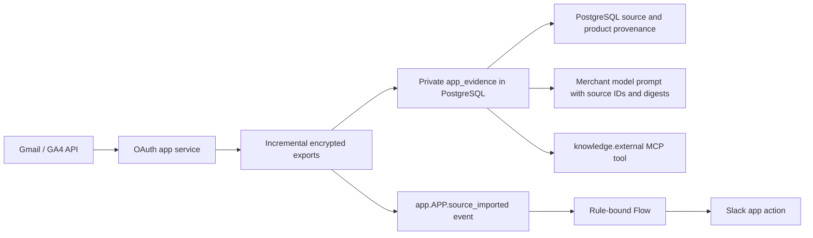

# Connected commerce apps: Google Analytics, Gmail and Slack

These are separate provider apps. The Rust core owns the permission/schema gateway,
private evidence storage, event outbox and durable flows. Provider OAuth, API calls,
token refresh, mailbox cursors and delivery jobs live in
`src/connectors/`. No Google/Slack SDK or credential belongs in the
Rust commerce domain or browser.

## Merchant experience

Open **Apps**, install **Google Analytics**, **Gmail** or **Slack**, then open its
own detail page. The interface is available in English, German, French and Spanish.
Connect the account through the provider's consent page, return to the app and
refresh. Settings use optimistic revisions. An import has a visible queued/running/
completed/failed state, rather than a success message before the provider responds.

- **Google Analytics:** use a `G-…` measurement ID for customer tracking and a
  numeric property ID for reporting. Optionally restrict tracking to one sales
  channel; an empty sales-channel field enables all channels in this shop. The
  native storefront asks for consent before it loads Google's actual tag. It sends
  product-list/product views, cart additions, checkout starts and placed orders.
  Pending payment orders are placed orders, not evidence of captured money. Purchase
  events are deduplicated by order ID. No customer names, emails, addresses or checkout
  tickets enter the event payload. Withdrawal disables further collection. Reports
  import acquisition and product metrics for the last 30 days, preserving row counts,
  truncation and threshold/sampling metadata. These reports do not establish causal uplift.
- **Gmail:** choose a dedicated support label and import. Full sync is bounded to
  500 messages; subsequent imports use `historyId`. An expired cursor triggers a full
  sync. Removed messages/labels remove their private sources. HTML becomes text;
  attachments are not downloaded. Changing the label resets the cursor. This is a
  read-only mailbox integration; it does not send replies.
- **Slack:** load channels and choose one to which the bot has access. Either enable
  all-order notifications, or create a targeted Flow Builder action. Enabling both
  produces two intentional notification paths. Templates support `{orderNumber}`,
  `{totalPrice}` and `{event}`. Mention markup is escaped. This app only posts after
  an explicit merchant setting, action or authorized saved flow.

Imports are explicit merchant actions in this version. The Rust worker polls completed
exports automatically, but it does not silently schedule mailbox/report downloads.

## Private knowledge and actual AI consumer



`GET /api/knowledge/external?query=…` returns private sources and their SQL provenance.
`knowledge.external` exposes the same authorized source data through MCP. The merchant
planner actually includes these sources in its model prompt and persisted task evidence.
Source text is marked untrusted data, never instructions. The local wire test inspects
that actual model request; it does not substitute a successful model call with a stored
field. This is retrieval/context integration, not automatic model-weight learning.

GA4 `itemId` rows link to matching native product IDs. Unsupported/unmapped IDs remain
source rows rather than guessed graph relationships. Imported email order numbers stay
in provenance metadata; automatic complaint resolution or verified customer identity is
not inferred from a mail. Private sources never enter public PDP answers or the public
product graph. Only active apps are retrieved. Disconnect revokes the provider token,
removes private sources and fences old in-flight exports so they cannot repopulate them.

## Operator setup

Local:

```sh
cargo build --locked --bin connectors
python3 scripts/connectors.py start
CONNECTED_APPS=1 scripts/dev.sh
```

The launcher creates private encryption and gateway keys under ignored `.run/` and
writes `.run/connector-services.json`. Preserve that encryption key with backups; losing
it requires reconnecting accounts. The core merges this map with existing `APP_SERVICES`.
Provider keys are server-side only. Add these to the ignored local `.env`:

```dotenv
GOOGLE_CLIENT_ID=YOUR_WEB_OAUTH_CLIENT
GOOGLE_CLIENT_SECRET=YOUR_PRIVATE_CLIENT_SECRET
SLACK_CLIENT_ID=YOUR_SLACK_APP_CLIENT
SLACK_CLIENT_SECRET=YOUR_PRIVATE_SLACK_CLIENT_SECRET
```

Register the redirect URI `http://127.0.0.1:8797/oauth/callback` for local development.
Enable the Gmail API and Google Analytics Data API in the Google project. The Gmail
scope is `gmail.readonly`; Analytics uses `analytics.readonly`. Configure your OAuth test
users or the provider's public-app verification as appropriate. Slack uses `chat:write`,
`channels:read` and `groups:read`; invite the installed bot to the selected channel.
Google can revoke an application's combined grant, so disconnecting one Google app
may require reconnecting another integration using the same Google OAuth project.

For deployment, the optional `connected-apps` Compose profile builds the independent
Rust service. Configuration, OAuth tokens, source exports and jobs use the shared
PostgreSQL database (migration 049), encrypted with a persistent 32-byte URL-safe
Base64 `CONNECTOR_SECRET_KEY`. The key format remains compatible with the original
operator key, but old Fernet ciphertext needs the explicit offline migration below.
Set a random 32+ character `CONNECTOR_GATEWAY_TOKEN` and `CONNECTOR_DATABASE_URL`.
Caddy serves the callback at `https://YOUR_COMMERCE_DOMAIN/connected-apps/oauth/callback`.
Set `APP_SERVICES` entries such as `https://YOUR_COMMERCE_DOMAIN/connected-apps/gmail`
with that gateway token; preserve Storyfront/custom app entries. Neither provider
credentials nor the gateway token reach the public frontend. A startup health check
requires migration 049; deploy migrations before restarting the service.

Multiple instances claim PostgreSQL jobs with row locks, tenant admission and fenced
leases. Mailbox imports have separate workers from notifications. Expired leases become
`uncertain`; starting another instance never steals an unexpired lease. See
[the runtime architecture, quotas and migration](rust-services.md).

The Slack implementation supports the ordinary non-rotating bot token setup. Slack
rotating refresh tokens, Gmail attachment ingestion, unbounded mailbox backfills and
scheduled provider sync are not implemented in this version.

## Events and visual rules/flows

The graphical builder edits the real bounded condition AST: nested AND/OR/NOT groups,
original numeric/UUID/string operators and server-owned customer/cart/event facts.
Original Shopware condition payloads can be imported through
`POST /api/automation/import-condition`; unknown conditions fail explicitly. Native
entity IDs must be mapped from original Shopware UUIDs during migration. The importer
never guesses country/customer-group/payment IDs.

`GET /api/automation/catalog` exposes available conditions, fields, events and installed
app actions. Common checkout conditions include customer group/authentication/email,
billing/shipping country, shipping/payment method, sales channel, cart amount/line count
and variant-aware product presence. `contextField` and `eventField` add typed app facts.
The original `cartLineItem` port preserves per-line negative comparison and parent-product
matching, distinct from the native set-based `lineItemId` condition.

An app declares `events.read` plus service-runtime subscriptions to receive the durable
outbox. `events.publish` authorizes private typed `emit` actions that publish
`app.APP_ID.ACTION_NAME`; the action input schema is validated by the same HTTP/MCP
gateway. Imported private sources publish `app.APP_ID.source_imported`.
An action declares `flowAllowed:true` to opt into durable private mutations.
Read-only/public actions cannot become flow targets. A flow may invoke `app_action`
with `{app,action,arguments}`. The gateway injects only
schema-declared `requestKey`, `event`, `kind` and translated `template` fields. Current
team rights, app activation and staging restrictions are checked again at execution.

The current executable production inventory is
`reference/automation-registry.json`: 114 concrete source rule classes, with 108
native scope bindings, and 16 Core action names. The graphical builder supports
branches, sequences, saved references, durable delays and typed domain/app
nodes. Complete source behavior, original trigger coverage, configuration/UUID
mapping and FlowSequence interchange remain incomplete. The older
`reference/rule-catalog.json` is a historical regex inventory, not the current
production count. [Automation details](automation.md) and the
[provider-free playground](playground.md) explain what can actually be tried.

## Delivery semantics and tests

A committed order produces one local durable flow job. Repeated app requests with the
same key and payload share the provider inbox receipt. HTTP 429 uses `Retry-After` and
bounded retries. A lost/ambiguous Slack response, 5xx or a worker stopping mid-delivery
is marked `uncertain` rather than automatically reposted. This prevents blind duplicates;
it is not an exactly-once guarantee across Slack's external network.

```sh
python3 scripts/connector_store_tests.py
python3 scripts/connected_apps.py
node frontend/tests/analytics.mjs
python3 scripts/rule_differential.py
```

The integration suite uses real local HTTP OAuth/provider fixtures plus the actual Rust
API, PostgreSQL, Qdrant, outbox, flow worker and model request adapter. It makes no paid AI
call and sends no message to a real Slack workspace. Live account authorization and
Google/Slack deployment verification remain separate from these protocol tests.

Primary contracts:
[GA4 ecommerce](https://developers.google.com/analytics/devguides/collection/ga4/ecommerce),
[Google consent](https://developers.google.com/tag-platform/security/guides/consent),
[GA4 reporting](https://developers.google.com/analytics/devguides/reporting/data/v1/rest/v1beta/properties/runReport),
[Google server OAuth](https://developers.google.com/identity/protocols/oauth2/web-server),
[Gmail history](https://developers.google.com/workspace/gmail/api/reference/rest/v1/users.history/list),
[Slack posting](https://docs.slack.dev/reference/methods/chat.postMessage/),
[Slack OAuth](https://docs.slack.dev/authentication/installing-with-oauth/).

## Storyfront integration

The companion Storyfront connector reads only the admitted shop's public measurement
ID through its server-side commerce bridge. It serves the identical consent adapter
from `/store-api/apps/analytics.js` through a same-origin proxy. Consent controls are
available in English, German, French and Spanish. No configured app means no Google
script. Page/product views, actual bag additions and authoritative checkout transfers
produce events after consent; purchases are recorded by the native checkout.

Storyfront view/bag events use its public product IDs; checkout events use the native
SKU IDs from the reviewed cart. Their identifiers can differ after slug normalization;
this release does not reconcile those identifiers in GA reports. The initial connector
uses the `default` sales channel. Native storefronts support per-channel measurement
IDs. There is no cross-domain identity stitching or automatic consent transfer between
Storyfront and the native checkout.
