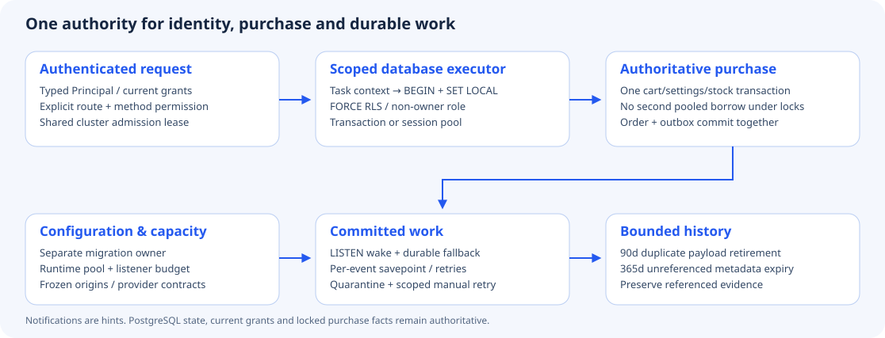

# Core hardening: identity, database and durable work

This change addresses the eighteen findings in the 8 October core review. It changes
runtime boundaries and the existing queue/database owners; it does not introduce a
second pricing engine, authentication service or job store. Production behavior
still needs verification against the deployed configuration. A green local suite
is not evidence that an older public service has received the migration or credentials.

## The eighteen findings and their implementation

| # | Finding | Implemented owner / behavior | Regression or boundary |
|---|---|---|---|
| 1 | Privileged production database and automatic DDL | `deploy/compose.yaml` runs separate migrate and provision jobs. Commerce uses a non-owner login with strict RLS and `serve`; connector credentials have their own role. | Strict startup rejects owner, bypass and core TRUNCATE privileges. Existing hosting credentials must be upgraded separately. |
| 2 | Unknown API routes inherit broad rights | `auth/route_policy.rs` declares method-specific rights beside every `/api/` route. Unknown methods/routes deny access. `security_route_gate.py` prevents an unregistered new API handler. | 191 declared API methods (9 October source); customer/MCP/UCP/app capabilities retain their own additional checks. |
| 3 | Principal carried in HTTP headers | `request_context.rs` stores a typed Principal in request extensions. Caller `x-rac-*` values are discarded; transport forwarded to services carries no trusted principal headers. | Forged identity, missing middleware, revoked membership and role-change controls. |
| 4 | Replica-local login defenses | `auth/abuse.rs` reserves hashed account/peer-prefix attempts in PostgreSQL before hashing passwords. Progressive failed-login backoff survives another replica. | Peer 120/minute, account 12/minute; failed attempts from five receive bounded backoff. Only exact configured proxy IPs may supply forwarded peer identity. Edge DDoS protection remains separate. |
| 5 | Random tenant headers fill admission maps | Only an existing admitted workspace gets its own bucket/cluster lease. Unvalidated requests share the bounded anonymous budget. | Unknown-shop denial and known independent-shop availability; no arbitrary-header tenant allocation. |
| 6 | Bootstrap, browser defenses, demo fallback and request types | Constant-time bootstrap comparison, native strict script CSP, HSTS in strict deployments, nosniff and referrer policy. No implicit atelier when strict or `SEED_DEMO=false`. Auth request bodies have typed DTOs. | Native scripts forbid inline handlers/eval. Dynamic app payloads keep versioned JSON-schema validation; all remaining domain payloads are not claimed to be compiler-typed. Hosted renderers own their stricter script policy. |
| 7 | Two context SQL round trips per borrow | `scoped_pool.rs` is the shared executor. Explicit transactions batch BEGIN and SET LOCAL. Direct queries can automatically acquire transaction-local scope in transaction-pool mode. Session mode retains mandatory bind on borrow and removes the redundant return reset. | Two real restricted replicas and one-backend PgBouncer exercise scope reuse. Cancelled transactions roll back through SQLx. Unknown task scope denies tenant rows. |
| 8 | Repeated authentication queries | `auth/identity.sql` reads credential, current grants, selected environment and current shop status in one authoritative query. | No TTL identity cache; next-request revocation, paused shops, integration-key intersections and staging ownership still apply. Customer/channel gates remain independent. |
| 9 | Cold Wasm compilation under locks / unbounded cache | `sandbox_cache.rs` uses bounded LRU (128), four compile slots and fixed single-flight stripes. B2B preparation precedes cart/product locks; the transaction rechecks its digest. Pure app Wasm uses the same cache implementation, without compilation under the global cache mutex. | Wrong digest cannot reuse another module; eviction is bounded. Blocking compile retains its permit even if the caller cancels. Execution remains fuel/memory bounded; process isolation is additional defense. |
| 10 | PNG decoding blocks async threads | `assets/image_provider.rs` decodes and re-encodes PNGs on the blocking pool; existing byte/dimension limits remain. | Image-provider fixtures cover valid, malformed and rejected outputs; this is not antivirus. |
| 11 | Idle polling by every worker | `work_signal.rs` listens for commit notifications and wakes the existing workers, with a 250 ms busy period and five-second idle fallback. | Startup/reconnect wakes and polling fallback recover missed hints; durable tables remain the source of truth. |
| 12 | One bad event rolls back an entire batch | `outbox.rs` uses a savepoint per event, persisted attempts and exponential retry; the eighth failure quarantines it. | Synthetic poison projection fails while its healthy neighbor commits. Tenant-bound `POST /api/runtime/outbox/{id}/retry` requires settings.write and recovers an inspected event. |
| 13 | Unbounded duplicate event payload history | `outbox/retention.rs` retires delivered duplicate payloads/projections after 90 days, then unreferenced metadata after 365 days, in bounded locked batches. | Unsettled work and referenced commerce/knowledge/idempotency evidence survive. Foreign keys remain intact; no cascading evidence deletion. Retention windows are configuration, not legal advice. |
| 14 | Tenant limits multiply with replicas | `performance/cluster_lease.rs` uses fenced PostgreSQL leases and an atomic invoker function for API/AI/checkout admission and model/app/provider work. | Both replicas reject the same exhausted tenant, another shop remains usable, expired leases recover. Actual model calls use a shared two-slot tenant limit; the identity broker has a separate four-slot budget. Token/spend accounting remains additional work. |
| 15 | No fleet connection budget / unsafe poolers | Weighted process leases reserve `DB_POOL_MAX + 2` from `DB_CLUSTER_CONNECTION_BUDGET`; heartbeat loss stops the process. Graceful shutdown awaits release; killed processes recover by expiry. PostgreSQL role limits provide another ceiling. Transaction-mode PgBouncer requires a separate direct/session listener URL. | The same strict-runtime suite runs through real PgBouncer with one physical backend and protocol prepared statements, including immediate restart and released reservations. Statement pooling is unsupported. All replicas must use the same budget settings. |
| 16 | Hot parsing and unchecked process settings | `runtime_config.rs` freezes validated limits, flags, provider/service JSON, trusted origins and proxy addresses once. PayPal origin/environment and generic provider declarations are checked before serving. Mutable merchant settings remain in the existing revisioned database. | Malformed configuration fails startup without displaying credential values. Third-party service contracts remain versioned dynamic schemas. |
| 17 | HeaderMap leaks into domain code | Native commerce handlers, flow adapters and MCP use the same `RequestContext`; raw headers remain only at actual transport boundaries and the independent connector service. | The HTTP, API-key, customer, staging and MCP suites exercise the changed adapters. Domain-specific records retain their existing types. |
| 18 | Wildcard imports conceal dependencies | Auth, payments, tenant-scope and pool boundaries explicitly import their dependencies. | Compiler/clippy and the module responsibility inventory check the resulting boundaries. Test-local imports and intentional module re-exports are distinct from production dependency imports. |

## Production configuration and upgrade order

1. Back up the database. Run the owner-only migration job through the selected release’s append-only migration ledger (currently migration 079).
2. Run the post-migration role provisioning job. Commerce gets only core DML and
   managed app schema ownership; connector tables stay with the connector role.
   Rerun provisioning after an additive migration instead of broadly granting every
   future table (which could include credentials).
3. Start HTTP/worker services with `BOOTSTRAP_MODE=serve`, `DB_RLS_REQUIRED=true`,
   `DATABASE_RUNTIME_URL` for the non-owner login and `ALLOW_BOOTSTRAP_AUTH=false`.
   The ordinary commerce service does not need the migration-owner password.
4. Budget each process's pool and two listener connections together. Default
   `DB_POOL_MAX=20`, `DB_CLUSTER_CONNECTION_BUDGET=80`, `DB_MAX_PROCESSES=1`.
   Limits count HTTP and worker processes together, not each replica independently.
5. For PgBouncer: `DB_POOLER_MODE=transaction`, PgBouncer 1.21+ with
   `max_prepared_statements=100`, `ignore_startup_parameters=extra_float_digits`,
   and `DATABASE_LISTENER_URL` pointing directly to PostgreSQL (or a session pool)
   using the **same non-owner identity**. The backend's `extra_float_digits` must
   retain PostgreSQL's default 3. Never force all clients onto a superuser identity.
   LISTEN connections cannot use transaction pooling. Statement pooling is rejected.
6. Configure `TRUSTED_PROXY_IPS` only for the actual final reverse proxies. Merely
   sending X-Forwarded-For cannot select another identity. Without this setting
   the socket peer is used, which can group clients behind a proxy into one bucket.

An exhausted limit returns 429/Retry-After; an exhausted SQL wait returns 503.
Check job/order state before retrying a timed-out financial operation. A quarantined
outbox event requires inspecting its cause, then a permission-checked retry. Logs
identify event IDs/kinds and error classes; customer payloads and credentials are
not included in quarantine messages.

## Verification and precise limits

`production_foundations` creates a disposable database identity and runs real HTTP,
checkout, CRM, RLS, queue, retention and two-replica tests. `transaction_pooler`
repeats it through a real one-backend transaction pool. CI installs PgBouncer and
runs both through the existing integration registry; no live payment, email or
model provider is involved. Native verification can select `TEST_PSQL` and
`TEST_PGBOUNCER`; the default database fixture still uses Docker.

The changes remove repeated identity queries and a return-reset query; transaction
pooling adds BEGIN/COMMIT for otherwise direct statements. Cluster admission also
performs real database lease work. **No latency percentage or Shopware speed-up is
claimed from these changes.** Existing dated benchmarks describe their original
configuration. Measure the selected deployment, cold/warm behavior and contended
checkout before making a performance claim.

RLS protects scoped database operations; the server's explicit system scope is still
privileged. These tests do not establish containment of SQL injection or a compromised
process. Browser sessions still use sessionStorage; MFA/recovery and a cookie/token
edge remain separate work. Financial float-to-integer migration, provider spend/token
quotas, automatic failover, large-database DDL windows and observability export are
also separate from these eighteen fixes. Lean continues to prove only the extracted
pure policies, not the database, network or whole system.
