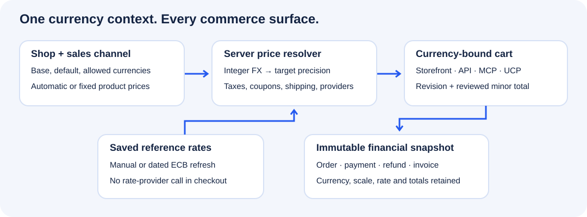
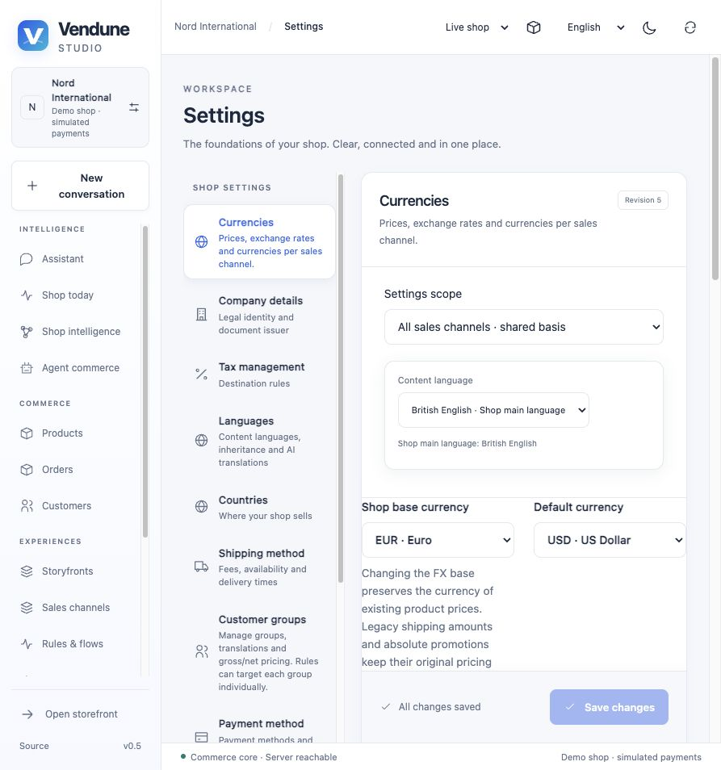
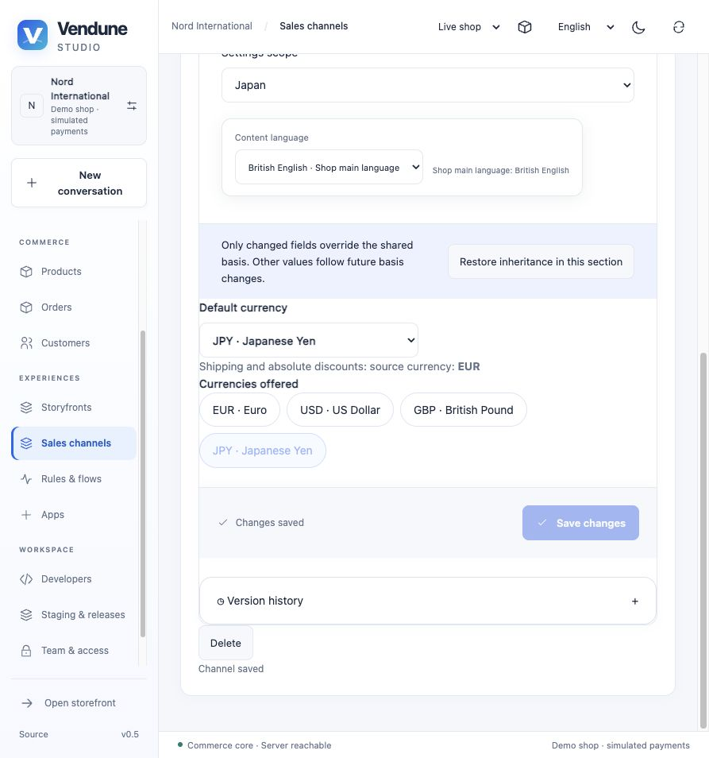
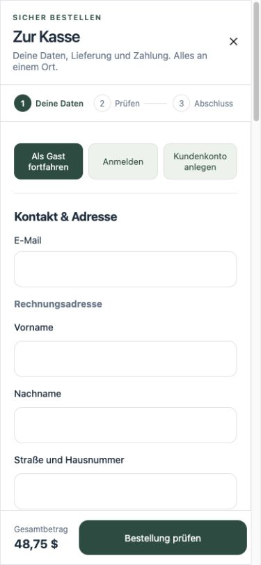

# Multi-currency commerce

Vendune has one shop currency registry, a default and enabled subset per sales
channel, and one authoritative currency on each cart. The storefront, Store API,
MCP and the implemented UCP checkout routes use the same price operations.
Orders and payment attempts retain their original currency, precision and totals.

## Configure a shop and its sales channels

Open **Settings → Currencies**. Add the currencies you need, enter a rate or fetch
ECB reference rates, choose a pricing strategy, and save the configuration. Rates
are decimal strings: `1.25000000` means one unit of the base currency buys 1.25
units of this currency. The base currency always has rate one.

The initial registry contains EUR. The chooser currently supports **39 currency
codes**, with explicit scales: JPY/KRW/CLP use zero decimal places;
BHD/KWD/OMR/JOD/TND use three; the other supplied codes use two. This is a bounded
catalogue, not a claim of every ISO 4217 currency or every provider-specific
settlement exception. EUR, USD, GBP, CHF, CAD and AUD are among the supplied codes.

In **Sales channels → Currencies**, override the offered currencies and the default
currency for that channel. The rates and product pricing strategies inherit from
the shop. An unmodified channel inherits later shop changes. Availability is
validated server-side; sending a different header cannot enable a disabled currency.

The storefront selector requotes an open cart, including taxes, shipping, coupons
and payment availability. Its remembered choice is scoped to shop and channel.
Merchant-approved product recommendations reuse the same bounded catalog price
path, react to currency changes and filter products by the active sales channel.

The exchange-rate base and a stored amount's source currency are different facts.
Changing the base renormalizes rates; it does not relabel an existing EUR 100 price
as USD 100. Products have an explicit source currency in their price editor; new
products default to the shop base. Legacy products, shipping fees/thresholds,
absolute discounts and native app fees keep their original `pricingCurrency`
(EUR for existing installations). That legacy source cannot be changed by simply
editing a configuration field. Changing a product's source in the editor converts
the draft price/list/regulation amounts using the saved rate before you save.

## Choose how product prices are produced

| Strategy | What happens | Typical use |
| --- | --- | --- |
| Automatic | Convert the stored product price using the latest saved rate whenever the server quotes it | Keep prices aligned with saved FX |
| Fixed | Use an exact per-currency product price; convert the source price when a fixed price is missing | Merchandising such as USD 49.00 |
| Generate fixed prices | Freeze the saved rates and populate missing product/variant prices in durable batches of 100 | Start a localized price list, then adjust it |

Fixed prices are edited in **Products → Prices** using a single currency selector.
They are exact decimal strings, e.g. `{"KWD":{"price":"7.123"}}`, stored with the
product's normal optimistic revision and history. List and regulation prices may
also be set. Product variants use the same editor and pricing resolver.
The existing advanced-price **discount tiers** apply to the resolved price; this
is not Shopware's complete inherited per-currency advanced-price record schema.
Destination tax adjustment still applies to fixed gross prices.

Generation preserves existing fixed prices unless **Replace existing fixed prices**
is explicitly selected. It snapshots the rate configuration, actor, product ID
ceiling and creation-time cutoff; it locks each batch and commits prices and its checkpoint together.
Multiple workers claim jobs with `FOR UPDATE SKIP LOCKED`. A restart resumes the
checkpoint. Validation failures roll back the current batch and mark the job
failed; database failures retain the queued job for retry. New products created
after the snapshot are intentionally excluded. There are at most three pending
jobs per tenant. Generated prices are normal versioned product changes; completed
batches can be inspected or reverted through product history.
Existing products receive a creation timestamp when this migration runs; their
original historical creation dates cannot be reconstructed by this migration.

## Exchange rates and checkout review

**Fetch ECB rates** calls a fixed HTTPS endpoint outside checkout. Optional automatic
refresh runs on the flow worker, scans shops in bounded batches and revisits them
hourly. Each process uses a 30-minute response cache; there
is no network request in the price, cart or order path. Rates are saved with their
publication date using a revision check, history and an outbox invalidation event.

The ECB publishes [reference rates](https://www.ecb.europa.eu/stats/policy_and_exchange_rates/euro_reference_exchange_rates/html/index.en.html)
on business days. These are not live tick prices or a provider's settlement rate.
Every configured currency must be present in the response for an ECB refresh to
succeed. Unsupported currencies, including KWD, need manual rates; mixing manual
and ECB rates within one registry is not implemented. A failed refresh retains the
previous rates. Automatic conversion with an ECB snapshot older than seven days
is rejected rather than silently producing a stale cross-currency quote. Manual
rates are merchant-controlled and do not expire automatically.

FX conversion uses rational integer arithmetic, eight-decimal rate strings and
one half-up rounding to the target minor unit. The ported Shopware tax/discount
calculator still uses its original float semantics behind the explicit money
boundary; it has not been replaced by an entirely integer calculator.

Before placing an order, the browser submits its reviewed cart revision, currency
and minor-unit total. If an exchange-rate change alters the quote, checkout returns
a conflict and requires a fresh review. A completed order returns its saved
snapshot, even after rates or shop defaults change. Reports separate invoice
currencies rather than summing EUR and USD into an unlabelled number. No historical
FX-normalized revenue report is implied.

## API and MCP contract

The actual mobile checkout retains the chosen currency for products, shipping,
taxes and the final review:

Set `x-tenant`, `sw-sales-channel-id` and, for a new cart, `x-commerce-currency`.
An existing `sw-context-token` owns its saved currency; changing the header alone
does not mutate the cart. Catalog/detail/context/options responses expose currency
metadata; cart `price` includes `currency` and `currencyScale`, plus `currencyContext`
with source/base currency, exact factor, strategy and rate date. Storefront amounts
are major-unit numbers at the legacy calculator boundary. Financial `money.minor`
and payment `amountMinor` are integer minor units.

| Endpoint | Input / purpose | MCP tool | Authority |
| --- | --- | --- | --- |
| `GET /store-api/currencies` | Channel availability and saved FX context | `currency.list` | Public scoped discovery |
| `PUT /store-api/checkout/currency` | `{currency, revision}` with owning cart token | `currency.select` | Owning open cart |
| `POST /api/merchant/currencies/rates/refresh` | `{revision}` | `merchant.currencies.refresh` | `settings.write` |
| `POST /api/merchant/currencies/price-jobs` | `{currency, revision, overwrite}` | `merchant.currencies.generate` | `catalog.write` |
| `GET /api/merchant/currencies/price-jobs` | Bounded recent jobs | `merchant.currencies.jobs` | `catalog.read` |
| `GET /api/merchant/currencies/price-jobs/{id}` | Own job status/checkpoint | `merchant.currencies.job` | `catalog.read` |

Shop/channel settings use the existing revisioned commerce settings endpoints;
product currency prices use the existing product edit API. UCP checkout create and
update accept `currency` and return integer prices using that currency's scale.
MCP tools call these handlers rather than maintaining a separate calculator.
Third-party apps must consume the explicit currency and scale instead of assuming
EUR or multiplying every amount by 100.

Payment method contracts declare supported `currencies`. Unavailable methods are
filtered from discovery and rechecked at order placement. The native PayPal wire
adapter formats its supported currencies; private generic adapters receive
`amountMinor`, `currency` and `currencyScale`. Payment ledger columns persist the
scale. Receipts and refunds must match the original currency and amount. Actual
live provider activation still requires authorized credentials and provider tests;
the included multi-currency payment tests use a local adapter fixture. This feature
does not certify the private Shopware Payments adapter for every currency.

## Implementation and verification

- `src/currencies/{model,pricing,rates,routes,jobs,capabilities}.rs`: registry,
  deterministic price resolution, bounded retrieval, public/private APIs and workers.
- `src/commerce/`, `src/cart_price.rs`, `src/order_checkout.rs`, `src/ucp.rs`:
  catalog, destination taxes, shipping, checkout and protocol consumers.
- `src/payments/`, `src/operations/receipt_text.rs`, `src/studio/revenue.rs`:
  provider ledger, documents and separated invoice-currency reporting.
- `src/connectors/templates.rs`: order emails use the frozen exact money snapshot;
  zero- and three-decimal totals are preserved in all supplied languages.
- Migrations `050-currency-price-jobs.sql` and `051-multi-currency-ledger.sql`:
  forced tenant row security for jobs and additive ledger precision support.
- Frontend `CurrencySettings`, `ProductCurrencyPrices` and `StorefrontCurrency`:
  shared English/German/French/Spanish controls.

`scripts/currencies.py` tests the actual HTTP/MCP/UCP/SQL paths: USD/JPY/KWD,
shipping and fixed coupons, disabled channel currency, stale reviews, completed
order preservation, fixed-price generation and foreign-tenant rejection.
`scripts/payment_providers.py` checks a real local adapter and durable ledger
through create/capture/refund for two-, zero- and three-decimal currencies.
`scripts/production_foundations.py` checks job RLS with a non-owner database role.
Frontend tests cover formatting, server-bound switching, fixed-price editing and
minor-unit checkout review. Rust tests cover overflow, invalid rates, exact prices,
ECB parsing and document precision. Existing Shopware differential gates remain.

The new extracted `currency_context_admissible` policy has Lean proofs and mutation
checks for enabled/configured/fresh admission. These prove the bounded predicate,
not FX source correctness, the entire server, providers or bug-free commerce.
