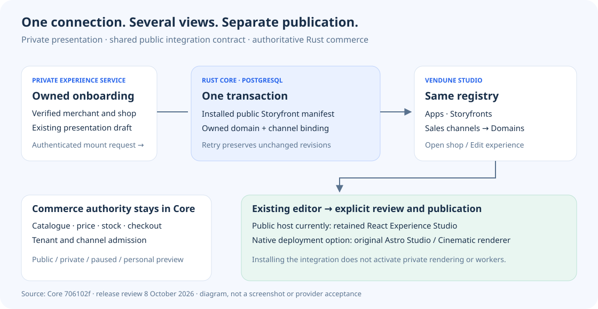
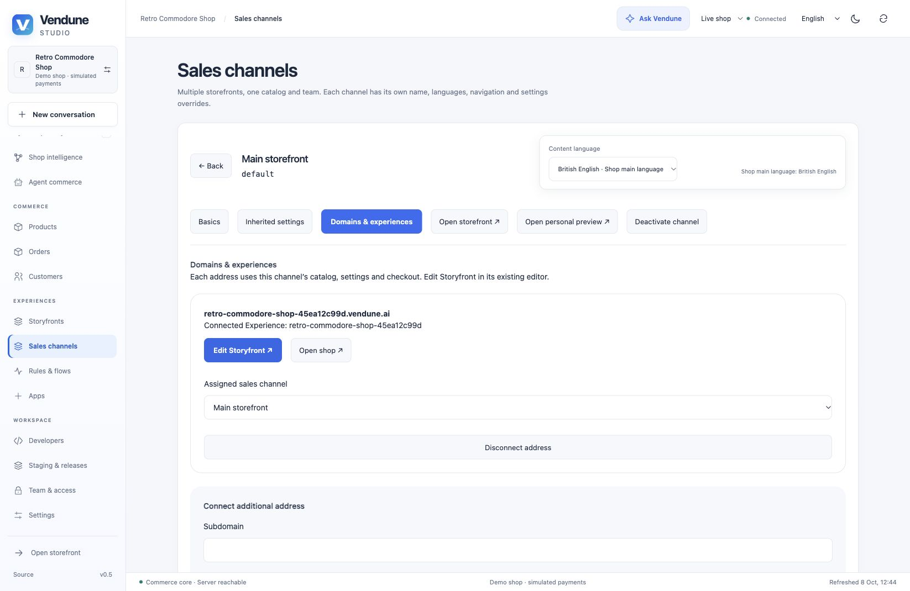

# Current release — 9 October 2026

[Feature tour](features.md) · [Architecture](production-architecture.md) · [Complete documentation](documentation-site.md)

The earlier feature/media review below describes **Vendune main at `706102f8ff3526a6f5bba7ab09b96ce713d1de74`**
and the privately operated Experience deployment observed on 8 October. Documentation
changes do not turn the prototype into a fully compatible Shopware replacement or
certify every provider. The static API catalogue contains **243 HTTP method/path
pairs** at this source; installed app routes are discovered separately. The current
formal manifest contains **36 extracted policies and 78 properties** across a
334-module Rust inventory; [formal evidence](formal-verification.md) distinguishes
those pure decisions from unproved SQL, network and UI adapters.

## Connected intelligence source update

[PR #73](https://github.com/sthamann/vendune/pull/73) connects automatic bounded
indexing/model rebuilds, lexical/dense retrieval with reranking, current-right
read-agent rounds, reviewed source claims, price guardrails/autonomy budgets,
controlled layout experiments and consent-bound private cart preferences. The
current candidate has **45 extracted policies, 97 properties, 184 Rust unit tests
and 385 frontend tests**; these counts do not certify the entire commerce system.
Source-aware categories and opt-in document-event extraction reuse native
catalog/Flow owners. Public answers reject sources or product snapshots changed
during inference, including uncited inputs. [Architecture, setup, actual evidence
and remaining audit scope](cognitive-commerce.md).

This records the implementation candidate and local verification. Its PR checks,
merge status and hosted runtime deployment remain separate evidence; a
GitHub/Vercel documentation preview does not activate Rust services.

## Core hardening update

The eighteen-point core review is addressed in [the hardening guide](core-hardening.md): typed trusted identity and explicit route rights, strict deployment roles, consolidated current grants, shared tenant/connection leases, transaction-local SQL/PgBouncer, bounded off-thread Wasm/image work, commit wakes, isolated outbox retries and retention. The guide distinguishes source/tests from a verified public rollout.

## What changed and where to use it

| Capability | Merchant workflow | Implementation / evidence |
| --- | --- | --- |
| Storyfront installed with Experience | Apps → Storyfront; Storyfronts; channel Domains & experiences | Mount and package installation commit together; migration 055 repairs older mounts. [PR #67](https://github.com/sthamann/vendune/pull/67), [ownership](channel-management.md#storyfront-app-ownership-for-experience-shops) |
| Editable channels and frontend connections | Sales channels → Manage channel → Basics / Domains & experiences | Rename, translate, assign/disconnect addresses, pause/resume or switch public/private; personal previews remain read-only. [PR #65](https://github.com/sthamann/vendune/pull/65), [admission](channel-management.md) |
| Guest buyers visible to merchants | Customers → guest buyer → linked orders and checkout addresses | Derived contact from immutable order snapshots, not a newly authenticated account. Entering an email cannot claim another person's orders. [PR #66](https://github.com/sthamann/vendune/pull/66), [customer ownership](merchant-operations.md) |
| Personal merchant enrollment | Welcome-access link → choose/confirm password → normal Studio session | Scanner-safe access page; canonical account checks, session revocation and one-use handoff. [PR #63](https://github.com/sthamann/vendune/pull/63), [identity contract](experience-integration.md#merchant-password-enrollment-and-email-link-recovery) |
| Existing experiences discovered | Storyfronts → Edit experience / Open shop | Tenant-bound mount registry, safe operator editor template, no generated duplicate. [PR #64](https://github.com/sthamann/vendune/pull/64), [discovery](experience-integration.md#discover-and-edit-existing-experiences) |

The main `default` storefront cannot be deleted or changed to headless; it **can** be
paused or made private. Additional channel deletion checks current orders, customers,
carts, overrides and frontend references under transaction/revision protection.
A configured subdomain is distinct from provisioning DNS/TLS for an arbitrary
external customer domain.

## One connection, several views

Core owns catalogue, price, stock, authentication and checkout. The private Experience
service owns presentation and its current/native editor selection. The public
Storyfront manifest links them; it contains no closed renderer or provider keys.

## What was observed, and what remains separate

- **Publicly observed:** the owned Retro Commodore demo shop shows one installed and
  enabled Storyfront app, its existing domain and main channel. Its Edit experience
  link opens the retained **React Experience Studio** with its published revision
  and preview. The Core and private Experience releases were healthy.
- **Tested in isolated CI:** persisted app ownership/backfill and channel admission;
  private native Docker builds the original Astro Studio/Cinematic applications and
  checks original pages, brand persistence and anonymous/foreign-owner refusal.
- **Not inferred from those tests:** public native-renderer activation, every native
  media import, native worker model inheritance, complete original UI localization,
  Google/Apple OAuth acceptance, real payment settlement or production capacity.
- **No external transaction for this documentation refresh:** no new email, paid
  inference, image generation or payment; the new screenshots are passive English
  captures of an owned public demo. [Exact media provenance](assets/showcase/README.md#public-integration-captures-8-october-2026).

The retained 6 October fashion demo recordings are dated evidence of those local
workflows, not relabelled captures of this later release. For full scope, use
[Shopware parity](shopware-parity.md), [measured tests](testing.md),
[formal boundaries](formal-verification.md), [payments](payment-provider-api.md),
[currencies](currencies.md) and [production architecture](production-architecture.md).
