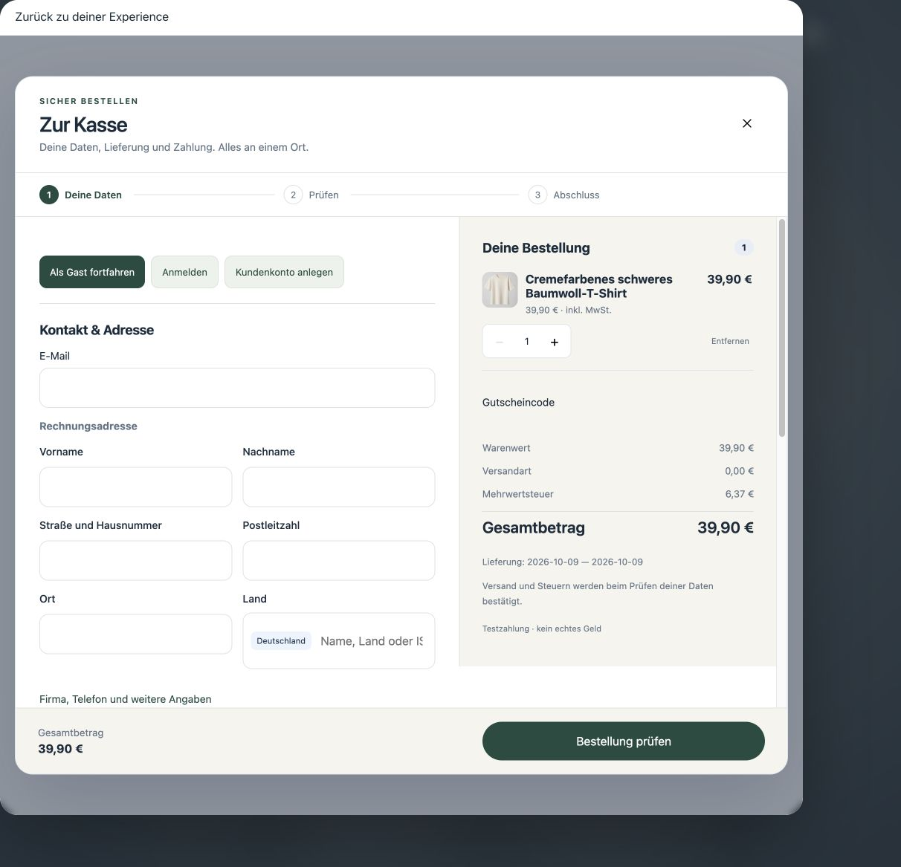
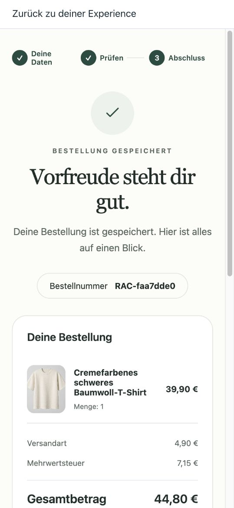
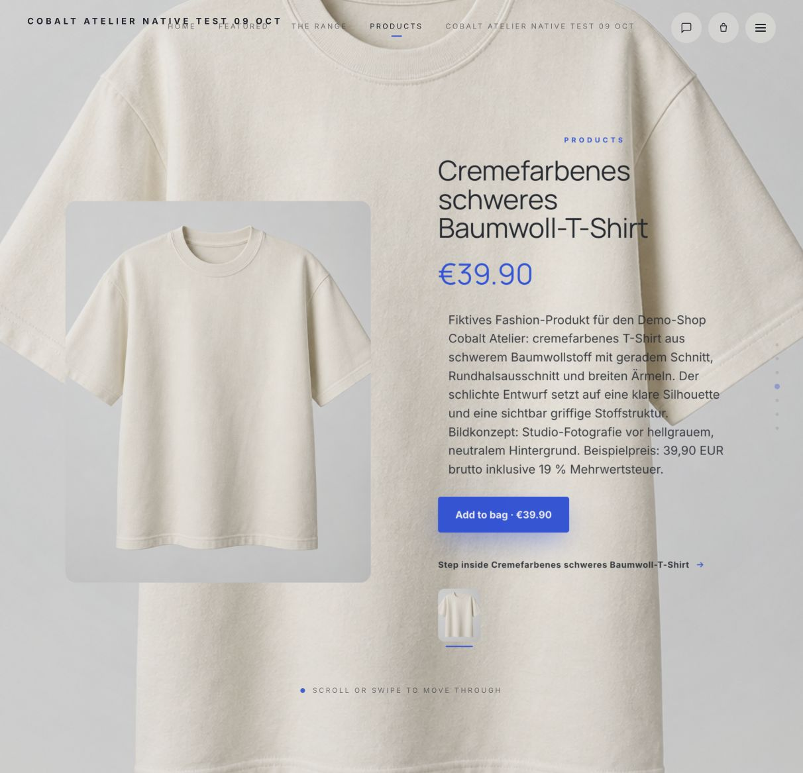
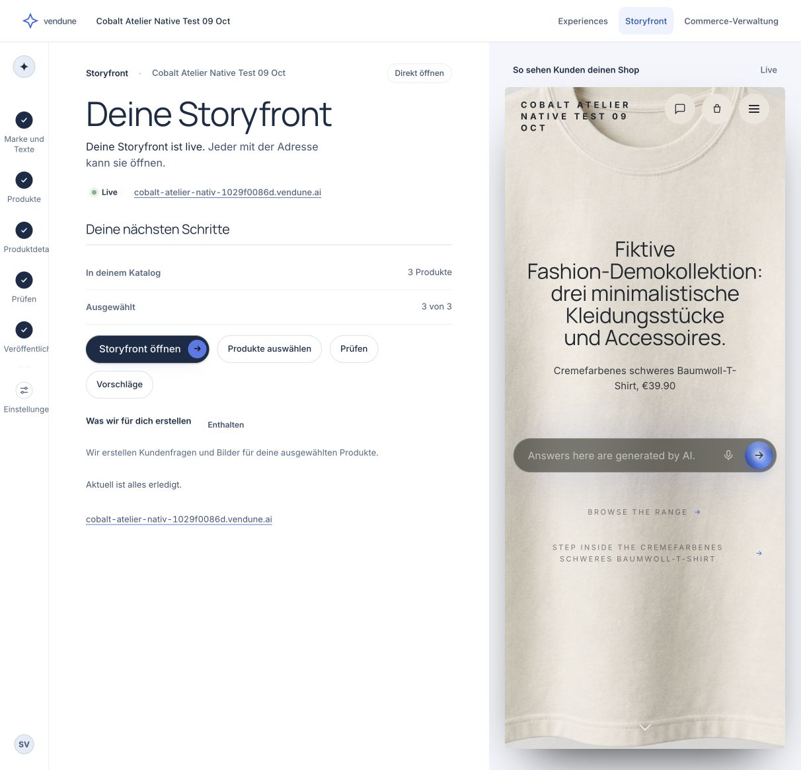
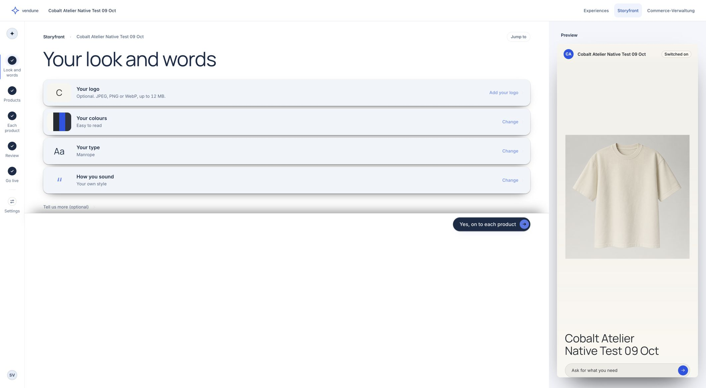
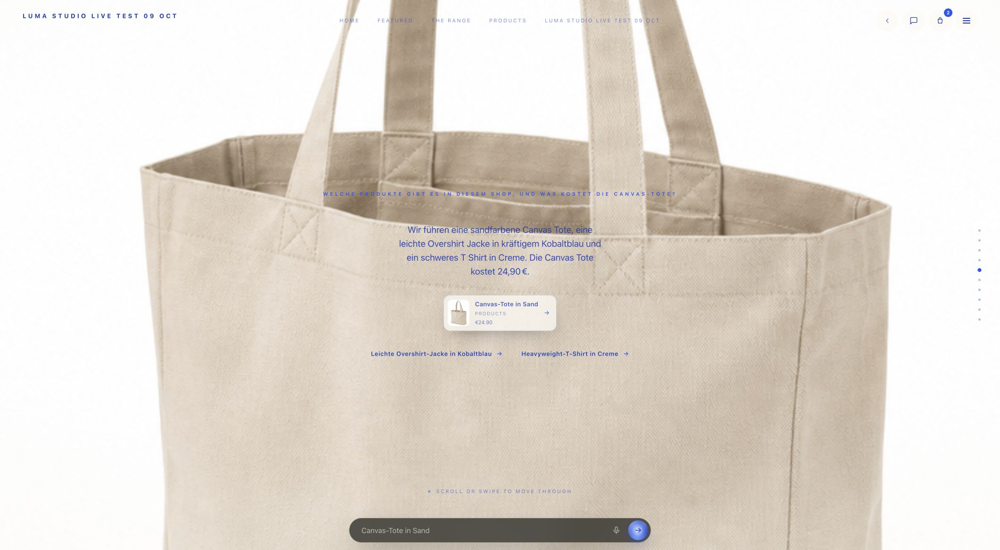
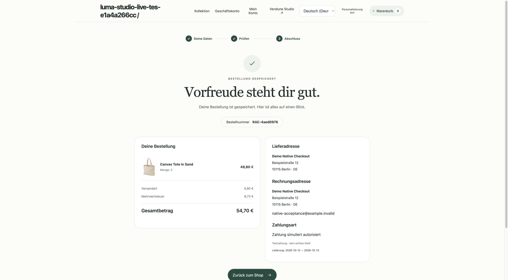

# Current release — 9 October 2026

[Feature tour](features.md) · [Architecture](production-architecture.md) · [Complete documentation](documentation-site.md)

The earlier connected intelligence and app release was merged in Core
`598bbec112165fcac1847797786e2ba5c606e06f`. The private Experience adapter pins
that Core and original Storyfront `2087783606e5c925317bae57625256a82c16bff0`;
its dated release was `f970543124d669971330945f74b87e9c799a76e4`. The public native update below supersedes that runtime observation.
[Complete changes, repeatable acceptance and remaining work](release-acceptance-2026-10-09.md).

The static API catalogue contains **280 HTTP method/path pairs**; installed app
routes are discovered separately. The source inventory contains **416 Rust
modules**. The formal subset has **45 extracted policies and 97 properties**,
with **142,298 compiled comparisons and no mismatch**. SQL, network and UI behavior
remain outside those proofs. [Formal evidence](formal-verification.md).

## Public original Storyfront update — 9 October 2026

### Checkout continuity

[PR #82](https://github.com/sthamann/vendune/pull/82) adds the existing native
Vendune checkout as an embedded surface inside the original Storyfront experience.
The same calculation, legal review, delivery, payment and immutable order owners
serve both checkout surfaces. Only the registered shop/channel origin may embed
the checkout; foreign origins and non-default HTTPS ports are rejected.

Original Storyfront verifies a completed order against the Core cart capability,
order ID and exact purchased quantities before removing those quantities from its
own Bag. Later additions remain in the Bag; repeated completion messages cannot
consume them twice. Canceling checkout retains the Bag. A saved completion receipt
can be retried after reload when confirmation was temporarily unavailable.

[PR #83](https://github.com/sthamann/vendune/pull/83) also routes the native
checkout's close button and Escape cancellation back to its registered parent.
This prevents an empty outer dialog after closing only the inner checkout.
Composition regressions exercise both paths and ordinary top-level checkout;
the local frontend suite passes **396 tests in 67 files**.

Order item names use the cart's content language, including parent/variant
inheritance, and remain immutable after later translation edits. The private
gateway forwards the selected Studio language to the original editor. Its overview
uses the actual connected catalogue and published address instead of unrelated
crawler/import status. The merchant signup now offers explicit sign-out/account
switching without discarding the shop draft.

[Ownership, failure handling and sequence diagram](storyfront.md#native-checkout-continuity-9-october-2026).

Public acceptance on 9 October saved **RAC-faa7dde0**, **44.80 EUR**, including
**4.90 EUR** delivery and **7.15 EUR** VAT, through this embedded checkout.
The receipt saves the German Tee name. Returning to the original experience
shows Bag **0**, still **0** after reload. Canceling the first checkout kept Bag
**1**. At 390 × 844 the checkout dialog measured exactly 390 × 844 and the outer
document measured 390px, without horizontal overflow. The existing AI-demo
catalog was reused; this acceptance made no new model/image call or real charge.
Core image `acc137c` has exactly the merged `aa4e644` source tree and passed both
full CI runs before deployment.

Private release `414e117` is healthy with the original Storyfront `b11b6e4` pin.
The public original overview now opens in German, reports the live address,
three catalogue products and three chosen products, and says that no work is
pending. Navigation and budget/status copy use the four-language source catalogue;
original renderer chrome and other advanced editor copy remain a separate
localization scope.

The earlier hosted React Studio observation below is historical. The existing
Experience service now runs the original private Storyfront Astro Studio and
Cinematic renderer, not a recreated editor or storefront. Private release
`1c3c663` builds original `2087783606` from checksum-checked private source archives.
A separate original presentation database and a persistent 6 GB asset volume keep
workspaces and generated media through stop/start deployment. Core remains the
only catalog, identity, price, inventory and order owner.

A freshly verified Cobalt onboarding accepted three actual model-proposed demo
products, generated three product images, stored four catalog languages and opened
the original Studio. Original review, worker Build and Go live completed for Cobalt
and the existing Luma catalog. An original writing-style edit survived reopening
and service replacement. A real German question in Luma produced a new original
multi-chapter scene naming its three products and correct 24.90 EUR Tote price.
The native Bag opens with item counts, removal and total; a 390px check measured
390px document width.

[PR #79](https://github.com/sthamann/vendune/pull/79) fixes hosted original public
API routing with current tenant/channel/preview admission. Private PR #42 removes
intermittent module activation failure by sharing only still-running admission
checks, immediately forgetting completed checks. No stale authorization cache or
quota bypass is introduced. [PR #80](https://github.com/sthamann/vendune/pull/80)
keeps the native checkout transfer on the shared `/checkout` route. Its merged
Core `b995b5a` is deployed as `dependent-floor-9352`; the new pod passed its health
check. The actual original Bag transferred two canonical Canvas Totes into the
shared checkout. Fictional address entry, standard delivery and simulated payment
saved **RAC-4aed0976**, **54.70 EUR** total, **4.90 EUR** shipping and **8.73 EUR** VAT.
The receipt confirms simulated authorization; no money was charged. The return
button exposed a separate SPA-navigation defect, repaired with canonical hosted
navigation while preserving local SPA behavior and channel/language scope.

Original intro/controls still include English copy. Universal native worker
provider inheritance, complete advanced-media import, externally settled payments
and production capacity are not established by these tests. Existing retained
renderer shops only switch after completing original Go live.

## Connected intelligence release

Merged [PR #73](https://github.com/sthamann/vendune/pull/73),
[PR #74](https://github.com/sthamann/vendune/pull/74) and
[PR #75](https://github.com/sthamann/vendune/pull/75) connect automatic bounded
indexing/model rebuilds, lexical/dense retrieval with optional reranking,
authorized read-agent rounds, reviewed source claims, signed public facts,
price guardrails/daily autonomy budgets, controlled layout experiments,
consent-bound cart preferences and native app ontology projections.
The current embedded-checkout CI passes **187 Rust unit tests and 393 frontend
tests in 66 files**, all registered database/browser-contract suites and the
formal/differential gates. Whole-source CI line coverage is **90.56% Rust /
63.34% frontend**; this remains partial coverage, not a whole-system guarantee.
[Complete verified checkout source run](https://github.com/sthamann/vendune/actions/runs/37907948163).
[Architecture, configuration, evidence and incomplete audit items](cognitive-commerce.md).

Product answers and buyer advice recheck their admitted native product/source
inputs after inference; concurrent source, consent or commerce changes return
localized retry guidance. API, MCP, categories and opt-in document-event flows
reuse current native rights and storage. This does not make arbitrary generated
prose true, train model weights or complete every audit item.

Completed CI and public documentation are source evidence. The 8 October hosted
observations below remain dated observations of that earlier runtime: the original public activation is recorded above. Neither source CI nor the
public acceptance establishes external payment settlement or production capacity.

## Core hardening update

The eighteen-point core review is addressed in [the hardening guide](core-hardening.md): typed trusted identity and explicit route rights, strict deployment roles, consolidated current grants, shared tenant/connection leases, transaction-local SQL/PgBouncer, bounded off-thread Wasm/image work, commit wakes, isolated outbox retries and retention. The guide distinguishes source/tests from a verified public rollout.

## What changed and where to use it

| Capability | Merchant workflow | Implementation / evidence |
| --- | --- | --- |
| Storyfront installed with Experience | Apps → Storyfront; Storyfronts; channel Domains & experiences | Mount and package installation commit together; migration 055 repairs older mounts. [PR #67](https://github.com/sthamann/vendune/pull/67), [ownership](channel-management.md#storyfront-app-ownership-for-experience-shops) |
| Editable channels and frontend connections | Sales channels → Manage channel → Basics / Domains & experiences | Rename, translate, assign/disconnect addresses, pause/resume or switch public/private; personal previews remain read-only. [PR #65](https://github.com/sthamann/vendune/pull/65), [admission](channel-management.md) |
| Guest buyers visible to merchants | Customers → guest buyer → linked orders and checkout addresses | Derived contact from immutable order snapshots, not a newly authenticated account. Entering an email cannot claim another person's orders. [PR #66](https://github.com/sthamann/vendune/pull/66), [customer ownership](merchant-operations.md) |
| Personal merchant enrollment | Welcome-access link → choose/confirm password → normal Studio session | Scanner-safe access page; canonical account checks, session revocation and one-use handoff. [PR #63](https://github.com/sthamann/vendune/pull/63), [identity contract](experience-integration.md#merchant-password-enrollment-and-email-link-recovery) |
| Existing experiences discovered | Storyfronts → Edit experience / Open shop | Tenant-bound mount registry, safe operator editor template, no generated duplicate. [PR #64](https://github.com/sthamann/vendune/pull/64), [discovery](experience-integration.md#discover-and-edit-existing-experiences) |

The main `default` storefront cannot be deleted or changed to headless; it **can** be
paused or made private. Additional channel deletion checks current orders, customers,
carts, overrides and frontend references under transaction/revision protection.
A configured subdomain is distinct from provisioning DNS/TLS for an arbitrary
external customer domain.

## One connection, several views

Core owns catalogue, price, stock, authentication and checkout. The private Experience
service owns presentation and its current/native editor selection. The public
Storyfront manifest links them; it contains no closed renderer or provider keys.

## What was observed, and what remains separate

- **Publicly observed:** the owned Retro Commodore demo shop shows one installed and
  enabled Storyfront app, its existing domain and main channel. Its Edit experience
  link opens the retained **React Experience Studio** with its published revision
  and preview. The Core and private Experience releases were healthy.
- **Tested in isolated CI:** persisted app ownership/backfill and channel admission;
  private native Docker builds the original Astro Studio/Cinematic applications and
  checks original pages, brand persistence and anonymous/foreign-owner refusal.
- **Not inferred from those tests:** public native-renderer activation, every native
  media import, native worker model inheritance, complete original UI localization,
  Google/Apple OAuth acceptance, real payment settlement or production capacity.
- **No external transaction for this documentation refresh:** no new email, paid
  inference, image generation or payment; the new screenshots are passive English
  captures of an owned public demo. [Exact media provenance](assets/showcase/README.md#public-integration-captures-8-october-2026).

The retained 6 October fashion demo recordings are dated evidence of those local
workflows, not relabelled captures of this later release. For full scope, use
[Shopware parity](shopware-parity.md), [measured tests](testing.md),
[formal boundaries](formal-verification.md), [payments](payment-provider-api.md),
[currencies](currencies.md) and [production architecture](production-architecture.md).
