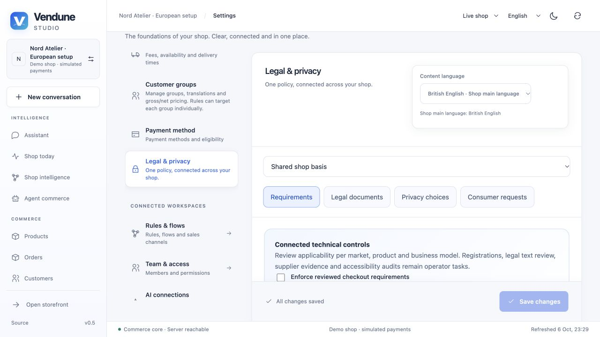
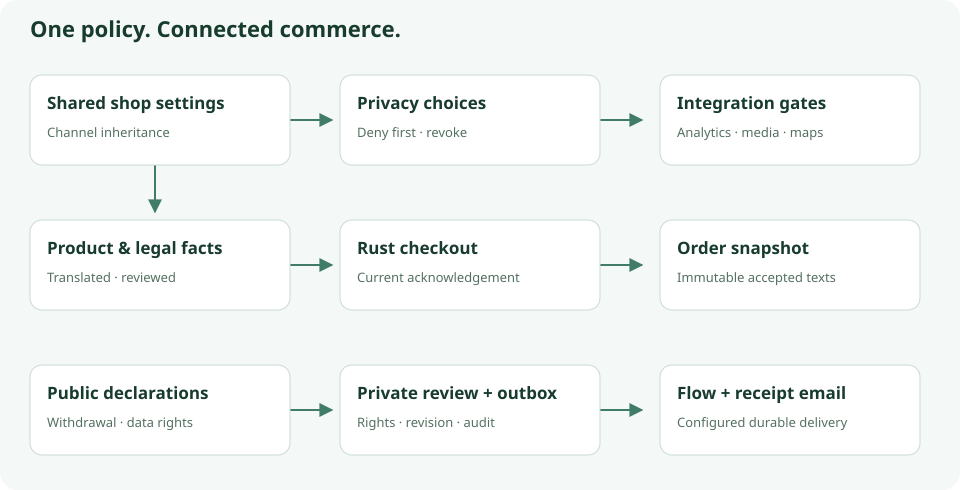
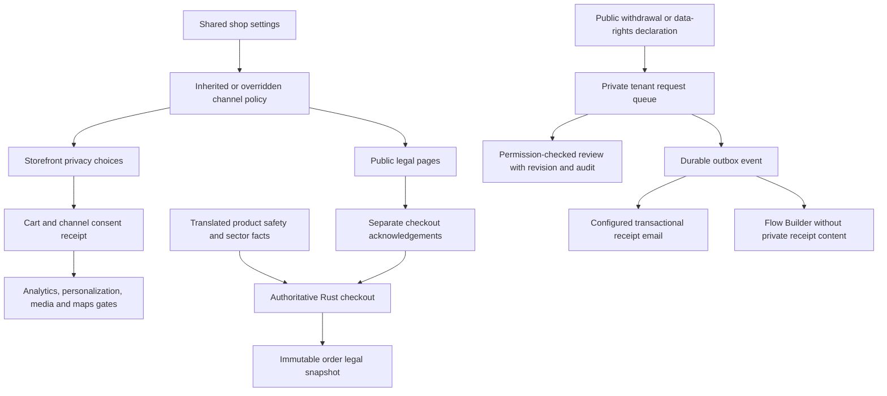

# European commerce: privacy, consumer rights and sector information

Vendune connects legal configuration to the actual storefront, checkout, product
facts, HTTP/MCP operations, outbox and transactional email. This is an operational
toolkit, **not a legal certificate**. Applicability depends on destination, trader,
customer type, product and national implementation. Sources below were checked
on 6 October 2026. Have the applicable texts and classifications reviewed before
opening real sales.

## Configure one shop, inherit into its sales channels

Open **Studio → Settings → Legal & privacy**. Four tabs cover requirements,
documents, consent and consumer requests. Select the shared shop configuration or
a sales channel. A channel inherits the shared `legal` area until explicitly
overridden; restoring inheritance removes that area's override. This is the same
revision/history system used by tax, shipping and payment configuration.
Independent SaaS merchants remain separate tenants.

1. Set company/imprint identity in **Settings → Company details**. Existing
   structured address, legal form, representatives, register court/number,
   responsible editor and logo support channel overrides. `#legal` renders the
   explicit public projection; private bank/domestic-tax fields stay private.
2. Select the shop's sectors. The requirements catalog shows 19 topics, their
   relevance, current technical support, remaining work and official sources.
   Operator review notes are private, not storefront content or consent inputs.
3. Supply reviewed privacy, terms, withdrawal, shipping, accessibility and dispute
   information in the **Documents** tab. Use one content-language selector and
   per-field main-language inheritance, rather than parallel language inputs.
4. Configure optional purposes and disclose each provider, purpose, description,
   retention statement and HTTPS privacy URL. Disabling a purpose prevents a
   visitor from enabling it. Providers are not automatically disclosed merely
   because their app is installed: review the active service inventory.
5. Fill product facts under **Products → product → Legal & safety**: manufacturer,
   contact/identifier, non-EU responsible person, warnings and relevant sector data.
6. Enable **strict checkout** after configuration is ready. It defaults to **off**
   for existing prototypes/demo shops; do not mistake a working demo checkout for
   legal readiness. Optional tracking consent is enforced independently, even
   when strict checkout is off.
7. Install/update Email Delivery **1.1.0**, connect SMTP/Resend/SendGrid, enable
   delivery and consumer-request notifications, and leave dry-run only when ready
   for real messages. Existing installed 1.0.0 manifests need an explicit app
   update to subscribe to the new consumer events. Configure the service mapping
   and encrypted credentials as described in [email delivery](email-delivery.md).

A missing translation inherits the main language technically. That does **not**
establish that the inherited language satisfies each target market's mandatory
information requirements. Explicit empty values remain empty.

## How the pieces connect

## Consent: denial first, explicit choice, real revocation

The storefront starts with every optional purpose denied. Reject and accept are
equally prominent; no checkbox is preselected. Visitors can choose individually
and reopen **Privacy choices** from the footer. Necessary cart/authentication
operations continue without optional consent.

The server records choices, policy fingerprint, receipt time and expiry per
**tenant + cart + sales channel**, plus an append-only choice log. Changing public
legal configuration invalidates older receipts. Repeating identical choices does
not extend expiry. `consentDays` (1–365; default 180) is a configurable validity
period, **not** a universally prescribed legal interval or an automatic database
retention policy.

- Analytics uses the shared current receipt; the SDK loads after analytics consent.
  Revocation disables GA and removes its SDK script and GA cookies. Existing legacy
  local-storage grants cannot authorize the native storefront.
- Personalization and experiment exposure require fresh affirmative consent in
  the server transaction. Withdrawal removes that cart/session's behavior signals
  and experiment exposure. The displayed ranking returns to static discovery.
- Remote video is mounted only with external-media consent; necessary local
  product media can still render. Google Places additionally requires map consent
  and a configured integration, while manual address entry remains available.
- The registry expires permissions at the receipt deadline. Focus and periodic
  server revalidation detect changed/revoked policy. Server checks are decisive
  for behavior collection; browser refresh is not a global instant invalidation
  channel for a third-party analytics network.

The built-in boundaries cannot sandbox arbitrary third-party app JavaScript or
undo information already sent to a provider. App authors and private Storyfront
frontends must integrate the same consent contract. Retention/export/erasure
across all historical tables, backups, email processors and providers still needs
an operator policy and workflow; the new choice log is not automatically purged.

## Strict checkout and durable documents

The Rust checkout locks effective settings and acknowledgement before order
commit. Strict mode requires current acknowledgement and nonempty effective
privacy, terms and shipping documents; consumer carts additionally require
withdrawal information. Selected product facts are required according to the
configured technical sector checks. Missing/stale acknowledgements or facts fail
even if a custom client bypasses the visual form.

Consumer digital products require a **separate**, initially unchecked acknowledgement
of immediate supply and loss of the withdrawal right. Business-group carts are
not asked for that consumer waiver. The current download path only offers
immediate delivery, not a deferred-delivery alternative. Providing a checkbox
alone does not establish that every legal condition for loss of the right is met.

The final button explicitly says **Order with obligation to pay**, with localized
labels. The order stores document maps, fingerprint, channel and accepted values/
time as an immutable snapshot, exposed only through owned customer orders or
merchant permissions. Later text changes never rewrite that purchase.

## Online withdrawal and data-rights requests

The [online withdrawal function introduced by Directive 2023/2673](https://eur-lex.europa.eu/eli/dir/2023/2673/oj/eng)
applies from 19 June 2026 through national implementation. The storefront footer
provides a public withdrawal entry point and a separate data-rights form. A visitor
can enter name, contract reference and email, review the declaration, then confirm
submission without logging into a customer account. The receipt includes date/time
and can be downloaded as text. A configured email app sends the receipt through
its durable queue; missing credentials/dry-run means **no delivered email**.

Requests support withdrawal, access, erasure, correction, portability and objection.
They do not grant access to orders by guessing a reference. Cart-held receipt
access is tenant/channel scoped. Merchant listing needs `customers.read`; review
needs `customers.write`, an exact revision and an audit note. Private reviewer
identity and notes are excluded from public receipts and generic Flow Builder
jobs. Review records are durable; the current list shows the latest review note.
A request does not automatically verify identity, refund money, cancel an order,
erase records or adjudicate the deadline/exceptions. Connect reviewed action steps
through the existing order/payment/flow system.

## Requirements catalog and actual implementation boundary

| Topic | Connected capability | Remaining operator/module work | Primary source |
| --- | --- | --- | --- |
| GDPR | Provider disclosures, consent records, protected rights intake | Lawful bases, processor contracts, transfer safeguards, retention, identity verification and execution of rights | [GDPR](https://eur-lex.europa.eu/eli/reg/2016/679/oj) |
| Cookies/device storage | Equal affirmative choices, withdrawal, actual built-in gates | Audit all deployed tags/apps/storage; country-specific implementation | [EDPB cookie banner taskforce](https://www.edpb.europa.eu/system/files/2023-01/edpb_20230118_report_cookie_banner_taskforce_en.pdf) |
| Consumer contracts | Legal documents, explicit pay button, snapshots | Reviewed information, cancellation exceptions, national requirements | [Distance selling](https://europa.eu/youreurope/business/selling-in-eu/selling-goods-services/ecommerce-distance-selling/index_en.htm) |
| Online withdrawal | Public two-step declaration, timed receipt, optional durable email, private review/flows | National transposition, persistent availability during the period, exceptions and real processing | [Directive 2023/2673, Article 11a](https://eur-lex.europa.eu/eli/dir/2023/2673/oj/eng) |
| Price reductions | Existing `regulation_price`/reference-price display | Automatic verifiable 30-day lowest-price history is **not implemented** | [Price transparency](https://europa.eu/youreurope/citizens/consumers/unfair-treatment/unfair-pricing/index_en.htm) |
| Reviews | Existing product reviews and disclosure document space | Explain verification, avoid fabricated claims/reviews | [Unfair commercial practices](https://europa.eu/youreurope/citizens/consumers/unfair-treatment/unfair-commercial-practices/index_en.htm) |
| Accessibility | Accessibility document, keyboard/native dialog and mobile tests | Full EAA/national audit, assistive technology testing, applicability/exemptions | [Accessibility requirements](https://europa.eu/youreurope/business/selling-in-eu/selling-goods-services/accessibility/index_en.htm) |
| General product safety | Manufacturer/responsible-person/contact/identifier/warning fields on product page; strict presence checks | GPSR applicability, market language, traceability, recalls and sector-specific exceptions | [GPSR Article 19](https://eur-lex.europa.eu/eli/reg/2023/988/oj/eng) |
| Textiles | Translated fibre-composition field and technical presence check | Actual composition/label and target-market requirements | [Regulation 1007/2011](https://eur-lex.europa.eu/eli/reg/2011/1007/oj) |
| Food | Ingredients, allergens, nutrition, net quantity, operator/origin | Exemptions, mandatory details, labeling, fulfillment conditions; a nonempty string is not validation of food law | [Regulation 1169/2011](https://eur-lex.europa.eu/eli/reg/2011/1169/oj) |
| Cosmetics | Ingredients and instructions | Responsible person, safety assessment, notifications, labels and claims | [Regulation 1223/2009](https://eur-lex.europa.eu/eli/reg/2009/1223/oj) |
| Electronics | Instructions, energy label/sheet URLs and registration fields | Applicable CE/Ecodesign/energy/WEEE/battery rules and registrations | [CE marking](https://europa.eu/youreurope/business/product-rules-compliance/general-product-compliance/ce-marking/index_en.htm) |
| Age-restricted goods | Review profile and translated procedure description | Actual age-verification and delivery enforcement **not implemented** | [Tobacco directive](https://eur-lex.europa.eu/eli/dir/2014/40/oj) |
| Digital content | Compatibility facts, separate immediate-supply acknowledgement, existing entitled downloads | Contract conformity/update obligations and optional deferred delivery | [Directive 2019/770](https://eur-lex.europa.eu/eli/dir/2019/770/oj) |
| Subscriptions | Requirement profile and documents | Recurring billing and dedicated German cancellation-button workflow **not implemented** | [BGB §312k](https://www.gesetze-im-internet.de/bgb/__312k.html) |
| Regulated goods | Explicit sector review profile | Licenses, jurisdiction-specific restrictions and professional approval | [EU product compliance](https://europa.eu/youreurope/business/product-rules-compliance/index_en.htm) |
| Packaging/EPR | Requirement profile and registration information fields | Destination registrations, reporting and phased packaging requirements | [European Commission packaging rules](https://environment.ec.europa.eu/topics/waste-and-recycling/packaging-waste_en) |
| AI transparency | Product-assistant AI disclosure, provider review | Role-specific AI Act duties, notices, evaluation and deployed-model/data policy | [EU AI regulatory framework](https://digital-strategy.ec.europa.eu/en/policies/regulatory-framework-ai) |
| Disputes | Localized dispute information document | National ADR duties; do not add the discontinued EU ODR link | [Commission ODR closure](https://consumer-redress.ec.europa.eu/site-relocation_en) |

The technical presence checks deliberately do not interpret certificates, decide
statutory exemptions or infer legal compliance from an AI response. The catalog is
versioned product guidance; maintain it when laws or the actual implementation change.

## APIs, MCP and extension integration

All storefront requests use the actual cart token (`sw-context-token`) and tenant/
channel context; no merchant secret belongs in a frontend. The public policy
omits private review notes. Generic declaration references never confer ownership.

| Operation | HTTP | MCP |
| --- | --- | --- |
| Effective policy | `GET /store-api/legal` | `privacy.policy` |
| Read/store choices | `GET/PUT /store-api/privacy/consent` | `privacy.consent` writes |
| Store checkout acknowledgement | `PUT /store-api/legal/acceptance` | `legal.accept` |
| Submit declaration | `POST /store-api/legal/requests` | `legal.request` |
| Owned receipt | `GET /store-api/legal/requests/{id}` | HTTP |
| Private list/review | `GET /api/merchant/legal/requests`, `PUT /api/merchant/legal/requests/{id}` | `merchant.legal.requests`, `merchant.legal.review` |

Read the policy, display its purposes/provider disclosures, and submit
`{policyVersion, choices}` only after the visitor acts. A stale policy returns
409; fetch and review again. Consent is not a flag supplied by the agent. Custom
frontends using the analytics SDK must choose `managedConsent: true`, start with
`setConsent(false)`, and unlock from a current server receipt; its unmanaged legacy
mode is retained for compatibility and is **not** the recommended EU integration.
Persist checkout acknowledgement immediately before submitting the reviewed order.

App events include `privacy.consent_changed`, six `consumer.*.requested` events
and `consumer.request.reviewed`. Generic flow context excludes the private receipt.
The explicitly subscribed email app receives only the declaration information it
needs for a transactional acknowledgement. Operators should review app permissions,
processor contracts and notification targets before sharing private consumer data.

## Implementation map and verification

- `src/legal/`: bounded settings, policy fingerprints, transactional consent,
  checkout guard/snapshot, product facts, private request review and MCP adapters.
- `migrations/048-legal-privacy.sql`: composite tenant/cart/channel ownership,
  five RLS-protected tables, consent log and review audit.
- `frontend/src/admin/legal/`, `shared/legal/`, `storefront/legal/`: inherited
  settings, requirement catalog, single-language editors, actual integration gates
  and public forms. Product safety shares these data, not another legal database.
- `extensions/services/connectors/email_*`: existing encrypted service settings,
  bounded localized receipt template and durable SMTP/HTTP delivery queue.
- `scripts/legal_privacy.py`: real PostgreSQL/HTTP negative and positive cases,
  foreign-tenant/session denial, current/stale policy, digital consent, immutable
  order documents, idempotent receipts, private notes and actual completed flow.
- Frontend tests cover equal/no-preselected choices, legacy-grant rejection,
  expiry, withdrawal, failed saves, remote video and separate digital approval.
- Two extracted production decisions have exact Lean properties and negative
  mutations: `consent_admissible`, `legal_checkout_admissible`. SQL/browser/email,
  factual correctness and legal sufficiency remain outside those proofs.

Run the registered `legal_privacy`, `tenant_isolation`, `email_tests` and affected
checkout/account/automation suites; normal CI runs the complete registry.
