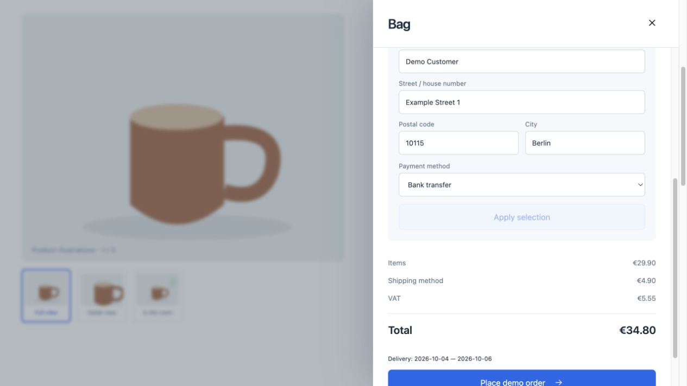
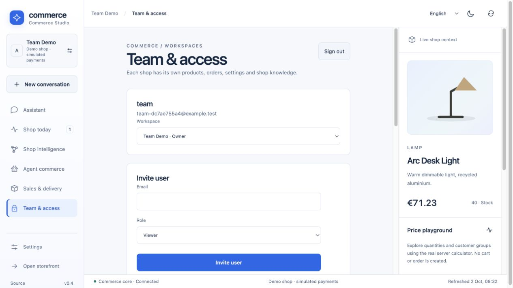
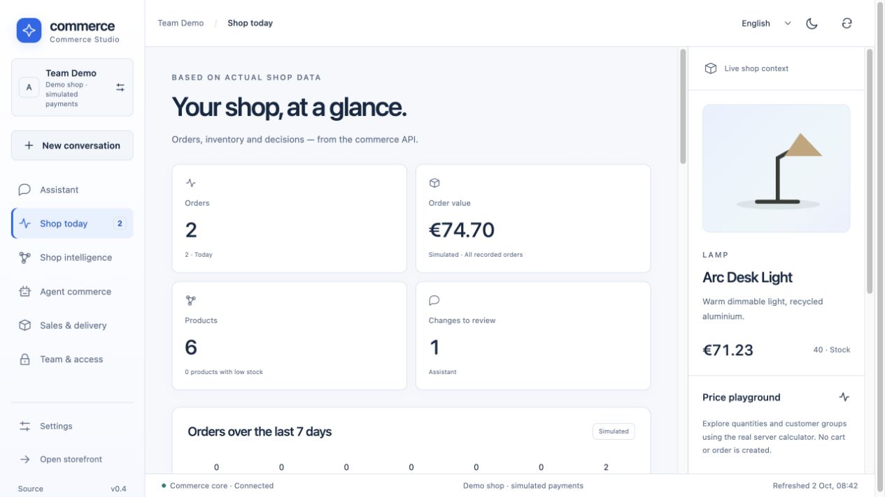
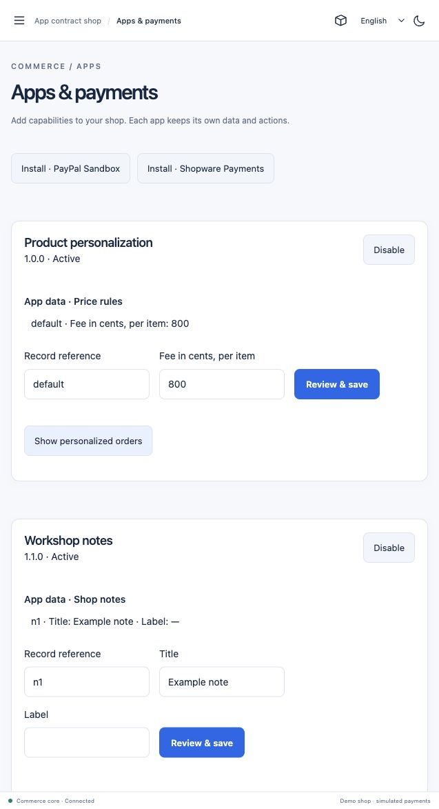
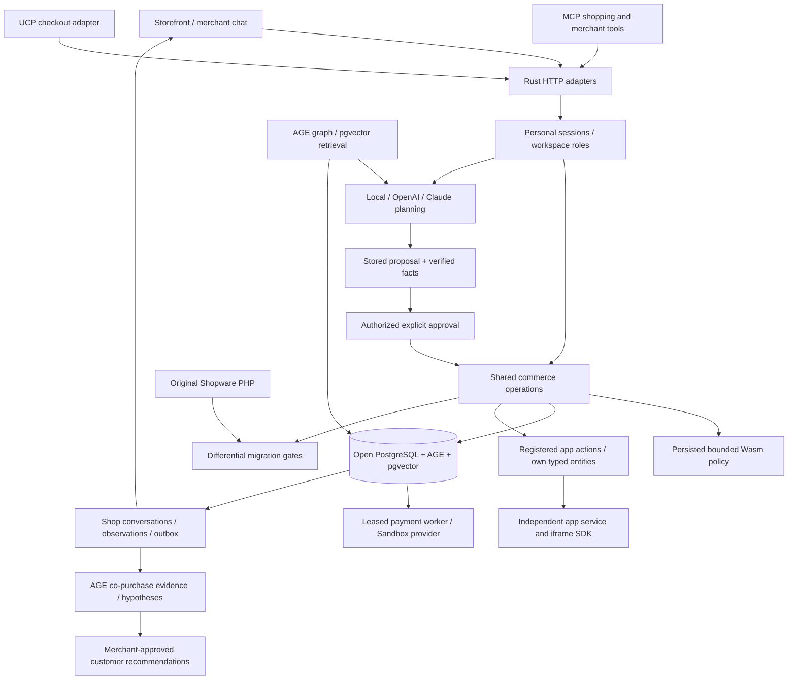

# Commerce features, architecture and verification

[Project overview](../README.md) · [Quickstart](quickstart.md) · [Prototype scope](shopware-parity.md)

## Product details and connected checkout

The storefront is a complete native flow through this bounded commerce slice:

- **SKU variants:** six product families and 11 actual purchasable SKUs. Option
  combinations select their own stock, prices and gallery; nonexistent
  combinations are disabled and sold-out variants cannot be purchased.
- **Multiple images and properties:** three authored SVG illustrations per SKU,
  image switching, material/care/capacity details and localized product text.
- **Reviews:** customer submission starts pending; an authorized merchant can
  publish/hide it. The public aggregate uses only published reviews. Verified
  purchase comes from an actual completed customer cart/account, not a client claim.
- **Quantity prices:** public and authenticated B2B tiers, minimum quantities,
  purchase steps and maximums. Product detail and cart consume the same Rust calculator.
- **Country tax and shipping:** editable standard/reduced country rates,
  eligible delivery methods, shipping fees, free-shipping thresholds,
  highest/proportional tax allocation, address and calendar date ranges.
- **Payments and deliveries:** simulated card authorization, manual bank
  transfer, B2B invoice eligibility, persisted method snapshots and internal
  paid/shipped/delivered transitions with tracking and optimistic revisions.

Changing tax/shipping configuration affects new quotes; completed order prices
remain immutable. Disabling a selected method retains cart items and requires
an explicit valid replacement. Checkout locks the selected SKU inventory and
persists one order for concurrent idempotent retries.



Tax rates, fulfillment statuses and dates are prototype configuration. There
is no live-money PSP, carrier label, legal invoice, complete tax jurisdiction engine,
returns pipeline or original Shopware delivery processor.

## Multi-user merchant workspaces

One personal identity can belong to several independent shops with different
roles. Membership and session validity are checked from PostgreSQL on every
request; a revoked access or changed role applies to subsequent requests,
including requests on another app instance. Client-provided tenant headers
select a workspace; they cannot grant membership.

| Role | Available actions |
|---|---|
| Owner | Read/plan/catalog changes, settings, fulfillment, extensions and team; appoint owners |
| Administrator | Shop operations and team; cannot grant/change ownership |
| Editor | Read, plan and explicitly approve catalog/experience changes |
| Reader | Read and plan; no execution or operational/settings/team changes |

Invitations expire after 24 hours and can be redeemed once. Existing users
must authenticate their own account when joining another shop. The final
active owner cannot be removed. Invitation codes are returned for manual
sharing; automatic invitation dispatch is not implemented. The separate
[Email Delivery app](email-delivery.md) can send merchant-authorized transactional mail. Roles also protect MCP direct
invocation, not just interface controls.



This is a working application boundary with real isolation tests, not proof
of a production SaaS deployment. SSO/MFA/recovery, quotas, verified email,
billing, tenant lifecycle, core-wide RLS, physical separation and failover remain open.

## Commerce Studio · v0.5

The light workspace uses Shopware-inspired blue accents and a large assistant.
An optional slate-blue theme remains available. Seven integrated views provide:

| View | Actual shop operation |
|---|---|
| Assistant | Persistent conversations, grounded proposals and explicit approval |
| Shop today | API-backed orders, inventory, proposals and real recorded activity |
| Shop intelligence | AGE product/need graph, complementary products, semantic retrieval and observed learning counts |
| Agent commerce | Customer journey, actual adapter call counters and separate ChatGPT/Claude connection status |
| Sales & delivery | Tax/shipping/payment settings, review moderation and order fulfillment records |
| Team & access | Personal sign-in, workspace creation, invitations, roles and shop switching |
| Apps | Versioned app installation, own data/forms, external UI panels and payment ledger |



The interactive preview uses the real server calculator; it creates no order
or stock change. Numbers/dates, product text and model replies follow the
selected language. Existing messages retain their original language. The API
also demonstrates Swiss German → German → system-language fallback.

## Intelligence and optional OpenAI/Claude

The model receives current catalog state, bounded conversation history, AGE
relationships, real retrieval results and verified order/policy/channel facts.
It returns an allowlisted typed proposal. The server attaches authoritative
revisions, stores its evidence and requires an authorized merchant's explicit
approval before execution. Model text cannot grant authority or run SQL/code.

| Provider | Native transport | Server configuration |
|---|---|---|
| Local open weights | Ollama structured JSON | `OLLAMA_MODEL` / `OLLAMA_URL` |
| OpenAI | Responses API + strict JSON schema | `OPENAI_API_KEY` / `OPENAI_MODEL` |
| Claude | Anthropic Messages + structured output | `ANTHROPIC_API_KEY` / `ANTHROPIC_MODEL` |

Cloud selection sends bounded shop/conversation context to that provider.
Keys stay on the server. Missing credentials, incomplete responses and provider
failures return explicit errors; no silent provider substitution occurs.

The local MCP stdio bridge works with Claude Desktop and other compatible
clients. Knowledge tools and merchant actions require scoped merchant authority;
public product/cart tools stay available to shopping clients. Selected MCP and
UCP checkout adapters share the actual commerce operations. Hosted ChatGPT/
Claude connections need a secure remote endpoint and account-side setup; no
external account or production OAuth connection has been created. See
[connection instructions and boundaries](connectors.md).

The adaptive storefront uses stable components, session affinity and a persisted
small epsilon-greedy discovery/comparison policy with observed views and
**simulated-order** rewards. These are contextual/policy memories. They are not
online LLM weight training or evidence of causal sales uplift.

## Fully open graph/vector/transactional storage

PostgreSQL 17 + Apache AGE + pgvector are built from source in
[database/Dockerfile](../database/Dockerfile):

- Real Cypher product/need/complement relationships with tenant and provenance.
- Persisted vectors joined to live authoritative prices/inventory.
- Atomic stock/order/idempotency/outbox transactions.
- Durable users, memberships, conversations, proposals and experience counters.

Licenses are PostgreSQL License / Apache 2.0 / PostgreSQL License. No commercial
database edition, BSL/SSPL service or paid database account is required.
[Attribution](../THIRD_PARTY.md) records source versions and licenses. The graph
adds semantic structure to a transactional ledger; relational storage remains
part of the architecture.

AGE is source-commit pinned and pgvector is pinned to v0.8.6. Migrations are
additive and retain the existing prototype volume; do not delete that volume
when updating. Existing orders/prices/stock are preserved. The graph's template
relationships are curated demo facts. Vector ranking is exact on the small
catalog; million-product capacity, ANN recall, distributed graph sharding and
production multi-tenant performance are **unmeasured**.

## Evidence-driven shop intelligence and full app examples

Orders now project into **durable, evidence-linked co-purchase relationships** in
AGE. Shop intelligence shows what was observed, simulation provenance and ideas
for review. A merchant-approved association is consumed on the product page and
in customer advice. This changes operational memory; model weights remain fixed
and observed correlation does not prove sales uplift.

Apps now define **versioned typed entities, relationships, HTTP/MCP actions,
product slots and admin panels**. The engraving app connects a customer product
configuration to the real taxed cart, order and merchant view. The assistant can
propose a registered app-data change and execute it after explicit approval.
An external workshop app runs its own service, iframe UI and SQLite event inbox.
Managed app tables have forced tenant RLS; core tables retain application filters.

The first payment adapter is **native PayPal Sandbox Orders v2** with persistent
attempts, reserved stock, idempotent capture/refund, verified webhooks and leased
workers. It is not Shopware Payments. That example reports a missing official
standalone connector contract and is deliberately unavailable at checkout.
Configure server-only accounts before trying a real Sandbox handoff.

Long model calls no longer hold database transactions/connections. Bounded
context, conversation leases and independent payment/app workers address concrete
contention. Whole-catalog operations remain elsewhere; no Shopware speedup or
million-product capacity is claimed.

[Implementation and limits](intelligence-apps-payments.md) ·
[App manifests, SDK and runnable examples](../extensions/README.md)



## Executable extensions

Four real pure-Wasm policies use the current B2B purchase approval ABI:

| Example | Actual policy |
|---|---|
| `company-limit.wat` | Respect the supplied company purchase limit |
| `budget-reserve.wat` | Preserve EUR 100 of the supplied budget |
| `minimum-order.wat` | Require EUR 50 minimum, respecting the budget |
| `single-order-cap.wat` | Limit an individual order to EUR 250, within the budget |

An owner/administrator activates WAT through `/api/extensions/activate`.
Wasmtime compiles and probes it before activation. Checkout uses a fresh Store,
10,000 fuel units, 1 MiB memory and a 256 KiB stack, with no host imports/WASI,
network or filesystem. Persisted policy changes refresh stale compiled modules
on another app instance before execution. Traps roll back the purchase.

These are alternative policies on one typed **B2B** hook; they do not run for
B2C or grant new host capabilities. There is no automatic PHP-to-Rust compiler
or arbitrary Shopware plugin support. See
[examples, ABI, activation and tests](../extensions/README.md).

## Verify

With the local app running:

```sh
set -a; source .env; set +a
cargo fmt --check
cargo clippy --locked --all-targets -- -D warnings
cargo test --locked
python3 scripts/structure.py
python3 scripts/studio.py
python3 scripts/integration.py
python3 scripts/protocols.py
python3 scripts/intelligence.py
python3 scripts/commerce.py
python3 scripts/users.py
TEST_PERSONAL=1 python3 scripts/providers.py
python3 scripts/extensions.py
python3 scripts/apps.py
python3 scripts/payments.py
python3 scripts/services.py
# After apps.py has created its isolated test workspace:
TEST_MODEL=1 python3 scripts/app_inference.py
TEST_EMBEDDING=1 TEST_MODEL=1 python3 scripts/intelligence.py
TEST_MODEL=1 python3 scripts/studio.py
```

These checks create synthetic accounts, carts, orders, reviews, conversations
and approved price changes. Extension tests submit simulated B2B orders on a
second app instance and restore the previous policy. Configuration tests restore
the prior settings. Default verification uses local payment contract fixtures; no live PayPal Sandbox traffic is claimed. Cloud adapters are tested
with local wire-contract servers; live OpenAI/Claude quality is **unverified**.
Real local model/embedding checks are separate and opt-in.

Independent original Shopware reference:

```sh
composer install --working-dir=reference --no-interaction
cargo build --locked --bins
python3 scripts/differential.py
python3 scripts/context_differential.py
python3 scripts/delivery_differential.py
```

The runners instantiate original Shopware 6.7.14.2 PHP classes: **2,144 pricing**,
**1,446 context/rule/quantity** and **1,002 proportional-tax** cases. These are
4,592 bounded comparisons, not full-Core proof. No rewritten PHP calculator or
selector is used as the oracle. `scripts/restart.py snapshot` / `verify` checks
persisted commerce, personal sessions/workspaces, graph/vector and chat state
across an external application/database restart.

CI runs build/type/format/lint checks, Rust tests, original-PHP comparisons and
real database suites. No 100% line/branch coverage claim is made.
[Source/test map](source-map.md) documents coverage and remaining checks.
Historical small-catalog v0.1 load measurements are not v0.5 capacity claims.

## Architecture and migration



`main.rs` contains process startup and the module registry. Auth, pricing,
products, carts, checkout, reviews, delivery, proposals, protocol adapters and
storage operations live in small documented modules. Frontend product/cart
views, Studio views, dialogs and locale dictionaries are also separated.
The Rust size guard prevents reintroducing a giant entry point.

[porting/units.json](../porting/units.json) identifies original units, verified scope,
implementation files, executable gates and remaining behavior. `scripts/port.py`
selects these gates for subsequent incremental ports. It automates verification;
it does not automatically produce a correct full-core translation.

The precise [Shopware feature matrix](shopware-parity.md) distinguishes
original behavioral ports, working native feature equivalents for the prototype
and missing functionality. Full collectors/processors/rule engine, DAL/CMS,
promotions, original variant inheritance, exact Admin/Store API schemas, live-money
payments/fulfillment, commercial B2B modules and PHP plugins remain missing.

[Migration workflow](migration.md) · [Architecture decisions](architecture.md) ·
[Security and SaaS limits](security.md) · [Model connections](connectors.md)

## Platform operator administration

Separate personal platform grants, audited empty/sample shop creation, bounded
shop directory, global and per-shop statistics, staging exclusion, four-language
UI, immediate revocation and production-mode bootstrap are implemented.
`platform.py` and `platform_setup.py` exercise actual PostgreSQL/HTTP behavior.
[Exact metrics and limits](platform.md), [deployment status](deployment.md).
No public host, custom-domain provisioning, billing or failover is claimed.

Full apps now add own admin modules, storefront pages/panels, namespaced API routes, selected AI context and independent storage. See [app-platform.md](app-platform.md) for connected examples and tested boundaries.

## Transactional email service (new app implementation)

SMTP with verified STARTTLS/implicit TLS, Resend and SendGrid (global/EU), encrypted
per-shop configuration, text/HTML and CC/BCC, four-language order confirmations,
API/MCP actions, order-event subscriptions and graphical app flows are implemented.
[Source map, setup and exact tested boundaries](email-delivery.md). This is a new
service abstraction, not full Shopware mail-template/message-queue parity. Attachments,
provider delivery/bounce webhooks, per-customer/channel sender/language policy and
automatic invitation emails remain missing.
