# Vendune feature guide

[Documentation home](documentation-site.md) · [Get started](quickstart.md) · [Exact Shopware scope](shopware-parity.md) · [Source map](source-map.md)

**Reviewed on 6 October 2026 against `main` at `5e4f8b5`.** This guide follows the current storefront, all 15 Studio workspaces and the separate platform console. It includes the fashion catalog, central AI configuration, shop lifecycle and the new trusted experience integration.

Screenshots and GIFs show the real application with synthetic accounts and orders. GIFs demonstrate interaction; pauses are shortened and their timing is not a performance measurement. Commerce examples use simulated payments. Provider configuration is shown separately from a successful live provider transaction. [Capture provenance and recording inventory](assets/feature-tour/README.md).

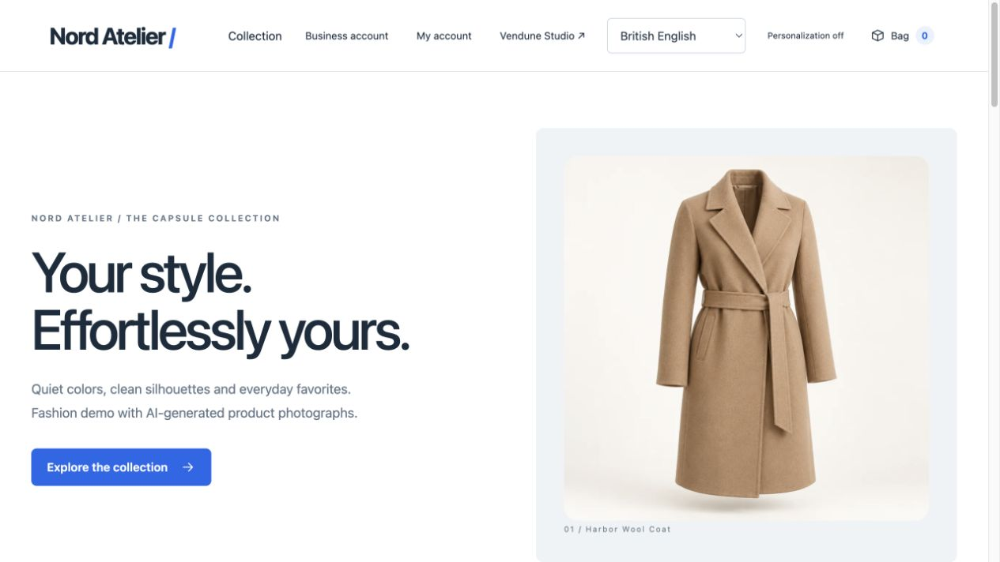

## Find your feature

| Area | What is included | Start here |
| --- | --- | --- |
| Shopping | Fashion catalog, categories, variants, media, prices, reviews, customer accounts and checkout | [Storefront](#storefront-and-shopping) |
| Catalog | Unified editor tabs, rich descriptions, translations, variants, galleries, categories, downloads and history | [Products](#products-and-categories) |
| Operations | CRM, addresses, customer groups, order workflows, delivery, payments and immutable PDFs | [Customers and orders](#customers-orders-and-documents) |
| Intelligence | Reviewed proposals, private/published knowledge, retrieval, recommendations, translations and image drafts | [Intelligence](#assistant-and-shop-intelligence) |
| Processes | Saved rules, coupons, campaigns, graphical branches, durable delays and app actions | [Rules and flows](#rules-campaigns-and-flow-builder) |
| Experiences | Sales channels, inherited settings, Storyfront checkout transfer and hosted private frontends | [Channels](#sales-channels-and-connected-experiences) |
| Extensions | Eight bundled apps, visual App Studio, typed data, SDK surfaces, services, webhooks, schedules and Wasm | [Apps](#apps-and-app-studio) |
| Control | Team rights, scoped API keys, private stages, selected releases, shop administration and diagnostics | [Workspace](#workspace-access-and-releases) · [Platform](#vendune-platform) |
| European operation | Consent gates, channel legal documents, sector facts, guarded checkout and durable consumer requests | [European operation](european-operation.md) |
| Foundation | Shared HTTP/MCP/UCP operations, transactional storage, independent workers and bounded verification | [Core](#shared-apis-storage-and-verification) |

## Storefront and shopping

### Nord Atelier: the current demo catalog

New demo shops use **Nord Atelier**, a fictional capsule collection with **12 parent products, 34 purchasable SKUs, seven categories and 136 product translations**. Clothing has S/M/L sizes, sneakers have EU 38–42, and accessories use one-size options. English, German, Spanish and French names and descriptions are supplied. Twelve generated WebP product photographs are shipped with the repository; no image-provider call is needed to browse them.

The collection includes a coat, knit, shirt, trousers, dress, blazer, T-shirt, jeans, skirt, sneakers, leather tote and scarf. Categories and product search use the actual catalog. Larger lists use bounded pages rather than downloading every product. Existing shop edits survive reseeding. The earlier furniture catalog remains an explicitly selected compatibility fixture; its mug/lamp screenshots are historical examples. [Catalog contents and seeding rules](fashion-demo.md).

### Product detail, variants and quantity

A product page combines its gallery, localized description, manufacturer/properties, variant choices, current SKU, stock, price, delivery information, reviews and product questions. Selecting a size resolves a real purchasable product with its own inventory; missing combinations and unavailable stock cannot become valid purchases through a browser choice. Merchant-configured galleries can contain multiple images; the default fashion fixture supplies one photograph per product.

Quantity minimums, steps, maximums and customer-group tiers feed the same server calculator used by the cart. Configured list/regulation/reference prices and eligible discounts are product pricing features, rather than a second browser calculator. Consumers and authenticated business customers can receive different configured prices and tax display. Channel, country and customer context affect availability.

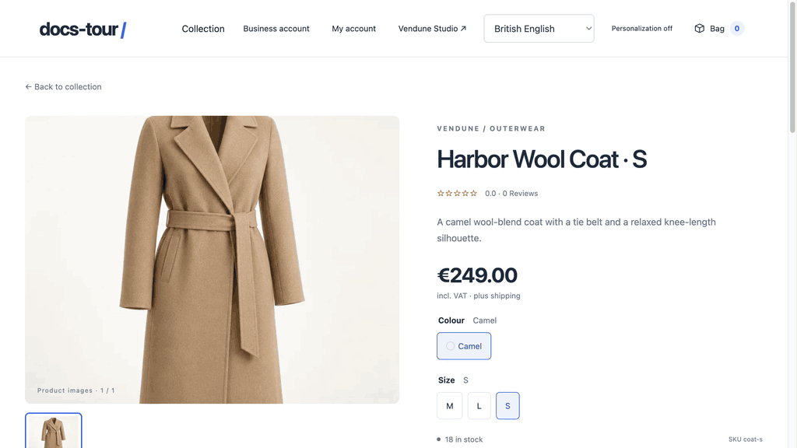

*GIF: switch from M to L, inspect stock and add the selected SKU to the real cart. The cart opens with that exact variant.*

### Reviews, recommendations and product questions

Submitted reviews start pending. Studio exposes publication/hiding controls; public ratings count only published reviews. A verified-purchase flag is derived from an actual completed customer purchase, not a shopper-supplied checkbox. Cross-selling uses configured same-shop products. Merchant-approved co-purchase associations can supply recommendations without exposing private customer identities.

**Ask Vendune** and product questions use eligible catalog facts and explicitly published sources when a model is configured. Missing facts and provider failures remain visible. These controls do not imply a model is included in every installation, and the source-retrieval test below can be used without inference. Personalization has a shopper toggle; its bounded session affinity and persisted discovery/comparison policy change retrieval/layout selection, not model weights or proven sales uplift. [Intelligence contracts](intelligence-apps-payments.md).

### One-page checkout

The bag opens one checkout containing guest/sign-in/account entry, contact, separate billing/delivery addresses, optional company details, shipping choices, payment choices, coupon entry and the order summary. Product images, quantities, discounts, shipping, tax and total come from the server quote. Changing address or methods invalidates a previous review; input drafts remain available.

**Review order** confirms the authoritative quote. **Place order** is a separate explicit action bound to its revision and amount. Concurrent retries use a stable idempotency key and return the original order; they cannot quietly charge a changed total. Checkout locks the selected inventory and stores immutable product, customer, address and method snapshots.

*GIF: choose Standard delivery, review the quote, then place the simulated order. Shipping can be free under the configured threshold rules. No real money is charged.*

Demo payment simulates authorization; bank transfer/invoice use manual states and their configured eligibility. The native **PayPal Orders v2** adapter supports configured Sandbox/Live accounts, provider approval, durable capture/refund attempts and webhook verification. A verified approval queues capture automatically; a browser return alone is not proof of payment. Pending/uncertain outcomes require reconciliation, not a repeated purchase. The private Shopware Payments connector is still a separate requirement. [Checkout behavior and payment boundaries](checkout.md).

### Customer accounts and downloads

Customer identities are separate from Studio users. Accounts support registration/sign-in, personal/contact fields, preferred payment method, an address book with independent billing/delivery defaults, password change, logout and own order history. A typed guest email does not authenticate an existing account or grant access to its previous orders.

Paid digital files become available through purchase entitlements. Orders pin immutable asset IDs; replacing or withdrawing a public file does not silently replace the purchased bytes. Full refunds revoke relevant access; partial refunds retain it. All-digital carts omit physical shipping; mixed carts calculate it for physical items. Recovery, verified email/email changes and complete account export/erasure remain additional work. [Customer and download contracts](merchant-operations.md).

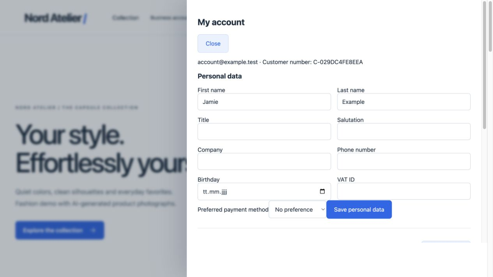

## Vendune Studio

The sidebar groups **15 workspaces**. The shell provides a shop switcher, live/private-stage selector, English/German/French/Spanish interface language, theme toggle, refresh, conversation entry and storefront access. Content editors use the shop's enabled content languages, which can extend beyond the four interface languages.

| Group | Workspace | Purpose |
| --- | --- | --- |
| Intelligence | Assistant | Persistent conversations and reviewed changes |
| Intelligence | Shop today | Actual orders, value, inventory, activity and review counts |
| Intelligence | Shop intelligence | Sources, connections, observations and decisions |
| Intelligence | Agent commerce | Public shopping journey, adapters and connection boundaries |
| Commerce | Products | Product list, eleven editor tabs and category tree |
| Commerce | Orders | Workflow, payment, fulfillment, documents and notes |
| Commerce | Customers | Profiles, address books, groups and linked orders |
| Experiences | Storyfronts | Configured catalog publication and checkout integration |
| Experiences | Sales channels | Main/additional storefront and headless channels |
| Experiences | Rules & flows | Conditions, campaigns and event processes |
| Experiences | Apps | Discover, install, inspect and manage packages |
| Workspace | Developers | App Studio and API/MCP explorer |
| Workspace | Staging & releases | Private tests and selected publication |
| Workspace | Team & access | Members, shops, sessions and integration keys |
| Workspace | Settings | Company, taxes, countries, languages, methods and AI connections |

### Shop today and the price playground

The dashboard reads actual commerce data: recorded orders/value, today's count, seven-day order chart, parent-product inventory, low stock, pending proposals, recent orders and activity. Simulated order value is identified; it is not reported as collected real revenue. Product selections link into the central editor.

The side preview has a **price playground** for quantity and consumer/business-group context. It calls the actual calculator without creating a cart, order or inventory mutation. The selected product can become context for a conversation. [Studio interface](studio-interface.md).

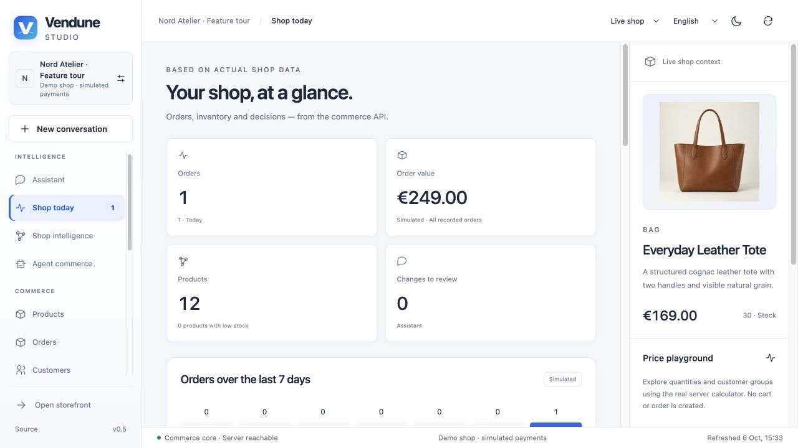

## Products and categories

### Searchable product list

Search by name/product number and filter active status, category or low stock. The default page is 25 products with bounded cursor pagination. Create a unique product, maintain its price/stock and other fields, save and activate deliberately; new products start inactive. Tenant and revision checks apply to UI, HTTP and MCP writes alike. Stable validated import IDs are also admitted through the product-creation API; duplicate IDs conflict.

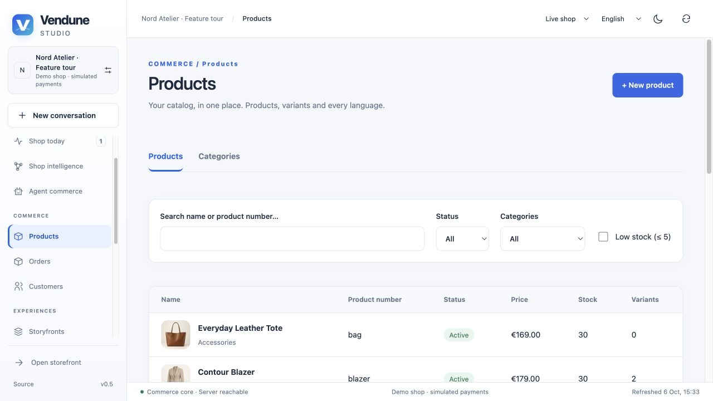

### Eleven connected editor tabs

| Tab | What you can maintain |
| --- | --- |
| General | Name/description, product number, manufacturer identifiers, EAN/GTIN, digital/free-shipping flags and rich description |
| Prices & stock | Gross price, stock, tax assignment, min/step/max quantities, delivery, list/regulation/reference prices and rule/group quantity tiers |
| Media | Gallery, cover, order, alt text, upload/URL entry and optional private AI image drafts |
| Variants | Existing child SKUs and reviewed option combinations with independent number, price and stock |
| Categories & channels | Multiple category assignments and explicit per-channel visibility |
| Specifications | Translated properties/specifications plus weight and dimensions |
| SEO | Localized metadata and slug fields; a complete route/CMS generator is separate |
| Cross-selling | Search and assign other products belonging to the same shop |
| Attachments & downloads | Immutable product files and paid digital access |
| Reviews | Inspect and publish/hide customer submissions |
| Safety & compliance | Translated manufacturer/responsible-person contacts, warnings and sector-specific product facts |

Each editor uses one **Content language**. Inherited values are distinguishable from explicit translations; a missing/null value inherits, while an intentional empty description remains empty. Saving binds the product revision and updates its relevant translations/associations atomically. [Full field contracts](product-management.md).

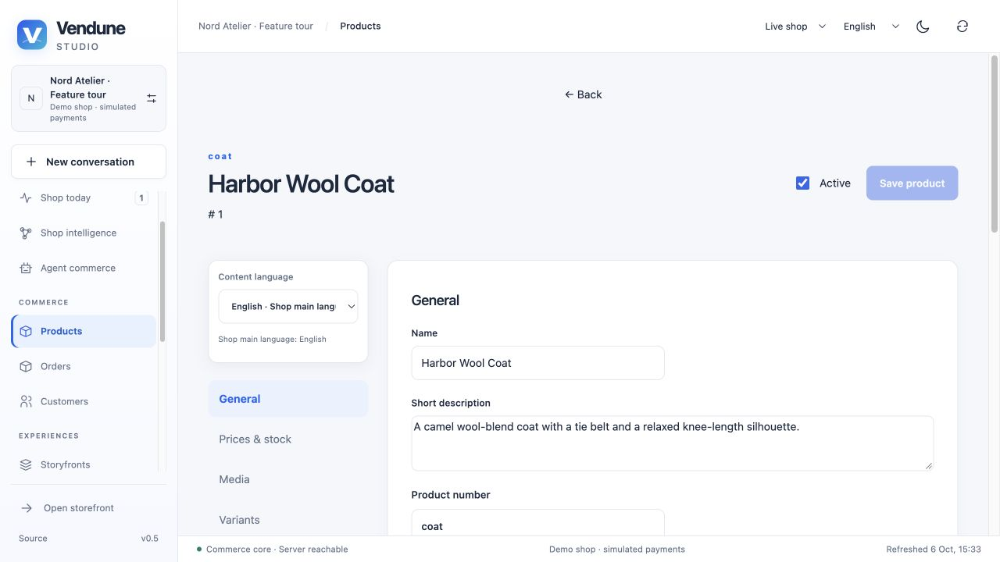

### Pricing, quantities and inventory

The price/stock tab combines current gross price, tax, inventory, purchase limits, quantity steps and optional list/regulation/reference prices. Tier rows can target a customer group and saved rule. Delivery and free-shipping fields feed checkout; changing a parent does not invent stock for its independently purchasable child SKUs. Save the reviewed revision to apply changes.

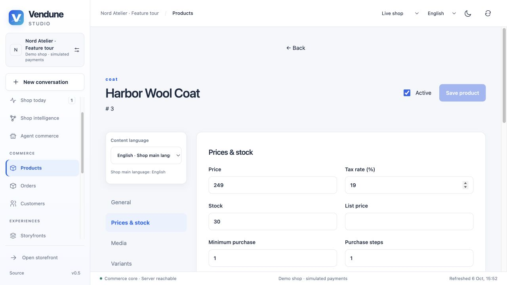

### Visual and Markdown descriptions

The visual editor supports bold/italic/underline, headings, quotations, lists, links, safe image/video blocks, undo/redo and preview. It stores bounded typed document blocks, not executable HTML. Markdown edits the same description through an explicit **Apply Markdown** step; unapplied source changes block an accidental save. Some rich attributes/video/underline are outside the Markdown subset and are disclosed rather than silently discarded.

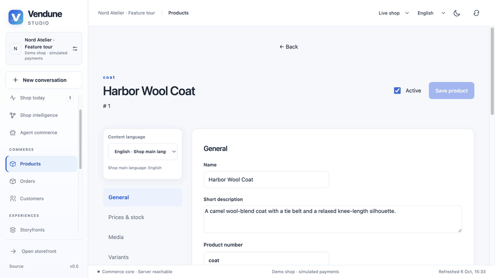

*GIF: the language selector hydrates saved translations; switching to Markdown exposes the real English source. Changing interface language and translating product content are separate actions.*

### Variant combination generator

Add up to five option groups, enter comma-separated values and **Generate combinations**. Review up to 50 combinations, deselect unwanted rows and set each SKU, price and stock before creation. Existing variants remain independently editable. Creation reports individual failures and permits an explicit retry; newly created children start inactive. The parent's live stock is not a sum guessed from the browser table.

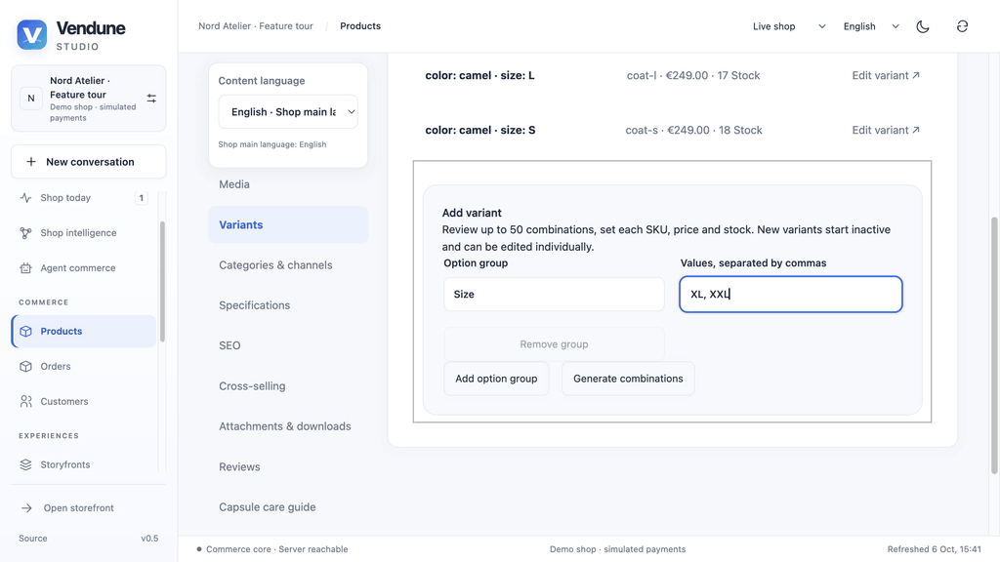

*GIF: generate XL/XXL draft rows for the demo coat. This capture stops at review; it does not claim those variants were published.*

### Galleries and image drafts

Add PNG/JPEG/WebP files or an allowed image URL, preview a cover, reorder, set alt text and save the product. Drag/drop and multiple selection share the same admission path. Uploads are bounded to 8 MiB each, 20 gallery images and 50 retained assets per tenant; successful files remain available when another upload fails. Public delivery follows explicit linkage/publication, not possession of a private URL.

**AI image studio** is optional: generation/edit jobs require enabled image capability, a configured independent image model and server-held credentials. Results are private review drafts with persisted job/revision state. They do not replace live media automatically. The supplied fashion photographs are checked-in artwork, not evidence of a live image-provider call during this tour. [Media and job behavior](settings-media.md).

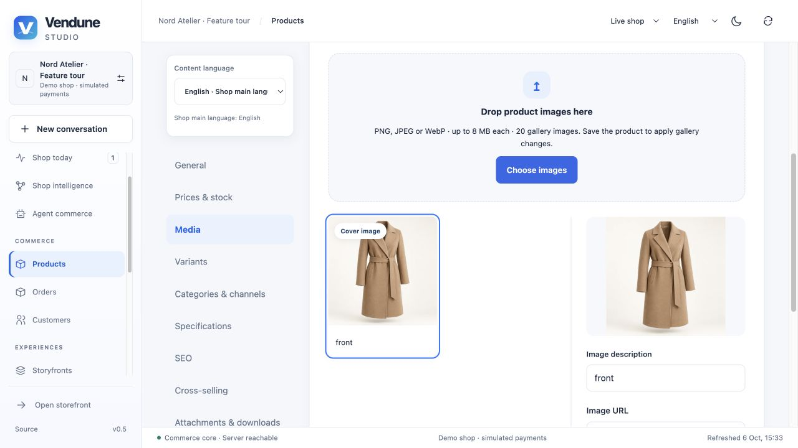

### Categories, specifications, SEO and digital assets

Categories form a translated parent/child tree. Page, folder and HTTPS link types have separate active/navigation-visible controls; inclusion of descendant products is explicit. A channel chooses its navigation root. Product pages remain cursor-paginated; category navigation is bounded to 2,000 nodes. This does not supply full Shopware CMS layouts, dynamic product groups, manufacturer entities or original DAL schemas.

Specifications expose localized merchant properties and dimensions; SEO stores translated title/description/slug information. Attachments use immutable bytes and deliberate publication. Product digital access and review moderation have their own tabs and rights. [Categories and product scope](product-management.md) · [Asset/purchase ownership](merchant-operations.md).

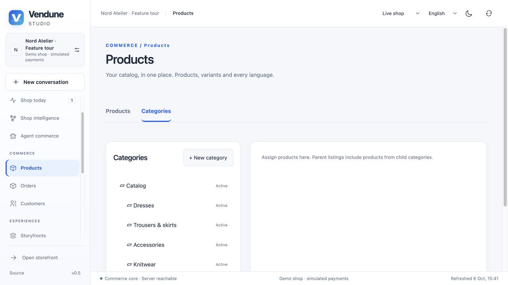

### Category and channel assignment

Assign one product to multiple categories and select its permitted sales channels. This connects category navigation to actual product visibility; the parent inclusion rule and each channel's navigation root remain explicit.

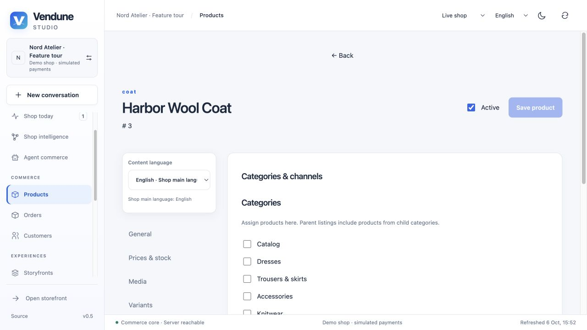

### Specifications and physical properties

Add translated specification rows and maintain named property/value entries such as the bundled Nord Atelier brand. Weight, width, height and length are independent physical fields used by the native product contract. Content-language changes follow the same inheritance rules as the description.

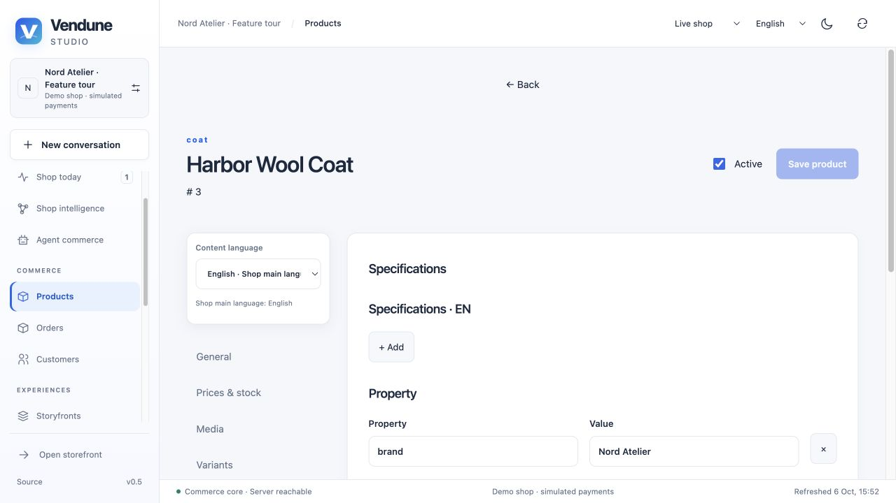

### SEO metadata

Maintain the selected language's meta title, meta description and URL slug, with the product preview shown underneath. These fields are persisted product metadata; they do not claim automatic search-engine ranking or a complete CMS route generator.

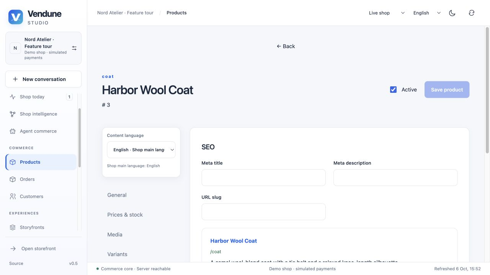

### Cross-selling

Search the current shop's catalog and select the related products explicitly. The linked recommendations belong to this product and are separate from merchant-approved observed co-purchase relationships in Shop intelligence.

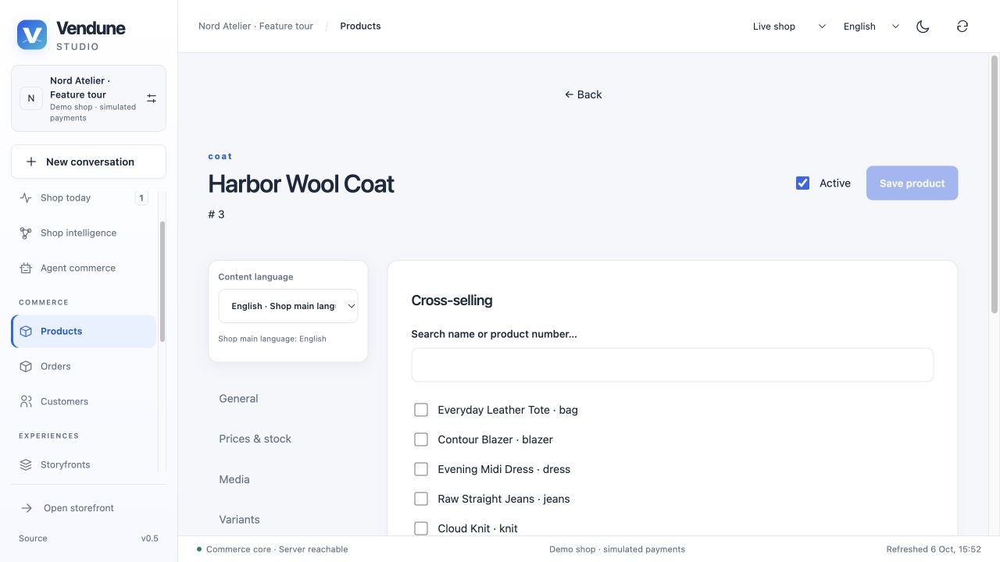

### Review moderation

Open Reviews to inspect customer submissions and their status. Publish or hide actual submissions deliberately; only published reviews contribute to the public rating. The captured coat has no submitted reviews, so its moderation list is empty.

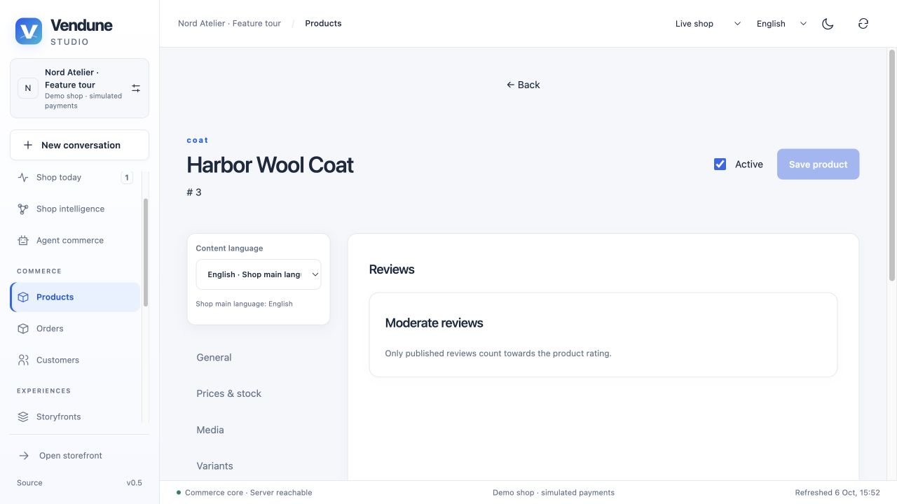

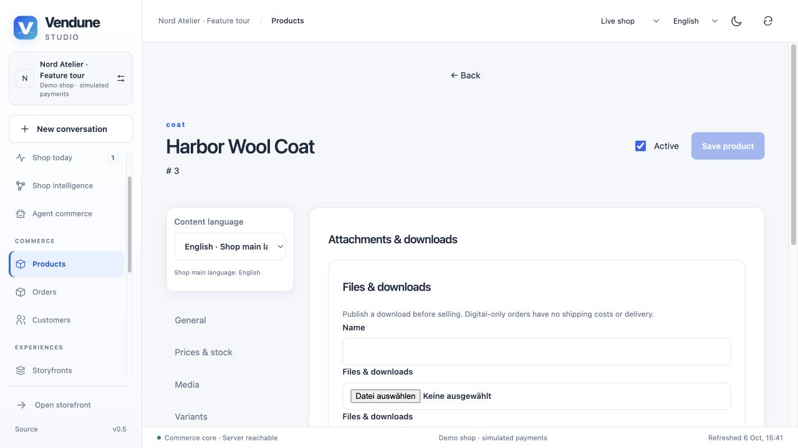

## Customers, orders and documents

### CRM, address books and customer groups

Search customers and maintain contact/company/VAT/phone/birthday fields, preferred payment, language, channel and permitted status/group information. Billing and delivery defaults are independent. Address fields include recipient/company, street/number, postcode/city, country/subdivision and additional lines. Product/customer/order links open the relevant central editor within the current shop/stage.

Customer groups have translated names and configurable gross/net display. Rules and pricing can target them. Group/status changes revalidate authority and revoke stale customer sessions/cart privileges. Required groups and referenced shipping/payment definitions have dependency guards; an in-use object cannot simply be removed through the UI. New guest orders retain an explicit guest identity instead of acquiring account ownership by email. [CRM/history](entity-history.md) · [Operations](merchant-operations.md).

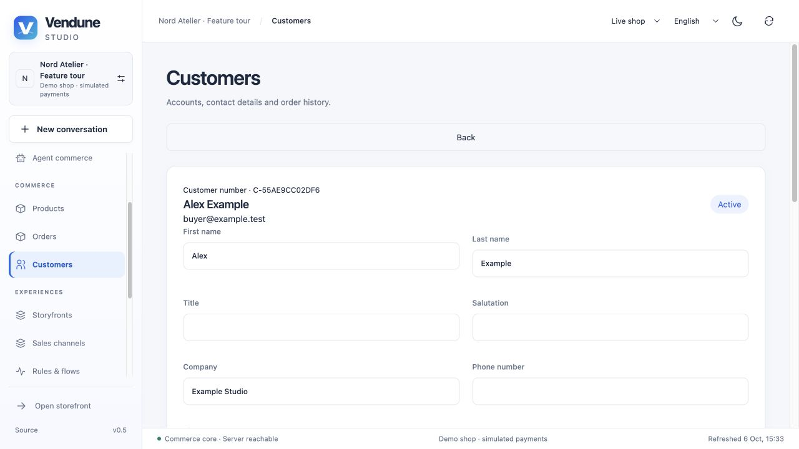

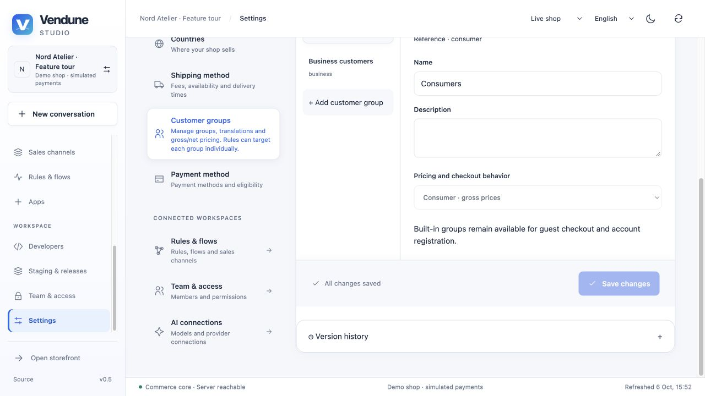

### Order workflow and fulfillment

The bounded chronological order list opens immutable items, quote/addresses/customer snapshots, payment/delivery, tracking, documents and activity. Next actions are derived from the shop's state machine; they are not arbitrary status strings. Revision and request-key checks guard transitions. Saved changes emit events for flows.

The workflow definition can contain translated custom states/edges under validation. Invalid/unreachable transitions, removal of persisted states and illegal terminal/cyclic definitions fail. Order workflows are also selectable release units. Delivery stores tracking and internal dispatch/delivery state; a status change does not purchase a carrier label or prove physical delivery.

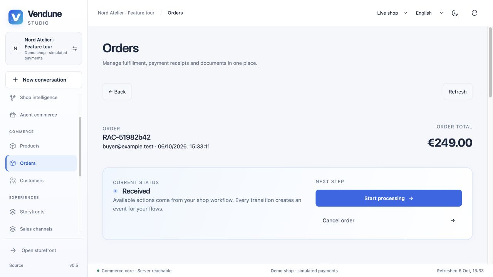

### Payments and numbered PDFs

Payment receipts remain distinct from order status and recorded order value. Manual confirmation and configured provider capture/refund use their own permissions. Durable workers reconcile provider jobs; an uncertain external result is visible. Invoice, delivery-note and cancellation PDFs have immutable numbered snapshots and stable request-key behavior. Company/channel issuer and order data are frozen when issued; later customer/company edits do not rewrite a PDF. Cancellation documents do not themselves refund a payment.

Issuer details must be configured before generation. Templates support the four interface languages within the renderer's font limitations. Legal/e-invoice compliance, arbitrary original Shopware document templates, carrier services and full upstream partial/multicurrency payment behavior are outside this native slice. [Document and payment scope](merchant-operations.md).

### Version history and validated restore

Supported histories cover products, categories, customers, orders, company/shared/channel settings, rules, campaigns, flows, channels and knowledge sources. **Version history** loads bounded revisions and exact Before/After fields. Actor, origin and reason are recorded where known; pre-history edits are not reconstructed with invented authors.

Restoring a supported state requires an explicit confirmation and the current revision. It runs normal validation and creates a new revision. **Product stock is preserved**; customer credentials/identity provenance remain current; restored knowledge needs publication review again. Orders are inspectable and do not replay financial operations. Deleted objects are not generally resurrected by this control. [Exact entity-history boundary](entity-history.md).

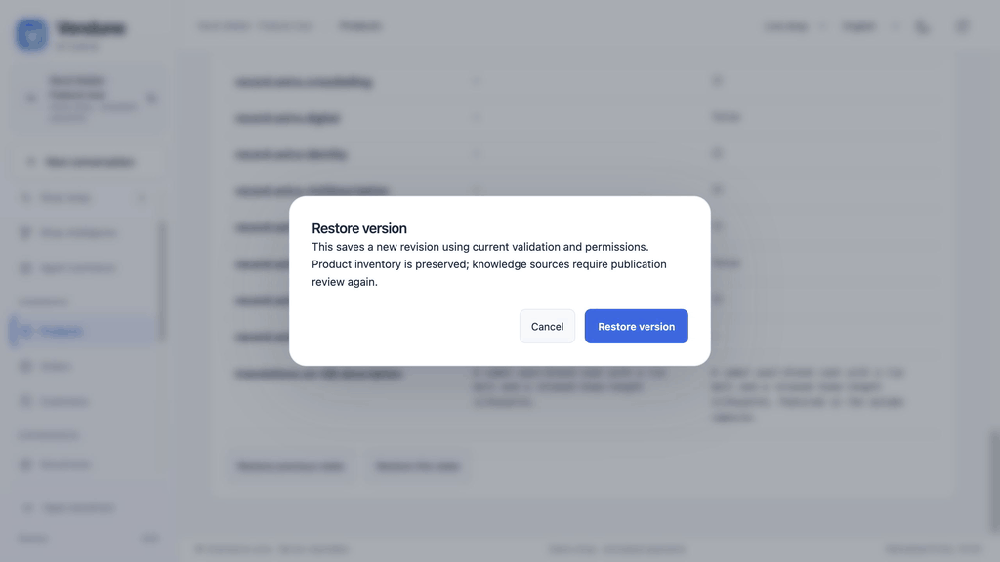

*GIF: confirm restoration of the real prior product state. This is content restoration, not inventory or order rollback.*

## Assistant and shop intelligence

### Conversations and reviewed changes

The merchant assistant persists conversations, messages, verified context and proposals. It receives bounded current catalog, history, observations, eligible sources and selected app facts/tools. The server attaches actual product/app/record revisions. A merchant reviews the stored fields and explicitly approves; application is atomic and rejects stale state. An LLM cannot grant permissions, execute SQL, approve itself or silently modify live content.

Choose configured **Ollama**, **OpenAI Responses** or **Anthropic Messages** adapters. Cloud API credentials differ from consumer subscriptions; calls may incur provider charges. Missing configuration, malformed output and provider failures are reported without silent substitution. Conversation leases and process admission keep network calls outside database transactions. Remote app-service mutations are not made atomic by a model proposal. [Inference and app planning](intelligence-apps-payments.md) · [Provider setup](connectors.md).

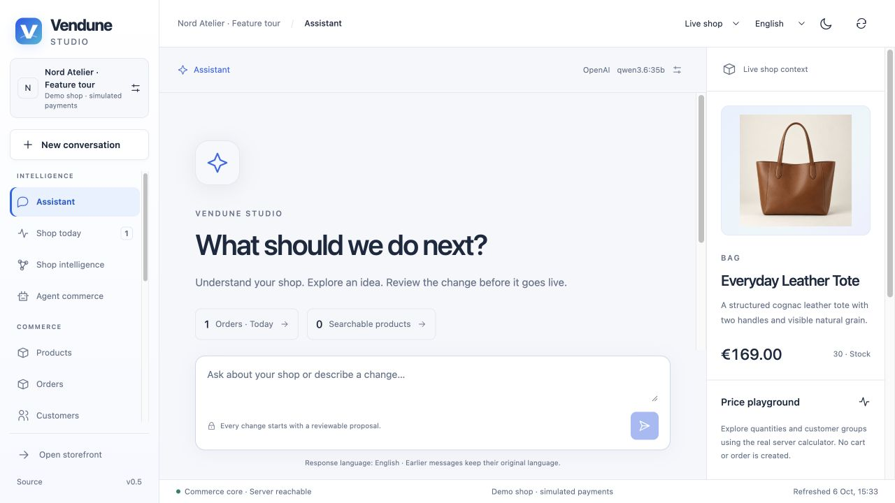

### Five views of the knowledge workspace

| View | Use it for |
| --- | --- |
| Overview | Actual catalog/source/publication/observation totals and next steps |
| Connections | Products, curated needs/complements and provenance-aware relationships |
| Sources | Private documents, published product/shop sources and connected app evidence |
| Learning & decisions | Observed co-purchases, simulation provenance and explicit recommendation decisions |
| Test & use | Question/product/audience selection and exact available evidence |

Catalog facts, curated demo relationships, private app evidence, observed purchases and merchant-approved recommendations remain distinguishable. Transactional event projection deduplicates repeated order/capture evidence. Publishing/dismissing a hypothesis changes eligibility for customer recommendations; marking an experiment does not run a randomized trial. Memory is durable shop evidence, not online model-weight training. [Knowledge workspace](knowledge-workspace.md).

### Private sources, explicit publication and real retrieval

Add text, searchable PDF, TXT or Markdown up to 2 MiB; choose document/data sheet/manual/care guide/FAQ/shipping/returns/warranty/brand kind and whole-shop or product scope. Sources store fingerprints/chunks and start private. A customer publication decision is separate and revision-bound. Editing resets public approval, removes old embeddings and rebuilds chunks. Archive/restore retains the deliberate private review boundary. Scanned PDFs need prior OCR.

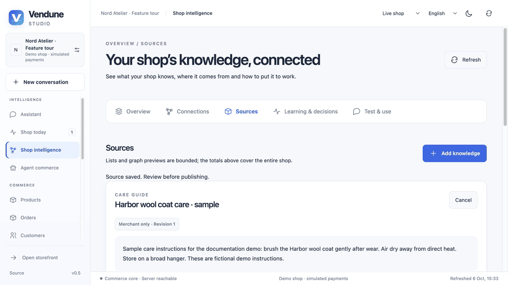

*GIF: publish a visibly fictional care guide in the isolated shop. Only the approved source becomes eligible for customer answers.*

**Test & use** runs real lexical retrieval with no LLM call or write. It displays exact excerpts, source IDs/fingerprints and audience eligibility. Configured live answers can additionally use Qdrant semantic candidates, checked against current PostgreSQL state. Private Gmail/Analytics evidence informs authorized merchant planning, not public product answers. [Publication and retrieval details](knowledge-workspace.md).

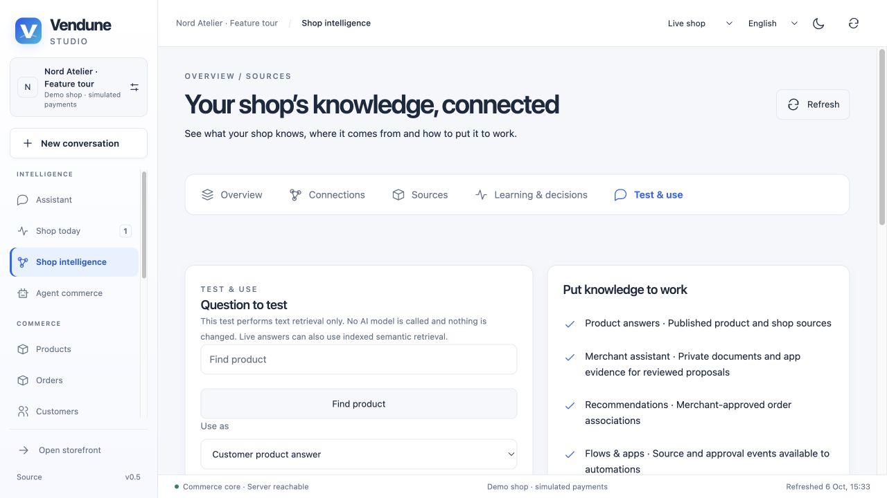

### AI translations and media jobs

Enable and save a target content language in Settings. A translation job processes bounded product steps, persists progress/drafts and supports resume/cancel. Names, descriptions, SEO and human-readable rich/specification text can be translated; IDs, URLs, units and document structure stay fixed. Review and apply individual/all bounded drafts; concurrent manual changes become conflicts, and repeat apply is idempotent. Results never change live products automatically.

Media generation/edit jobs similarly produce private review drafts. Both paths require available provider capabilities and their independent workers. They validate structure and revisions; they do not certify linguistic accuracy, product truth or image quality. [Translation workflow](international-commerce.md#translate-the-whole-product-catalogue-with-ai) · [Image jobs](settings-media.md).

## Rules, campaigns and Flow Builder

### Saved rules and starter processes

New shops have a main channel, three starter rules and two order/payment note flows. They do not automatically activate marketing discounts or external messages. Rules expose native conditions and reviewed source-named Shopware conditions with typed configuration, nested AND/OR/NOT/XOR and saved-rule references. Event projection freezes relevant definitions/facts for the admitted execution. A Boolean preview evaluates the actual cart without effects.

The registry binds 108 of 114 reviewed source-named condition types; six unsupported runtime types remain visibly disabled. This is a native subset with bounded comparison evidence, not full upstream Rule Builder parity or unrestricted PHP execution. [Condition inventory and lifecycle](automation.md).

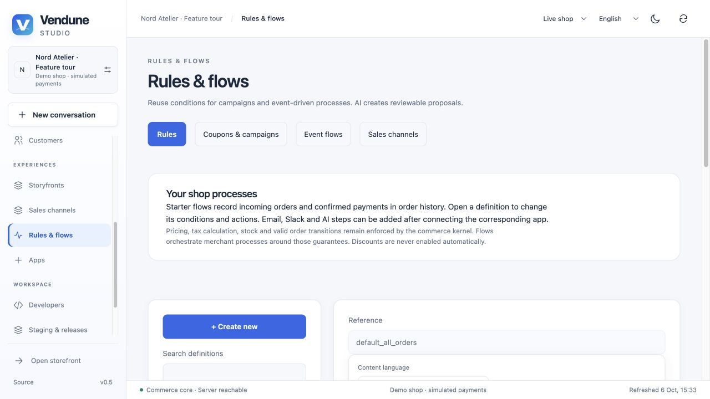

### Coupons and campaigns

Create translated percent/fixed discounts, coupon codes or automatic campaigns and free-shipping effects. Configure priority, exclusivity, active windows, rule eligibility and global usage caps. Applying `TRY10` in the example uses actual tax-adjusted totals; concurrent redemption counts use transactional checks. Search/edit/enable/remove definitions through dependency-aware, revision-bound operations. [Campaign semantics](automation.md).

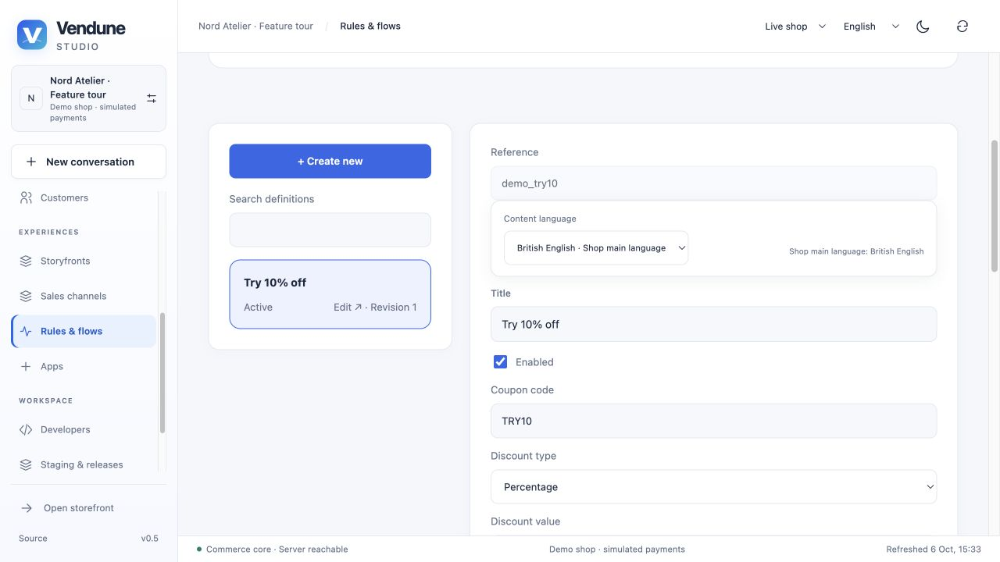

### Branches, actions, delays and execution traces

The Flow canvas builds an acyclic graph of 1–100 steps: condition Yes/No branches, actions, delay and stop. Native actions include customer/order tags, custom fields, attribution, group/status changes, guarded order/payment/delivery transitions, documents and download access. Configured email, installed app actions and AI proposals add external/approval boundaries.

*GIF: navigate the six-step graph and inspect each step's controls. This is an editor walkthrough, not a claimed external delivery.*

Delays up to 30 days persist as scheduled continuations. SQL leases/node receipts survive restarts and refresh current rights before actions. The workspace periodically refreshes actual branch decisions, steps, results and errors. Confirmed effects are not blindly repeated; ambiguous external effects need reconciliation. Events include catalog/order/payment/delivery, knowledge decisions and namespaced app events. [Runtime, actions and limitations](automation.md).

## Settings and international commerce

### Company, brand and channel inheritance

Maintain structured legal/company identity, address, contact, private bank fields, brand text and logo. The scope selector chooses the shared basis or a channel override. Missing/null fields inherit; a string replaces only that field; explicit empty optional values stay empty. Reset restores inheritance. Channel/basis revision checks prevent stale saves and preserve drafts.

Company logos are bounded PNG/JPEG/WebP uploads normalized to PNG and private until linked. Storefront brand/logo/legal notice use an explicit public projection excluding private banking/domestic tax fields. Document issuer uses the order's channel and an immutable snapshot. [Company settings](company-settings.md).

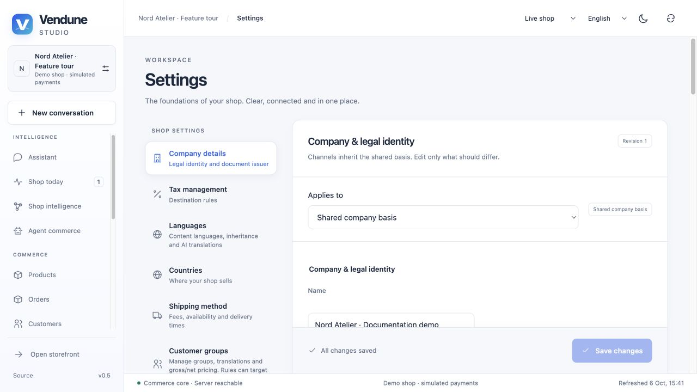

### Countries and destination taxes

The geography picker bundles 249 ISO-assigned country entries plus explicitly separate Kosovo, with names/aliases/codes, continents and US subdivisions. Tenant overlays can add validated custom countries/subdivisions. Choose delivery destinations, then provide explicit tax coverage and eligible methods; enabling a country does not invent a zero tax rate.

Tax classes have country rates/fallbacks and prioritized destination rules for subdivisions, exact/prefix/range postcodes, UTC date windows and saved-rule conditions. The resolver uses authoritative pre-tax/pre-discount facts, avoids recursive quote conditions and preserves completed order snapshots. Shipping tax supports highest/proportional allocation. This is merchant configuration, not a live worldwide tax-law service. [International contracts](international-commerce.md).

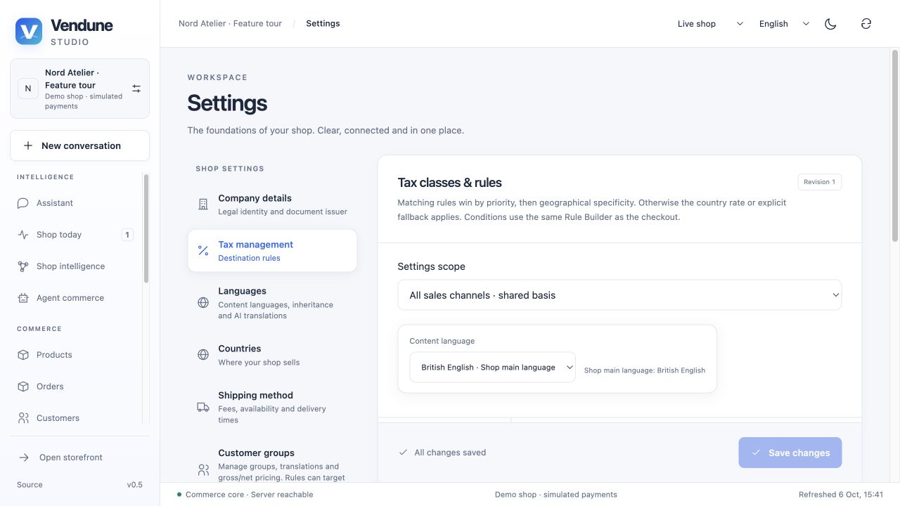

### Languages, shipping and payment settings

Shop-main and enabled content locales drive product/category/settings/app editors. Custom content locales extend beyond the four interface languages; they do not automatically translate UI vocabulary. Shipping/payment names, country/region labels, tax labels, specifications, SEO and rich content use deliberate field inheritance. Settings contain one selected language instead of duplicate language walls.

Shipping maintains fees, country/rule availability, delivery times and tax allocation; payment maintains manual/simulated/configured provider mode, country/customer eligibility and descriptions. A channel inherits checkout settings until an explicit field-level override. Switching a dirty scope asks for save/discard. Dependency checks protect referenced methods and preserve existing order snapshots. [Shared basis and overrides](settings-media.md).

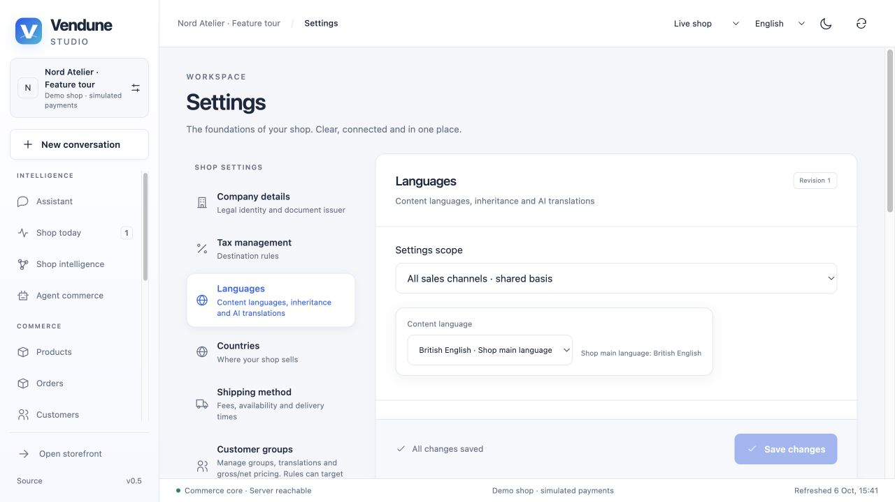

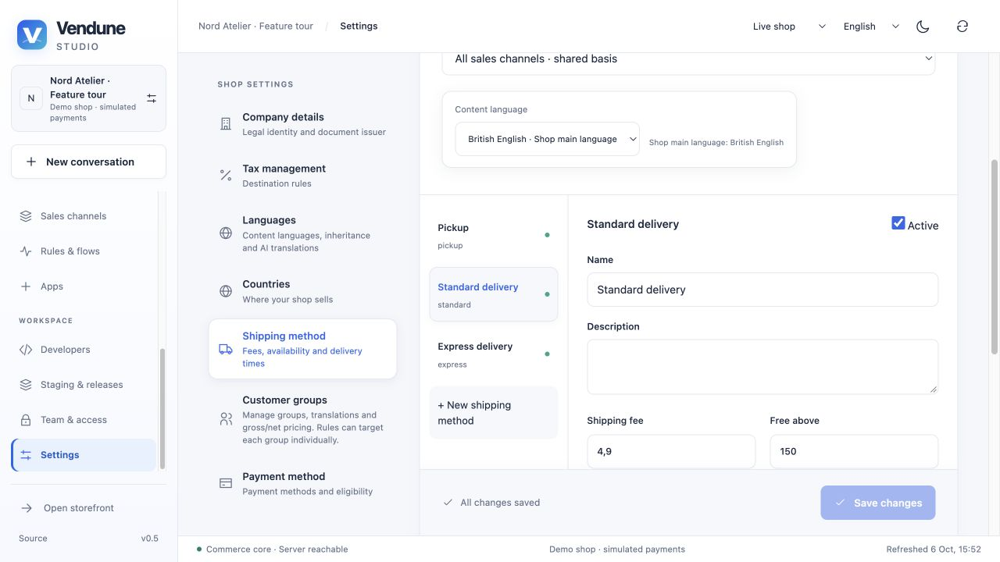

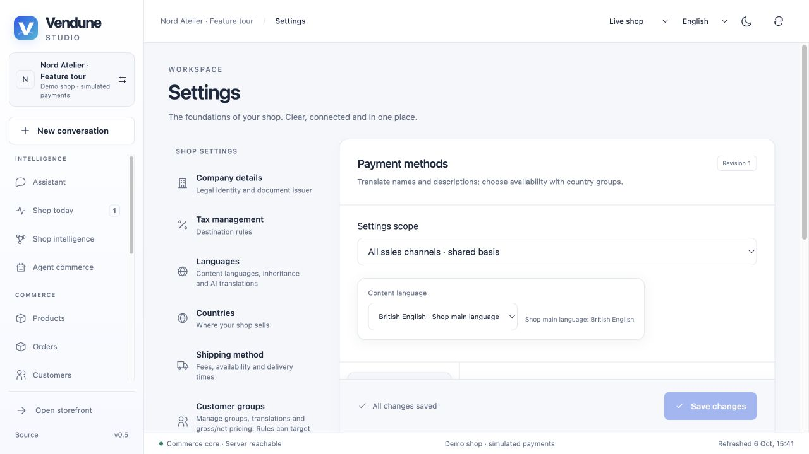

## Sales channels and connected experiences

### Main storefront and three-step channel creation

A shop's persisted main storefront cannot be deactivated/deleted. Additional storefront/headless channels share its catalog/team but have distinct names, enabled languages, navigation root, selected products and settings overrides. Channel-bound carts cannot be silently reassigned to another channel.

The creation assistant has **Basics → Catalog & languages → Review & create**. It supports searchable product selection and inherited settings; the final review is explicit. Separate SaaS shops have independent data/membership, whereas channels belong to one shop. Unused additional channels have revision/dependency-checked lifecycle operations. [Channel guide](studio-api-and-channels.md#sales-channels).

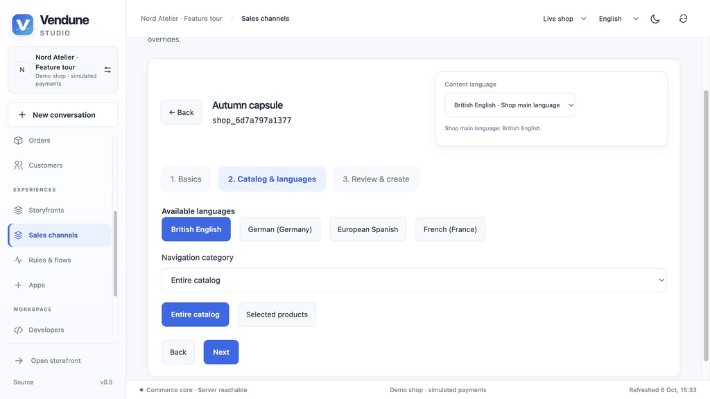

*GIF: configure the Autumn capsule channel and inspect the review step. Creation is a separate action.*

### Storyfront catalog publication and checkout transfer

The Storyfront app connects to an **operator-configured private companion service**. It publishes a bounded catalog snapshot with real SKU mappings, translations and allowed product media, reports job status/counts and opens its configured storefront. Shopper intent transfers through a single-use cart ticket into the authoritative Vendune checkout. The ticket expires, is consumed once and rotates the cart token; merchant credentials do not enter the shopper link.

A native install alone does not deploy the private service, generate an AI story release or enable customer account SSO. Provider configuration, consent/tracking, continuous sync and companion ownership remain explicit. The earlier end-to-end Storyfront evidence is retained and dated in its guide. [Storyfront integration](storyfront.md).

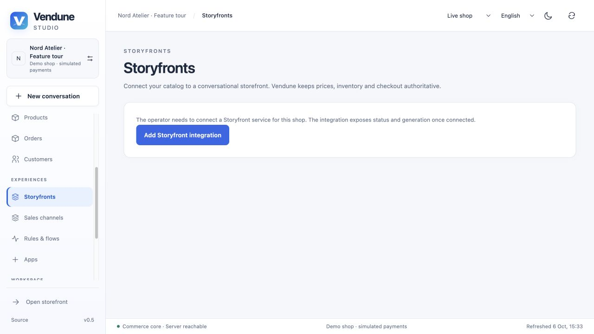

### Trusted identity, Studio handoff and hosted frontends

The latest generic experience boundary lets a trusted server verify a merchant, provision an owned empty/fashion shop, use inherited structured inference and bind a public frontend alias to an active channel. Identity assertions are route-bound, short-lived and protected against durable replay. The shared signing key delegates verified identity authority and stays in trusted server runtimes; it is never a browser integration key.

A personal merchant can issue a **one-use 60-second Studio ticket**. Redeeming it rechecks current membership; Studio removes `login_ticket` from the URL before network requests. Normal personal sessions result, without a password/bearer token in a link. Hosted frontend aliases and shop IDs share collision checks; requests resolve authoritative tenant/channel from storage. The public proxy strips cookies/merchant Authorization, disallows redirects and restricts endpoints/body sizes.

These adapters are opt-in and disabled without operator configuration. Trusted inference has a durable 50-call allowance per verified email per UTC day; this is a prototype abuse boundary, not SaaS billing. They do not establish deployed Google/Apple OAuth, real email verification delivery or a publicly running private experience service. [Trust contract, routes and configuration](experience-integration.md).

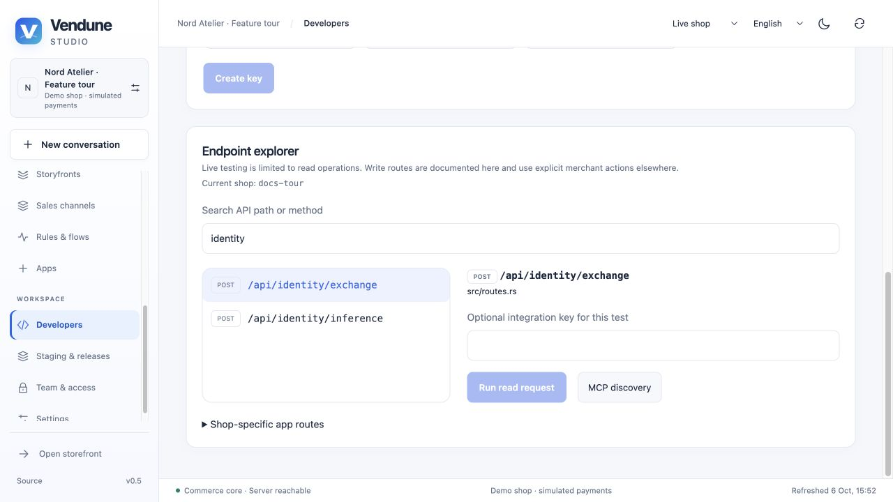

## Apps and App Studio

### Discover, install and inspect

The library has **Installed** and **Discover**, search and categories, status filtering, passive cover/icon metadata and a common detail page. Fresh shops show the eight bundled choices without silently connecting external services. Details expose **App details**, **App workspace**, **Data**, and **Version & permissions**. Activation is revision-bound and permission checked; an installed app can retain records when disabled.

The bundled catalog is not an external marketplace of arbitrary vetted services. Product Lab and custom packages can be installed from reviewed manifests separately. [Library and package lifecycle](app-library.md).

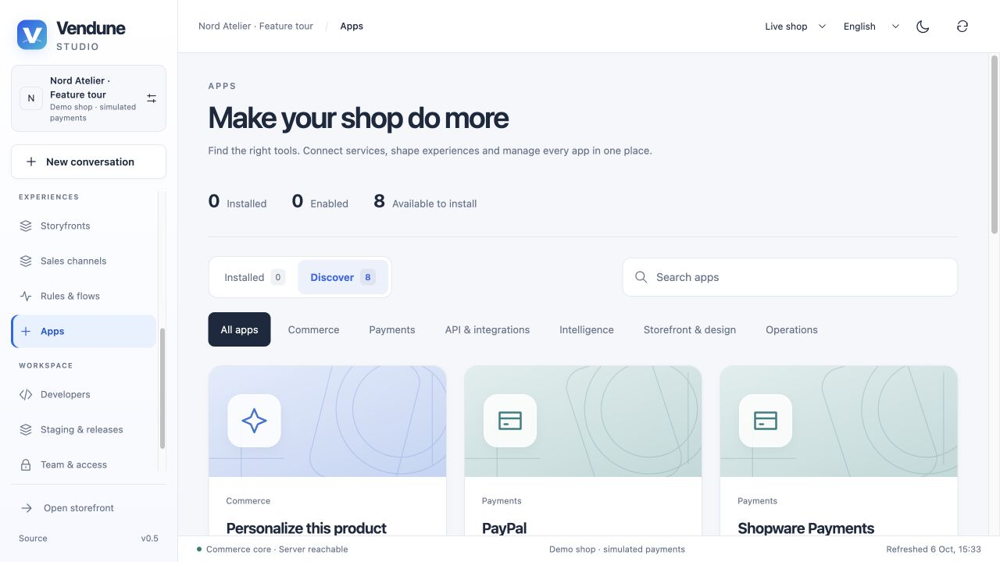

### The eight bundled apps

| App | Actual capability | Configuration / boundary |
| --- | --- | --- |
| Personalize this product | Product inscription form, Wasm validation, server-calculated taxed surcharge and immutable order configuration | Install/enable its package; generic cart contribution ABI also supports the gift-message example |
| PayPal | Native provider configuration/status plus authoritative Orders v2 checkout/capture/refund path | Own Sandbox/Live account; server-held credentials; actual PSP account run remains unverified |
| Shopware Payments | Published integration/settings contract with explicit availability status | Official private standalone connector required; not silently substituted with demo payment |
| Storyfront | Catalog publication/status and connected shopping/checkout transfer | Separately operated private service and admitted shop pairing |
| Google Analytics | Consent-gated GA4 storefront events plus acquisition/product reports and private evidence | Configured tracking/OAuth service; measurements disclose thresholds/sampling, not causal uplift |
| Gmail | Read-only label-based support import, initial/history cursor sync and private planning evidence | Configured OAuth service; no attachments or mail-sending capability |
| Slack | Configured channel/order or deliberate Flow notifications with bounded escaped templates | Own service/token/destination; notifications require explicit setup |
| Email delivery | SMTP with verified TLS, Resend or SendGrid, text/HTML/CC/BCC, previews/test mode, four-language order confirmations and durable receipts | Own service/sender/credentials; disabled/test mode initially; provider acceptance differs from inbox delivery |

OAuth/token refresh and connector queues live in independent app services with their own encrypted configuration/storage. Imported content is evidence, never an instruction. Disconnect fences/removes its active planning sources. Order-event and equivalent Flow notifications are two distinct paths; intentionally choose one if only one message is wanted. [Connected apps](connected-apps.md) · [Email delivery](email-delivery.md).

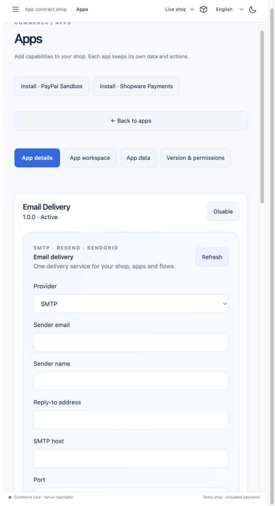

*This retained image illustrates transport settings; the new feature-tour capture does not send external email or claim a live connected account.*

### Nine guided app starting points

**Developers → App Studio → New app** offers storefront, admin, connected experience, payment connector, shipping connector, ERP/external systems, event/Flow actions, incoming webhook and scheduled automation. Choose placement, translated fields and explicit exposure to create an ordinary editable manifest. A template is a contract starting point, not an implementation of every provider's business logic.

Editor placements include an independent admin module, product-general section/new product submenu, customer/order fields, product-detail surface and storefront page. App data lives in app-owned tables with validated same-shop core references; the host binds the currently open product/customer/order. Missing context cannot cause an unfiltered private read. [Assistant types and mounts](app-assistants.md).

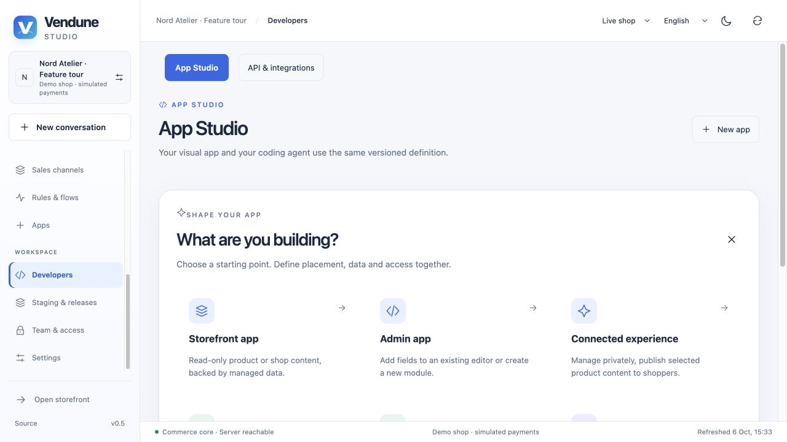

### Visual design and typed data models

The palette contains **Text, Data table, Cards and Input form**. Add/select/reorder components, edit properties/bindings, choose stacked/two-column layout and undo/redo. One content-language selector serves localized view/field text. Public forms are rejected; explicit public reads remain separate from authenticated writes.

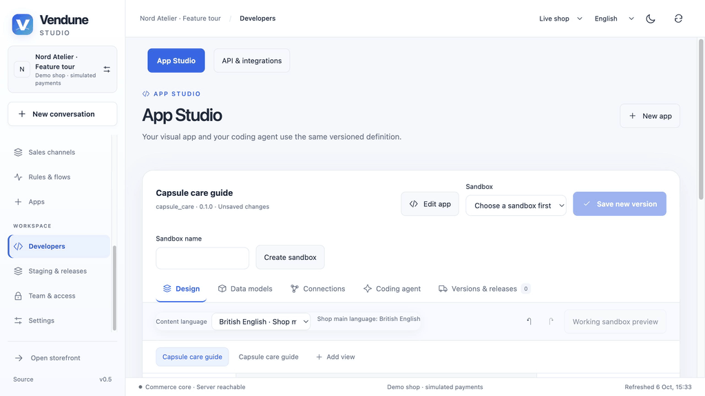

*GIF: real draft layout changes. The design canvas labels its sample data; it is distinct from the working sandbox preview.*

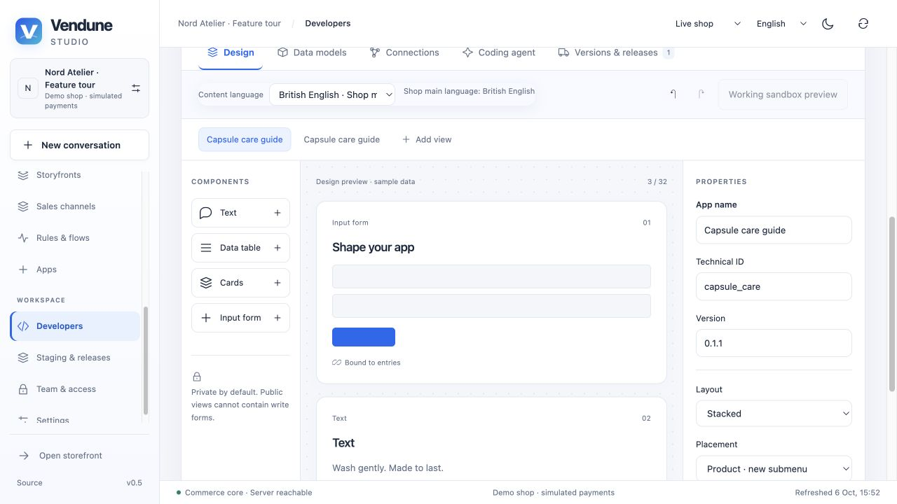

Data models define typed fields, required/indexed flags, translated strings, validated choices and product/customer/order references. Managed storage applies compound tenant foreign keys and forced RLS; additive nullable evolution is supported, destructive schema changes are rejected. Bounded JSON fields support richer data without arbitrary SQL. [Manifest/storage contracts](app-platform.md).

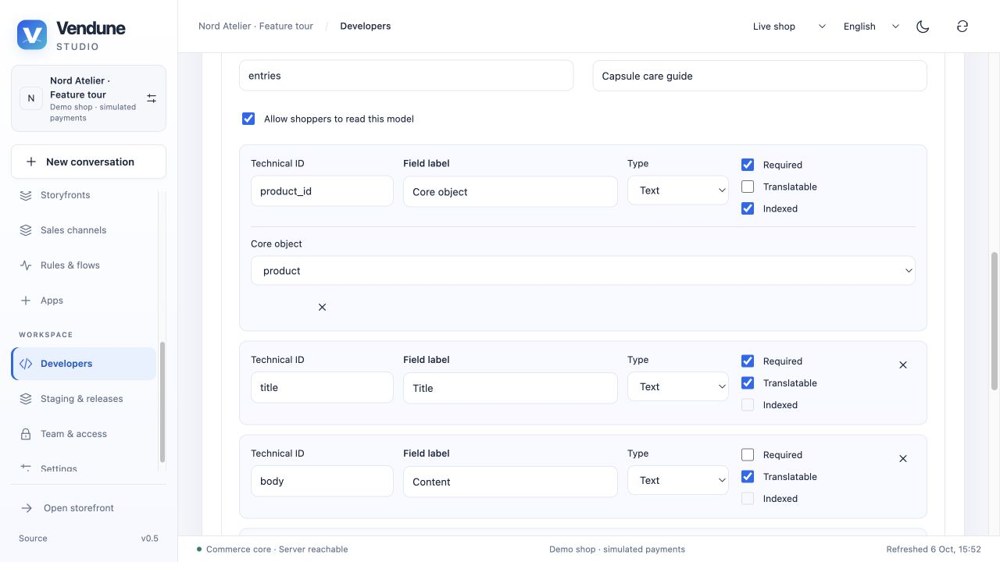

### Working preview, immutable versions and app data

Create/select a private sandbox, save a new immutable version, inspect changes/digest and approve installation there. **Working sandbox preview** runs the actual native renderer with real managed records. For embedded forms, choose a real matching object, save, reopen and inspect persisted data/revision. Package publication and app-data publication are independent.

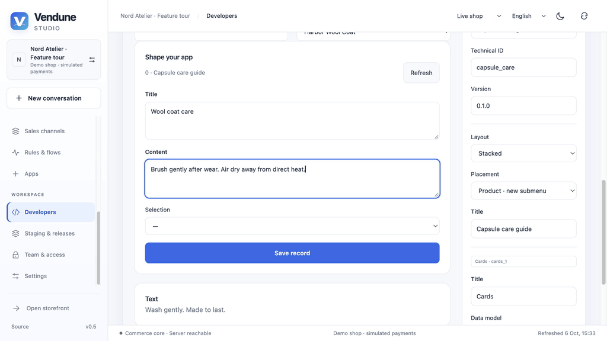

*GIF: persist a care record for the Harbor coat. It remains sandbox data when only the app package is released.*

**My apps / Edit app** opens the same canvas for the next compatible version. App Studio Trash supports recoverable project archival; it does not erase installed versions or their records. Version bounds include 16 views, 32 blocks/view, 12 models, 16 fields/model and 24 actions/routes. [App Studio workflow](app-studio.md).

### Coding agents, custom services and SDK surfaces

The Coding agent view exports a task/manifest contract with credential placeholders for an authorized external Codex/Claude workflow; it does not launch a CLI or shell. AI generation is optional and produces a reviewed draft. Visual and agent editing share the manifest/version path.

Full apps can own admin modules, product/order panels, storefront pages/home/header/detail/cart/account surfaces, namespaced HTTP aliases, MCP tools, selected planning facts and an independent service/database/model. Product Lab is a runnable example. Custom UI runs in an opaque iframe with a scoped SDK bridge; it receives no merchant bearer token and cannot replace parent DOM. Per-action rights, public reads, MCP exposure and selected planning tools are separate decisions. [Full app platform and SDK](app-platform.md).

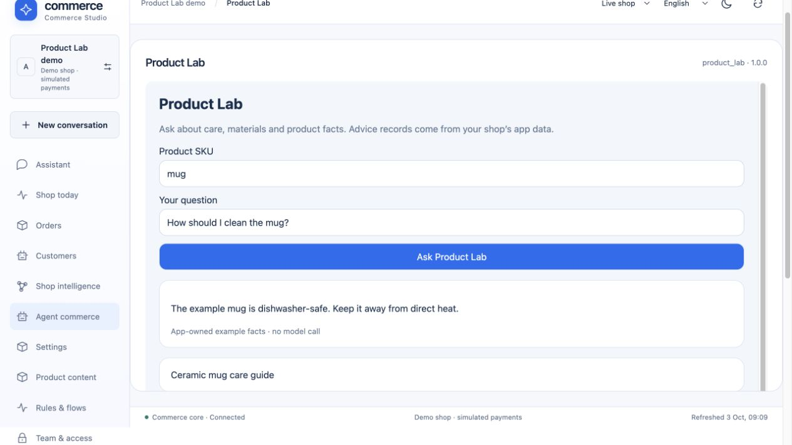

External calls have deadlines/payload/admission limits and do not hold a core DB connection. Operator configuration supplies trusted service/UI origins. Automatic arbitrary source builds/rollout, signing, hostile-code microVM containment and customer-private service identity are not supplied by the visual builder.

### App events, schedules and signed webhooks

Apps emit namespaced events and subscribe through durable at-least-once delivery. Receivers deduplicate with stable keys. Flow-enabled actions use the same authorized gateway. Scheduled emit actions support bounded six-field **UTC** schedules, at most eight per app and at most one tick/minute/schedule; SQL prevents duplicate ticks across restarts/replicas. Private stages do not execute them.

Incoming webhook declarations admit bounded typed payloads signed with an operator-held HMAC key, timestamp and stable event ID. Identical repeats return the original receipt; different bytes under one ID fail. Public customer/order references are forbidden. These contracts still require real provider/service implementations. [Schedules/webhook evidence](app-assistants.md#events-cron-and-incoming-webhooks).

### Pure Wasm commerce hooks

Four checked-in B2B purchase policies cover company limit, EUR 100 budget reserve, EUR 50 minimum and EUR 250 single-order cap. Approved WAT is compiled/probed before activation; checkout uses no host imports/WASI/network/filesystem, 10,000 fuel units, 1 MiB memory and a 256 KiB stack. Saved changes refresh stale process caches; traps roll back the purchase. These are alternative policies for one B2B ABI, not arbitrary PHP plugins or a general compiler. [Policy examples and activation](../extensions/README.md).

The personalization app uses its separate generic configuration/cart-contribution ABI to connect customer input, validation, taxed surcharge and order display. It does not gain unrestricted host access from App Studio.

## Workspace access and releases

### Personal membership and precise rights

A personal identity can belong to multiple independent shops with owner/administrator/editor/viewer defaults and **15 fine scopes** for catalog, customers, orders, documents, payments, settings, team, apps and knowledge. Invitations, memberships and integration keys cannot delegate beyond the actor's current authority. Every request checks active membership in PostgreSQL. Role/revocation changes apply to later requests across replicas; the final owner is protected.

Invitations expire after 24 hours and are used once. Codes are shared manually; automatic invitation mail is not implemented. The local instance bootstrap token is privileged setup authority, not a merchant integration credential. Customer, merchant and platform sessions remain distinct. [Access rules](security.md) · [Operations permissions](merchant-operations.md).

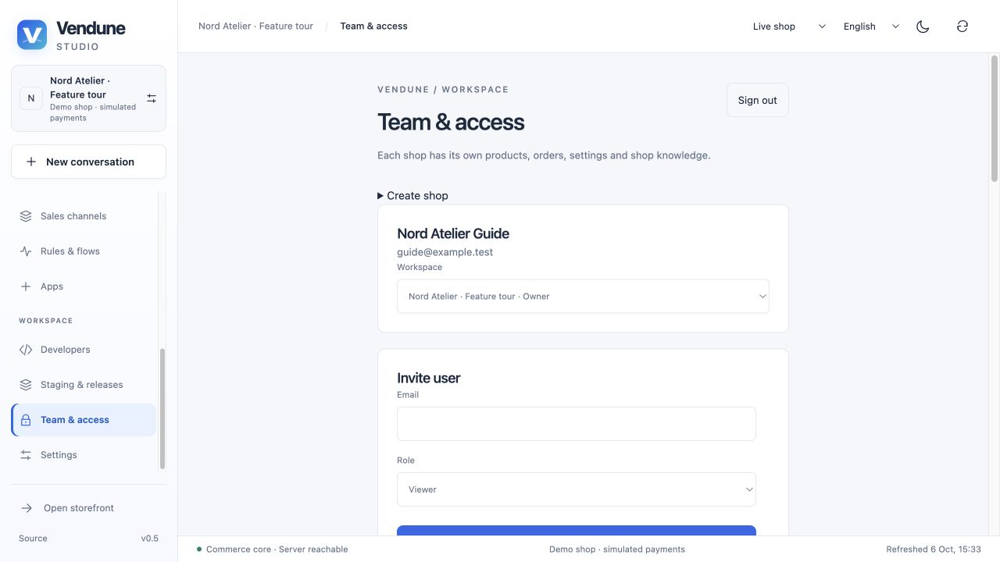

### Expired-session recovery and API/MCP keys

Protected Studio links require sign-in before private content loads. An expired active session presents a blocking reauthentication dialog, preserving drafts and editor context. Only the same account/current membership can resume; failed writes are not replayed. Authorization/provider/network errors are distinguished from authentication expiry.

Create named, hashed, scoped integration keys valid for **1–90 days**. They are shown once and are rechecked against the creator's current membership. The API explorer lists **214 static method/path pairs** at the reviewed commit, with source and access metadata; installed app routes are discovered at runtime. Its live tester supports authorized GET and MCP `tools/list`, with a selected scoped key, without replacing Studio identity or exposing operator binary routes. [Sessions and explorer](studio-api-and-channels.md).

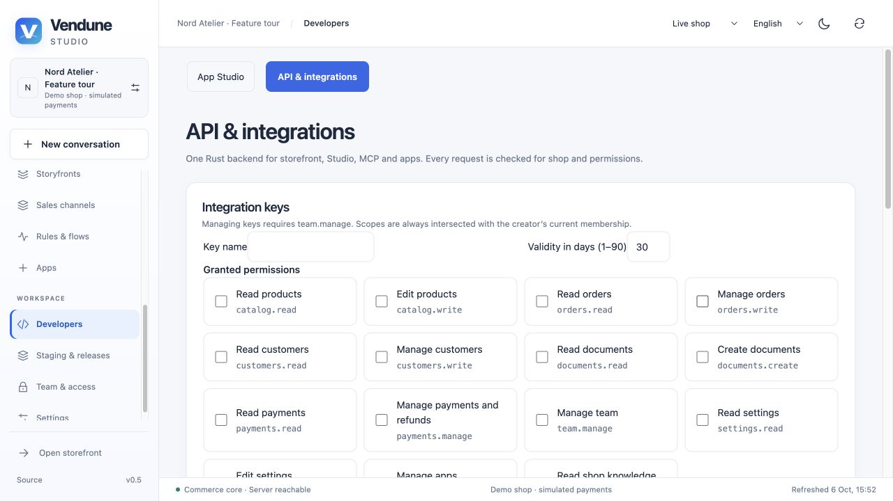

### Private stages and selected publication

A sandbox clones catalog/translations/categories, settings/company, experience state, rules/flows/campaigns/channels, app packages and selected public app data/documents. It excludes live customer accounts/orders, payment attempts/provider keys, observed shopper behavior and private app records. Sandbox inventory is simulated; publishing product content preserves live stock. Anonymous checkout and external service effects are blocked.

**Review changes** compares stage content with its recorded live baseline. Select only the needed units: products, categories, apps, app data, assets/documents, rules, campaigns, flows, channels, settings, company/channel overrides, experience and order workflow. A release is atomic and rejects concurrent live baseline conflicts; there is no automatic conflict merge or universal rollback button. [Clone and release boundary](workbench.md#what-a-sandbox-contains).

*GIF: one selected package is released and entered in release history. The separate app-data change remains available in the sandbox.*

## Vendune Platform

### Separate operator console and shop directory

The public service hub at **admin.vendune.ai** links merchant and platform entry points. A platform grant is separate from merchant ownership and the bootstrap token. Operators see a bounded searchable shop directory, staging separately, per-shop team/business/channel/app information and 7/30/90-day statistics. Access is checked on every operator request; platform access does not automatically authorize every merchant Studio.

Metrics distinguish recorded gross order value, simulation and confirmed captures by currency. Captures are not net revenue after refunds/fees. Stored lifetime HTTP requests are not visitors. Daily buckets use the database/UTC calendar. [Metric definitions](platform.md).

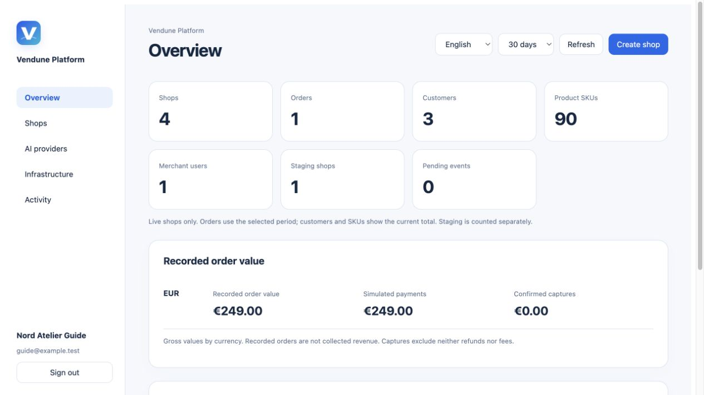

### Shop creation, addresses and inherited AI

Create an empty/sample shop with an optional existing owner. No shared-password demo customers are created by operator provisioning. Payments start simulated. With configured wildcard routing, shops use `https://SHOP_ID.vendune.ai`; old public query links retain product/channel/language context during upgrade. Studio/private stages keep their authenticated origin. DNS/certificates, arbitrary custom domains, billing and island migration are separate operator work.

Global provider configuration has an enabled/default **Ollama/OpenAI/Anthropic** choice, provider models/endpoints and independent image capability/model. Shops inherit it or have an explicit override. Provider keys are write-only and encrypted with the runtime key; they are not returned to the browser. A configured status reports saved configuration, not provider health or a completed inference call. Disabling a provider denies use; there is no silent fallback. [AI and address controls](platform.md).

### Pause, trash and restore

Pause requires a reason and current revision. It blocks new customer actions/AI/writes and defers queued automation across the shop and its stages; admitted merchant reads and existing payment reconciliation remain available. Already running work may finish. Move to Trash requires exact shop-ID confirmation and preserves records for recovery.

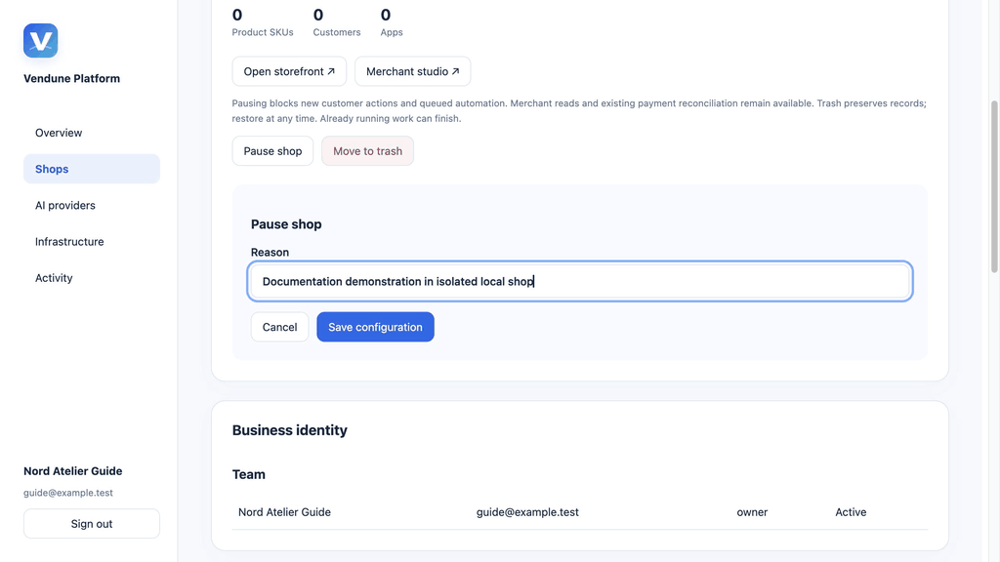

*GIF: the isolated `lifecycle-tour` shop moves through Paused → In trash → Active. No production shop is touched.*

Restore reactivates preserved records. Trash is not physical erasure/GDPR purge and does not refund orders, cancel external subscriptions or erase provider obligations. Platform activity records operator changes. [Lifecycle admission](platform.md#shop-lifecycle-and-dossier).

### Actual infrastructure diagnostics

Infrastructure probes PostgreSQL version/size/connections, Qdrant readiness, Rust pool/cache/queue state and measured mean/maximum HTTP timings. Linux cgroups can expose current-process/container CPU/RAM with sufficient samples; unavailable values display a dash. These are current probes, not invented fleet utilization, p99 latency, capacity or guaranteed failover.

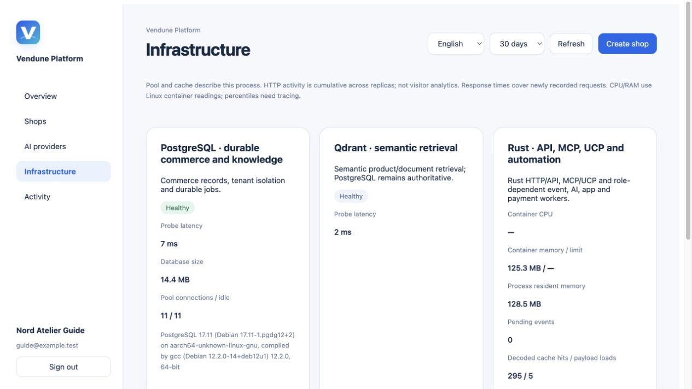

## Shared APIs, storage and verification

### HTTP, Store API, MCP and UCP

Browser shopping, merchant HTTP and protocol adapters call shared operations. MCP publishes typed shopping/knowledge/merchant/app tools filtered by current rights; direct invocation is independently authorized. The stdio bridge forwards to the running Core rather than implementing another calculator. The native HTTP MCP subset uses stateless JSON responses and no SSE subscription. UCP's documented checkout adapter shares carts, quotes and order behavior.

A reachable HTTPS endpoint and account-side registration are still required for hosted ChatGPT/Claude clients. A custom UI connector requiring OAuth needs its own gateway; a scoped token alone does not implement an OAuth authorization server. [Connection instructions](connectors.md) · [API catalog](studio-api-and-channels.md) · [Protocol scope](shopware-parity.md).

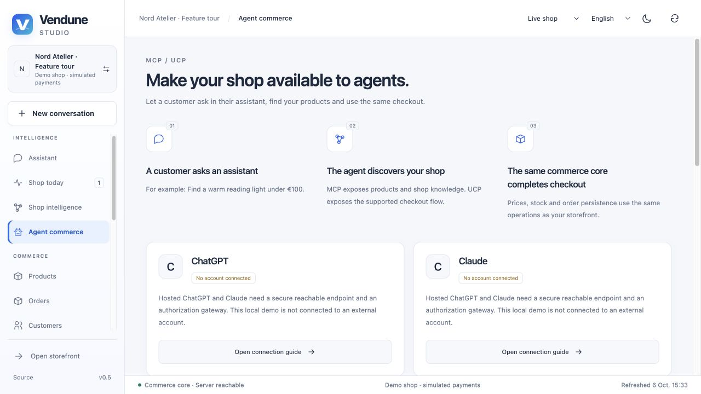

### Durable state and independent workers

Ordinary **PostgreSQL** is authoritative for products, inventory, orders, users/rights, conversations/proposals, history, app records, relationships, source vectors and durable queues. **Qdrant** is a private rebuildable search index; candidates are hydrated/checked against current tenant, product revision, digest, price and stock. Legacy AGE/pgvector conversion preserves existing data; fresh installs do not require those extensions.

Atomic stock/order/idempotency/outbox transactions avoid partial commerce writes. Independent HTTP, memory/outbox, payment, app-event, translation and media roles use SQL leases/receipts. An HTTP-only process needs the appropriate workers for queued effects. Core tables use application tenant filters and critical composite foreign keys; forced RLS applies to managed app tables, not every core table. [Architecture](architecture.md) · [Storage/migration](managed-hosting.md) · [Isolation](tenant-isolation.md).

### What the verification establishes

CI checks source ownership, frontend build/localization, Rust formatting/lint/tests, original Shopware PHP comparisons, real isolated PostgreSQL/HTTP regressions and selected extracted Lean policies. Existing price/context/tax/comparison/rule suites contain **7,000 bounded original-PHP comparisons**. Formal claims name exact production policies and exclude SQL/provider/browser/whole-system correctness.

Million-product commerce measurements are dated workload-specific observations; they do not establish semantic recall, production capacity or a Shopware speed ratio. This remains an extensible working prototype with explicit gaps in full Shopware DAL/CMS/plugin parity, real PSP certification, production recovery/MFA, core-wide RLS, distributed quotas, automatic relocation/failover and legal compliance. [Testing](testing.md) · [Formal boundary](formal-verification.md) · [Performance](benchmarks.md) · [Complete parity matrix](shopware-parity.md).

## Keep the guide current

For a feature change, update its section and detailed guide, capture the real UI when it changes, and replace the relevant image/GIF. Keep provider configuration, local contract tests and observed external results distinguishable. Preserve dated evidence rather than relabeling old media as a new capture. Main-branch Pages builds render these Markdown sources and copy the media automatically. [Documentation publishing](documentation-site.md).

## Multi-currency shops and channels

Configure a shop currency registry and select offered/default currencies per sales
channel. Customers switch currencies on a server-requoted cart. Merchants choose
automatic saved-rate conversion, exact fixed product/variant prices or durable
bulk generation. Payments, refunds, documents and order history retain original
precision. Revenue reports separate invoice currencies. The same context is
exposed through Store API, MCP and the implemented UCP checkout routes.
[Currency settings, rates, API contract and limits](currencies.md).
