# Intelligence, apps and payments · v0.5

This document describes implemented paths and explicit prototype limits.

## One connected shop memory

```mermaid
flowchart LR
  Order[Order or confirmed sandbox capture] --> Event[Transactional outbox]
  Event --> Worker[Receipt-based projection worker]
  Worker --> Evidence[Order association with event and simulation provenance]
  Evidence --> Graph[PostgreSQL relationship and persistent hypothesis]
  Graph --> Merchant[Shop intelligence and grounded merchant chat]
  Merchant --> Review[Explicit merchant decision]
  Review --> Public[Product recommendations and customer concierge]
```



`cognition/projection.rs` deduplicates both event receipts and order-pair evidence.
The same order cannot be counted twice when its placement and capture events
arrive. Pending external payments enter knowledge only after confirmed capture.
Current manual/simulated and sandbox evidence stays labelled as such. Graph
writes, evidence and receipt commit together with outbox delivery.

`GET /api/intelligence` exposes at most 24 pairs/hypotheses, observed order counts,
simulated counts and source event IDs to an authorized merchant. A revision-bound
`PUT /api/intelligence/hypotheses/{id}` records dismissed, experiment or published
with `approve: true`. Experiment means marked for review; no randomized trial
starts automatically. Published pairs feed `/store-api/intelligence/recommendations/{sku}`
and the customer concierge. Private order identities/counts never enter that
public response. The merchant can dismiss a published pair again.

Memory changes retrieval and registered decisions, **not model weights**. No
causal sales uplift is inferred from co-purchases. Session layout policy remains
the separate small persisted epsilon-greedy policy.

The planner receives up to 24 localized root products, bounded history,
observations and active app contracts/records. An app save can become a typed
proposal; authoritative app and record revisions are attached by the server.
Approval applies core and app changes in one transaction. A stale record or
package rejects the whole transaction. Remote service writes are not part of
this atomic planning path and need a future explicitly approved saga contract.

## Versioned apps and three execution boundaries

1. **Managed declarations:** an API-1 manifest defines typed entities, foreign
   references, actions, permissions and slots. The installer creates real tables,
   indexes and compound tenant foreign keys. New nullable columns can be added;
   incompatible changes/removals/downgrades fail. Versions are immutable within a
   shop; compatible versions coexist across shops over a shared physical superset.
2. **External services:** operator-configured HTTPS (or explicit loopback during
   development) services run in a separate process with their own storage/UI.
   The core supplies a tenant and service credential to declared actions. Events
   are durable, at least once, leased and keyed for receiver deduplication.
3. **Pure Wasm:** the existing B2B approval hook keeps its no-import/fuel/memory
   restrictions. It does not gain arbitrary host access from the app platform.

Managed app tables use forced PostgreSQL RLS with transaction-local `rac.tenant`.
Core tenant tables now also have forced policies with request-bound pool hooks;
application object/customer checks remain required. Strict runtime startup rejects
core ownership, bypass roles and TRUNCATE privileges. SQLx uses a checked identifier
builder; merchants and models never submit SQL or arbitrary Rust/PHP. A database
superuser bypasses RLS, so enable the separate non-owner runtime as described in
the [illustrated architecture and deployment guide](production-architecture.md).

The same registered action serves `/api/apps/{app}/actions/{action}`, public
`/store-api/apps/{app}/actions/{action}` where explicitly allowed, and MCP
`app.{app}.{action}`. Readers can list private app data but cannot save or invoke
private service actions. Editors may change app records; installation/lifecycle
requires owner/administrator authority. Editor-writable app data must not contain
credentials or security configuration; operational secrets are operator-owned.

Admin UI panels can use managed forms or an operator-configured iframe.
The iframe has an opaque origin (`allow-scripts allow-forms`, no same-origin),
no bearer token and a source-window/nonce-bound message bridge. The SDK can invoke
only the current app's declared actions through normal server authorization.
Own UI bundles now mount at declared admin/storefront surfaces, with namespaced API aliases and selected AI context; see [app-platform.md](app-platform.md). They cannot inject code into the parent document. A resource-limited example container is provided; microVM isolation, package signing, a WIT host ABI and automatic PHP transpilation remain absent. Deployment network/runner boundaries remain the operator's responsibility.

App-specific engraving validation lives in `extensions/apps/engraving/configuration.wat` and its manifest. The generic host in `src/apps/cart_contributions.rs` binds revisions and applies the result; `src/apps/runtime.rs` executes the package ABI. An independent gift-message package uses the same contract with different rules and input fields.

The engraving example is genuinely connected: product slot → authoritative
configuration → taxed cart surcharge per unit → revision check → immutable order
configuration → merchant order view. Removing the line removes the fee; old
configuration records remain in that cart until the cart is discarded.

## Payment adapter and ledger

Payment apps now use the [general provider API 1](payment-provider-api.md): versioned contracts, tenant/channel onboarding, frozen environments and accounts, redirect/embedded checkout, exact receipt allocation and protected app/Flow/MCP commands. Shopware Payments provider code and attribution remain in the private repository; the public build has no dependency on that repository.

`payments/provider.rs::PaymentProvider` is the native adapter boundary. The core
owns amounts, order/cart authorization, idempotency, inventory and ledger states.
The provider owns wire calls. The first adapter is PayPal **Orders v2**, with configured Sandbox or Live environments.
This is not Shopware Payments. Actual PSP account traffic remains unverified.

Checkout atomically creates an immutable EUR-cent attempt, decrements and records
reserved SKU quantities, and queues a create job. A separate worker performs
network calls after committing its claim. Stable provider request IDs, attempt
serialization, leases and fenced receipts prevent duplicate local effects.
Capture reconciles PayPal first, so a lost capture response can recover without a
second charge. Only an exact provider order/currency/amount/merchant receipt
marks paid. Browser redirects cannot do that. Cancellation reconciles before
releasing stock once. A late capture moves the order to payment review.

Refund requests reserve the requested cent amount against the remaining captured
balance, deduplicate replays and reject over-refunds. Webhooks first call PayPal's
signature-verification endpoint, then persist an idempotent inbox and queue
reconciliation. This follows the [Orders API](https://developer.paypal.com/api/rest/integration/orders-api),
[idempotency](https://developer.paypal.com/api/rest/reference/idempotency/) and
[webhook verification](https://developer.paypal.com/api/rest/webhooks/rest/) contracts.

Configure server-only `PAYPAL_ACCOUNTS` (or legacy `PAYPAL_SANDBOX_ACCOUNTS`) as a JSON object keyed by exact
workspace ID, with `clientId`, `clientSecret`, `webhookId`, explicit private `bnCode`,
`environment` and optionally `merchantId`.
Install the PayPal app in that shop and enable its configured method in **Settings → Payment methods**. Set `PUBLIC_BASE_URL` to the browser-accessible origin. No credential is
returned to the browser or sent to a model. The return flow relies on the original
browser's cart context; hosted-agent handoff still needs a secure transfer token.

```text
{"my-shop":{"clientId":"...","clientSecret":"...","webhookId":"...","merchantId":"...","bnCode":"your-authorized-private-attribution","environment":"sandbox"}}
```

The environment chooses `https://api-m.sandbox.paypal.com` or
`https://api-m.paypal.com`; Live additionally requires HTTPS return URLs. Only an explicit
loopback override is allowed for contract tests; such attempts are permanently
labelled `contract-fixture`. Environment/version mismatches require the original
adapter for reconciliation. No actual Sandbox or Live transaction was run.

Shopware's [Payments documentation](https://docs.shopware.com/en/shopware-6-en/shopware-services/shopware-payments)
requires a valid Shopware installation and onboarding. A standalone integration
contract has not been verified. Its example app therefore reports
`connector-contract-required` and cannot be selected for checkout. The native
PayPal adapter must not be presented as an official Shopware Payments integration.

Production gaps include authorization/void flows, multi-currency, dispute and
externally initiated refund reconciliation, asynchronous refund completion,
early webhook matching before provider-ID persistence, refund retry beyond the
provider's idempotency retention, multi-seller onboarding/credential rotation,
and a real sandbox-account end-to-end run. Uncertain operations retain inventory
or refund reservations; they require reconciliation rather than guessed success.

## Process scaling and measured boundaries

`PROCESS_ROLE` selects `all` (local default), `http` (HTTP and diagnostic
counter flushing), `memory-worker` (core outbox and projections), `payment-worker`,
`app-worker` (flows, schedules and app deliveries), `translation-worker` or
`media-worker`. The HTTP-only role does not consume the durable outbox. Worker roles do not bind an HTTP
port. Shared SQL leases/receipts coordinate replicas. Example configuration and
an independently running SQLite service are in [extensions/README.md](../extensions/README.md).

Chat admission uses a short DB lease, at most two concurrent conversations per
shop and four inference slots per process. Long model calls hold no DB transaction
or connection. Context/replies have bounds; service/payment JSON responses are
stream-limited to 64 KiB. API compute, local inference and remote payments can
therefore progress independently.

These changes remove concrete bottlenecks; they do not establish a speedup over
Shopware. Catalog/detail/cart reads are now bounded and serving is separated
from migrations. [Million-product commerce probes](benchmarks.md) and
[small-fixture read-context comparisons](read-performance.md) are measured
separately. Private Qdrant search replaces exact pgvector ranking; semantic
quality/scale, sustained many-tenant capacity and HA remain unmeasured. Historical
aggregates and some searches still grow with matching data. Global inference
admission is per process, not distributed. The next performance gate is comparable release-build workloads with
identical cart semantics, database and catalog size; report p50/p95/p99, throughput,
CPU/memory and model latency separately.

[One-page checkout, approval return and the private Shopware Payments boundary](checkout.md).
