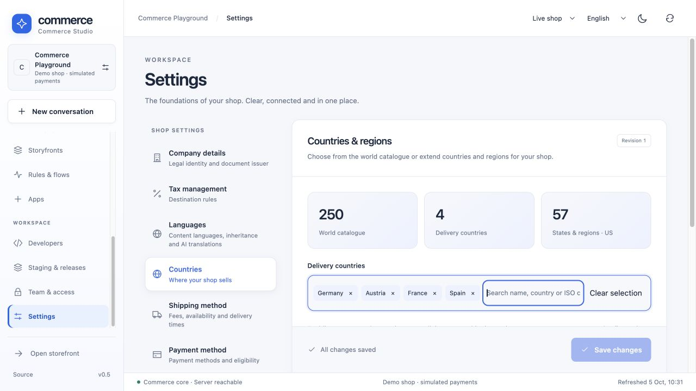
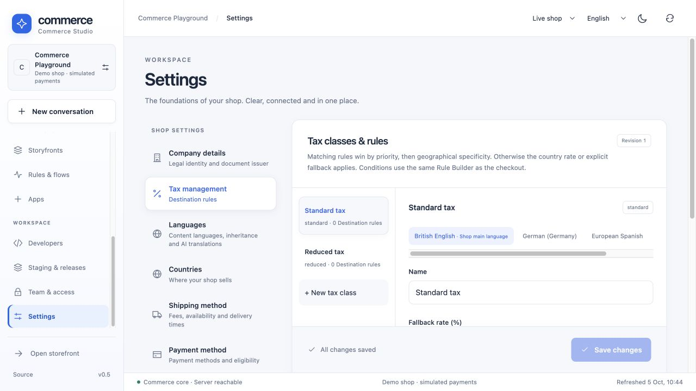

# International commerce: countries, destination taxes and translations

These are native Rust prototype features, shared by Studio, Store API and MCP.
They implement a documented subset of Shopware's country/tax/translation concepts;
they do not establish full upstream schema/API compatibility or current tax law.

## Configure a shop in Commerce Studio

Open **Settings → Countries**. The world catalogue contains **249 ISO
3166-1 assigned entries plus Kosovo (XK, explicitly not ISO assigned)**. Entries
include alpha-2, alpha-3, numeric code, continent and English/German/Spanish/French
names. The US entry includes 50 states, Washington DC and six territories/outlying
areas. Other countries' subdivisions can be added; a worldwide subdivision
catalogue is not bundled. Search by any bundled name or ISO alias, select an entire
continent, or remove individual chips. Shipping/payment and address forms reuse
the same keyboard-accessible picker.

Country definitions are tenant-owned overlays. Edit names, continent and region
codes/names, or add a two-letter custom entry. Official ISO identities are checked
against the bundled catalogue; a custom code cannot claim invented ISO assignment.
Select the subset of countries you actually deliver to. A new country requires
explicit tax coverage, active shipping and an active consumer payment method.
Countries, taxes, methods and languages share one revisioned draft across the
settings navigation. Save the complete aggregate once; conflicting saves fail.

## Tax classes and destination rules

**Settings → Tax management** has a class list and detail editor. Standard/reduced
classes retain their legacy assignments; create additional named classes and
assign them in the product editor. A class used by products cannot be deleted.
Set a country rate or explicitly supply a fallback rate. Enabling another country
never silently creates a zero rate.

Each class can have destination rules with:

- Country and zero or more validated subdivisions.
- Exact postcodes, postcode prefixes and an equal-length numeric postcode range.
- Inclusive start/end dates, evaluated using the server's UTC date.
- Priority and an optional saved Rule Builder condition.

All supplied geographical/date guards must match. Saved rule conditions use
private, authoritative **pre-tax/pre-discount cart facts**, not browser-provided
facts or a recursively computed final quote. Higher priority wins, then postcode
specificity, subdivision specificity and stable rule ID ordering. The fallback
order is destination rule → country rate → explicit class fallback → error.
Product detail with a context token, cart and locked checkout use this resolver.
Anonymous product detail without a cart excludes conditional rules. Orders keep
their original price/tax snapshot after configuration changes.

Shipping supports highest/proportional item tax allocation. Payment availability
is country-aware: `restrictedCountries: true` with an empty `countries` list means
available nowhere. Legacy empty lists without this flag retain their historical
“all enabled countries” meaning. Clearing a restricted list cannot expand access.
A subdivision is required when the destination definition has subdivisions; region
codes from another country are rejected in registration, address book and checkout.

The bundled dataset contains geography, **not a worldwide tax-rate service**.
Merchant-entered rates, thresholds, exemptions and Rule Builder choices need the
appropriate real business configuration. Compound US local/county/district taxes,
external tax services, currency-specific rounding and full Shopware tax-state
resolution remain outside this implementation.

## Content languages and inheritance

**Settings → Languages** controls the shop's main content language and enabled
BCP-style locale keys, including new languages such as `it-IT`. Product and category
editors use that list, rather than a fixed four-language catalog. The storefront
language selector exposes configured content languages; `?language=it-IT` selects
Italian content. Interface vocabulary is English/German/Spanish/French; custom
content languages do not automatically translate the whole interface.

Names/descriptions of shipping/payment methods, tax labels, country/region names,
product/category text, SEO, specifications and rich descriptions are editable with
shop-main-language fallback. The translation badge distinguishes inherited text
from an explicit override. `null`/missing means inherit; an empty description is
an intentional blank. Displaying a fallback does not save a fabricated translation.
SEO fields inherit individually; specification groups and rich documents can be
adopted and reset to inheritance. Existing system-language/variant fallback keeps
its bounded original Shopware comparison; the tenant main-language behavior is a
native extension, tested separately.

### Translate the whole product catalogue with AI

Save the new target language first. Under **Languages → AI translation**, choose
Ollama, OpenAI or Claude from the server-configured providers. Start a job, inspect
progress and source/target drafts, then apply one product or all remaining drafts.
Each provider uses the existing inference adapter; API credentials stay on the
server. Actual configured cloud calls can incur provider charges.

The worker processes one product per leased step, releases its database connection
before inference and uses keyset traversal with an initial upper ID bound. Job and
item progress persist in PostgreSQL. It translates human-readable names,
descriptions, SEO text, specification values and rich-document text/alt/title.
Specification keys, SEO slugs, URLs, units, media and document structure remain
unchanged. This traversal is not a fully frozen catalogue snapshot: concurrent
creation/deletion can change the observed population.

Model output is untrusted: exact paths, count, unique fields, length limits and
safe rich structures are validated. A provider failure leaves a resumable failed
job. Generated drafts never change live products automatically. Apply locks the
configuration/job/product and checks the original product revision, at most 50
items per request. A newer manual edit becomes a visible conflict. Repeat apply
is idempotent. This protects structure and revisions; it does not prove linguistic
quality, factual accuracy or immunity to every model failure.

## Shared API and MCP

`x-tenant` scopes every request; personal merchant/API credentials and ordinary
shop rights apply. `settings.read`/`settings.write` control configuration;
`catalog.read`/`catalog.write` control translation reads/writes (`catalog` remains the internal legacy write alias).

| Endpoint | Behavior |
|---|---|
| `GET /store-api/countries` | Catalogue, enabled delivery countries, main language, locales and configuration revision |
| `GET /api/merchant/commerce` | Stored revisioned international aggregate |
| `PUT /api/merchant/commerce` | `{revision, data}` optimistic validated save |
| `GET /api/merchant/translations` | Recent tenant jobs |
| `POST /api/merchant/translations` | `{targetLocale, inference: {provider, model}, overwrite}`; persist a queued job |
| `GET /api/merchant/translations/{id}?cursor=...` | Job/counts and up to 50 drafts, with `nextCursor` |
| `PUT /api/merchant/translations/{id}` | `{action: "resume"}` or `{action: "cancel"}` |
| `POST /api/merchant/translations/{id}/apply` | Optional `{productId}`; bounded revision-checked apply |

MCP uses those same handlers: `merchant.commerce.read/save` and
`merchant.translations.list/create/detail/control/apply`. Unauthorized tools are
hidden and direct calls are independently rejected. A separate replica can run
with `PROCESS_ROLE=translation-worker`; `all` also starts this worker. Leases,
`SKIP LOCKED` and the shared inference admission limit bound concurrent work.

## Sources, licensing and verification

The checked-in [geography fixture](../fixtures/geography.json) derives from
[countries-list 3.4.1](https://github.com/annexare/Countries) and
[i18n-iso-countries 7.14.0](https://github.com/michaelwittig/node-i18n-iso-countries)
(MIT; included notices under `fixtures/licenses/`). US subdivision codes derive
from the [US Census state reference](https://www2.census.gov/geo/docs/reference/state.txt).
This is a versioned bundled catalogue, not a live geopolitical updater.
[Shopware country configuration](https://docs.shopware.com/en/shopware-6-en/settings/countries)
and [tax configuration](https://docs.shopware.com/en/shopware-6-en/settings/taxes)
provide the product references for this native subset.

Run `scripts/verify_integration.py --only international_commerce translations
catalog_management`. The isolated PostgreSQL suites exercise real prices/orders,
custom geography/classes, non-English inheritance, tenant/MCP denial, durable jobs,
restart, stale apply and local Ollama/OpenAI/Claude protocol fixtures. No paid model
calls or real tax-law validation are part of these checks.

The mandatory [project rule](../AGENTS.md#internationalization-contract-mandatory-for-every-new-module)
and `npm run localization` reject new untranslated UI literals and incomplete
bundled EN/DE/ES country/method/class content. An explicit legacy literal inventory
remains; this gate does not claim that every historic module is fully localized.
The destination guard is extracted to Lean with every Boolean combination and
negative guard mutations. Database transactions, tax-law choices, model output
quality and the surrounding server remain outside that proof boundary.
