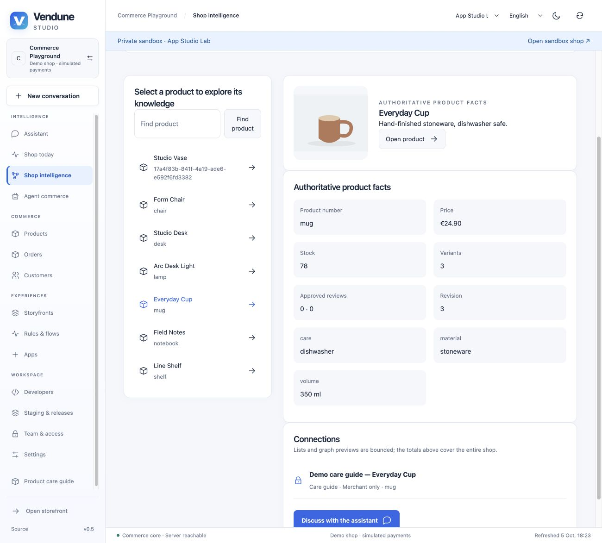
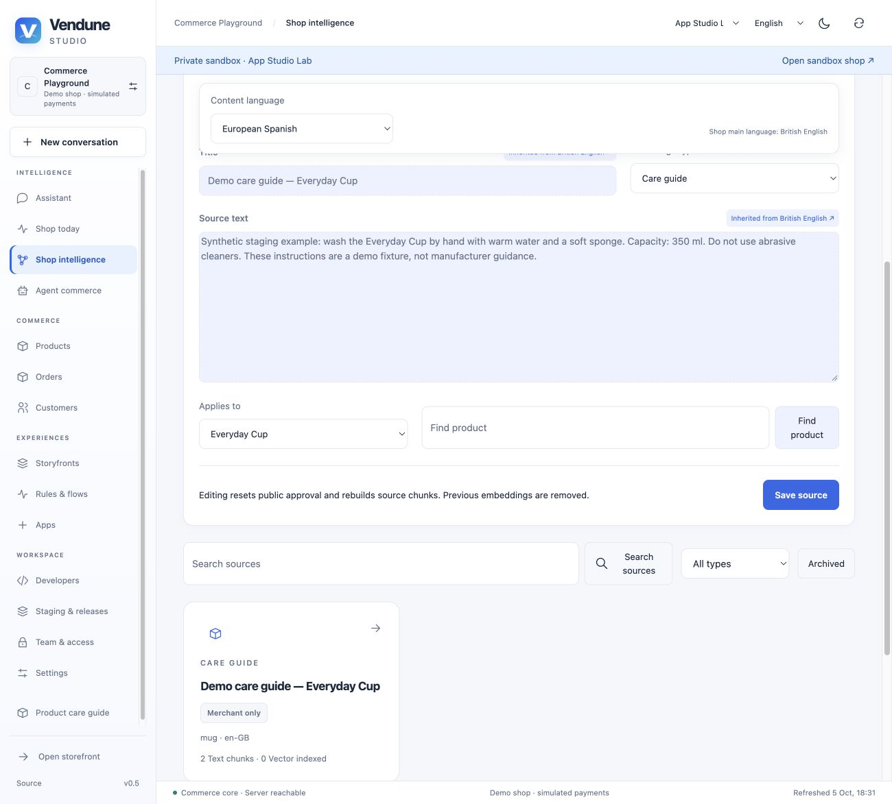

# Knowledge workspace

Open **Vendune Studio → Shop intelligence** (German: **Shopwissen**). The workspace separates authoritative
catalogue data, merchant-managed sources, curated graph connections, order-derived
associations and explicit merchant approvals. It shows actual persisted data;
an empty shop does not receive fabricated questions, support tickets or learning.

## Five connected views

- **Overview**: whole-shop product/source/active-app counts, publication coverage,
  co-purchase associations, approved suggestions, the collect → connect → review
  path, useful next actions and the latest 20 source/approval events.
- **Connections**: find any product through the catalogue API. Inspect current SKU,
  price, stock, properties/specifications, variant/review counts, curated needs and
  complements, observed co-purchases, product/parent/shop documents and active
  private app references. Product-specific graph queries avoid relying on the
  overview's first 48 relationships. Each relationship list remains bounded at 50.
- **Sources**: search before cursor pagination, filter by kind, inspect source text,
  ownership, hash, publication state, chunks and index coverage. Edit a source,
  archive/restore it, or explicitly publish it for customer answers. The separate
  private app browser shows up to 12 active Gmail/Analytics/app source excerpts;
  it ranks exports by query rather than representing a complete inbox.
- **Learning & decisions**: product views, cart additions, approved reviews, processed
  order events and durable co-purchase evidence. Simulated and real-payment evidence
  stay separate. Approval makes an association available to the existing product
  recommendation endpoint. Marking an investigation does **not** start an A/B test.
- **Test & use**: choose a product and customer/merchant audience, enter a question,
  then inspect the actual matching passages, content language and source hashes.
  This preview shares the source scope and language rules of product answers but
  performs lexical retrieval only: no embedding or LLM call and no write. Live
  product answers and the merchant planner may additionally use indexed vectors.

## Try the complete source path

1. Choose **Sources → Add knowledge**. Select data sheet, manual, care guide, FAQ,
   shipping, returns, warranty, brand knowledge or a generic document.
2. Write truthful source text and choose a product or the whole shop. Alternatively,
   upload a searchable PDF, TXT or Markdown file (2 MiB maximum; scans need OCR first).
   Text is bounded to 100,000 UTF-8 bytes, combined translations to 200,000 bytes.
3. Use the single **content language** picker. Missing/null fields inherit the shop's
   primary language, then the source language for legacy foreign-language sources.
   An explicitly empty translated body remains empty. Switching language writes
   nothing and does not fabricate translations.
4. Save. New sources are private. A merchant preview can retrieve them; a customer
   preview cannot. The merchant assistant now consumes source document passages,
   IDs and hashes in its real provider prompt, alongside private app evidence.
5. Open the source and choose **Publish for customers**. Review the shared confirmation
   dialog, then test the customer audience. Only product/parent/shop sources in scope
   are available. Customer source citations are validated against retrieved passages.
6. Editing increments the expected revision, removes old embeddings, rebuilds chunks
   and resets publication to private. Review again before publishing. Archiving removes
   the source from retrieval; restoring keeps it private. Stale edits are rejected.
7. In a private staging shop, prepare sources and translations, review the diff and
   selectively release the `document:<id>` unit. Metadata, language chunks and hashes
   move together. A newer live revision still blocks a conflicting release.

The screenshots use a synthetic private App Studio Lab source, never manufacturer
guidance or live customer records. It remains outside the live shop.

## HTTP and MCP contracts

Merchant authentication and `knowledge.read` protect workspace/source reads and preview.
Source creation/edit/publication/archive and observation approval require `catalog.write`.
The direct merchant planning/chat entry points also require `knowledge.read`.
Viewer roles can inspect evidence without receiving editing controls or write MCP tools.
Every query binds the tenant; callers cannot supply SQL/Cypher or access another shop's sources.

| HTTP operation | Shared MCP operation |
|---|---|
| `GET /api/knowledge/workspace?after=&query=&kind=&archived=false` | `knowledge.workspace` |
| `GET /api/knowledge/product/{id}` | `knowledge.product` |
| `POST /api/knowledge/preview` (`query`, `audience`, optional `productId`) | `knowledge.preview` |
| `POST /api/knowledge/documents` | `knowledge.source.create` |
| `GET /api/knowledge/documents/{id}` | `knowledge.source.detail` |
| `PATCH /api/knowledge/documents/{id}` (complete source, expected `revision`) | `knowledge.source.edit` |
| `PUT /api/knowledge/documents/{id}` (`visibility`, `approve`, `revision`) | `knowledge.source.visibility` |
| `POST /api/knowledge/documents/{id}/lifecycle` (`archived`, `approve`, `revision`) | `knowledge.source.archive` |
| `POST /api/knowledge/documents/upload` (multipart `file`, `title`, optional `kind`, `locale`, `productId`, JSON `translations`) | HTTP upload |
| `POST /api/knowledge/documents/{id}/index` | Existing embedding-index HTTP operation |

Create/edit fields: `title`, `content`, optional `productId`, `kind`, `locale`,
`translations: { "de-DE": { "title": "…", "content": "…" } }` and edit revision.
Translations accept only enabled shop locales; the source locale is represented by
base fields. Publication/archival require explicit `approve: true`. Editing an
archived source is blocked until restore. Exact source content duplicates are reused
on ingestion; editing into another source's same content/ownership is rejected.

Outbox events: `knowledge.document.ingested`, `.updated`, `.visibility`, `.archived`,
`.restored` and existing `intelligence.decision`. These appear as translated triggers in the Flow Builder and reach the existing
durable app-event/flow path, including events without an order. The workspace reports event IDs/timestamps rather than claiming
that every installed app has subscribed or that an automation has completed.

## What learns and what does not

The shop persists sources and order evidence, retrieves them for the actual model
prompt and recommends merchant-approved associations. Its existing layout policy
also records views/rewards; this workspace does not confuse layout learning with
product-variant learning. Model weights remain fixed. No causal uplift, automatic
fact truth, full customer-question log, autonomous experiments or full Shopware parity
is implied. Authoritative price/tax/order decisions continue in the deterministic core.

Customer questions remain read-only and are not silently logged. Gmail/app content
is untrusted quoted evidence and remains merchant-private. Publication is a deliberate
content-review decision, not a mechanism for sharing an entire mailbox.

## Source ownership and verification

- `src/documents/workspace.rs`, `product_knowledge.rs`: census, cursor source list,
  activity and canonical/product-specific evidence read models.
- `content.rs`, `ingestion.rs`, `lifecycle.rs`: bounded enabled-language admission,
  source hashes/chunks, optimistic edits and recoverable publication lifecycle.
- `retrieval.rs`, `preview.rs`, `questions.rs`: shared source/language/archive scope,
  deterministic evidence preview and cited real product answers.
- `tools.rs`, `capabilities/catalog.rs`, `mcp.rs`: HTTP/MCP parity and permission filtering.
- `src/knowledge.rs`: transactional AGE document reassignment and public graph filtering.
- `src/marketing/flows.rs`, `catalog.rs`: shared native trigger registry, non-order source event admission and durable execution.
- `src/planner.rs`: document passages actually feed and persist with merchant proposals.
- `src/staging/documents.rs`: clone/diff/release metadata and chunks as one unit.
- `frontend/src/admin/intelligence/`: small workspace, source editor/library, product
  explorer/facts, observations and preview modules; UI vocabulary in shared i18n.

`scripts/knowledge_workspace.py` checks real PostgreSQL/AGE APIs: privacy, hashes,
translation and non-English fallback, explicit empty values, tenant/role isolation,
revision conflicts, graph reassignment, archive/restore, >50-source pagination,
multilingual upload, selective staging release, MCP parity and an actual
source-ingestion → event rule → completed durable flow without an order. `developer_documents.py`
uses local provider fixtures to prove private document input reaches the merchant
model call, archive removes it, and public product responses validate citations.
The existing `apps` and `connected_apps` suites exercise order evidence and private
app provenance. Component tests exercise inherited editing, publication confirmation,
viewer controls, preview privacy and failures. Rust/format/lint, architecture,
localization and existing Lean extraction/mutation gates remain mandatory. These
checks do not establish whole-core bug freedom or 100% coverage.
