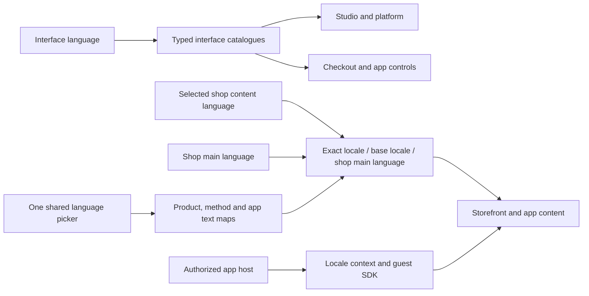

# One translation contract across Vendune

Vendune separates **interface language** from **shop content language**. The
Studio, customer account, checkout, platform console and bundled app controls
ship English, German, French and Spanish. A shop can enable additional content
languages, including regional variants, without adding another field to every
form. New merchant-entered content inherits the shop's main language until an
actual translation is saved.



## Translate interface text without editing components

The existing TypeScript vocabulary modules remain the source of truth. Do not
introduce another runtime dictionary, DOM replacement layer or automatic model
call for interface labels. Export one translator-friendly JSON document:

```sh
npm --prefix frontend run translations -- export /tmp/vendune-translations.json
# Edit entries[].values.en/de/fr/es in a translation editor.
npm --prefix frontend run translations -- import /tmp/vendune-translations.json
npm --prefix frontend run localization
npm --prefix frontend run build
npm --prefix frontend test
```

Each entry has a stable source/module/key identifier, not a line number. Import
changes string literals only. It rejects missing/extra/duplicate keys, missing
languages, empty translations and changed interpolation parameters **before any
file is written**. Export again after upstream catalogue changes. Review and
format the resulting source diff as normal. Imports do not call AI providers or
write merchant data. The current catalogue contains 2,505 interface keys; CI
recomputes the count instead of requiring this number to stay constant.

Interface-language expansion requires updating the shared locale registry,
catalogue layout and formatting tests together. The current tuple catalogues
have the explicit order EN/DE/FR/ES; adding a fifth interface language is a code
change, not merely enabling an extra shop content language.

## Content editors and inheritance

Use `ContentLanguage`, `ContentLanguagePicker` and `LocalizedField`, or the
`TranslationFields` adapter for object maps. One selected language applies to
nested flow nodes, product fields, app fields and attachments. Never display four
parallel language inputs or persist inherited preview values.

For content rendering, `contentText(map, requestedLocale, mainLocale)` reads the
exact requested locale, its legacy base key, the exact main locale, then its base
key. Missing/null values inherit; an explicit empty string remains empty. It does
not select an arbitrary sibling region. Editing uses `contentKey`, which only
edits a legacy base key when it is unambiguous among enabled languages.

For example, a German product-app hint missing in a Spanish-main shop inherits
Spanish. `de: ""` deliberately displays no hint. The old product-slot English
fallback has been removed. Native public app views read the storefront's selected
content language even when interface controls continue to use English.

## Native and external apps

Native Manifest labels, view/block text, entity fields and choice labels use
language-keyed maps and the same renderer as App Studio's preview. Bundled
manifests and assistant templates are checked in all four interface languages.
Custom apps can use arbitrary configured content locales and main-language
inheritance; stable action names, protocol keys and permissions are not translated.

Opaque iframe guests receive `locale` (interface), `contentLocale` (content),
`mainLocale` and `locales` through `commerce.context`. They receive no extra
credentials or authority. With `extensions/sdk/browser.js`:

```js
const sdk = await connectCommerce();
heading.textContent = sdk.uiText({
  en: 'Care advice', de: 'Pflegehinweise',
  fr: 'Conseils d’entretien', es: 'Consejos de cuidado',
});
body.textContent = sdk.text(record.instructions);
summary.textContent = sdk.uiText(messages.count, { count: 3 });
sdk.onContext(() => refreshVisibleText());
```

`uiText` uses the interface locale and an English interface fallback. `text` uses
the requested content language and shop main-language fallback. Both preserve
explicit empty strings and support named parameters. Product Lab and Storyfront's
public connector UI use this SDK. SDK timeouts are localized. Independent apps
own their own translations and must run equivalent checks; Vendune cannot prove
that arbitrary remotely hosted HTML is translated.

The private Experience application remains in its private repository. Its own
`bun run localization` checks shopper, onboarding, design and access-page
catalogues. Generated Storyfront copy and merchant-entered data are content,
not static interface labels; their translation quality needs content review.

## What CI enforces

`npm run localization` is part of required GitHub verification. It checks:

- Rendered JSX prose, accessibility labels, placeholders, display-label props,
  conditional/fallback/template expressions and local string bindings.
- Complete EN/DE/FR/ES catalogue keys and matching `{parameter}` names.
- The world country/subdivision catalogue and seeded methods/tax-class names.
- Bundled app maps and both shipped guest catalogues.
- The prohibition on stacked per-language editor fields.

There is **no legacy UI-literal baseline or recording escape hatch**. The small
`localization-tokens.json` list contains documented proper names, source protocol
identifiers, units and artwork lettering. Never add prose there to silence a
failure. Negative-control tests deliberately add untranslated copy, omit a
language and drop parameters to prove that verification fails.

Static checks do not infer every possible data-flow expression or judge the
quality of a translation. Browser checks and regression tests still need to
exercise dynamic labels, inherited content, stale requests and external apps.
