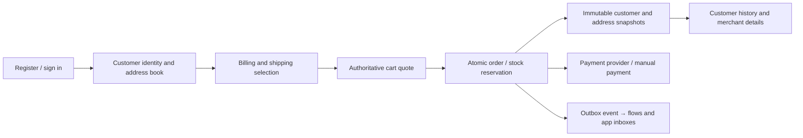

# Customer accounts, orders and merchant operations

The storefront, merchant HTTP API and MCP use the same persisted operations.
All examples use synthetic data. This is a bounded native implementation, **not**
a declaration of complete Shopware Admin/Store API interchangeability.

## Registration through checkout

A registered customer has a shop-owned ID and customer number, email, first/last
name, salutation/title, company, VAT IDs, phone, birthday, preferred payment
method, language/sales-channel provenance, login timestamps, address defaults
and derived order count/amount/last-order date. Price groups and account status
are merchant-owned. Standard read fields are exposed in the customer detail;
`profile` keeps backward compatibility with the early prototype.

Addresses include recipient, first/last name, company/department, VAT ID,
street/house number, postal code (`zipcode` accepted as input alias), city,
ISO country, region/state, two additional lines, title/salutation and telephone.
The prototype uses ISO country codes and native method/channel identifiers;
it does not map every original Shopware UUID or DAL association.

| Store API | Behavior |
|---|---|
| `POST /store-api/account/register` | Structured contacts; optional distinct `billingAddress`/`shippingAddress` created in the same transaction |
| `POST /store-api/account/login` | Argon2 verification, context-token rotation, independent customer session and saved address/payment defaults |
| `GET/PUT /store-api/account/profile` | Own contact/preferences; cannot change group, account status or email identity |
| `GET/POST /store-api/account/addresses` | Own address book, capped at 100 addresses; separate default billing/shipping IDs |
| `PUT/DELETE /store-api/account/addresses/{id}` | Revision-checked edits/deletion; composite foreign keys preserve customer/tenant ownership |
| `PUT /store-api/checkout/context` | Contact, billing/shipping addresses or owning address IDs; method/country eligibility and cart revision checks |
| `POST /store-api/checkout/order` | Idempotent stock-locked order; copied customer and addresses, prices/taxes, delivery and payment records |
| `GET /store-api/account/orders` | Own order history, no shopper context tokens |
| `POST /store-api/account/password` / `logout` | Password changes revoke previous sessions; logout revokes its session and invalidates the supplied open authenticated cart |

Customer requests use `x-tenant` and `x-customer-token`. Cart requests additionally
use the capability `sw-context-token`; address-ID selection needs both the owning
customer session and its authenticated cart. **Entering an email grants no
customer identity.** New guest orders cannot be exposed to a registered account
simply because that account has the same email. Legacy pre-snapshot orders retain
the earlier email-based history path; migrate legacy ownership deliberately
before production import. Completed cart capabilities remain valid for their
payment handoff; logout invalidates open carts, not existing provider operations.

The storefront collects email and billing address for every checkout, with a
separate delivery address when wanted. Financial/manual methods require those
fields server-side. The explicit simulated demo method retains compatibility
with minimal historical headless fixtures. Registrations without addresses are
allowed; the buyer supplies them before the visible storefront checkout.

The explicit synthetic `buyer@example.test` fixture now has an example address.
This does not insert invented addresses into real registered accounts.

## Merchant API and MCP

The CRM supports bounded customer search, detail, contact/group/status changes,
address books and own associated order history. Address routes are:
`/api/merchant/customers/{email}/addresses[/{id}]`. MCP exposes the same code as
`merchant.customer.addresses`, `merchant.customer.address.save` and
`merchant.customer.address.delete`; `id` is the customer's email, `addressId`
is needed for updating/deleting and `revision` fences existing address writes.

Orders have a bounded chronological cursor list, immutable customer/billing/
shipping/quote snapshots, standard totals/line-item/address/transaction read
fields, editable operational state, tracking per delivery, append-only notes,
flow effects and generated documents. The prototype has one native payment
transaction and EUR pricing; multiple partial transactions/currencies and the
complete Shopware conversion/DAL model remain unported.

Order detail returns `workflow.actions` with translated labels, eligibility and
reasons. The UI executes an eligible action once and updates directly from the
server. `requestKey`/`Idempotency-Key` makes repeated identical commands return
the same result; reusing a key for another command or a stale revision fails.
Provider work has a durable job ID and the UI checks that job rather than
submitting another payment command.

`GET/PUT /api/merchant/order-state-machine` exposes the shop-owned translated
state graph. Merchant/app definitions can add states and transitions; validation
rejects cycles through terminal states, unreachable states, duplicate edges,
removed persisted states and executable effects. Business guards still require
confirmed payment/delivery before completing an order; a custom edge cannot
bypass payment/refund/return constraints. The definition can be cloned and
selectively released as `order-workflow`. `sourceApp` records provenance and
requires an active installed app when saved; deactivation does not automatically
undo a merchant's persisted workflow.

A committed transition produces one outbox event: `order.state_changed`,
`payment.state_changed` or `delivery.state_changed`, plus the legacy
`order.updated`. Provider updates emit `payment.updated`. Flow conditions use
an immutable event snapshot, so rapid subsequent transitions do not change the
meaning of an earlier event. Note flows append a visible order activity exactly
once. AI-proposal flows still produce reviewed proposals rather than auto-applying
LLM changes. The graphical full Shopware FlowSequence/branch/action pipeline is
not implemented; current flows have one native note or proposal action.

## Central settings, apps and documents

Settings groups company details, countries, taxes, shipping and payments, with
links to automation/channels, team and model connections. Company/document
issuer data is one revision-bound record at `/api/settings/master-data`.
The legacy receipts-settings route points at the same record. Each issued
invoice/delivery note/cancellation document snapshots issuer and order data,
uses a transactional number range and an idempotency key. Invoices print billing
addresses; delivery notes print shipping addresses. Re-downloading an existing
PDF never re-renders it from mutable customer/company data.

Documents support English/German/French/Spanish labels. The paginated PDF writer
uses WinAnsi Helvetica: full Unicode is preserved in snapshots but characters
outside that font's supported encoding cannot be faithfully printed. Legally
complete invoices, jurisdiction-specific mandatory data, e-invoices, payments
or tax compliance are not certified by these tests.

Apps have their own category catalog and per-package workspace/data/version
pages. `manifest.category` optionally declares `commerce`, `payment`, `api`,
`ai`, `design` or `operations`; older packages remain valid and the UI infers a
category for built-in payment/Storyfront apps. Payment operations belong to
order details; app installation is separate from a global payment ledger.

## Rights and files

Fifteen fine scopes cover catalog, customers, orders, documents, payments,
settings, team, apps and knowledge. Explicit member scopes replace role defaults;
request-time checks re-evaluate active membership and integration-key scope.
Delegation cannot grant rights the actor lacks, including role-default resets
and invitations after an inviter's authority is revoked. Owners keep ownership
invariants. Expiring per-shop API/MCP keys are shown once and persisted hashed.
Sessions and invitations can be revoked individually.

Product attachments/private digital downloads are immutable uploaded bytes
with MIME/magic checks and digest-fenced publication. Paid owning orders pin
published download IDs; a later publication withdrawal does not alter the
purchase. Full refunds revoke access; partial refunds currently retain all
files (there is no per-line refund allocation). Mixed carts only deliver
physical positions; all-digital carts have no delivery or shipping cost.
Four-language rich descriptions render typed text/headings/lists/images/video
without arbitrary HTML/script execution. Binary assets can be privately staged
and selectively released by digest. Uploads are bounded at 8 MiB; this is not an
antivirus or production object-storage pipeline.

## Payments: tested contract, explicit production boundary

The PayPal wallet Orders v2 adapter supports configured Sandbox or Live
create/approval/capture/reconcile/refund, webhook verification, durable pending
refund lookup and amount/tenant/idempotency checks. The official public
`shopwareAG_Cart_Shopware6_PPCP` attribution header is pinned in the adapter and
attempts. Test fixtures verify that header on wire requests. This **does not**
prove actual PayPal partner attribution or a real-money account transaction.
Live mode requires a public HTTPS commerce origin and server-only per-shop
credentials. Read [the original attribution constants](https://github.com/shopware/SwagPayPal/blob/8a1ba382ae1a770f76e415870f68103cd87faa96/src/RestApi/PartnerAttributionId.php)
and [PayPal's request guidance](https://developer.paypal.com/api/make-api-requests/).

Advanced cards, vaulting, alternative methods, authorize/void, disputes and
partner onboarding are not full ports. **Shopware Payments remains unconnected**:
its source is private and a supported standalone connector/onboarding contract
has not been obtained. No private source was copied into this public repository.
No real PSP charge or additional paid model request was performed for this work.

## Verification

`customer_accounts.py` exercises the actual PostgreSQL/HTTP registration,
concurrent address CAS, cross-owner/shop isolation, login/default restoration,
owned checkout snapshots/history, billing PDFs, guest identity separation,
required manual-payment contact, MCP and logout path. `merchant_operations.py`
covers fine rights, immutable uploads/downloads, PDF idempotency, cancellation,
workflow/flow/app events and selective staging. `payments.py` uses a local provider
wire fixture; `services.py` runs a separate real app process with durable inbox.
These are meaningful behavioral tests, not a claim of 100% line coverage or
complete upstream feature/API equivalence.
