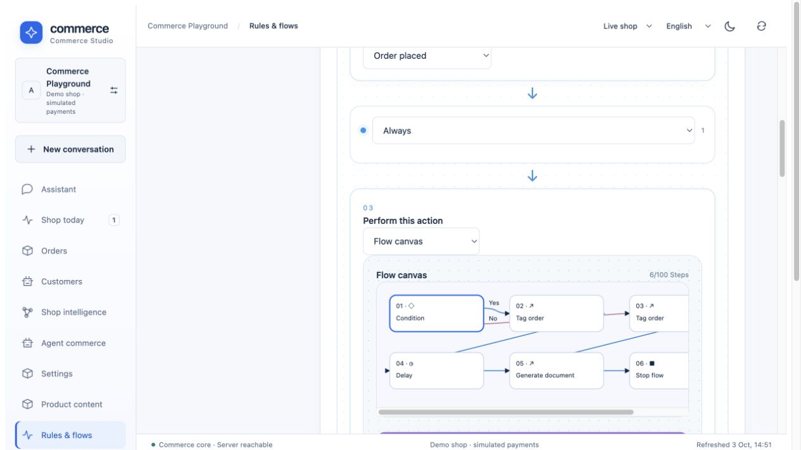

# Try the connected commerce playground

The playground is a separate synthetic shop under your personal merchant account.
It has its own catalog, inventory, orders, apps, rules and settings. Its active
order flow needs no AI model, mail provider or real payment account. Setup creates
no orders; you place them through the storefront.

## Create your playground

1. Start the app with `./scripts/dev.sh` and open `http://127.0.0.1:8787/#merchant`.
2. Create a personal merchant account in **Team & access → Create shop**, or sign
   in to your existing account. Merchant accounts and customer accounts differ.
3. In another terminal, from the repository root, run:

   ```sh
   python3 scripts/playground.py --email your-personal-merchant@example.test
   ```

   Enter that account's password at the private prompt. The script uses only the
   local HTTP API. It creates **Commerce Playground**, prints four links and
   records its ID in ignored `.run/playground.json`. No password or session token
   is stored in that file. Existing personal `COMMERCE_SESSION_TOKEN` is also
   supported; the instance bootstrap credential is deliberately rejected.
4. Open the printed **Studio** link. If asked to sign in, use your personal
   merchant account. Sign-in selects the account's default shop; select
   **Commerce Playground** in the shop picker / **Team & access → Workspace**.

Merchant sessions expire after 12 hours. Studio offers **Sign in to Studio** when
the server rejects the current session and clears previously loaded shop data
across workspaces. Use the same personal account, then select **Commerce Playground**
again if the account's default workspace differs. Session validation also runs
when returning to the visible Studio; it does not use a shared demo credential.

The script accepts loopback HTTP origins only. For a separate local instance use
`--base-url http://127.0.0.1:8789`. A second independent playground uses another
`--state .run/playground-second.json`. Re-running with the same state resumes
setup and preserves existing rules, flows, campaigns, app configuration and
company details. It does not reset merchant edits or recreate orders.

## A ten-minute tour

| Step | Where to go | Try this | Actual result |
|---|---|---|---|
| Product details | Printed product link | Switch mug variant, image and quantity | SKU-specific availability and prices; core quantity calculation |
| Product extension | Mug detail → engraving | Add a short inscription | The installed Wasm app supplies its own form/rule and a taxed cart contribution |
| Coupon | Cart | Apply `TRY10` | A server-calculated 10% campaign discount, including adjusted taxes |
| Customer account | Storefront → Account | Register your own synthetic customer and sign in | Customer profile/address book and own orders; this is not the Studio login |
| Checkout | Cart → checkout | Choose a valid billing/shipping address, delivery and simulated payment | Immutable order/address/method snapshots and one durable order |
| Standard flow | Place one ordinary mug order below €100 | Studio → Rules & flows → Event flows | The No branch adds `playground-standard`, creates an invoice and stops |
| Priority flow | Place two lamps, total at least €100 | Same workspace → Flow executions | The Yes branch adds `playground-priority`, waits 15 seconds, creates an invoice and stops |
| Order operations | Studio → Orders → open your order | Use one eligible next-status action; inspect activity and Documents | State-machine transition/event and the generated numbered PDF |
| Rule editing | Rules & flows → Rules | Edit “Cart total at least €100” | New orders use the changed condition; already queued events retain their frozen definition |
| Sales channel | Printed collection link | Browse Home collection | Only mug, lamp, chair and their variants; a distinct channel-bound cart |

Create a customer account with your own test email/password to exercise registration.
If the instance enables `SEED_DEMO=true`, it also provides synthetic B2B
`buyer@example.test` / `demo-business`. Secure instances with `SEED_DEMO=false`
intentionally do not create that shared account. Playground setup does not bypass
this setting or install a customer with a public known password.

Choose **simulated card** for the initial tour. Bank transfer/invoice follow
different payment states. Use the default channel if you want the whole sample
catalog. Applied coupons and B2B prices can change which side of €100 an order
lands on; the flow uses the actual event-time cart total.

The generated invoice uses visibly synthetic issuer details, under **Settings →
Company details**. It is a demo document, not a certified legal/e-invoice.
Flow executions refresh every three seconds. Open a run to inspect branch choices,
completed actions and a scheduled continuation. Wait for it to complete before
checking **Orders → Documents**. Browser reloads do not discard persisted jobs.



## Try the other workspaces

- **Product content:** select one product, maintain its four translations,
  specifications, rich description/media blocks, SEO metadata and cross-selling.
- **Shop knowledge:** upload a UTF-8 data sheet or searchable PDF, assign a product
  and explicitly publish it. Product questions then use that eligible source when
  a configured model is available. Import/publication does not require a model;
  answer generation does. No OCR or learned model weights are claimed.
- **Staging & releases:** create a private environment, edit a product or rule,
  inspect changes and publish only that selected unit. Staging checkout and
  external service delivery are disabled. A playground is an independent shop;
  staging is a private environment within that shop.
- **Apps:** engraving is installed by setup. Install Email Delivery, Slack,
  Google Analytics, Gmail, Product Lab or Storyfront separately and follow their
  own configuration pages. External service examples need an operator service
  endpoint; OAuth apps additionally need provider clients and consent.
- **Storyfronts:** use [the Storyfront guide](storyfront.md) to connect the local
  Storyfront service, import this shop's catalog and transfer checkout back to
  the same Rust tenant/channel. Scenes and questions may call its configured
  model provider; setup does not provision another Storyfront or run those calls.
- **Developers:** import a reviewed declarative app, or explicitly select a model
  to generate a draft. Inspect its version/digest, install in staging and publish
  selected app/data units. External Codex/Claude Code use the authorized exported
  task/MCP path; arbitrary service compilation/deployment stays external.
- **Team & access:** create a reader invitation or scoped API/MCP key and compare
  allowed reads with rejected writes. Do not use the instance bootstrap token as
  a normal merchant integration.

## Optional AI, mail and agent clients

The installed flow has **no AI, email, Slack or external payment action**. To test
AI deliberately, create a separate flow, add **AI proposal for review**, select a
configured provider and save it. Order-triggered proposals must still be reviewed
before applying changes. OpenAI/Anthropic API credentials are separate from
ChatGPT/Claude subscriptions; cloud calls may incur charges.

Email Delivery provides preview/dry-run before real delivery. Configure SMTP,
Resend or SendGrid before using a real-send node. Slack/Gmail/Analytics need their
own credentials. No provider credentials are included in the playground.
Connect a local MCP client using [connectors.md](connectors.md); automation HTTP
and MCP use the same handlers and rights. Hosted clients need a reachable HTTPS
backend; localhost cannot serve a remote ChatGPT/Claude account directly.

## What “try everything” means here

This tour covers the implemented prototype. Disabled rules, complete original
FlowSequence import/export, all upstream triggers/configurations, production
identity recovery, Shopware Payments and a public commerce deployment remain
outside it. [Automation contracts](automation.md), [feature inventory](features.md)
and [the Shopware parity matrix](shopware-parity.md) give precise boundaries.

`scripts/automation.py`, in the isolated integration suite, runs the same setup
CLI, edits a rule, repeats setup to prove that the edit survives, and places both
orders. It checks their actual tags and generated invoice records. It also checks
that the state file contains no session token and has private permissions.
The suite uses no paid provider, mail delivery or live payment account.

## Manage the catalog

Open **Products** in Studio. Search by name or product number, filter status,
category or low stock, then select a row. Use **Create product**, enter a unique
number/name, price/stock and category, and save. New products start inactive;
activate deliberately to expose them in the Store API. Edit four content languages
and rich descriptions in the same detail view. Under **Categories**, manage the
translated tree; the storefront category bar uses those real assignments.
[Full product guide and scope](product-management.md).
