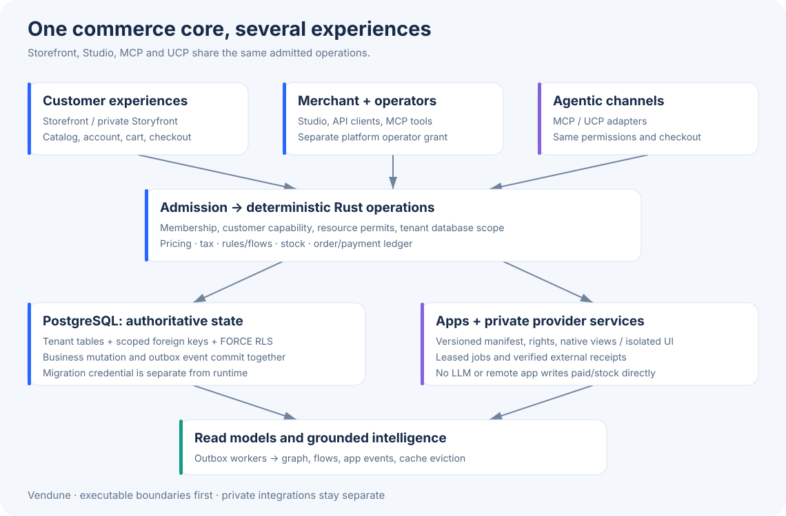
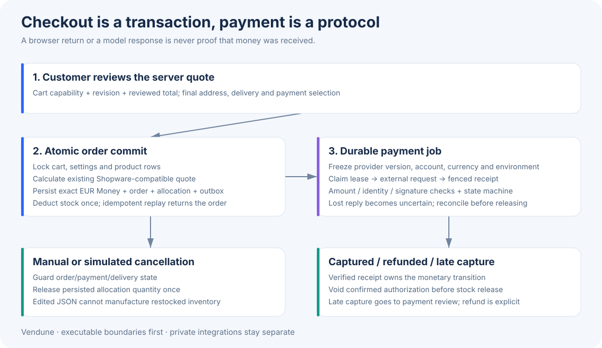
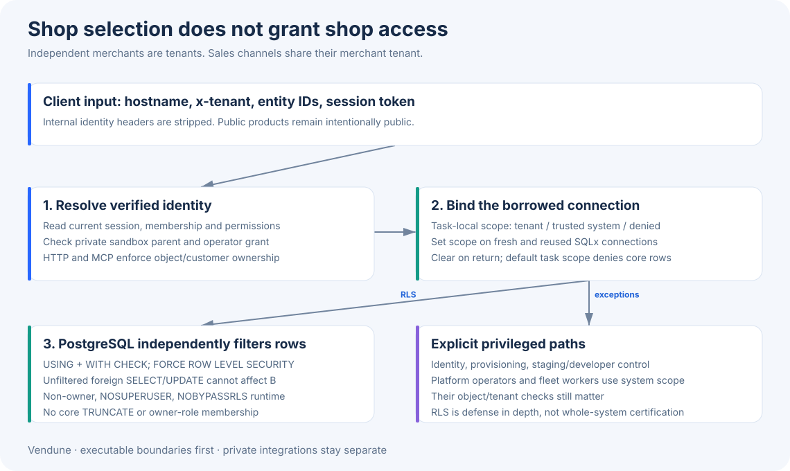
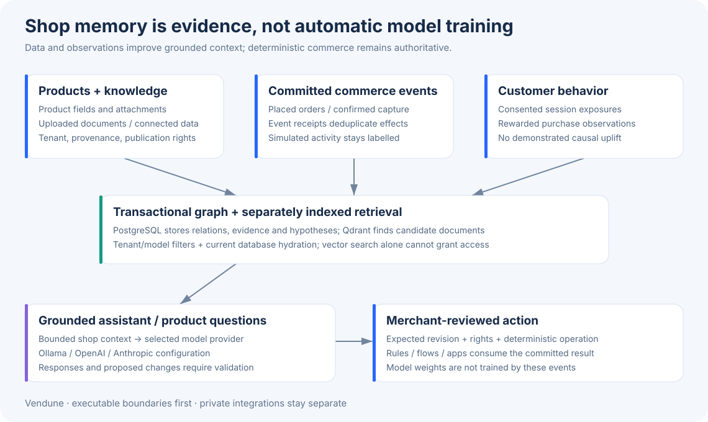

# How Vendune works: production architecture

Vendune has one deterministic Rust commerce core. The storefront, merchant Studio,
API clients and MCP/UCP adapters call that same core. AI helps find information,
explain behavior and propose changes; it does not decide whether a payment is
received, a user is authorized or stock can be sold.

This guide describes the executable architecture, its current protection boundaries,
and the next migrations. It complements the [feature tour](features.md),
[Shopware mapping](shopware-parity.md), [module inventory](module-inventory.md)
and [test coverage](testing.md). Diagram images open at full size.

## Follow a real request

1. The browser selects a shop and sales channel. A hosted subdomain resolves to a
   stored frontend binding. A sales channel is an experience within a merchant
   workspace; an unrelated merchant is a different tenant, not another channel.
2. Authentication strips caller-supplied internal identity headers, resolves the
   current session, all grants and shop status in one authoritative query, and checks explicit route/method permission. The trusted Principal lives in request extensions. Customer
   operations also verify the customer/cart/download capability.
3. Resource admission takes bounded process and tenant permits. Checkout uses a
   separate process pool, so catalog traffic cannot consume all checkout permits.
   Interactive AI admission also reserves a durable daily quota before the handler.
4. A task-local database scope follows the admitted request. Fresh and reused
   SQLx connections receive that scope before queries; explicit transactions use SET LOCAL. Session mode rebinds every borrow without an extra reset query; transaction-pool mode scopes direct queries as well. Unknown tasks receive an empty, denied context.
5. The native handler validates its entity IDs, rights and expected revision.
   Mutations use PostgreSQL transactions and write their outbox events in the same
   commit. MCP and UCP use these operations rather than a separate payment engine.
6. Workers consume the committed events. They update read models, project knowledge,
   evaluate flows, deliver app events or execute payment commands. Slow model/provider
   calls are outside checkout locks. The browser receives the native API result.

## What lives where

| Responsibility | Actual implementation | Authority |
|---|---|---|
| Merchant identity and permissions | `src/auth/`, `src/accounts/`, `src/auth/middleware.rs` | Current PostgreSQL session/membership; no client principal |
| Tenant-scoped database leases | `src/request_context.rs`, `src/tenant_scope.rs`, `src/scoped_pool.rs`, `src/performance/{pool,row_security}.rs` | Server-derived scope; PostgreSQL row policies |
| Product, category and checkout operations | `src/commerce/`, `src/order_checkout.rs`, `src/cart_*.rs` | Locked catalog/settings/cart snapshot |
| Exact money boundary | `src/money.rs` | Checked minor integers and explicit currency scale |
| Stock allocation | `src/commerce/inventory.rs`, migration 047 | Persisted quantities linked to tenant + order + product |
| Payments | `src/payments/{state,storage,generic_receipts,worker}.rs` | Verified receipts, immutable provider identity, fenced durable jobs |
| Rules, flows and app events | `src/marketing/`, `src/apps/`, `src/outbox.rs` | Versioned contracts and current action permissions |
| Read caching and admission | `src/performance/` | Bounded memory; authoritative SQL versions; outbox eviction |
| Shop memory and retrieval | `src/cognition/`, `src/knowledge/` | Provenance/publication filters and persisted event receipts |
| Operator controls | `src/platform/` | Separate personal operator grant, audit and revisions |
| Migrations / startup | `src/migrations.rs`, `src/migrations/schema.rs`, `src/bootstrap.rs` | Append-only checksums and separate migration credential |

The [complete module inventory](module-inventory.md) includes every source file.
The [source map](source-map.md) maps additional behavior to its real tests.

## Checkout, stock and monetary truth

The final checkout locks the cart, product rows and effective settings. It recomputes
price/tax/shipping/promotions and checks the cart revision and reviewed amount.
An idempotency key identifies the purchase, not simply the HTTP request.

The same transaction writes the order, deducts available stock, creates an allocation
for every order line and writes `order.placed`. This allocation now exists for manual,
simulated and provider-backed methods. Cancellation uses its persisted quantity,
not an editable line-item snapshot. Setting `released_at` and restoring stock happen
atomically; repeat cancellation cannot release stock twice. Existing order allocations
are backfilled by migration 047 where their referenced product still exists.

Provider-backed checkout also creates a payment attempt and durable command. Its
provider version, merchant account, environment, currency and amount are frozen.
The worker claims a lease, commits the claim, calls the provider and applies the
verified receipt in a fenced transaction. A timeout can mean that the provider
already charged money: it leaves reconciliation work, not an automatic paid flag
or automatic stock release.

The central payment state machine admits:

- Pending → ready → approved → authorized → captured, with valid skips for
  provider contracts that capture immediately.
- Uncaptured cancellation/expiry, with explicit void confirmation for an authorization.
- Captured → partial refund → full refund; terminal refund never returns to ready.
- Cancelled/expired → late capture → payment review, with an explicit refund path.

Amount, currency, account, signature and receipt allocation checks remain separate
from state admission. The state graph alone cannot prove that an external charge
occurred. Local provider fixtures cover authorization/void, capture, lost replies,
partial refunds, restart and duplicate notifications. Real provider credentials,
merchant onboarding and live acquiring require separate integration evidence.
Shopware Payments implementation and attribution remain in the private repository;
the public core exposes the [generic payment contract](payment-provider-api.md).

### Money: exact boundary, deliberate migration

New `Money` values contain an `i64` minor amount and a `Currency { code, scale }`.
For example, EUR 12.34 is `1234` with scale 2; JPY 1234 uses scale 0; KWD 1.234
uses scale 3. Parsing/formatting uses integer arithmetic, rejects ambiguous precision,
and supports checked addition only for matching code **and** scale. Scale is bounded
to six; signed credit amounts including `i64::MIN` round-trip without overflow.

The active checkout supports a channel-selected currency. Orders include an explicit
`money` snapshot; the payment ledger persists its currency scale (including zero
and three). [The multi-currency guide](currencies.md) explains automatic/fixed
pricing, saved rates, protocol contracts and tested provider boundaries.

The Shopware-ported calculators still reproduce the original PHP float behavior.
The currency-aware checkout boundary preserves the existing calculator rounding and rejects
non-finite, negative or out-of-range payment totals. This is a carefully defined
boundary, not a claim that all tax and discount arithmetic is now integer-based.
`scripts/money_boundary_differential.py` compares the actual boundary against original
Shopware calculator results; the existing price/context/delivery/rule differential
gates remain required. The next arithmetic migration must retain those gates and
introduce explicit rounding rules for every intermediate operation.

## Independent SaaS shops and row security

Migration 044 installs `ENABLE` and `FORCE ROW LEVEL SECURITY` on current public
core tables with a tenant column. Managed app tables keep their existing forced
app policy. New tenant tables must add equivalent policies, scoped foreign keys and
adversarial tests. Strict startup checks coverage, the effective runtime role,
owner-role membership, `BYPASSRLS`/superuser status and core `TRUNCATE` privileges.

**Enable strict runtime enforcement with both `DATABASE_RUNTIME_URL` and
`DB_RLS_REQUIRED=true`.** Migration owner and runtime credentials must differ.
PostgreSQL superusers and `BYPASSRLS` roles bypass row security even when forced;
installing policy SQL while continuing to use that role does not secure a deployment.
See the [PostgreSQL row-security documentation](https://www.postgresql.org/docs/current/ddl-rowsecurity.html).

The runtime uses task-local tenant context and the shared `ScopedPool` executor.
Explicit transactions batch BEGIN and SET LOCAL; transaction-pool mode also wraps
direct queries in a scoped transaction. Session mode binds every checkout, with no
second reset query on return. Unknown tasks fail closed. Transaction pooling is
verified through actual PgBouncer with one backend, protocol prepared statements
and two Rust replicas. It needs a separate direct/session `DATABASE_LISTENER_URL`;
statement pooling is unsupported. [Configuration and all eighteen review fixes](core-hardening.md).

Identity resolution, authenticated platform operations, registration/provisioning,
staging/developer control paths and fleet workers deliberately use trusted system
scope. Their existing ownership checks still matter. Ordinary shop business requests
receive a tenant scope. Apps receive capability contracts, never the migration URL.
Dynamic app tables need their own schema owner for additive upgrades; the runtime
must never own the core tables. This is defense in depth, not a proof against SQL
injection, a compromised process, all side channels or arbitrary external services.

### Deploy safely

1. Apply migrations with `DATABASE_URL` using `BOOTSTRAP_MODE=migrate`. They keep
   their old checksums and add 044–047; migration 047 scans historical order lines,
   so plan DDL/backfill locks for large live installations.
2. Provision a dedicated runtime login through the database/secret manager.
   [runtime-role.sql](../deploy/sql/runtime-role.sql) grants only core DML/reference
   privileges, grants existing core tables (excluding connector credentials) and transfers **only managed app tables**
   to their app schema group. Run it as the actual migration owner after additive migrations; rerun role provisioning for new tables. Never grant the migration owner to runtime.
3. Set `DATABASE_RUNTIME_URL`, `DB_RLS_REQUIRED=true`, `BOOTSTRAP_MODE=serve` and
   `ALLOW_BOOTSTRAP_AUTH=false` for public HTTP and worker deployments. Membership
   in `vendune_runtime` must be inherited by the runtime login. App tables may be
   owned by that limited app-schema group; core tables stay with the migration owner.
4. Reserve `DB_POOL_MAX + 2` per process for the pool and listeners against the shared `DB_CLUSTER_CONNECTION_BUDGET`. A fenced heartbeat enforces this fleet budget; a lost lease stops its process.
5. Run the strict `production_foundations` suite on a disposable database and test
   registration, ordinary and sandbox operations, callbacks and cold restart before
   switching public traffic. Public hosting secrets/configuration are operational
   work; a local regression does not establish that the public deployment uses RLS.

## Caches: commit-driven eviction, version-driven correctness

Decoded settings are bounded by entries and estimated bytes. Request memoization
avoids duplicate context work within one read request. Keys contain tenant/channel;
a primary-database version probe still validates every new request.

Committed outbox insertion produces a PostgreSQL notification containing only its
tenant identifier. Each HTTP/worker replica has a listener and evicts that tenant's
settings entries. Configuration writes generate explicit `cache.invalidate` outbox
rows. Rollback emits no notification. Missed notifications cannot grant stale values:
a version probe rejects them; reconnect also clears cached entries. Language cache
correctness still uses the authoritative registry version. This is eager invalidation
without making transient notification delivery the authority.

The listener is a performance hint. Business outbox delivery remains durable and
transactional. Do not replace it with a volatile event bus or a cursor that assumes
sequence IDs commit in numerical order. No public personalized page, cart, token,
customer response or authenticated MCP result is shared through a public CDN cache.
See [read performance](read-performance.md) for the measured baseline and limits.

## Admission, quotas and observability

| Configuration | Default | Meaning |
|---|---:|---|
| `HTTP_CONCURRENCY` | 128 | Process permits for ordinary API requests |
| `CHECKOUT_CONCURRENCY` | 32 | Separate reserved process permits for checkout/payment/UCP |
| `TENANT_CONCURRENCY` | 16 | Concurrent API requests per tenant across replicas (plus local defense) |
| `TENANT_AI_CONCURRENCY` | 2 | Interactive AI requests per tenant across replicas (plus local defense) |
| `TENANT_AI_DAILY_QUOTA` | 1000 | Default durable admitted interactive AI attempts per UTC day |
| `DB_POOL_MAX` / `DB_POOL_WAIT_MS` | 20 / 5000 | SQL connection capacity and bounded queue wait |

Admission uses immediate permits and returns 429 plus `Retry-After` on saturation;
permit drop also handles cancellation. Tenant bookkeeping is bounded to 4096 active/
recent tenant budgets, and unvalidated callers share an anonymous bucket, so arbitrary tenant headers cannot allocate new entries.
Checkout's separate process capacity still shares the configured tenant cap and SQL
pool: this is not a guarantee of unlimited checkout throughput.

The daily interactive AI quota is an atomic PostgreSQL reservation shared by replicas.
A private stage charges its live workspace through a narrowly scoped quota query;
sales channels already share that same tenant.
Failures count once admitted; a timeout may already have consumed provider resources.
Platform operators configure a shop through `GET/PUT /api/platform/shops/{id}/quotas`:
`{ "revision": 1, "dailyAi": 200 }`. Revisions reject lost updates; changes are audited.
This quota counts `/api/experience`, `/api/concierge`, agent chat/plan and product
`/questions` and `/ask` HTTP routes, not tokens, actual
provider spend, every MCP-derived AI action, background translation/image jobs or
identity-broker usage on behalf of another shop. The actual model boundary also has shared concurrency leases for translation, image, developer and broker work; these limit concurrent calls, not tokens or spend. A complete tenant AI cost cap remains unimplemented.

`/api/platform/infrastructure` exposes bounded latency histogram buckets, calls,
failures, capacity and rejection counters, SQL pool/read-cache diagnostics and
persisted channel traffic. Bootstrap-only `/api/runtime` remains a local diagnostic;
public hosting should use the personal operator interface. Histogram and concurrency
values are process-local; persisted channel counts are fleet diagnostics. They are
not visitor counts, and the buckets are not measured p95/p99 values. Process restarts
reset these local counters. No raw URLs, customer data or tokens are metric labels.

## How shop intelligence is connected

Product edits and knowledge ingestion store source-linked graph data in PostgreSQL.
Configured embedding workers separately index retrieval vectors in Qdrant. Search
uses tenant/model filters and hydrates candidates through current database and
publication checks. An embedding result is a candidate, not authorization.

Committed order/payment events pass an event-receipt deduplication fence. Confirmed
provider captures produce observed product pairs, evidence-linked relationships and
reviewable bundle hypotheses. Uncaptured external payments do not count as captured
purchases. Simulated observations remain labelled. Personalization records session
exposures and rewarded outcomes; there is no demonstrated causal sales lift here.

The assistant receives bounded, scoped context and calls the configured model.
Current AI integrations do not change model weights after transactions. "Learning"
here means persisted observations and reusable context, not online training or proof
of economic benefit. A proposed action still needs rights, an expected revision and
a deterministic native operation. Flows can invoke configured AI/app actions under
the same declared capabilities; provider output cannot become an unchecked SQL command.

## What the gates actually establish

- Rust tests cover exact scale/amount boundaries, signed overflow, mismatched currencies,
  scoped task restoration, semaphore cleanup and monotonic payment transitions.
- `production_foundations` runs two real Rust replicas under a non-owner, non-bypass
  database login, deliberately omits tenant predicates, attempts foreign mutations,
  repeats checkout/CRM/tenant regressions and checks commit/rollback cache events.
- `transaction_pooler` repeats the strict-runtime suite through a real one-backend PgBouncer; poison-event, retention, login-backoff and shared-limit controls also run in both modes.
- Payment suites use local provider fixtures for restart, capture/refund, duplicate
  notifications, version/account pinning, authorization/void and uncertain receipts.
- Original Shopware differential suites guard the ported behavior and money boundary.
- Lean extracts 30 named policies, including currency precision, bounded quota and
  ledger transition admission. It does **not** prove the float bridge, all Money
  arithmetic, SQL pool hooks, migrations, external providers, browser or entire core.
- The documentation build mirrors all tracked Markdown, copies local SVG assets,
  checks links/anchors/publication inventory, and publishes a searchable site after
  a merge to `main`. These diagrams are rendered assets, not unrendered fenced code.

Remaining production work includes complete integer pricing/tax migration, per-tenant
worker/provider token and spend admission, finer runtime/worker privilege separation, large-scale DDL/backfill validation, full telemetry
export/traces/alerts and independently reviewed public deployment hardening.
