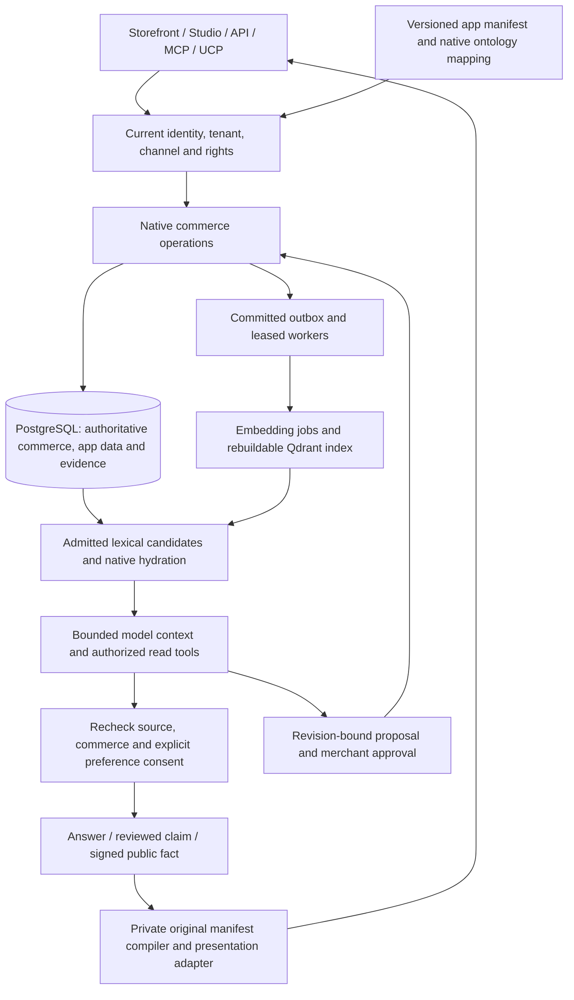

# Connected release: changes and end-to-end acceptance

This record covers the 8–9 October hardening, app-platform and cognitive-commerce
work and the subsequent documentation/acceptance pass. Core source is
`598bbec112165fcac1847797786e2ba5c606e06f`; private Experience is
`f970543124d669971330945f74b87e9c799a76e4`, pinning original Storyfront
`2087783606e5c925317bae57625256a82c16bff0`. A source pin, a passing fixture and a
public deployment are distinct evidence. Historical screenshots, model examples
and performance results retain their original dates and conditions.

[Current release](current-release.md) · [Changelog](../CHANGELOG.md) ·
[Machine-readable source/CI inventory](evidence/release-acceptance-2026-10-09.json)

## One connected system

The model does not own price, stock, customer identity, permissions or payment
state. PostgreSQL is authoritative; retrieval indexes can be rebuilt. The private
presentation adapter delegates shopping and checkout to Core. There is no second
commerce implementation, independent app knowledge database or replacement queue.

## Runtime, identity and database changes

The [eighteen-point core repair](core-hardening.md) now uses a typed request
Principal, declared route/method rights and one current identity/grant query.
Caller-supplied identity headers cannot become merchant authority. Unknown API
routes deny access. Persistent login backoff survives another replica. Only
admitted shops receive tenant buckets; random tenant names cannot exhaust a map
of real-shop budgets. Native scripts use a strict CSP, and production startup
checks its validated role/provider/proxy configuration.

Database deployment separates migration credentials from a non-owner,
non-bypass serving role. Forced RLS, scoped operations and composite tenant
references protect native and managed app tables; trusted system operations and
database administrators retain privileged authority. Transaction-local context
supports real transaction-mode PgBouncer. Fleet leases budget connections and
API/model/app work across processes; losing the lease stops the process.

Wasm compilation uses a bounded cache, single-flight compilation and blocking
work permits; compilation is moved out of commerce locks. Image decoding runs
outside async request executors. Existing fuel, stack, memory and table limits
remain. Commit notifications wake the existing durable workers; polling remains
recovery for missed hints. Per-event savepoints prevent a poison outbox event
from rolling back healthy neighbors; attempts, quarantine, explicit recovery and
bounded retention persist in PostgreSQL.

[Request performance](read-performance.md) additionally reuses a current request
admission snapshot, skips identity SQL for native public assets, serves compressed
build variants with correct negotiation, borrows decoded settings, batches sorted
inventory work and limits dashboard fan-out. The recorded 9,000-request comparison
has unchanged business fingerprints; it is not a universal speed-up claim.

## Apps and visual development

The [app platform](app-platform.md) uses an immutable manifest, exact review digest
and explicit permission consent. Tenant/app/model-specific tables avoid schema
collisions. Server validation enforces types, bounded nested inputs, references,
uniqueness, indexed cursor lists and record revisions. Small explicit schema
migrations validate records before atomic installation and keep recovery snapshots;
large/relation migrations require an offline plan.

Native views, existing product/customer/order editor mounts, storefront surfaces,
API/MCP actions and Flow steps share the gateway. Short surface grants bind actor,
package, allowed actions and context IDs. Scoped callback keys expire and intersect
the creator's current rights. Approved service digests prevent a merchant app ID
from inheriting operator provider authority. Private media uses the existing asset
owner. Event payloads follow granular subscription and PII grants; bounded lanes,
batches, leases, retries and replay remove the former single slow global lane.
Long jobs, publisher/dependency admission and bounded pure WIT commerce hooks reuse
existing jobs, outbox and native calculation owners. Custom iframes remain a
restricted extension boundary, not a proven hostile-code microVM platform.

[App Studio](app-studio.md) and coding agents edit the same contract. Optional
`intelligence.ontology` maps a bounded selection of real app fields and native
references into namespaced nodes/edges. API, MCP and planner tools receive only
currently admitted projections and revisions. Model/field deletion prunes the
mapping. The [ontology-care example](../extensions/apps/ontology-care/README.md)
shows translated care advice attached to products without moving app logic into
Core. Ontology projection does not establish global graph traversal or turn
unstructured app text into reviewed product evidence.

## Intelligence, evidence and safe actions

[Cognitive commerce](cognitive-commerce.md) connects these changes:

- **Index lifecycle:** transactional batched embedding jobs, model/dimension
  generations, restart-safe cursors, pooled Qdrant transport, optional named text
  vectors/INT8 and shared tenant model admission. Source updates reach the existing
  worker; the vector store remains a projection.
- **Retrieval:** admitted lexical candidates plus dense results combine by reciprocal
  rank fusion, with optional bounded TEI reranking. Forced-RLS tenant/lexeme B-tree
  projections narrow product/document candidates before native hydration. Current
  hashes, visibility, model generation and locale still gate the result. This is
  not BM25/sparse/image retrieval.
- **Serving and tools:** self-hosted OpenAI-compatible chat and task-model routing,
  optional provider-native system-prefix caching, bounded authorized read rounds
  and native SSE acceptance/progress/final events. The planner uses current
  capability rights and a currency-neutral prompt. SSE is not token streaming;
  tools do not grant generic autonomous writes.
- **Evidence:** exact-quote source claims have source identity/revision/hash,
  time/type/review history and proposed/confirmed/rejected lifecycle. On-demand
  and opt-in document-event extraction reuse Flow and the same daily AI budget.
  Confirmed public facts feed saved localized category queries and Ed25519-signed
  public facts through native API/MCP/UCP extensions.
- **Prices and experiments:** explicit price corridors, margin limits, budgets,
  idempotency and current approval guard the implemented price-only autonomy.
  Layout experiments use consent enrollment, randomized holdouts, fixed horizons,
  CUPED and delayed captured net cash. No real economic uplift or broader
  autonomous optimization is inferred from synthetic checks.
- **Buyer privacy and freshness:** explicit advice consent and bounded preference
  memory are rechecked after inference, including withdrawal, forgetting and
  identical erase/recreate races. Product answers recheck every supplied source,
  including uncited inputs. Advice rehydrates the channel-admitted native products
  after inference; price, stock, locale, channel pause or source changes return
  localized retry guidance. Shared quota refusal happens before provider invocation.

A recorded selective 20,000-product SQL microbenchmark returns identical JSON and
measures a warm median **36.209 → 0.243 ms**. This measures one SQL path under its
reported RLS role; it is neither an end-to-end API benchmark nor a million-product
or model-throughput result. [Raw conditions](evidence/lexical-rls.json).

## Private Experience and original Storyfront

The private adapter batches current confirmed public Core claims into the exact
original manifest/compiler. Source withdrawal blocks the corresponding native
consumer. Product/SKU/channel/tenant binding stays canonical; editable presentation
facts cannot redefine money or inventory. The integration suite runs original
retrieval, composition and cinematic adaptation, not a separately recreated engine.

The native container separately builds and boots the original Astro Studio and
Cinematic applications, imports a signed synthetic catalog, persists an original
brand edit and refuses anonymous/foreign owners. The retained React fallback and
explicit native activation remain different deployments. Original worker provider
inheritance, full advanced-media import, complete original UI localization and
universal binding of every generated/edited free-text claim remain open. Private
runtime/provider code is not published in the public repository.

## Repeatable acceptance and measured limits

All checks use fresh synthetic shops or explicit fixture databases. Provider
protocols are loopback fixtures: no external email, paid model request, image
generation or real payment is required. The suites cover allowed and denied
operations and persisted effects, not simply endpoint availability.

| Check | Evidence / scope |
| --- | --- |
| Complete merged-Core CI | [Run 37868239729](https://github.com/sthamann/vendune/actions/runs/37868239729), successful against `598bbec`; units, formal checks/mutations, original PHP comparisons, native DB/provider contracts, coverage and build |
| Rust/compiler checks repeated locally | 187 tests (48 library + 139 server), formatting and strict clippy pass |
| Frontend repeated locally | 387 tests / 64 files; build, formatting, module ownership and four-language checks pass |
| Complete integration rerun | All 48 HTTP + 17 provider/connector + four browser contracts + three tooling suites pass locally in a fresh database after the fixture repair; original registry remains the single owner |
| Original Shopware slice comparisons | 2,144 price, 1,446 context, 1,002 delivery-tax, 1,976 primitive-rule and 432 condition-class cases; no mismatches in those slices, not full Shopware equivalence |
| Formal subset | 45 extracted policies, 97 properties, 142,298 compiled comparisons; 122 broken-policy, 14 syntax, three stale/disconnected-binding and nine proof-shortcut negative cases rejected |
| Private application repeated locally | 197 tests / 40 files; 15 original integration tests / 133 assertions / three files, build and packaged startup pass |
| Private PostgreSQL restart | Synthetic verified session/job persists through a new process; consumed code replay and foreign ownership denied |
| Real Core + private compiler purchase | Four-language native catalog; one 29.80 EUR simulated native order, identical replay and owner-visible merchant order; disposable databases removed |
| Real browser purchase | Default fashion catalog, size L, customer registration, structured address, standard shipping, explicit quote review and persisted 43.90 EUR simulated order; customer account shows that order/details, an independently saved billing/shipping default address survives logout/login, 390px order layout has no horizontal overflow |
| Browser vs contract tests | Actual browser checks supplement jsdom and HTTP fixtures; the four registry browser contracts are not four complete visual journeys |
| Private native container | Required independent private CI; original applications and synthetic ownership with workers/providers disabled; no public activation inferred |

A native local mail/Flow test exposed a verification-tool defect: it hard-coded
Docker while the shared fixture had selected native PostgreSQL. It now uses the
existing `testing.database.psql` helper. The same nine mail checks pass against the
selected native server and retain Docker CI behavior. No delivery implementation,
provider protocol or assertion was relaxed.

The [machine-readable record](evidence/release-acceptance-2026-10-09.json) contains
exact merged-Core CI metrics. Its line coverage is **90.55% Rust / 63.23% frontend /
81.34% Python tooling/reference scope**. Rust regions are not branch coverage.
Private application coverage, CSS, guest SDK instruction coverage, Wasm instruction
coverage, live provider semantics and production capacity remain unmeasured.
The system is not 100% tested or proved bug-free.

## Documentation and deployment acceptance

README, changelog, feature tour, current release, testing, formal evidence, API
explorer counts, core-hardening deployment guidance and website release copy are
updated together. The exact generated source inventory is checked for drift.
All **155 tracked Markdown sources** build into **162 HTML pages**; the site checker verifies **3,900 internal links/assets**, each
source destination, links/anchors, search, sitemap, unique metadata and dated media
hashes. The published HTML must be checked separately after GitHub Pages deployment.

Northflank rollout, strict production role configuration, authenticated public
onboarding, public native rendering and real payment/OAuth/mail acceptance require
separate observations. Documentation publication and a Vercel preview do not deploy
the Rust services. The [audit completion tracker](cognitive-commerce.md#audit-completion-tracker)
keeps every unfinished request visible: continuous multi-source extraction, wider
autonomy, richer semantic traversal, cross-device customer memory, causal return/
margin experiments, validated forecasting, recurring goals, full native Storyfront
broker/media/localization and the remaining production infrastructure work.
