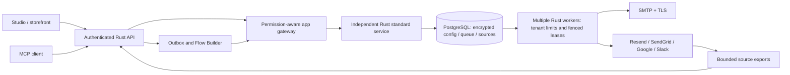

# Rust standard services and language boundaries

Vendune's commerce server and bundled Email Delivery / Google Analytics / Gmail / Slack
service run in Rust. The connector is a separate process (`cargo build --locked --bin
connectors`), not provider logic embedded in checkout handlers. Both services use
PostgreSQL; connector private records are encrypted with AES-256-GCM, bound to tenant
and app, and protected by forced RLS. The shared gateway alone supplies tenant identity.
The public UI never receives gateway/provider keys. Run an ordinary database role with
`NOSUPERUSER NOBYPASSRLS` and `DB_RLS_REQUIRED=true`; startup then rejects table ownership,
owner membership, TRUNCATE privilege and unprotected connector tables. Database administrators
still hold trusted system authority. Local development can use the schema owner with this
strict switch disabled; that is not a production RLS configuration.



## Modules and ownership

| Module | Responsibility |
|---|---|
| `src/bin/connectors.rs` | Process entry only |
| `src/connectors/server.rs` | HTTP authentication, OAuth completion, size limits, graceful shutdown |
| `actions.rs`, `email.rs` | Existing app actions, events and exports; unchanged API/MCP/flow contracts |
| `config.rs`, `templates.rs` | Rust setting types, runtime validation, bounded multilingual templates |
| `crypto.rs`, `store.rs` | Authenticated encryption and transaction-local RLS/configuration context |
| `queue.rs`, `worker.rs` | PostgreSQL idempotency, tenant admission, fair claims, leases and outcome handling |
| `smtp.rs`, `network.rs` | Pinned SMTP addresses, verified TLS, fixed HTTP endpoints, bounded responses |
| `oauth.rs` | Single-use PKCE state, encrypted token refresh and revocation |
| `providers/`, `exports.rs` | Gmail incremental cursors, exact GA4 rows, Slack notification and bounded exports |
| `legacy.rs` | Explicit atomic offline migration; no automatic import during normal serving |
| Migration 049 | Six private tenant-scoped tables and forced RLS |

## Distributed queue semantics

A new tenant/request key and payload fingerprint are committed atomically. Reusing the
key with changed input is rejected. PostgreSQL tenant limit rows serialize daily quota
and concurrent admission. Claims use `FOR UPDATE SKIP LOCKED`; a UUID lease fences all
completion writes. A worker may finish only its current, unexpired lease.

Defaults **per tenant/app**: 10,000 new jobs/day, 1,000 waiting/running jobs, 120 dispatches
per minute, two running jobs. Set `CONNECTOR_TENANT_DAILY`, `CONNECTOR_TENANT_BACKLOG`,
`CONNECTOR_TENANT_PER_MINUTE`, `CONNECTOR_TENANT_CONCURRENCY` consistently on every
instance. Defaults are protective configuration, not measured throughput claims.
`CONNECTOR_WORKERS_PER_APP` defaults to two and accepts 1–8 per process. Scale processes
against one PostgreSQL database; preserve the same encryption and gateway keys.

Leases last 120 seconds; operations have a 60-second ceiling and mail provider calls
an 8-second ceiling. Starting another process does not steal active leases. Only expired
leases become `uncertain`. A retry is permitted after an explicit HTTP 429 rejection,
bounded to eight attempts. A timeout, lost connection or ambiguous notification-provider
failure is **not** automatically resent. Provider acceptance does not prove inbox delivery.
Stable SMTP Message-ID and Resend idempotency improve reconciliation; SMTP and SendGrid
cannot provide universal exactly-once delivery. Inspect provider records for uncertain jobs.

Email configuration changes serialize with provider dispatch. Pending jobs carry their
saved configuration revision and fail after an intervening change/disable. Credentials
are write-only and encrypted; provider/SMTP identity changes clear stale credentials.
An accepted external mail cannot be recalled. The service drains active work on shutdown.

## Deployment and existing data

1. Deploy and run commerce migration 049 before starting the new connector.
2. Set `CONNECTOR_DATABASE_URL` (or `DATABASE_URL`), `CONNECTOR_SECRET_KEY` (32-byte URL-safe
   Base64), `CONNECTOR_GATEWAY_TOKEN` and `CONNECTOR_PUBLIC_URL`.
3. Keep the existing `APP_SERVICES` mappings and OAuth callback URLs. The Compose
   `connected-apps` profile now builds a Rust-only image with PostgreSQL persistence.
4. Back up the database **and** encryption key. `/health` checks database reachability
   without exposing tokens, configuration or customer content.

For production, provision a dedicated connector login (no superuser/bypass/owner
membership). Grant schema usage; SELECT on `tenants`/`commerce_migrations`;
SELECT/INSERT/UPDATE/DELETE on the six `connector_*` tables; and USAGE/SELECT/UPDATE
on `connector_changes_seq_seq`. Set its URL as `CONNECTOR_DATABASE_URL` and enable
`DB_RLS_REQUIRED=true`. Trusted workers still use transaction-local system scope;
ordinary tenant actions use tenant scope. The gateway key is therefore server-only authority.

For a pre-existing SQLite connector: **stop its worker first**, preserve an encrypted
SQLite backup and the original Fernet key, build both binaries, then run:

```sh
python3 -m pip install -r scripts/testing/requirements.txt
# Existing commerce tenants must already exist in the destination PostgreSQL database.
CONNECTOR_DATABASE_URL=postgres://... python3 scripts/migrate_connector_state.py /path/to/connectors.sqlite
python3 scripts/connectors.py start
```

The one-time Python reader decrypts the old Fernet records and pipes them directly to
`connectors --import-legacy`; decrypted records are not written to a temporary file or
printed. Rust re-encrypts everything in one PostgreSQL transaction. Original revisions,
job IDs, source records and export cursors survive. Previously running jobs become
uncertain; outstanding OAuth states are deliberately discarded and must be restarted.
Existing destination configs are rejected instead of overwritten. Keep the original
SQLite backup until verification completes. The local launcher refuses to silently start
against an unmigrated local SQLite state. Hosted owners must stop their original service
and explicitly run this migration before cutting over; no production credentials are
invented or automatically reconnected.

## Why Python still exists in the repository

| Python scope | Decision |
|---|---|
| Former bundled connector | Ported completely to Rust; archived in `reference/connectors-python/` for differential fixtures, never copied into its runtime image |
| Verification, original-PHP comparisons, source/coverage checks, documentation generation | Keep as development/CI tools; no request processing or provider delivery |
| `scripts/connectors.py` and offline migration | Local lifecycle/data migration tools; they launch the compiled Rust service |
| `scripts/mcp_stdio.py` | Optional client-side JSON-RPC bridge; hosted `/mcp` runs in Rust |
| Product Lab / service-example | Explicit independent third-party-style app examples demonstrating language-independent extensions; not a commerce runtime dependency |
| Private Storyfront/Experience apps | Separate repositories and product boundary; not imported into the public core |

Removing all Python tooling would not make API latency lower. The architectural rule is:
**first-party central runtime in Rust; protocol-based external apps language-independent;
verification tools outside production serving**. Any future bundled provider service must
follow the Rust rule and use the documented gateway, tenant ownership and durable queue.

## Verification and remaining limits

- Rust parser/template/encryption tests include wrong tenant/app binding, tampering,
  header injection, invalid types and localized rendering.
- `scripts/rust_connectors.py` starts two real Rust services against PostgreSQL and local
  provider fixtures: raced idempotency, quotas, leases, ambiguity, OAuth callbacks,
  Gmail/GA4/Slack, knowledge/MCP ingestion, bounded source exports and non-owner/non-bypass
  service instances, plus strict unsafe-role rejection and noisy-neighbor admission.
- `scripts/email_tests.py` preserves the old reference comparisons and uses the actual
  Rust checkout → outbox → Flow Builder → Rust service → SMTP path, including consumer receipts.
- SMTP STARTTLS/TLS, HTTP wire formats, stale configuration and offline state migration
  are tested against synthetic fixtures. No real account, payment or external message is used.
- Lean covers the exact notification retry predicate only; SQL, TLS and provider protocols
  remain tested, unproved adapters. Passing tests does not mean full-system 100% coverage.

No bounce/delivery webhooks, attachments, campaign/suppression system, rotating Slack
bot tokens, unrestricted mailbox backfill or measured provider throughput are claimed.
