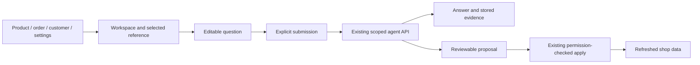

# Connected Studio and storefront experience

Vendune's interface follows one path: **workspace → evidence → conversation → reviewed change → live result**. The assistant belongs beside the task. Opening help must preserve an unsaved product editor; suggestions must not invoke a model or apply a change until the merchant explicitly submits or approves it.

## Studio

`admin/shell/StudioHeader.tsx` exposes **Ask Vendune** on every workspace. `admin/assistant/WorkspaceCopilot.tsx` opens a native dialog beside the current screen. It reuses `StudioConversation`, `StudioComposer`, the session-scoped controller and the existing proposal renderer. The current workspace/environment, area and a selected linked entity reference are included in an editable prompt. Product list entries use the same entity navigation as orders/customers, keeping deep links and back navigation connected.

The prompt describes the screen; it grants no permission and does not automatically include unsaved field contents. Authorization and tenant scope stay in the existing transport and backend. The drawer shares the existing conversation instead of maintaining a second chat state. A native modal traps keyboard focus, restores it on close, releases the screen when a session expires and closes before provider settings are opened.

This implements contextual entry, not a claim that every possible module has a fully specialized autonomous agent. Merchant editors remain explicit, reliable controls. Existing preview, staging, knowledge and proposal flows are the foundation for subsequent task-specific assistance.

## Standard storefront and customer account

`storefront/shell/ConciergeView.tsx` exposes catalogue-grounded discovery with budget, gift and comparison question starters. A starter only fills the input. Explicit submission uses the existing `/api/concierge` transport with shop, language and cart context. Recommendations use product links, not fabricated prices or availability. Product-specific questions continue through the existing product question/knowledge path.

`useStorefrontAnchors.ts` restores section scrolling after SPA rendering, including browser history and reduced-motion handling. Store branding, legal content and product routes remain scoped to the selected shop/channel. Long brand names wrap without colliding with currency/language or basket controls.

The account has separate sign-in and registration forms and six connected views: overview, orders, addresses, downloads, profile and security. The orientation panel explains what the account contains. Authentication retains existing tenant-scoped shopper sessions and cart rotation. Native dialogs provide scroll containment and focus restoration. Existing purchase screens supply status, immutable addresses, delivery/tracking, authenticated documents and paid download entitlements.

## Styling, localization and verification

- `storefront/styles/storefront-polish.css` owns the shared storefront presentation. Load it at the composition root after base and feature styles, not as a side effect of a state hook.
- `storefront/styles/experience-polish.css` owns discovery/assistant interaction surfaces. `storefront/account/account-polish.css` owns account orientation and refinements. `admin/styles/workspace-copilot.css` inherits Studio theme tokens.
- All new interface vocabulary is typed in `shared/i18n/experience-ui-i18n.ts`, with EN/DE/FR/ES entries and identical interpolation keys. Existing forms keep their canonical vocabularies.
- `workspace-copilot.test.tsx` verifies staging/reference prompts, preserved edits, focus, provider settings and expiration without model calls. `experience-discovery.test.tsx` verifies four-language starters, explicit scoped submission and actual SPA scrolling.
- Existing account component suites cover login/registration, order details, receipts/downloads, safe links, address defaults and expiration. `scripts/customer_accounts.py` exercises the real database and selects a purchasable product from the current default catalogue rather than retired demo IDs.

Browser acceptance covers desktop, 375×667 portrait and 844×390 landscape for the assistant and account, plus storefront overflow, product navigation and checkout layout. Passing these checks is not 100% visual coverage of every app, industry-specific form or external payment/OAuth integration. No external model call or financial charge is needed to verify layout and question preparation.
